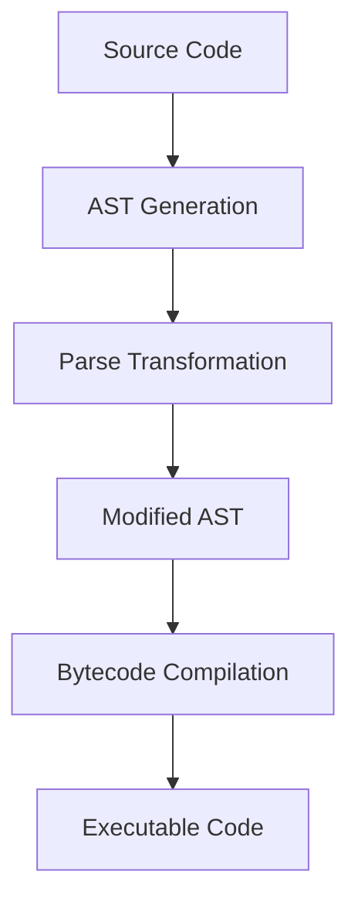

## 9.10 Extending Functionality with Parse Transformations

In the realm of Erlang programming, parse transformations offer a powerful mechanism to extend the language's capabilities by modifying the abstract syntax tree (AST) of code at compile time. This advanced technique allows developers to implement custom syntactic constructs, optimize code, and enforce coding standards, among other possibilities. However, with great power comes great responsibility, as parse transformations can introduce complexity and potential risks if not used judiciously.

### What Are Parse Transformations?

Parse transformations in Erlang are a form of metaprogramming that allows developers to manipulate the code's AST during the compilation process. This means you can programmatically alter the structure of your code before it is compiled into bytecode, enabling you to introduce new language features or optimize existing ones.

#### Key Concepts

- **Abstract Syntax Tree (AST):** A tree representation of the syntactic structure of source code. Each node in the tree denotes a construct occurring in the source code.
- **Compile Time:** The phase in which source code is translated into executable code. Parse transformations occur during this phase.
- **Metaprogramming:** Writing programs that write or manipulate other programs (or themselves) as their data.

### How Parse Transformations Work

To implement a parse transformation, you need to define a module that exports a function named `parse_transform/2`. This function receives the current module's AST and the compilation options as arguments. It returns a modified AST, which the compiler then uses to generate the final bytecode.

Here's a basic outline of how a parse transformation is structured:

```erlang
-module(my_transform).
-export([parse_transform/2]).

parse_transform(Forms, _Options) ->
    % Modify the AST here
    NewForms = transform_forms(Forms),
    NewForms.

transform_forms(Forms) ->
    % Example transformation logic
    lists:map(fun transform_form/1, Forms).

transform_form(Form) ->
    % Modify individual forms (expressions/statements)
    Form.
```

### Example: Adding Logging to Functions

Let's explore a practical example where we automatically add logging to every function entry and exit point in a module using parse transformations.

#### Step 1: Define the Parse Transformation

```erlang
-module(logging_transform).
-export([parse_transform/2]).

parse_transform(Forms, _Options) ->
    NewForms = lists:map(fun transform_form/1, Forms),
    NewForms.

transform_form({function, Line, Name, Arity, Clauses}) ->
    NewClauses = lists:map(fun transform_clause(Name, Arity)/1, Clauses),
    {function, Line, Name, Arity, NewClauses};
transform_form(Other) ->
    Other.

transform_clause(Name, Arity, {clause, Line, Patterns, Guards, Body}) ->
    EntryLog = io_lib:format("Entering ~p/~p with args: ~p~n", [Name, Arity, Patterns]),
    ExitLog = io_lib:format("Exiting ~p/~p~n", [Name, Arity]),
    NewBody = [{call, Line, {remote, Line, {atom, Line, io}, {atom, Line, format}}, [EntryLog]},
               {call, Line, {remote, Line, {atom, Line, io}, {atom, Line, format}}, [ExitLog]} | Body],
    {clause, Line, Patterns, Guards, NewBody}.
```

#### Step 2: Apply the Transformation

To apply the parse transformation, you need to specify it in the module's compilation options:

```erlang
-module(my_module).
-compile({parse_transform, logging_transform}).

my_function(X) ->
    X * 2.
```

With this setup, every function in `my_module` will automatically log its entry and exit, providing valuable debugging information.

### Complexity and Risks

While parse transformations can be incredibly powerful, they come with inherent complexity and risks:

- **Readability:** Code modified by parse transformations can become difficult to understand and maintain, as the source code does not directly reflect the compiled behavior.
- **Debugging:** Errors introduced by parse transformations can be challenging to trace, as they may not manifest until runtime.
- **Compatibility:** Changes in the Erlang compiler or language syntax can break existing parse transformations, requiring updates to the transformation logic.

### Best Practices

When using parse transformations, consider the following best practices:

1. **Thorough Testing:** Ensure that your transformations are well-tested to catch any potential issues early.
2. **Documentation:** Clearly document the purpose and behavior of your transformations to aid future maintenance.
3. **Simplicity:** Keep transformations as simple as possible to minimize potential side effects and improve maintainability.
4. **Version Control:** Track changes to your transformations in version control to manage updates and rollbacks effectively.

### Visualizing Parse Transformations

To better understand how parse transformations modify the AST, consider the following diagram illustrating the process:



**Diagram Description:** This flowchart represents the process of parse transformations in Erlang, starting from source code and ending with executable code. The transformation occurs between the AST generation and bytecode compilation phases.

### Try It Yourself

Experiment with the provided logging transformation by modifying it to log additional information, such as function execution time or specific variable values. This hands-on approach will deepen your understanding of parse transformations and their potential applications.

### Further Reading

For more information on parse transformations and related topics, consider exploring the following resources:

- [Erlang Documentation on Parse Transformations](https://www.erlang.org/doc/man/compile.html#parse_transform-1)
- [Metaprogramming in Erlang](https://learnyousomeerlang.com/metaprogramming)
- [Erlang and OTP in Action](https://www.manning.com/books/erlang-and-otp-in-action)

### Knowledge Check

Before moving on, consider the following questions to reinforce your understanding of parse transformations:

1. What is the primary purpose of parse transformations in Erlang?
2. How do parse transformations differ from runtime code modifications?
3. What are some potential risks associated with using parse transformations?
4. How can you apply a parse transformation to an Erlang module?
5. What are some best practices to follow when implementing parse transformations?

### Embrace the Journey

Remember, mastering parse transformations is just one step in your Erlang journey. As you continue to explore the language's capabilities, you'll discover new ways to enhance your applications and solve complex problems. Keep experimenting, stay curious, and enjoy the journey!

## Quiz: Extending Functionality with Parse Transformations



### What is the primary purpose of parse transformations in Erlang?

- [x] To modify the abstract syntax tree (AST) at compile time
- [ ] To optimize runtime performance
- [ ] To manage memory allocation
- [ ] To handle error logging

> **Explanation:** Parse transformations allow developers to modify the AST during the compilation process, enabling custom syntactic constructs and optimizations.

### How do parse transformations differ from runtime code modifications?

- [x] They occur at compile time
- [ ] They are more efficient
- [ ] They are easier to debug
- [ ] They require less testing

> **Explanation:** Parse transformations occur at compile time, modifying the code structure before it is compiled into bytecode.

### What is a potential risk of using parse transformations?

- [x] Reduced code readability
- [ ] Increased runtime speed
- [ ] Simplified debugging
- [ ] Enhanced memory management

> **Explanation:** Parse transformations can make code harder to read and maintain, as the source code may not directly reflect the compiled behavior.

### How can you apply a parse transformation to an Erlang module?

- [x] By specifying it in the module's compilation options
- [ ] By importing it at runtime
- [ ] By using a special runtime library
- [ ] By modifying the Erlang VM

> **Explanation:** Parse transformations are applied by specifying them in the module's compilation options, allowing the compiler to use the transformation during the compilation process.

### What is a best practice when implementing parse transformations?

- [x] Thorough testing
- [ ] Avoiding documentation
- [ ] Ignoring version control
- [ ] Maximizing complexity

> **Explanation:** Thorough testing is essential to ensure that parse transformations do not introduce errors or unexpected behavior.

### What does the `parse_transform/2` function return?

- [x] A modified AST
- [ ] A list of errors
- [ ] A compiled bytecode
- [ ] A runtime exception

> **Explanation:** The `parse_transform/2` function returns a modified AST, which the compiler uses to generate the final bytecode.

### What is the role of the AST in parse transformations?

- [x] It represents the syntactic structure of the code
- [ ] It manages memory allocation
- [ ] It handles error logging
- [ ] It optimizes runtime performance

> **Explanation:** The AST is a tree representation of the code's syntactic structure, which parse transformations modify to alter the code's behavior.

### Which of the following is a benefit of using parse transformations?

- [x] Enabling custom syntactic constructs
- [ ] Simplifying runtime debugging
- [ ] Reducing compile time
- [ ] Increasing memory usage

> **Explanation:** Parse transformations enable developers to introduce custom syntactic constructs and optimizations at compile time.

### What is a common use case for parse transformations?

- [x] Adding logging to functions
- [ ] Managing memory allocation
- [ ] Handling runtime exceptions
- [ ] Optimizing network communication

> **Explanation:** Parse transformations can be used to automatically add logging to functions, among other use cases.

### True or False: Parse transformations can introduce new language features.

- [x] True
- [ ] False

> **Explanation:** Parse transformations can introduce new language features by modifying the AST to support custom syntactic constructs.


