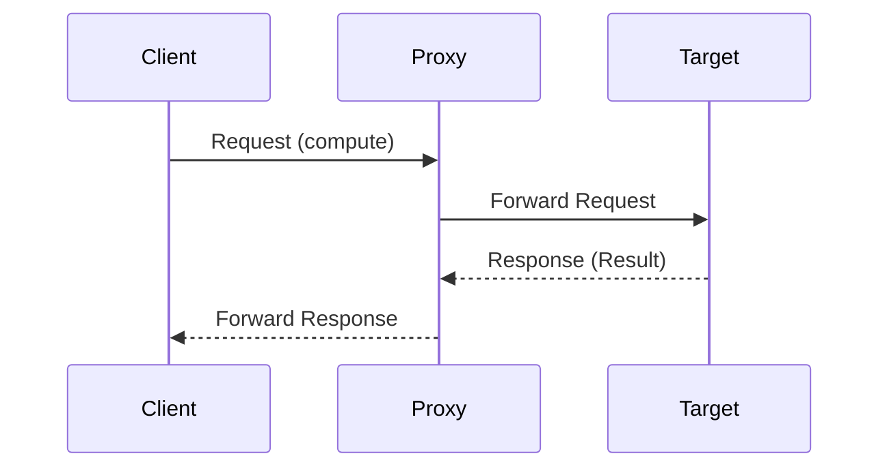

## 9.2 Proxy Pattern Using Processes

In this section, we delve into the Proxy Pattern, a structural design pattern that uses intermediary processes to control access to other processes in Erlang. This pattern is particularly useful in scenarios where additional functionality, such as access control, lazy initialization, or logging, is required without altering the core logic of the target process.

### Understanding the Proxy Pattern

The Proxy Pattern acts as an intermediary between a client and a target process, providing a surrogate or placeholder to control access to the target. This pattern is commonly used for:

- **Access Control**: Restricting or granting access to certain functionalities based on predefined rules.
- **Lazy Initialization**: Deferring the creation of an object until it is needed.
- **Logging and Monitoring**: Capturing and logging interactions with the target process.
- **Remote Proxy**: Representing an object located in a different address space.

### Key Participants

- **Proxy Process**: The intermediary that controls access to the target process.
- **Target Process**: The actual process that performs the core functionality.
- **Client**: The entity that interacts with the proxy process instead of directly with the target process.

### Applicability

Use the Proxy Pattern when:

- You need to add an additional layer of control or functionality to an existing process.
- Direct access to the target process should be restricted or monitored.
- You want to implement lazy initialization for resource-intensive processes.

### Sample Code Snippet

Let's explore a simple example of a Proxy Pattern in Erlang where a proxy process controls access to a target process that performs a computation.

```erlang
-module(proxy_example).
-export([start/0, proxy/2, target/0]).

% Start the proxy process
start() ->
    ProxyPid = spawn(proxy_example, proxy, [self(), fun target/0]),
    ProxyPid ! {self(), compute, 5},
    receive
        {ProxyPid, Result} ->
            io:format("Received result: ~p~n", [Result])
    end.

% Proxy process that forwards messages to the target process
proxy(ClientPid, TargetFun) ->
    receive
        {ClientPid, compute, Value} ->
            % Perform access control or logging here
            io:format("Proxy: Forwarding request to target~n"),
            Result = TargetFun(),
            ClientPid ! {self(), Result},
            proxy(ClientPid, TargetFun)
    end.

% Target process that performs the computation
target() ->
    io:format("Target: Performing computation~n"),
    42. % Example computation result
```

### Explanation of the Code

- **Proxy Process**: The `proxy/2` function acts as the proxy process. It receives messages from the client and forwards them to the target process. Here, it logs the forwarding action.
- **Target Process**: The `target/0` function represents the target process performing the actual computation.
- **Client**: The `start/0` function initiates the communication by sending a message to the proxy process.

### Benefits of Using the Proxy Pattern

- **Added Control**: The proxy process can enforce access control policies, ensuring that only authorized requests reach the target process.
- **Abstraction**: The client interacts with the proxy, unaware of the complexities involved in accessing the target process.
- **Flexibility**: The proxy can modify requests or responses, adding functionality such as caching or logging.
- **Decoupling**: The client and target process are decoupled, allowing changes to be made to the target process without affecting the client.

### Design Considerations

- **Performance**: Introducing a proxy process can add overhead, potentially affecting performance. Ensure that the benefits outweigh the costs.
- **Complexity**: The added layer of abstraction can increase complexity. Use the Proxy Pattern judiciously to avoid unnecessary complications.
- **Concurrency**: Consider the implications of concurrent access and ensure that the proxy process handles requests efficiently.

### Erlang Unique Features

Erlang's concurrency model, based on lightweight processes and message passing, makes it particularly well-suited for implementing the Proxy Pattern. The ability to spawn processes and communicate asynchronously allows for flexible and scalable proxy implementations.

### Differences and Similarities

The Proxy Pattern is often confused with the Decorator Pattern. While both add functionality to an object, the Proxy Pattern focuses on controlling access, whereas the Decorator Pattern enhances or modifies behavior.

### Visualizing the Proxy Pattern

Below is a sequence diagram illustrating the interaction between the client, proxy process, and target process.



### Try It Yourself

Experiment with the code example by modifying the proxy process to include additional functionality, such as logging request timestamps or implementing access control based on client identity. Consider how these changes affect the overall system behavior.

### Knowledge Check

- What are the primary purposes of the Proxy Pattern?
- How does the Proxy Pattern differ from the Decorator Pattern?
- What are some potential drawbacks of using the Proxy Pattern?

### Summary

The Proxy Pattern in Erlang provides a powerful mechanism for controlling access and enhancing functionality in concurrent systems. By leveraging Erlang's process model, developers can implement flexible and scalable proxies that add value without compromising the integrity of the target processes.

## Quiz: Proxy Pattern Using Processes



### What is the primary purpose of the Proxy Pattern in Erlang?

- [x] To control access to other processes
- [ ] To enhance the performance of processes
- [ ] To simplify the process logic
- [ ] To replace the target process

> **Explanation:** The Proxy Pattern is primarily used to control access to other processes, adding an intermediary layer that can enforce policies or add functionality.

### Which of the following is NOT a benefit of using the Proxy Pattern?

- [ ] Added control
- [ ] Abstraction
- [x] Increased complexity
- [ ] Flexibility

> **Explanation:** While the Proxy Pattern offers added control, abstraction, and flexibility, it can also increase complexity, which is not a benefit.

### How does the Proxy Pattern differ from the Decorator Pattern?

- [x] The Proxy Pattern controls access, while the Decorator Pattern modifies behavior.
- [ ] The Proxy Pattern modifies behavior, while the Decorator Pattern controls access.
- [ ] Both patterns serve the same purpose.
- [ ] The Proxy Pattern is used for logging, while the Decorator Pattern is not.

> **Explanation:** The Proxy Pattern is focused on controlling access, whereas the Decorator Pattern is used to modify or enhance behavior.

### What is a potential drawback of using the Proxy Pattern?

- [x] Performance overhead
- [ ] Improved security
- [ ] Simplified code
- [ ] Enhanced functionality

> **Explanation:** Introducing a proxy can add performance overhead due to the additional layer of communication and processing.

### In the provided code example, what role does the `proxy/2` function play?

- [x] It acts as the intermediary process controlling access to the target.
- [ ] It performs the actual computation.
- [ ] It initializes the client process.
- [ ] It logs the results of the computation.

> **Explanation:** The `proxy/2` function serves as the intermediary process, forwarding requests to the target process and potentially adding additional functionality.

### What is a unique feature of Erlang that makes it suitable for implementing the Proxy Pattern?

- [x] Lightweight processes and message passing
- [ ] Object-oriented programming
- [ ] Synchronous communication
- [ ] Global variables

> **Explanation:** Erlang's lightweight processes and asynchronous message passing make it well-suited for implementing the Proxy Pattern.

### Which of the following scenarios is NOT suitable for the Proxy Pattern?

- [ ] Access control
- [ ] Logging and monitoring
- [x] Direct manipulation of process state
- [ ] Lazy initialization

> **Explanation:** The Proxy Pattern is not intended for direct manipulation of process state, as it focuses on controlling access and adding functionality.

### What is the role of the client in the Proxy Pattern?

- [x] To interact with the proxy process instead of the target process
- [ ] To perform the core functionality
- [ ] To initialize the proxy process
- [ ] To log interactions with the target process

> **Explanation:** The client interacts with the proxy process, which in turn manages access to the target process.

### True or False: The Proxy Pattern can be used to implement lazy initialization.

- [x] True
- [ ] False

> **Explanation:** The Proxy Pattern can defer the creation of an object until it is needed, implementing lazy initialization.

### What is the main advantage of using a proxy process for logging?

- [x] It centralizes logging functionality without altering the target process.
- [ ] It improves the performance of the target process.
- [ ] It simplifies the client process.
- [ ] It eliminates the need for a target process.

> **Explanation:** A proxy process can centralize logging functionality, allowing the target process to remain focused on its core tasks.



Remember, this is just the beginning. As you progress, you'll build more complex and interactive systems using the Proxy Pattern. Keep experimenting, stay curious, and enjoy the journey!
