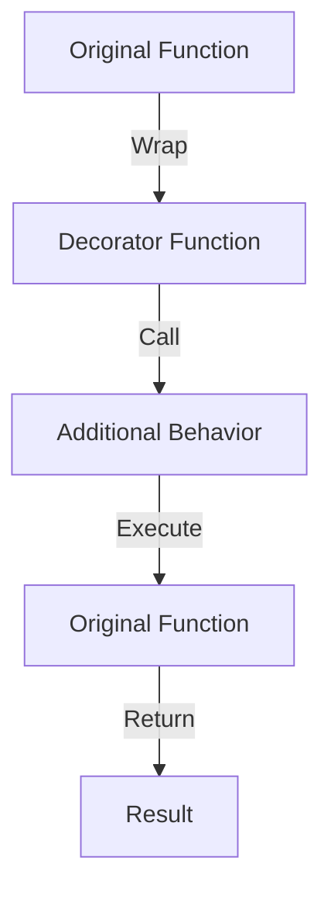

## 9.3 Decorator Pattern with Higher-Order Functions

In this section, we delve into the Decorator Pattern, a structural design pattern that allows behavior to be added to individual objects, either statically or dynamically, without affecting the behavior of other objects from the same class. In Erlang, we leverage higher-order functions to implement this pattern, providing a flexible and powerful way to extend functionality.

### Understanding the Decorator Pattern

The Decorator Pattern is a design pattern used to extend the functionality of objects in a flexible and reusable manner. It involves wrapping an object with a new object that adds the desired behavior. This pattern is particularly useful when you want to add responsibilities to individual objects without affecting others.

#### Key Participants

- **Component**: The original object that needs to be extended.
- **Decorator**: A wrapper that adds additional behavior to the component.

### Higher-Order Functions in Erlang

Higher-order functions are functions that take other functions as arguments or return them as results. In Erlang, this concept is central to functional programming and is used extensively to create flexible and reusable code.

#### Example of a Higher-Order Function

```erlang
% Define a simple higher-order function that takes a function and a value
apply_twice(Fun, Value) ->
    Fun(Fun(Value)).

% Example usage
double(X) -> X * 2.

% Applying the function
Result = apply_twice(fun double/1, 3).
% Result is 12
```

### Implementing the Decorator Pattern with Higher-Order Functions

In Erlang, we can use higher-order functions to implement the Decorator Pattern by wrapping existing functions with additional functionality. This approach allows us to extend behavior without modifying the original function.

#### Wrapping Functions with Additional Functionality

Let's consider a scenario where we want to add logging to a function. We can create a decorator function that logs the input and output of the original function.

```erlang
% Define a logging decorator
log_decorator(Fun) ->
    fun(Args) ->
        io:format("Calling function with args: ~p~n", [Args]),
        Result = Fun(Args),
        io:format("Function returned: ~p~n", [Result]),
        Result
    end.

% Original function
add(X, Y) -> X + Y.

% Decorated function
LoggedAdd = log_decorator(fun add/2).

% Example usage
Result = LoggedAdd({3, 4}).
% Output:
% Calling function with args: {3,4}
% Function returned: 7
```

### Advantages of Using Decorators in Erlang

- **Flexibility**: Decorators allow you to add functionality to functions without modifying their code.
- **Reusability**: Once a decorator is defined, it can be applied to any function with a compatible signature.
- **Separation of Concerns**: By separating the additional behavior from the core functionality, you maintain cleaner and more maintainable code.

### Practical Examples of Function Decorators

#### Logging Decorator

Logging is a common requirement in applications. By using a decorator, we can add logging to any function without altering its implementation.

```erlang
% Define a generic logging decorator
log_decorator(Fun) ->
    fun(Args) ->
        io:format("Calling function with args: ~p~n", [Args]),
        Result = Fun(Args),
        io:format("Function returned: ~p~n", [Result]),
        Result
    end.

% Example function
multiply(X, Y) -> X * Y.

% Decorated function
LoggedMultiply = log_decorator(fun multiply/2).

% Example usage
Result = LoggedMultiply({5, 6}).
% Output:
% Calling function with args: {5,6}
% Function returned: 30
```

#### Validation Decorator

Validation is another common use case for decorators. We can create a decorator that checks the validity of inputs before calling the original function.

```erlang
% Define a validation decorator
validate_decorator(Fun) ->
    fun(Args) ->
        case is_valid(Args) of
            true -> Fun(Args);
            false -> {error, invalid_arguments}
        end
    end.

% Validation function
is_valid({X, Y}) when is_integer(X), is_integer(Y) -> true;
is_valid(_) -> false.

% Example function
subtract(X, Y) -> X - Y.

% Decorated function
ValidatedSubtract = validate_decorator(fun subtract/2).

% Example usage
Result = ValidatedSubtract({10, 5}).
% Result is 5

InvalidResult = ValidatedSubtract({"a", 5}).
% InvalidResult is {error, invalid_arguments}
```

### Design Considerations

When using decorators in Erlang, consider the following:

- **Performance**: Each layer of decoration adds overhead. Ensure that the benefits outweigh the performance costs.
- **Complexity**: Avoid overusing decorators, as they can make the codebase harder to understand.
- **Compatibility**: Ensure that decorators are compatible with the functions they wrap.

### Erlang Unique Features

Erlang's functional nature and support for higher-order functions make it particularly well-suited for implementing the Decorator Pattern. The ability to pass functions as arguments and return them as results allows for elegant and concise decorator implementations.

### Differences and Similarities with Other Patterns

The Decorator Pattern is often confused with the Proxy Pattern. While both involve wrapping objects, the Proxy Pattern focuses on controlling access, whereas the Decorator Pattern focuses on adding behavior.

### Try It Yourself

Experiment with the code examples provided. Try creating your own decorators for different purposes, such as caching or retry logic. Modify the existing decorators to handle more complex scenarios.

### Visualizing the Decorator Pattern

Below is a diagram illustrating the flow of the Decorator Pattern using higher-order functions in Erlang:



This diagram shows how the original function is wrapped by the decorator, which adds additional behavior before and after calling the original function.

## Quiz: Decorator Pattern with Higher-Order Functions



### What is the primary purpose of the Decorator Pattern?

- [x] To add behavior to individual objects without affecting others.
- [ ] To control access to an object.
- [ ] To create a new object from a prototype.
- [ ] To define an interface for creating objects.

> **Explanation:** The Decorator Pattern is used to add behavior to individual objects without affecting others.

### How does Erlang implement the Decorator Pattern?

- [x] Using higher-order functions to wrap existing functions.
- [ ] By creating subclasses of a base class.
- [ ] Through inheritance and polymorphism.
- [ ] By using macros and parse transformations.

> **Explanation:** Erlang uses higher-order functions to implement the Decorator Pattern by wrapping existing functions with additional functionality.

### What is a higher-order function?

- [x] A function that takes other functions as arguments or returns them as results.
- [ ] A function that is defined within another function.
- [ ] A function that has more than one argument.
- [ ] A function that is called recursively.

> **Explanation:** A higher-order function is one that takes other functions as arguments or returns them as results.

### Which of the following is a benefit of using decorators in Erlang?

- [x] Flexibility in adding functionality without modifying original code.
- [ ] Improved performance due to reduced function calls.
- [ ] Simplified code structure by combining multiple functions.
- [ ] Enhanced security by restricting access to functions.

> **Explanation:** Decorators provide flexibility by allowing functionality to be added without modifying the original code.

### What is a common use case for decorators?

- [x] Logging function calls and results.
- [ ] Creating new data types.
- [ ] Managing memory allocation.
- [ ] Compiling code at runtime.

> **Explanation:** Logging is a common use case for decorators, as it allows function calls and results to be logged without altering the original function.

### What should be considered when using decorators?

- [x] Performance overhead and complexity.
- [ ] The number of arguments in the function.
- [ ] The size of the codebase.
- [ ] The type of data structures used.

> **Explanation:** When using decorators, consider the performance overhead and complexity they introduce.

### How can decorators affect code readability?

- [x] They can make code harder to understand if overused.
- [ ] They always improve code readability.
- [ ] They have no impact on code readability.
- [ ] They simplify code by reducing the number of functions.

> **Explanation:** Overusing decorators can make code harder to understand due to the additional layers of abstraction.

### What is the difference between the Decorator and Proxy Patterns?

- [x] Decorators add behavior, while Proxies control access.
- [ ] Decorators control access, while Proxies add behavior.
- [ ] Both patterns serve the same purpose.
- [ ] Decorators are used for logging, while Proxies are used for validation.

> **Explanation:** Decorators focus on adding behavior, while Proxies focus on controlling access.

### Can decorators be used for validation?

- [x] Yes, decorators can be used to validate inputs before calling the original function.
- [ ] No, decorators are only for logging purposes.
- [ ] Yes, but only in object-oriented languages.
- [ ] No, validation requires separate functions.

> **Explanation:** Decorators can be used for validation by checking inputs before calling the original function.

### True or False: Erlang's support for higher-order functions makes it well-suited for implementing the Decorator Pattern.

- [x] True
- [ ] False

> **Explanation:** Erlang's support for higher-order functions allows for elegant and concise implementations of the Decorator Pattern.



Remember, this is just the beginning. As you progress, you'll build more complex and interactive applications. Keep experimenting, stay curious, and enjoy the journey!
