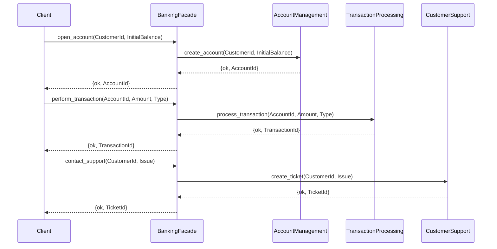

## 9.4 Facade Pattern through API Modules

In this section, we delve into the Facade Pattern, a structural design pattern that provides a simplified interface to a complex subsystem. We will explore how this pattern can be effectively implemented in Erlang using API modules, enhancing usability and code organization.

### Understanding the Facade Pattern

The Facade Pattern is a structural design pattern that aims to provide a unified and simplified interface to a set of interfaces in a subsystem. This pattern defines a higher-level interface that makes the subsystem easier to use. The primary goal is to hide the complexities of the subsystem and provide a cleaner, more manageable interface for the client.

#### Key Participants

- **Facade**: The main interface that clients interact with. It provides simplified methods that internally call the complex subsystem's methods.
- **Subsystem Classes**: The classes or modules that perform the actual work. They are complex and have intricate interactions, which the facade aims to simplify.
- **Clients**: The users of the facade interface. They interact with the facade instead of the subsystem directly.

### The Role of API Modules as Facades

In Erlang, API modules can serve as facades by encapsulating complex functionalities and exposing a simplified interface. This approach is particularly beneficial in functional programming, where modularity and separation of concerns are paramount.

#### Benefits of Using API Modules as Facades

1. **Simplified Interface**: By providing a single entry point to a complex subsystem, API modules reduce the learning curve for developers.
2. **Improved Code Organization**: Grouping related functionalities behind a facade leads to better-organized codebases.
3. **Decoupling**: Clients are decoupled from the subsystem, allowing for easier maintenance and scalability.
4. **Enhanced Usability**: With a clear and concise interface, API modules improve the usability of the system.

### Implementing the Facade Pattern in Erlang

Let's explore how to implement the Facade Pattern in Erlang using API modules. We'll create a simple example to demonstrate the concept.

#### Example: A Simple Banking System

Consider a banking system with various subsystems such as account management, transaction processing, and customer support. Each subsystem has its own set of complex functionalities. We will create a facade to simplify interactions with these subsystems.

**Subsystem Modules**

1. **Account Management Module**

```erlang
-module(account_management).
-export([create_account/2, close_account/1, get_account_details/1]).

create_account(CustomerId, InitialBalance) ->
    % Logic to create a new account
    {ok, AccountId}.

close_account(AccountId) ->
    % Logic to close an account
    ok.

get_account_details(AccountId) ->
    % Logic to retrieve account details
    {ok, AccountDetails}.
```

2. **Transaction Processing Module**

```erlang
-module(transaction_processing).
-export([process_transaction/3, get_transaction_history/1]).

process_transaction(AccountId, Amount, Type) ->
    % Logic to process a transaction
    {ok, TransactionId}.

get_transaction_history(AccountId) ->
    % Logic to retrieve transaction history
    {ok, TransactionHistory}.
```

3. **Customer Support Module**

```erlang
-module(customer_support).
-export([create_ticket/2, resolve_ticket/1]).

create_ticket(CustomerId, Issue) ->
    % Logic to create a support ticket
    {ok, TicketId}.

resolve_ticket(TicketId) ->
    % Logic to resolve a support ticket
    ok.
```

**Facade Module**

Now, let's create a facade module that provides a simplified interface to these subsystems.

```erlang
-module(banking_facade).
-export([open_account/2, perform_transaction/3, contact_support/2]).

open_account(CustomerId, InitialBalance) ->
    case account_management:create_account(CustomerId, InitialBalance) of
        {ok, AccountId} ->
            {ok, AccountId};
        Error ->
            Error
    end.

perform_transaction(AccountId, Amount, Type) ->
    case transaction_processing:process_transaction(AccountId, Amount, Type) of
        {ok, TransactionId} ->
            {ok, TransactionId};
        Error ->
            Error
    end.

contact_support(CustomerId, Issue) ->
    case customer_support:create_ticket(CustomerId, Issue) of
        {ok, TicketId} ->
            {ok, TicketId};
        Error ->
            Error
    end.
```

### Visualizing the Facade Pattern

To better understand the Facade Pattern, let's visualize the interaction between the client, facade, and subsystems.



### Design Considerations

When implementing the Facade Pattern, consider the following:

- **Subsystem Complexity**: Ensure the facade simplifies the subsystem's complexity without hiding essential functionalities.
- **Interface Design**: Design the facade interface to be intuitive and aligned with client needs.
- **Performance**: Be mindful of potential performance overhead introduced by the facade layer.

### Erlang-Specific Features

Erlang's concurrency model and process-based architecture make it particularly suited for implementing the Facade Pattern. The ability to encapsulate processes within modules allows for clean separation of concerns and efficient message passing between subsystems.

### Differences and Similarities with Other Patterns

The Facade Pattern is often confused with the Adapter Pattern. While both provide a simplified interface, the Adapter Pattern focuses on converting one interface to another, whereas the Facade Pattern provides a unified interface to a set of interfaces.

### Try It Yourself

Experiment with the provided code examples by adding new functionalities to the subsystems and updating the facade module accordingly. Consider implementing additional features such as account balance checks or transaction reversals.

### Knowledge Check

- How does the Facade Pattern improve code organization?
- What are the key differences between the Facade and Adapter Patterns?
- How can Erlang's concurrency model enhance the implementation of the Facade Pattern?

### Conclusion

The Facade Pattern, when implemented through API modules in Erlang, offers a powerful way to manage complexity and improve code organization. By providing a simplified interface to complex subsystems, developers can create more maintainable and scalable applications.

## Quiz: Facade Pattern through API Modules



### What is the primary goal of the Facade Pattern?

- [x] To provide a simplified interface to a complex subsystem
- [ ] To convert one interface to another
- [ ] To enhance performance
- [ ] To increase the number of interfaces

> **Explanation:** The Facade Pattern aims to provide a simplified interface to a complex subsystem, making it easier to use.

### How do API modules act as facades in Erlang?

- [x] By encapsulating complex functionalities and exposing a simplified interface
- [ ] By converting data types
- [ ] By enhancing performance
- [ ] By increasing the number of interfaces

> **Explanation:** API modules encapsulate complex functionalities and expose a simplified interface, acting as facades.

### What is a key benefit of using the Facade Pattern?

- [x] Improved code organization
- [ ] Increased complexity
- [ ] Reduced performance
- [ ] More interfaces

> **Explanation:** The Facade Pattern improves code organization by providing a unified interface to complex subsystems.

### Which of the following is a key participant in the Facade Pattern?

- [x] Facade
- [ ] Adapter
- [ ] Proxy
- [ ] Decorator

> **Explanation:** The Facade is a key participant in the Facade Pattern, providing a simplified interface to clients.

### How does the Facade Pattern differ from the Adapter Pattern?

- [x] The Facade Pattern provides a unified interface, while the Adapter Pattern converts one interface to another.
- [ ] The Facade Pattern increases complexity, while the Adapter Pattern simplifies it.
- [ ] The Facade Pattern is used for performance, while the Adapter Pattern is not.
- [ ] The Facade Pattern is more complex than the Adapter Pattern.

> **Explanation:** The Facade Pattern provides a unified interface, while the Adapter Pattern focuses on converting interfaces.

### What is a design consideration when implementing the Facade Pattern?

- [x] Ensuring the facade simplifies the subsystem's complexity
- [ ] Increasing the number of interfaces
- [ ] Enhancing performance
- [ ] Reducing the number of clients

> **Explanation:** A key design consideration is ensuring the facade simplifies the subsystem's complexity without hiding essential functionalities.

### How can Erlang's concurrency model enhance the Facade Pattern?

- [x] By allowing efficient message passing between subsystems
- [ ] By increasing the number of interfaces
- [ ] By reducing performance
- [ ] By complicating the architecture

> **Explanation:** Erlang's concurrency model allows for efficient message passing between subsystems, enhancing the Facade Pattern.

### What is a potential pitfall of the Facade Pattern?

- [x] Performance overhead introduced by the facade layer
- [ ] Increased complexity
- [ ] Reduced usability
- [ ] More interfaces

> **Explanation:** A potential pitfall is the performance overhead introduced by the facade layer.

### What should be considered when designing the facade interface?

- [x] It should be intuitive and aligned with client needs
- [ ] It should increase complexity
- [ ] It should reduce performance
- [ ] It should have more interfaces

> **Explanation:** The facade interface should be intuitive and aligned with client needs to enhance usability.

### True or False: The Facade Pattern is often confused with the Adapter Pattern.

- [x] True
- [ ] False

> **Explanation:** The Facade Pattern is often confused with the Adapter Pattern, but they serve different purposes.



Remember, the journey of mastering design patterns in Erlang is ongoing. Keep exploring, experimenting, and applying these concepts to build robust and scalable applications. Enjoy the process and embrace the power of functional and concurrent programming!
