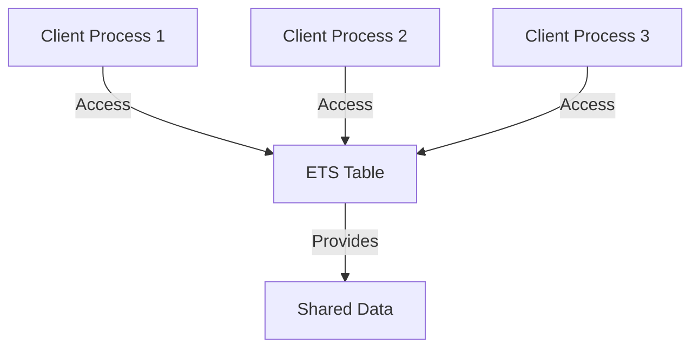

## 9.5 Flyweight Pattern with ETS for Shared Data

### Introduction

In the realm of software design patterns, the Flyweight pattern stands out as a powerful technique for optimizing memory usage. This pattern is particularly useful in scenarios where a large number of similar objects are needed, but the cost of creating and maintaining these objects individually is prohibitive. In Erlang, the Flyweight pattern can be effectively implemented using ETS (Erlang Term Storage) tables, which allow for efficient data sharing across processes without duplication.

### Understanding the Flyweight Pattern

**Intent**: The Flyweight pattern aims to minimize memory usage by sharing as much data as possible with similar objects. It achieves this by storing common data externally and referencing it, rather than duplicating it across each object instance.

**Key Participants**:
- **Flyweight**: The shared object that contains intrinsic state.
- **ConcreteFlyweight**: The specific instance of a Flyweight.
- **FlyweightFactory**: Manages and provides access to Flyweight objects.
- **Client**: Uses Flyweight objects.

**Applicability**: Use the Flyweight pattern when:
- You need to create a large number of objects.
- Most of the object's state can be made extrinsic.
- The cost of creating and maintaining objects is high.

### ETS: Erlang Term Storage

ETS is a powerful feature in Erlang that provides in-memory storage for Erlang terms. It is particularly useful for sharing data between processes, as it allows for concurrent read and write operations. ETS tables can be used to store Flyweight objects, enabling efficient data sharing across processes.

**Key Features of ETS**:
- **Concurrency**: ETS tables support concurrent access, making them suitable for shared data scenarios.
- **Efficiency**: ETS is implemented in C, providing fast access to stored data.
- **Flexibility**: Supports various table types, including set, ordered_set, and bag.

### Implementing the Flyweight Pattern with ETS

To implement the Flyweight pattern using ETS, we need to:
1. **Create an ETS table** to store shared data.
2. **Define a Flyweight module** that interacts with the ETS table.
3. **Use the Flyweight module** in client processes to access shared data.

#### Step 1: Creating an ETS Table

First, we create an ETS table to store shared data. This table will act as the repository for Flyweight objects.

```erlang
% Create an ETS table named flyweight_table
flyweight_table = ets:new(flyweight_table, [set, public, named_table]).
```

#### Step 2: Defining the Flyweight Module

Next, we define a module that provides functions to interact with the ETS table. This module will include functions to add, retrieve, and manage Flyweight objects.

```erlang
-module(flyweight).
-export([add_flyweight/2, get_flyweight/1]).

% Add a Flyweight object to the ETS table
add_flyweight(Key, Value) ->
    ets:insert(flyweight_table, {Key, Value}).

% Retrieve a Flyweight object from the ETS table
get_flyweight(Key) ->
    case ets:lookup(flyweight_table, Key) of
        [{_, Value}] -> {ok, Value};
        [] -> {error, not_found}
    end.
```

#### Step 3: Using the Flyweight Module

Finally, client processes can use the Flyweight module to access shared data. This approach ensures that data is not duplicated across processes, conserving memory.

```erlang
% Example client process using the Flyweight module
client_process() ->
    flyweight:add_flyweight("example_key", "shared_data"),
    case flyweight:get_flyweight("example_key") of
        {ok, Value} -> io:format("Retrieved value: ~p~n", [Value]);
        {error, not_found} -> io:format("Value not found~n")
    end.
```

### Concurrency and Data Access Patterns

When using ETS for shared data, it's important to consider concurrency and data access patterns. ETS tables support concurrent reads and writes, but developers should be mindful of potential race conditions and ensure that data access is properly synchronized when necessary.

**Concurrency Considerations**:
- **Read-Heavy Workloads**: ETS is well-suited for read-heavy workloads, as concurrent reads are efficient.
- **Write Contention**: In scenarios with high write contention, consider using multiple ETS tables or partitioning data to reduce contention.

**Data Access Patterns**:
- **Batch Operations**: Use batch operations to minimize the number of ETS calls, improving performance.
- **Caching**: Consider caching frequently accessed data in process memory to reduce ETS access.

### Design Considerations

When implementing the Flyweight pattern with ETS, consider the following:
- **Memory Usage**: Ensure that the memory savings from using Flyweight objects outweigh the overhead of managing ETS tables.
- **Complexity**: The Flyweight pattern can add complexity to the codebase. Use it judiciously in scenarios where memory optimization is critical.
- **Scalability**: ETS tables are limited by the available memory. Monitor memory usage and scale the system appropriately.

### Erlang Unique Features

Erlang's concurrency model and lightweight processes make it particularly well-suited for implementing the Flyweight pattern. The ability to share data across processes using ETS without locking mechanisms is a unique advantage of Erlang.

### Differences and Similarities

The Flyweight pattern is often confused with the Singleton pattern, as both involve shared data. However, the Flyweight pattern focuses on sharing data across many objects, while the Singleton pattern ensures a single instance of an object.

### Try It Yourself

Experiment with the Flyweight pattern by modifying the code examples:
- Add additional Flyweight objects to the ETS table.
- Implement a function to remove Flyweight objects from the table.
- Measure the performance impact of using ETS for shared data.

### Visualizing the Flyweight Pattern with ETS

Below is a diagram illustrating the interaction between client processes and the ETS table in the Flyweight pattern.



**Diagram Description**: This diagram shows multiple client processes accessing shared data stored in an ETS table. The ETS table acts as a central repository for Flyweight objects, allowing efficient data sharing across processes.

### Knowledge Check

- What is the primary goal of the Flyweight pattern?
- How does ETS facilitate data sharing in Erlang?
- What are some concurrency considerations when using ETS?

### Summary

The Flyweight pattern is a powerful tool for optimizing memory usage by sharing data across similar objects. In Erlang, ETS provides an efficient mechanism for implementing this pattern, allowing for concurrent data access without duplication. By understanding the Flyweight pattern and leveraging ETS, developers can build scalable and memory-efficient applications.

### Quiz: Flyweight Pattern with ETS for Shared Data



### What is the primary goal of the Flyweight pattern?

- [x] To minimize memory usage by sharing data
- [ ] To maximize CPU usage
- [ ] To simplify code structure
- [ ] To enhance security

> **Explanation:** The Flyweight pattern aims to minimize memory usage by sharing data across similar objects.

### How does ETS facilitate data sharing in Erlang?

- [x] By providing in-memory storage accessible by multiple processes
- [ ] By duplicating data across processes
- [ ] By encrypting data
- [ ] By compressing data

> **Explanation:** ETS provides in-memory storage that can be accessed by multiple processes, facilitating data sharing.

### What is a key feature of ETS?

- [x] Supports concurrent access
- [ ] Requires locking mechanisms
- [ ] Only supports read operations
- [ ] Is limited to a single process

> **Explanation:** ETS supports concurrent access, making it suitable for shared data scenarios.

### When should you consider using the Flyweight pattern?

- [x] When you need to create a large number of similar objects
- [ ] When you have a small number of unique objects
- [ ] When you need to enhance security
- [ ] When you need to simplify code

> **Explanation:** The Flyweight pattern is useful when you need to create a large number of similar objects and want to minimize memory usage.

### What is a potential drawback of using ETS?

- [x] Limited by available memory
- [ ] Requires complex locking mechanisms
- [ ] Only supports write operations
- [ ] Cannot be used in concurrent environments

> **Explanation:** ETS tables are limited by the available memory, so it's important to monitor memory usage.

### What is a common misconception about the Flyweight pattern?

- [x] It is the same as the Singleton pattern
- [ ] It is only used for security
- [ ] It cannot be used in Erlang
- [ ] It is only for database applications

> **Explanation:** The Flyweight pattern is often confused with the Singleton pattern, but they serve different purposes.

### How can you optimize ETS access in a read-heavy workload?

- [x] Use batch operations
- [ ] Increase write operations
- [ ] Use complex locking mechanisms
- [ ] Duplicate data across tables

> **Explanation:** Using batch operations can minimize the number of ETS calls, improving performance in read-heavy workloads.

### What is a unique advantage of Erlang for implementing the Flyweight pattern?

- [x] Lightweight processes and concurrency model
- [ ] Complex locking mechanisms
- [ ] Limited to single-threaded applications
- [ ] Requires external libraries

> **Explanation:** Erlang's lightweight processes and concurrency model make it well-suited for implementing the Flyweight pattern.

### What should you monitor when using ETS for shared data?

- [x] Memory usage
- [ ] CPU usage
- [ ] Network bandwidth
- [ ] Disk space

> **Explanation:** It's important to monitor memory usage when using ETS, as tables are limited by available memory.

### True or False: The Flyweight pattern is only applicable in Erlang.

- [ ] True
- [x] False

> **Explanation:** The Flyweight pattern is a general design pattern applicable in various programming languages, not just Erlang.



Remember, this is just the beginning. As you progress, you'll discover more ways to optimize your Erlang applications using design patterns. Keep experimenting, stay curious, and enjoy the journey!
