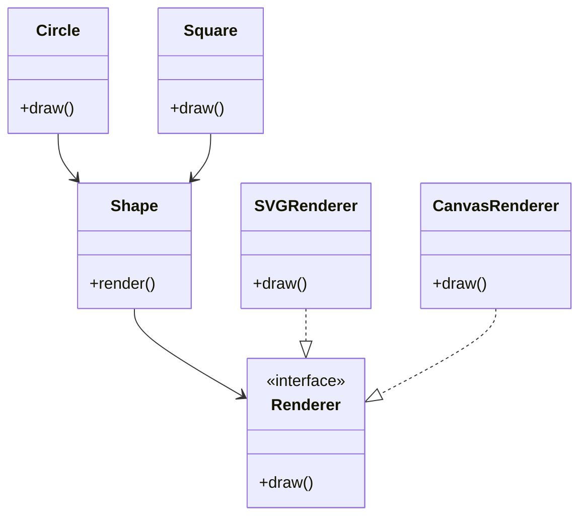

## 9.7 Bridge Pattern for Decoupling Interfaces

In the world of software design, the Bridge pattern stands out as a powerful structural design pattern that promotes flexibility and scalability by decoupling abstraction from implementation. This separation allows both to evolve independently, making it easier to manage complex systems. In this section, we will delve into the Bridge pattern, its application in Erlang, and how it can be leveraged to create robust and maintainable systems.

### Understanding the Bridge Pattern

The Bridge pattern is a structural design pattern that separates the abstraction from its implementation so that both can be modified independently. This pattern is particularly useful in scenarios where you need to switch between different implementations of an abstraction without altering the client code.

#### Key Concepts

- **Abstraction**: The high-level control layer for some entity. It defines the core functionality but delegates the implementation specifics to the Implementor.
- **Implementor**: The low-level layer that provides the concrete implementation of the abstraction's operations.
- **Decoupling**: The process of separating two components so that changes in one do not affect the other.

### Why Use the Bridge Pattern?

The Bridge pattern is ideal in situations where:

- You need to switch between different implementations dynamically.
- You want to avoid a permanent binding between an abstraction and its implementation.
- You anticipate that both the abstraction and the implementation will frequently change.

### Bridge Pattern in Erlang

In Erlang, the Bridge pattern can be effectively implemented using modules and callbacks. Erlang's functional nature and its emphasis on concurrency make it a suitable language for implementing this pattern.

#### Implementing the Bridge Pattern

Let's explore how to implement the Bridge pattern in Erlang using a practical example.

**Scenario**: Consider a graphics application that needs to render shapes using different rendering engines. We want to decouple the shape abstraction from the rendering engine implementation.

#### Step 1: Define the Abstraction

First, we define the abstraction, which in this case is the `shape` module. This module will define the interface for rendering shapes.

```erlang
-module(shape).
-export([render/1]).

-spec render(any()) -> ok.
render(Shape) ->
    Shape:draw().
```

In this module, the `render/1` function takes a shape and delegates the drawing operation to the shape's `draw/0` function.

#### Step 2: Define the Implementor Interface

Next, we define the implementor interface, which will be used by different rendering engines.

```erlang
-module(renderer).
-export([draw/0]).

-callback draw() -> ok.
```

The `renderer` module defines a callback `draw/0` that each rendering engine must implement.

#### Step 3: Implement Concrete Implementors

Now, let's implement two concrete rendering engines: `svg_renderer` and `canvas_renderer`.

```erlang
-module(svg_renderer).
-behaviour(renderer).
-export([draw/0]).

draw() ->
    io:format("Drawing shape using SVG renderer~n").
```

```erlang
-module(canvas_renderer).
-behaviour(renderer).
-export([draw/0]).

draw() ->
    io:format("Drawing shape using Canvas renderer~n").
```

Each module implements the `draw/0` function as specified by the `renderer` behaviour.

#### Step 4: Implement Concrete Abstractions

Finally, we implement concrete shapes that use these rendering engines.

```erlang
-module(circle).
-export([new/1, draw/0]).

-record(circle, {renderer}).

new(Renderer) ->
    #circle{renderer = Renderer}.

draw() ->
    Renderer = ?MODULE:renderer(),
    Renderer:draw().
```

```erlang
-module(square).
-export([new/1, draw/0]).

-record(square, {renderer}).

new(Renderer) ->
    #square{renderer = Renderer}.

draw() ->
    Renderer = ?MODULE:renderer(),
    Renderer:draw().
```

Each shape module uses a renderer to perform the drawing operation.

### Visualizing the Bridge Pattern

To better understand the Bridge pattern, let's visualize the relationship between the components using a class diagram.



**Diagram Explanation**: The diagram illustrates how the `Shape` abstraction is decoupled from the `Renderer` implementation. The `SVGRenderer` and `CanvasRenderer` are concrete implementations of the `Renderer` interface, while `Circle` and `Square` are concrete shapes that use the `Shape` abstraction.

### Use Cases for the Bridge Pattern

The Bridge pattern is particularly useful in the following scenarios:

- **Graphics Rendering**: As demonstrated in the example, the Bridge pattern can be used to decouple shape abstractions from rendering engine implementations.
- **Database Access**: Separating database operations from the database engine allows switching between different databases without altering the client code.
- **UI Components**: Decoupling UI components from their rendering logic enables flexibility in changing the look and feel without modifying the core logic.

### Design Considerations

When implementing the Bridge pattern, consider the following:

- **Complexity**: The Bridge pattern adds an extra layer of abstraction, which can increase complexity. Ensure that the benefits outweigh the added complexity.
- **Performance**: The indirection introduced by the pattern may impact performance. Evaluate the performance implications in your specific context.
- **Flexibility**: The pattern provides flexibility in changing implementations, but ensure that the abstraction interface is stable to avoid frequent changes.

### Erlang Unique Features

Erlang's unique features, such as its lightweight processes and message-passing capabilities, make it well-suited for implementing the Bridge pattern. The use of modules and behaviours in Erlang aligns naturally with the separation of abstraction and implementation.

### Differences and Similarities with Other Patterns

The Bridge pattern is often confused with the Adapter pattern. While both patterns deal with interfaces, the Bridge pattern focuses on decoupling abstraction from implementation, whereas the Adapter pattern is used to make incompatible interfaces work together.

### Try It Yourself

To deepen your understanding of the Bridge pattern, try modifying the example code:

- **Add a new shape**: Implement a new shape, such as a triangle, and integrate it with the existing rendering engines.
- **Add a new renderer**: Implement a new rendering engine, such as a PDF renderer, and use it with the existing shapes.
- **Experiment with dynamic switching**: Modify the code to switch rendering engines at runtime based on user input or configuration.

### Summary

The Bridge pattern is a powerful tool for decoupling abstraction from implementation, providing flexibility and scalability in software design. By leveraging Erlang's features, you can effectively implement this pattern to create robust and maintainable systems. Remember, the key to mastering design patterns is practice and experimentation. Keep exploring and applying these concepts in your projects.

## Quiz: Bridge Pattern for Decoupling Interfaces



### What is the primary purpose of the Bridge pattern?

- [x] To decouple abstraction from implementation
- [ ] To make incompatible interfaces work together
- [ ] To provide a way to create objects
- [ ] To define a family of algorithms

> **Explanation:** The Bridge pattern is designed to decouple abstraction from implementation, allowing them to vary independently.

### In Erlang, what is commonly used to implement the Bridge pattern?

- [x] Modules and callbacks
- [ ] Classes and objects
- [ ] Inheritance and polymorphism
- [ ] Interfaces and abstract classes

> **Explanation:** In Erlang, modules and callbacks are used to implement the Bridge pattern, aligning with Erlang's functional programming paradigm.

### Which of the following is a key benefit of using the Bridge pattern?

- [x] Flexibility in changing implementations
- [ ] Simplifying code by reducing the number of classes
- [ ] Enhancing performance by reducing overhead
- [ ] Ensuring thread safety in concurrent applications

> **Explanation:** The Bridge pattern provides flexibility in changing implementations without affecting the client code.

### What is the role of the Implementor in the Bridge pattern?

- [x] To provide the concrete implementation of the abstraction's operations
- [ ] To define the high-level control layer for some entity
- [ ] To manage the lifecycle of objects
- [ ] To handle user input and output

> **Explanation:** The Implementor provides the concrete implementation of the abstraction's operations in the Bridge pattern.

### How does the Bridge pattern differ from the Adapter pattern?

- [x] The Bridge pattern decouples abstraction from implementation, while the Adapter pattern makes incompatible interfaces work together.
- [ ] The Bridge pattern is used for creating objects, while the Adapter pattern is used for defining algorithms.
- [ ] The Bridge pattern enhances performance, while the Adapter pattern simplifies code.
- [ ] The Bridge pattern ensures thread safety, while the Adapter pattern manages object lifecycles.

> **Explanation:** The Bridge pattern focuses on decoupling abstraction from implementation, whereas the Adapter pattern is used to make incompatible interfaces work together.

### Which of the following scenarios is suitable for applying the Bridge pattern?

- [x] Switching between different rendering engines in a graphics application
- [ ] Implementing a singleton class
- [ ] Managing a collection of objects
- [ ] Defining a family of algorithms

> **Explanation:** The Bridge pattern is suitable for scenarios where you need to switch between different implementations, such as rendering engines in a graphics application.

### What is a potential drawback of using the Bridge pattern?

- [x] Increased complexity due to an extra layer of abstraction
- [ ] Reduced flexibility in changing implementations
- [ ] Decreased performance due to direct coupling
- [ ] Limited scalability in large systems

> **Explanation:** The Bridge pattern can increase complexity due to the additional layer of abstraction it introduces.

### In the provided Erlang example, what is the role of the `renderer` module?

- [x] To define the implementor interface for rendering engines
- [ ] To manage the lifecycle of shapes
- [ ] To handle user input and output
- [ ] To provide the high-level control layer for shapes

> **Explanation:** The `renderer` module defines the implementor interface for rendering engines in the Erlang example.

### What is the main advantage of separating abstraction from implementation?

- [x] It allows both to evolve independently
- [ ] It simplifies the code by reducing the number of modules
- [ ] It enhances performance by reducing overhead
- [ ] It ensures thread safety in concurrent applications

> **Explanation:** Separating abstraction from implementation allows both to evolve independently, providing flexibility and scalability.

### True or False: The Bridge pattern is only applicable in object-oriented programming languages.

- [ ] True
- [x] False

> **Explanation:** The Bridge pattern can be applied in both object-oriented and functional programming languages, including Erlang.



Remember, this is just the beginning. As you progress, you'll build more complex and interactive systems. Keep experimenting, stay curious, and enjoy the journey!
