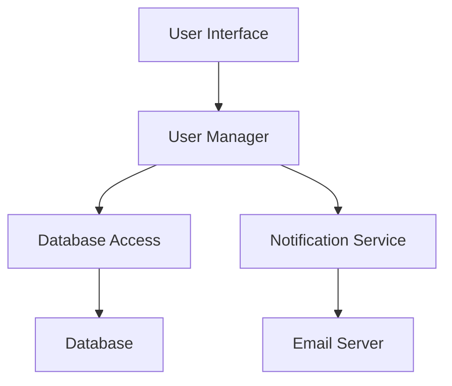

## 9.8 Module Structuring for Maintainable Code

In the realm of Erlang programming, structuring modules effectively is crucial for creating maintainable and scalable applications. This section delves into the principles of organizing code into modules, the importance of clear interfaces, minimizing dependencies, and the role of regular refactoring in maintaining code structure.

### Understanding Erlang Modules

Erlang modules serve as the fundamental building blocks of an application. Each module encapsulates a set of related functions, providing a namespace and a boundary for code organization. By grouping related functionalities, modules help in managing complexity, enhancing readability, and promoting code reuse.

#### Key Principles for Module Structuring

1. **Single Responsibility Principle (SRP):** Ensure each module has a single responsibility or purpose. This makes the module easier to understand, test, and maintain.

2. **Cohesion and Coupling:** Aim for high cohesion within modules and low coupling between them. Cohesion refers to how closely related the functions within a module are, while coupling refers to the degree of dependency between modules.

3. **Clear Interfaces:** Define clear and concise interfaces for modules. This involves specifying which functions are exposed to other modules and which remain internal.

4. **Minimal Dependencies:** Reduce dependencies between modules to avoid tight coupling. This makes it easier to modify or replace modules without affecting others.

5. **Consistent Naming Conventions:** Use consistent naming conventions for modules and functions to enhance readability and maintainability.

6. **Regular Refactoring:** Continuously refactor modules to improve structure, remove redundancies, and adapt to new requirements.

### Grouping Related Functions

Organizing functions into modules based on their functionality is a key aspect of module structuring. Consider the following example:

```erlang
-module(math_utils).
-export([add/2, subtract/2, multiply/2, divide/2]).

%% Adds two numbers
-spec add(number(), number()) -> number().
add(X, Y) ->
    X + Y.

%% Subtracts the second number from the first
-spec subtract(number(), number()) -> number().
subtract(X, Y) ->
    X - Y.

%% Multiplies two numbers
-spec multiply(number(), number()) -> number().
multiply(X, Y) ->
    X * Y.

%% Divides the first number by the second
-spec divide(number(), number()) -> number().
divide(X, Y) when Y =/= 0 ->
    X / Y;
divide(_, 0) ->
    error(badarg).
```

In this example, the `math_utils` module groups arithmetic operations, making it easy to locate and manage related functions.

### Importance of Clear Interfaces

A well-defined interface is essential for module interaction. It specifies which functions are available for use by other modules, promoting encapsulation and reducing the risk of unintended interactions.

#### Example of a Clear Interface

```erlang
-module(user_manager).
-export([create_user/2, delete_user/1, get_user/1]).

%% Creates a new user
-spec create_user(string(), map()) -> {ok, user()} | {error, term()}.
create_user(Name, Attributes) ->
    %% Implementation details
    {ok, User}.

%% Deletes an existing user
-spec delete_user(user_id()) -> ok | {error, term()}.
delete_user(UserId) ->
    %% Implementation details
    ok.

%% Retrieves user information
-spec get_user(user_id()) -> {ok, user()} | {error, not_found}.
get_user(UserId) ->
    %% Implementation details
    {ok, User}.
```

The `user_manager` module exposes a clear interface for managing users, with functions for creating, deleting, and retrieving user information.

### Minimizing Dependencies

Minimizing dependencies between modules is crucial for maintainability. It allows modules to evolve independently and reduces the risk of changes in one module affecting others.

#### Techniques for Minimizing Dependencies

- **Use Dependency Injection:** Pass dependencies as parameters rather than hardcoding them within modules.
- **Apply the Facade Pattern:** Use a facade module to provide a simplified interface to a complex subsystem, reducing direct dependencies.
- **Leverage Behaviours:** Use Erlang behaviours to define common interfaces for modules, allowing for interchangeable implementations.

### Regular Refactoring

Regular refactoring is essential for maintaining a clean and efficient codebase. It involves restructuring existing code without changing its external behavior to improve readability, reduce complexity, and adapt to new requirements.

#### Refactoring Strategies

- **Extract Functions:** Break down large functions into smaller, more manageable ones.
- **Modularize Code:** Move related functionalities into separate modules.
- **Remove Redundancies:** Eliminate duplicate code and unnecessary dependencies.
- **Optimize Performance:** Identify and address performance bottlenecks.

### Try It Yourself

Experiment with the following code example by adding new functions to the `math_utils` module, such as `power/2` for exponentiation or `modulus/2` for modulus operation. Consider how these additions affect the module's interface and dependencies.

### Visualizing Module Interactions

To better understand module interactions, consider the following diagram illustrating a simple application structure:



**Diagram Description:** This diagram represents a high-level view of an application where the `User Interface` interacts with the `User Manager` module. The `User Manager` module, in turn, interacts with `Database Access` and `Notification Service` modules, which connect to the `Database` and `Email Server`, respectively.

### References and Links

- [Erlang Documentation](https://www.erlang.org/docs)
- [Erlang Programming: A Concurrent Approach to Software Development](https://www.amazon.com/Erlang-Programming-Concurrent-Approach-Development/dp/0596518188)
- [Refactoring: Improving the Design of Existing Code](https://martinfowler.com/books/refactoring.html)

### Knowledge Check

- What are the benefits of high cohesion and low coupling in module design?
- How can dependency injection help minimize dependencies between modules?
- Why is regular refactoring important for maintainable code?

### Embrace the Journey

Remember, effective module structuring is an ongoing process. As you gain experience, you'll develop an intuition for organizing code in a way that enhances maintainability and scalability. Keep experimenting, stay curious, and enjoy the journey of mastering Erlang module structuring!

## Quiz: Module Structuring for Maintainable Code



### What is the primary benefit of using the Single Responsibility Principle in module design?

- [x] It makes modules easier to understand and maintain.
- [ ] It increases the number of functions in a module.
- [ ] It reduces the need for documentation.
- [ ] It eliminates the need for testing.

> **Explanation:** The Single Responsibility Principle ensures that each module has a single purpose, making it easier to understand, test, and maintain.

### How does dependency injection help in minimizing dependencies?

- [x] By passing dependencies as parameters rather than hardcoding them.
- [ ] By increasing the number of dependencies.
- [ ] By making modules dependent on each other.
- [ ] By eliminating the need for interfaces.

> **Explanation:** Dependency injection involves passing dependencies as parameters, reducing hardcoded dependencies and allowing for more flexible module interactions.

### What is a facade pattern used for?

- [x] To provide a simplified interface to a complex subsystem.
- [ ] To increase the complexity of a system.
- [ ] To eliminate the need for interfaces.
- [ ] To create more dependencies between modules.

> **Explanation:** The facade pattern provides a simplified interface to a complex subsystem, reducing direct dependencies and simplifying module interactions.

### Why is regular refactoring important?

- [x] To improve readability and reduce complexity.
- [ ] To increase the number of lines of code.
- [ ] To make the code harder to understand.
- [ ] To eliminate the need for testing.

> **Explanation:** Regular refactoring improves code readability, reduces complexity, and adapts the codebase to new requirements without changing its external behavior.

### What is the role of clear interfaces in module design?

- [x] To specify which functions are exposed to other modules.
- [ ] To increase the number of functions in a module.
- [ ] To eliminate the need for documentation.
- [ ] To make modules dependent on each other.

> **Explanation:** Clear interfaces specify which functions are exposed to other modules, promoting encapsulation and reducing unintended interactions.

### What is the benefit of high cohesion within a module?

- [x] It ensures that functions within a module are closely related.
- [ ] It increases the number of dependencies.
- [ ] It makes the module harder to understand.
- [ ] It eliminates the need for interfaces.

> **Explanation:** High cohesion ensures that functions within a module are closely related, enhancing readability and maintainability.

### How can you minimize dependencies between modules?

- [x] By using dependency injection and the facade pattern.
- [ ] By increasing the number of dependencies.
- [ ] By making modules dependent on each other.
- [ ] By eliminating the need for interfaces.

> **Explanation:** Minimizing dependencies can be achieved through techniques like dependency injection and the facade pattern, reducing tight coupling between modules.

### What is the purpose of using consistent naming conventions?

- [x] To enhance readability and maintainability.
- [ ] To increase the number of functions in a module.
- [ ] To eliminate the need for documentation.
- [ ] To make modules dependent on each other.

> **Explanation:** Consistent naming conventions enhance readability and maintainability by making it easier to understand the purpose and functionality of modules and functions.

### What is the benefit of using behaviours in Erlang?

- [x] To define common interfaces for modules, allowing for interchangeable implementations.
- [ ] To increase the number of dependencies.
- [ ] To make modules dependent on each other.
- [ ] To eliminate the need for interfaces.

> **Explanation:** Behaviours in Erlang define common interfaces for modules, allowing for interchangeable implementations and promoting code reuse.

### True or False: Regular refactoring can help in adapting the codebase to new requirements.

- [x] True
- [ ] False

> **Explanation:** Regular refactoring helps in adapting the codebase to new requirements by improving structure, removing redundancies, and optimizing performance.


