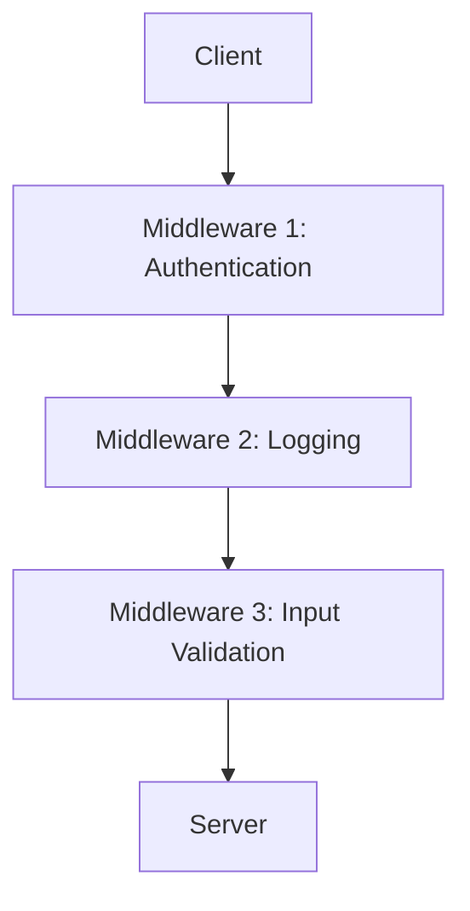

## 9.9 Implementing Wrappers and Middleware

In this section, we delve into the concept of wrappers and middleware in Erlang, exploring how these design patterns can be utilized to enhance functionality, improve modularity, and maintain separation of concerns. We'll provide examples of wrapping function calls or messages, discuss use cases such as logging, authentication, and input validation, and highlight the benefits of these patterns in building robust Erlang applications.

### Understanding Wrappers and Middleware

**Wrappers** are a design pattern used to encapsulate a function or a set of functions, allowing additional behavior to be added without modifying the original code. This pattern is particularly useful for adding cross-cutting concerns such as logging, error handling, or performance monitoring.

**Middleware**, on the other hand, refers to a layer that sits between the client and the server, processing requests and responses. Middleware can be used to implement functionalities like authentication, input validation, and request transformation.

Both wrappers and middleware are instrumental in achieving modularity and separation of concerns, as they allow developers to isolate and manage different aspects of an application independently.

### Key Concepts and Benefits

- **Modularity**: By using wrappers and middleware, you can separate different functionalities into distinct modules, making your codebase easier to manage and understand.
- **Reusability**: These patterns allow you to reuse common functionalities across different parts of your application.
- **Separation of Concerns**: Wrappers and middleware help in isolating different concerns, such as logging or authentication, from the core business logic.
- **Scalability**: By decoupling functionalities, you can scale different parts of your application independently.

### Implementing Wrappers in Erlang

Let's start by exploring how to implement wrappers in Erlang. We'll look at a simple example of wrapping a function call to add logging functionality.

```erlang
-module(wrapper_example).
-export([wrapped_function/1]).

% Original function
original_function(X) ->
    X * X.

% Wrapper function
wrapped_function(X) ->
    io:format("Calling original_function with argument: ~p~n", [X]),
    Result = original_function(X),
    io:format("Result of original_function: ~p~n", [Result]),
    Result.
```

In this example, `wrapped_function/1` acts as a wrapper around `original_function/1`. It logs the input and output of the original function, providing additional functionality without altering the original code.

#### Use Cases for Wrappers

- **Logging**: Automatically log function calls and their results.
- **Error Handling**: Catch and handle errors in a centralized manner.
- **Performance Monitoring**: Measure execution time and resource usage.

### Implementing Middleware in Erlang

Middleware in Erlang can be implemented using processes and message passing. Let's consider an example where we use middleware to authenticate requests.

```erlang
-module(middleware_example).
-export([start/0, authenticate_request/2]).

% Start the middleware process
start() ->
    spawn(fun loop/0).

% Middleware loop
loop() ->
    receive
        {authenticate, From, Request} ->
            case authenticate_request(From, Request) of
                ok ->
                    From ! {ok, "Request authenticated"};
                error ->
                    From ! {error, "Authentication failed"}
            end,
            loop()
    end.

% Authentication logic
authenticate_request(_From, Request) ->
    % Simple authentication check
    case lists:keyfind(user, 1, Request) of
        {user, "valid_user"} -> ok;
        _ -> error
    end.
```

In this example, the middleware process listens for authentication requests. It checks if the request contains a valid user and responds accordingly. This pattern can be extended to include other middleware functionalities such as logging, input validation, and request transformation.

#### Use Cases for Middleware

- **Authentication**: Verify user credentials before processing requests.
- **Input Validation**: Ensure that incoming requests meet certain criteria.
- **Request Transformation**: Modify requests before they reach the server.

### Visualizing Middleware Flow

To better understand how middleware operates, let's visualize the flow of a request through a series of middleware components.



In this diagram, a request from the client passes through multiple middleware components before reaching the server. Each middleware component can modify the request or perform additional checks.

### Benefits of Using Wrappers and Middleware

- **Enhanced Functionality**: Easily add new features without modifying existing code.
- **Improved Maintainability**: Isolate different concerns, making the codebase easier to maintain.
- **Flexibility**: Dynamically add or remove middleware components as needed.
- **Consistency**: Ensure consistent behavior across different parts of the application.

### Erlang-Specific Considerations

Erlang's concurrency model and message-passing capabilities make it particularly well-suited for implementing middleware. Processes can be used to encapsulate middleware logic, allowing for scalable and fault-tolerant designs.

### Differences and Similarities with Other Patterns

Wrappers and middleware are often compared to other design patterns like decorators and interceptors. While they share similarities, wrappers and middleware are typically used for cross-cutting concerns and are more focused on modularity and separation of concerns.

### Try It Yourself

Experiment with the examples provided by modifying the wrapper and middleware logic. Try adding new functionalities, such as caching or rate limiting, to see how these patterns can be extended.

### Knowledge Check

- What are the key benefits of using wrappers and middleware?
- How can middleware be implemented in Erlang?
- What are some common use cases for wrappers?

### Conclusion

Implementing wrappers and middleware in Erlang allows developers to enhance functionality, improve modularity, and maintain separation of concerns. By leveraging Erlang's unique features, such as its concurrency model and message-passing capabilities, you can build robust and scalable applications.

## Quiz: Implementing Wrappers and Middleware



### What is the primary purpose of using wrappers in Erlang?

- [x] To add additional behavior to functions without modifying them
- [ ] To replace existing functions with new implementations
- [ ] To improve the performance of functions
- [ ] To simplify the syntax of function calls

> **Explanation:** Wrappers are used to add additional behavior, such as logging or error handling, to functions without altering the original code.

### Which of the following is a common use case for middleware?

- [x] Authentication
- [ ] Data serialization
- [ ] Code compilation
- [ ] Memory management

> **Explanation:** Middleware is often used for cross-cutting concerns like authentication, input validation, and logging.

### How can middleware be implemented in Erlang?

- [x] Using processes and message passing
- [ ] By modifying the Erlang VM
- [ ] Through direct memory access
- [ ] By using macros

> **Explanation:** Middleware in Erlang is typically implemented using processes and message passing, leveraging Erlang's concurrency model.

### What is a benefit of using middleware in an application?

- [x] Improved modularity and separation of concerns
- [ ] Increased code complexity
- [ ] Reduced application performance
- [ ] Simplified error handling

> **Explanation:** Middleware improves modularity and separation of concerns by isolating different functionalities into distinct components.

### Which pattern is often compared to wrappers and middleware?

- [x] Decorator pattern
- [ ] Singleton pattern
- [ ] Factory pattern
- [ ] Observer pattern

> **Explanation:** The decorator pattern is often compared to wrappers and middleware as it also involves adding behavior to existing code.

### What is a key feature of Erlang that makes it suitable for implementing middleware?

- [x] Concurrency model and message-passing capabilities
- [ ] Object-oriented programming support
- [ ] Low-level memory management
- [ ] Built-in GUI libraries

> **Explanation:** Erlang's concurrency model and message-passing capabilities make it well-suited for implementing middleware.

### What is the role of a wrapper function?

- [x] To encapsulate a function and add additional behavior
- [ ] To directly modify the original function's code
- [ ] To replace the original function with a new one
- [ ] To remove functionality from the original function

> **Explanation:** A wrapper function encapsulates another function, allowing additional behavior to be added without modifying the original function.

### Which of the following is NOT a benefit of using wrappers and middleware?

- [ ] Enhanced functionality
- [ ] Improved maintainability
- [ ] Flexibility
- [x] Increased code duplication

> **Explanation:** Wrappers and middleware reduce code duplication by centralizing common functionalities.

### What is a common pattern for handling requests in middleware?

- [x] Passing requests through a series of middleware components
- [ ] Directly modifying requests in the client
- [ ] Storing requests in a database
- [ ] Ignoring requests that do not meet criteria

> **Explanation:** Requests are typically passed through a series of middleware components, each performing specific tasks.

### True or False: Middleware can only be used for authentication.

- [ ] True
- [x] False

> **Explanation:** Middleware can be used for a variety of purposes, including logging, input validation, and request transformation.



Remember, this is just the beginning. As you progress, you'll build more complex and interactive applications. Keep experimenting, stay curious, and enjoy the journey!


