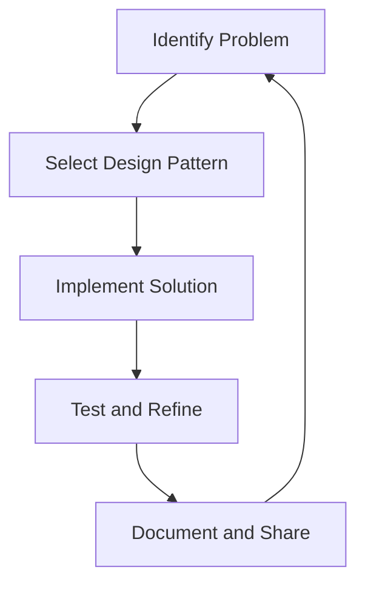

## 1.1 What Are Design Patterns?

In the realm of software engineering, design patterns are akin to blueprints that provide generalized solutions to recurring design problems. They are not finished designs that can be directly transformed into code but rather templates for how to solve a problem in various situations. Let's delve into what design patterns are, their purpose, and their significance in the world of software development, particularly within the context of F# and functional programming.

### Understanding Design Patterns

Design patterns are best understood as a set of best practices that software developers can use to solve common problems when designing an application or system. They represent the distilled wisdom of experienced developers and architects, encapsulating solutions that have been proven effective over time.

#### Definition of Design Patterns

A design pattern is a reusable solution to a commonly occurring problem within a given context in software design. It is a description or template for how to solve a problem that can be used in many different situations. Design patterns help to standardize the way problems are solved, making it easier for developers to communicate and collaborate.

#### Purpose of Design Patterns

The primary purpose of design patterns is to provide a common language for developers to communicate complex ideas more effectively. They help to:

- **Facilitate Communication**: By using a shared vocabulary, developers can discuss and convey complex design concepts more efficiently.
- **Promote Reusability**: Patterns encourage code reuse, reducing redundancy and enhancing maintainability.
- **Enhance Code Efficiency**: By applying proven solutions, developers can avoid reinventing the wheel, leading to more efficient and reliable code.
- **Improve Code Quality**: Patterns often lead to cleaner, more understandable code, which is easier to maintain and extend.

### Why Design Patterns Are Essential

Design patterns are essential because they address the fundamental challenges of software design: complexity, scalability, and maintainability. As software systems grow in size and complexity, the need for standardized solutions becomes increasingly critical.

#### Standardized Solutions to Common Problems

Design patterns provide standardized solutions that can be applied across various projects and domains. This standardization helps in:

- **Reducing Complexity**: By breaking down complex problems into manageable parts.
- **Ensuring Consistency**: Across different parts of an application or across multiple projects.
- **Accelerating Development**: By providing ready-made solutions that can be adapted to specific needs.

#### Enhancing Communication Among Developers

One of the most significant benefits of design patterns is their ability to enhance communication among developers. When developers use patterns, they can describe complex solutions succinctly and accurately, reducing misunderstandings and misinterpretations.

### Illustrating Design Patterns with Examples

To better understand the concept of design patterns, let's consider a few simple examples and analogies.

#### Example: The Singleton Pattern

The Singleton pattern ensures that a class has only one instance and provides a global point of access to it. This pattern is useful in scenarios where a single object is needed to coordinate actions across the system.

```fsharp
module SingletonExample =
    let mutable instance = None

    let getInstance () =
        match instance with
        | Some i -> i
        | None ->
            let newInstance = "Singleton Instance"
            instance <- Some newInstance
            newInstance

// Usage
let singleton1 = SingletonExample.getInstance()
let singleton2 = SingletonExample.getInstance()

printfn "Are both instances the same? %b" (singleton1 = singleton2)
```

In this example, the `getInstance` function ensures that only one instance of the object is created, demonstrating the Singleton pattern in action.

#### Analogy: Design Patterns as Recipes

Think of design patterns as recipes in a cookbook. Just as a recipe provides a step-by-step guide to creating a dish, a design pattern provides a structured approach to solving a design problem. Both offer a tried-and-tested method that can be adapted to suit individual tastes or requirements.

### The Role of Design Patterns in F#

F#, as a functional-first language, offers unique opportunities and challenges when it comes to implementing design patterns. While many traditional design patterns originate from object-oriented programming, they can be adapted to fit the functional paradigm of F#.

#### Improving Code Reusability and Efficiency in F#

In F#, design patterns can enhance code reusability and efficiency by leveraging the language's functional features, such as immutability, first-class functions, and type inference. These features allow for more concise and expressive implementations of patterns.

#### Setting the Stage for F# Design Patterns

As we explore design patterns within the context of F#, we will focus on how these patterns can be adapted to leverage the strengths of functional programming. This includes:

- **Adapting Object-Oriented Patterns**: To fit the functional paradigm.
- **Exploring Functional Patterns**: Unique to functional programming languages.
- **Leveraging F# Features**: Such as pattern matching and computation expressions.

### Visualizing Design Patterns

To further illustrate the concept of design patterns, let's use a diagram to visualize how they fit into the software development process.



**Diagram Description**: This flowchart represents the iterative process of using design patterns in software development. It starts with identifying a problem, selecting an appropriate design pattern, implementing the solution, testing and refining it, and finally documenting and sharing the knowledge.

### Key Takeaways

- **Design Patterns**: Are reusable solutions to common software design problems.
- **Purpose**: They enhance communication, promote reusability, and improve code efficiency.
- **Essential**: For addressing complexity, scalability, and maintainability in software systems.
- **F# Context**: Patterns can be adapted to leverage F#'s functional programming features.

### Embrace the Journey

Remember, understanding and applying design patterns is a journey. As you progress, you'll gain deeper insights into how these patterns can be used to build robust and scalable applications. Keep experimenting, stay curious, and enjoy the journey!

## Quiz Time!



### What is a design pattern in software engineering?

- [x] A reusable solution to a commonly occurring problem in software design
- [ ] A specific implementation of a software feature
- [ ] A programming language syntax rule
- [ ] A type of software bug

> **Explanation:** Design patterns are templates for solving common design problems, not specific implementations or language rules.

### What is the primary purpose of design patterns?

- [x] To provide a common language for developers to communicate complex ideas
- [ ] To create new programming languages
- [ ] To replace all existing code
- [ ] To eliminate the need for software testing

> **Explanation:** Design patterns facilitate communication by providing a shared vocabulary for developers.

### How do design patterns enhance code efficiency?

- [x] By applying proven solutions, developers can avoid reinventing the wheel
- [ ] By increasing the complexity of the code
- [ ] By making code harder to understand
- [ ] By eliminating all bugs

> **Explanation:** Design patterns provide efficient solutions that have been tested over time, reducing the need for redundant code.

### In what way do design patterns improve code quality?

- [x] They lead to cleaner, more understandable code
- [ ] They make code more complex
- [ ] They increase the number of lines of code
- [ ] They make code less maintainable

> **Explanation:** Design patterns often result in cleaner code that is easier to maintain and extend.

### What is the Singleton pattern used for?

- [x] Ensuring a class has only one instance and provides a global point of access
- [ ] Creating multiple instances of a class
- [ ] Hiding the implementation details of a class
- [ ] Managing multiple threads

> **Explanation:** The Singleton pattern restricts a class to a single instance, providing a global access point.

### How do design patterns facilitate communication among developers?

- [x] By using a shared vocabulary to describe complex solutions
- [ ] By making code more difficult to read
- [ ] By increasing the number of meetings required
- [ ] By eliminating the need for documentation

> **Explanation:** Design patterns provide a common language that simplifies the communication of complex ideas.

### Why are design patterns particularly useful in complex software systems?

- [x] They address complexity, scalability, and maintainability
- [ ] They make systems more complex
- [ ] They reduce the need for testing
- [ ] They eliminate all bugs

> **Explanation:** Design patterns provide standardized solutions that help manage complexity and improve scalability and maintainability.

### How can design patterns be adapted for F#?

- [x] By leveraging F#'s functional programming features
- [ ] By ignoring F#'s functional features
- [ ] By converting F# code to another language
- [ ] By avoiding design patterns altogether

> **Explanation:** Design patterns can be adapted to take advantage of F#'s features like immutability and first-class functions.

### What is the analogy used to describe design patterns in this article?

- [x] Recipes in a cookbook
- [ ] Steps in a dance
- [ ] Notes in a song
- [ ] Colors in a painting

> **Explanation:** Design patterns are compared to recipes, providing structured approaches to solving design problems.

### True or False: Design patterns eliminate the need for software testing.

- [ ] True
- [x] False

> **Explanation:** Design patterns do not eliminate the need for testing; they provide solutions that can make code more reliable and maintainable, but testing is still essential.




