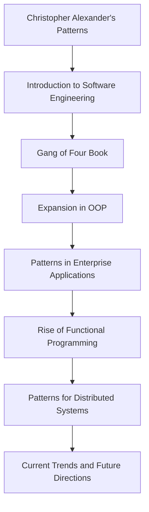

## 1.2 History and Evolution of Design Patterns

In the ever-evolving landscape of software development, design patterns have emerged as a cornerstone for crafting robust and maintainable code. These patterns offer reusable solutions to common problems, enabling developers to build complex systems with greater ease and reliability. In this section, we will trace the origins and development of design patterns, exploring their journey from the realm of object-oriented programming to their adaptation in functional programming languages like F#.

### The Inception of Design Patterns

The concept of design patterns was first introduced outside the realm of software engineering. It originated in the field of architecture, with the work of Christopher Alexander in the late 1970s. Alexander's book, "A Pattern Language: Towns, Buildings, Construction," presented a catalog of design patterns that could be used to solve recurring problems in architectural design. His work emphasized the importance of capturing design knowledge in a structured format, which could then be applied to new projects.

This idea of capturing and reusing design knowledge resonated with software engineers, who were facing similar challenges in developing complex software systems. The notion of design patterns was formally introduced to the software engineering community in 1987 by Kent Beck and Ward Cunningham, who presented their work on Smalltalk at the OOPSLA conference. They demonstrated how patterns could be used to improve the design of object-oriented systems.

### The "Gang of Four" and Their Impact

The true catalyst for the widespread adoption of design patterns in software development came with the publication of the seminal book "Design Patterns: Elements of Reusable Object-Oriented Software" in 1994. Authored by Erich Gamma, Richard Helm, Ralph Johnson, and John Vlissides, this book is often referred to as the "Gang of Four" (GoF) book. It introduced 23 classic design patterns, categorized into creational, structural, and behavioral patterns.

The GoF book had a profound impact on the software development community. It provided a common vocabulary for discussing design solutions and encouraged developers to think in terms of reusable patterns. The book's influence extended beyond object-oriented programming, inspiring developers across various paradigms to explore the use of design patterns in their work.

### Key Milestones in the Evolution of Design Patterns

Since the publication of the GoF book, design patterns have continued to evolve, adapting to new programming paradigms and technologies. Here are some key milestones in their evolution:

1. **1990s - Expansion in Object-Oriented Programming**: Following the GoF book, design patterns became a fundamental part of object-oriented programming (OOP). They were integrated into the curricula of computer science programs and became a staple in software engineering practices.

2. **2000s - Patterns in Enterprise Applications**: As enterprise applications grew in complexity, new patterns emerged to address challenges such as scalability, maintainability, and integration. Patterns like Model-View-Controller (MVC) and Dependency Injection gained prominence during this period.

3. **2010s - Rise of Functional Programming**: With the increasing popularity of functional programming languages like Haskell, Scala, and F#, the community began to explore how traditional design patterns could be adapted to functional paradigms. This led to the development of new patterns that leveraged the strengths of functional programming, such as immutability and higher-order functions.

4. **2020s - Patterns for Distributed Systems and Microservices**: The shift towards cloud computing and microservices architecture introduced new challenges, leading to the emergence of patterns specifically designed for distributed systems. Patterns like Circuit Breaker, Saga, and Event Sourcing became essential for building resilient and scalable applications.

### Transition from Object-Oriented to Functional Programming

The transition of design patterns from object-oriented to functional programming represents a significant evolution in the software engineering landscape. While object-oriented programming emphasizes encapsulation, inheritance, and polymorphism, functional programming focuses on immutability, pure functions, and higher-order functions.

#### Adapting Object-Oriented Patterns to Functional Programming

Many traditional design patterns have been reimagined for functional programming. For example, the Singleton pattern, which ensures a class has only one instance, can be implemented using modules in F#. Modules in F# are inherently singleton, as they are initialized once and shared across the application.

```fsharp
module Singleton =
    let instance = "I am a singleton instance"
```

In this example, the `Singleton` module contains a single instance of a string. This instance is shared across the application, achieving the same effect as the Singleton pattern in object-oriented programming.

#### Embracing Functional Patterns

Functional programming introduces its own set of patterns that leverage its unique features. For instance, the use of Monads, such as the `Option` and `Result` types in F#, provides a powerful way to handle optional values and errors without resorting to null references or exceptions.

```fsharp
let divide x y =
    if y = 0 then None
    else Some (x / y)

let result = divide 10 2
match result with
| Some value -> printfn "Result: %d" value
| None -> printfn "Cannot divide by zero"
```

In this example, the `divide` function returns an `Option` type, which can be either `Some` with a value or `None` if the division is not possible. This pattern ensures that error handling is explicit and type-safe.

### The Maturation of Design Patterns in the Community

As the software development community's understanding of design patterns has matured, so too has their application. Developers have moved beyond simply applying patterns as prescribed in the GoF book, instead adapting and evolving them to suit the needs of modern software systems.

#### Community Contributions and Influential Works

The evolution of design patterns has been driven by contributions from the community and influential works that have expanded the understanding of patterns. Books like "Patterns of Enterprise Application Architecture" by Martin Fowler and "Domain-Driven Design" by Eric Evans have introduced new patterns and concepts that address the complexities of enterprise software development.

The open-source community has also played a crucial role in the evolution of design patterns. Platforms like GitHub and Stack Overflow have facilitated the sharing of knowledge and best practices, enabling developers to collaborate and innovate.

### Visualizing the Evolution of Design Patterns

To better understand the evolution of design patterns, let's visualize their journey from object-oriented to functional programming using a flowchart.



This flowchart illustrates the key milestones in the evolution of design patterns, highlighting their transition from architectural design to software engineering and their adaptation to new programming paradigms.

### Insights into the Future of Design Patterns

As we look to the future, design patterns will continue to evolve in response to emerging technologies and paradigms. The rise of artificial intelligence, machine learning, and quantum computing will undoubtedly introduce new challenges and opportunities for design patterns.

The community's understanding of design patterns will also continue to mature, driven by ongoing research and collaboration. As developers embrace new paradigms and technologies, they will continue to adapt and innovate, ensuring that design patterns remain a vital tool in the software engineer's toolkit.

### Try It Yourself: Experimenting with Patterns in F#

To deepen your understanding of design patterns in F#, try implementing some of the patterns discussed in this section. Start by adapting a traditional object-oriented pattern to a functional paradigm, such as the Singleton or Factory pattern. Then, explore functional patterns like Monads and Lenses, and consider how they can be applied to your own projects.

Remember, this is just the beginning. As you progress, you'll build more complex and interactive applications. Keep experimenting, stay curious, and enjoy the journey!

### Knowledge Check

- **Question**: What was the original field where the concept of design patterns was introduced?
- **Challenge**: Implement the Singleton pattern using a module in F#.

### Summary of Key Takeaways

- Design patterns originated in architecture and were introduced to software engineering in the late 1980s.
- The "Gang of Four" book was pivotal in popularizing design patterns in object-oriented programming.
- Design patterns have evolved to address the needs of enterprise applications, functional programming, and distributed systems.
- The transition from object-oriented to functional programming has led to the adaptation and creation of new patterns.
- The community's understanding of design patterns continues to mature, driven by collaboration and innovation.

## Quiz Time!



### What book is often referred to as the "Gang of Four" book?

- [x] "Design Patterns: Elements of Reusable Object-Oriented Software"
- [ ] "Patterns of Enterprise Application Architecture"
- [ ] "Domain-Driven Design"
- [ ] "A Pattern Language: Towns, Buildings, Construction"

> **Explanation:** The "Gang of Four" book is "Design Patterns: Elements of Reusable Object-Oriented Software," authored by Erich Gamma, Richard Helm, Ralph Johnson, and John Vlissides.

### Which programming paradigm emphasizes immutability and pure functions?

- [x] Functional Programming
- [ ] Object-Oriented Programming
- [ ] Procedural Programming
- [ ] Logic Programming

> **Explanation:** Functional programming emphasizes immutability and pure functions, which are key characteristics of this paradigm.

### Who introduced the concept of design patterns to software engineering?

- [x] Kent Beck and Ward Cunningham
- [ ] Erich Gamma and Richard Helm
- [ ] Martin Fowler and Eric Evans
- [ ] Christopher Alexander

> **Explanation:** Kent Beck and Ward Cunningham introduced the concept of design patterns to software engineering at the OOPSLA conference in 1987.

### What is the primary focus of the Singleton pattern?

- [x] Ensuring a class has only one instance
- [ ] Encapsulating object creation
- [ ] Separating abstraction from implementation
- [ ] Composing objects into tree structures

> **Explanation:** The Singleton pattern ensures that a class has only one instance and provides a global point of access to it.

### Which pattern is used to handle optional values in functional programming?

- [x] Monad
- [ ] Singleton
- [x] Option
- [ ] Factory

> **Explanation:** In functional programming, Monads like `Option` are used to handle optional values without resorting to null references.

### What was the original field where the concept of design patterns was introduced?

- [x] Architecture
- [ ] Software Engineering
- [ ] Mathematics
- [ ] Physics

> **Explanation:** The concept of design patterns was originally introduced in the field of architecture by Christopher Alexander.

### Which book introduced the concept of Domain-Driven Design?

- [x] "Domain-Driven Design"
- [ ] "Design Patterns: Elements of Reusable Object-Oriented Software"
- [ ] "Patterns of Enterprise Application Architecture"
- [ ] "A Pattern Language: Towns, Buildings, Construction"

> **Explanation:** The book "Domain-Driven Design" by Eric Evans introduced the concept of Domain-Driven Design.

### What is a key characteristic of functional programming?

- [x] Immutability
- [ ] Inheritance
- [ ] Polymorphism
- [ ] Encapsulation

> **Explanation:** Immutability is a key characteristic of functional programming, emphasizing the use of immutable data structures.

### What is the primary goal of the Factory pattern?

- [x] Encapsulating object creation logic
- [ ] Ensuring a class has only one instance
- [ ] Separating abstraction from implementation
- [ ] Composing objects into tree structures

> **Explanation:** The Factory pattern's primary goal is to encapsulate the object creation logic, allowing for more flexible and reusable code.

### Design patterns have evolved to address the needs of which types of systems?

- [x] Enterprise applications
- [x] Functional programming
- [x] Distributed systems
- [ ] Static websites

> **Explanation:** Design patterns have evolved to address the needs of enterprise applications, functional programming, and distributed systems, among others.


