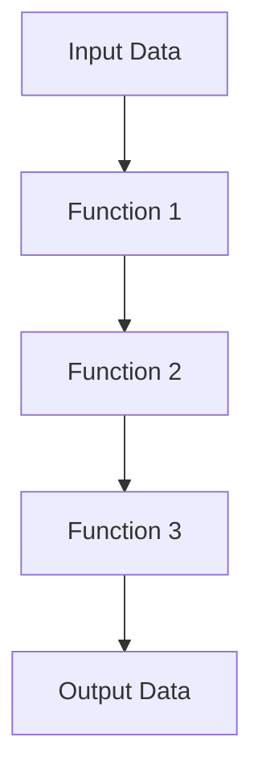

## 1.3 Importance of Design Patterns in Functional Programming

In the realm of software development, design patterns serve as a vital toolkit for solving recurring design problems. They provide a shared language for developers to communicate complex ideas efficiently and effectively. While traditionally associated with object-oriented programming (OOP), design patterns are equally important in functional programming (FP) languages such as F#. This section explores the significance of design patterns in functional programming, highlighting their role, adaptation, and benefits.

### Understanding Design Patterns in Functional Programming

Design patterns in functional programming are reusable solutions to common problems that arise in software design. They are not just about code reuse but also about conceptual reuse, providing a template for solving problems that can be adapted to specific needs. In functional programming, design patterns often revolve around functions, immutability, and higher-order abstractions.

#### Key Concepts

- **Immutability**: In FP, data structures are immutable, meaning they cannot be modified after creation. This leads to patterns that focus on transforming data rather than changing it in place.
- **First-Class Functions**: Functions in FP are first-class citizens, meaning they can be passed as arguments, returned from other functions, and assigned to variables. This enables patterns that leverage higher-order functions.
- **Pure Functions**: These functions have no side effects and always produce the same output for the same input, making them predictable and easier to reason about.

### Contrasting Design Patterns in FP and OOP

While design patterns are prevalent in both OOP and FP, their application and implementation can differ significantly due to the paradigms' inherent characteristics.

#### Object-Oriented Programming

In OOP, design patterns often focus on the relationships and interactions between objects. Patterns such as Singleton, Factory, and Observer are used to manage object creation, communication, and state.

#### Functional Programming

In FP, the emphasis is on functions and data transformations. Patterns like Monads, Functors, and Lenses are more prevalent, focusing on function composition, data manipulation, and side-effect management.

#### Comparison Table

| Aspect                  | Object-Oriented Programming                  | Functional Programming                            |
|-------------------------|----------------------------------------------|---------------------------------------------------|
| **Focus**               | Objects and their interactions               | Functions and data transformations                |
| **State Management**    | Mutable state, encapsulation                 | Immutability, pure functions                      |
| **Pattern Examples**    | Singleton, Factory, Observer                 | Monad, Functor, Lens                              |
| **Design Approach**     | Inheritance, polymorphism                    | Composition, higher-order functions               |

### Challenges and Adaptations in FP

Adapting traditional design patterns to functional programming can present unique challenges due to the paradigm's emphasis on immutability and pure functions. However, these challenges can be addressed by leveraging the strengths of FP.

#### Challenge: Managing State

In OOP, patterns often involve managing mutable state, which is not directly applicable in FP. Instead, FP uses immutable data structures and pure functions to manage state changes.

**Solution**: Use persistent data structures and techniques like recursion and tail call optimization to manage state efficiently.

#### Challenge: Object Creation

Patterns like Factory and Singleton focus on object creation, which is less relevant in FP due to its emphasis on functions.

**Solution**: Use higher-order functions and closures to encapsulate creation logic.

### Examples of Design Patterns in Functional Programming

Functional programming offers a rich set of patterns that are naturally expressed in languages like F#.

#### Monad Pattern

Monads are a powerful abstraction for handling computations that involve context, such as side effects or optional values. They provide a way to sequence operations while maintaining purity.

```fsharp
// Example of the Option Monad in F#
let bind f option =
    match option with
    | Some x -> f x
    | None -> None

let addOne x = Some (x + 1)

let result = Some 5 |> bind addOne |> bind addOne
// result is Some 7
```

#### Functor Pattern

Functors allow you to apply a function to a wrapped value, such as a list or an option, without unwrapping it.

```fsharp
// Example of a Functor with List
let map f list =
    List.map f list

let incremented = map (fun x -> x + 1) [1; 2; 3]
// incremented is [2; 3; 4]
```

#### Lens Pattern

Lenses provide a way to focus on a part of a data structure, allowing you to get or set values in a nested structure.

```fsharp
// Example of a simple Lens
type Person = { Name: string; Age: int }

let ageLens =
    { Get = fun person -> person.Age
      Set = fun newAge person -> { person with Age = newAge } }

let john = { Name = "John"; Age = 30 }
let johnsAge = ageLens.Get john
let olderJohn = ageLens.Set 31 john
```

### Benefits of Using Design Patterns in FP

Design patterns in functional programming offer several advantages that contribute to cleaner, more maintainable code.

#### Code Clarity

Patterns provide a clear structure for solving problems, making code easier to read and understand. They encapsulate complex logic into reusable components.

#### Maintainability

By using patterns, you can reduce code duplication and increase modularity, making it easier to maintain and extend your codebase.

#### Enhanced Problem-Solving Skills

Understanding and applying design patterns enhances your ability to solve complex problems by providing a toolkit of proven solutions.

### Visualizing Design Patterns in FP

To better understand how design patterns fit into functional programming, let's visualize the flow of data and functions in a typical FP pattern.



**Caption**: This diagram illustrates the flow of data through a series of functions, a common pattern in functional programming.

### Try It Yourself

Experiment with the code examples provided in this section. Try modifying the functions to see how changes affect the output. For instance, in the Monad example, try adding a function that multiplies the value by 2 instead of adding 1.

### References and Links

For further reading on design patterns in functional programming, consider exploring the following resources:

- [Functional Programming Patterns in Scala and Clojure](https://www.amazon.com/Functional-Programming-Patterns-Scala-Clojure/dp/1937785475)
- [Learn You a Haskell for Great Good!](http://learnyouahaskell.com/)

### Knowledge Check

Let's test your understanding of the concepts covered in this section. Consider the following questions:

1. What is the primary focus of design patterns in functional programming?
2. How do monads help manage side effects in functional programming?
3. What are the benefits of using design patterns in functional programming?

### Embrace the Journey

Remember, mastering design patterns in functional programming is a journey. As you continue to explore and apply these patterns, you'll find new ways to solve problems and write more expressive, efficient code. Keep experimenting, stay curious, and enjoy the process!

### Summary

In this section, we've explored the importance of design patterns in functional programming, particularly in F#. We've discussed how these patterns differ from those in OOP, the challenges of adapting them to FP, and the benefits they offer. By understanding and applying these patterns, you can enhance your problem-solving skills and write cleaner, more maintainable code.

## Quiz Time!



### What is a key characteristic of functional programming that influences design patterns?

- [x] Immutability
- [ ] Inheritance
- [ ] Polymorphism
- [ ] Encapsulation

> **Explanation:** Immutability is a fundamental aspect of functional programming, influencing how design patterns are applied.

### Which pattern is commonly used in functional programming to handle computations with context?

- [x] Monad
- [ ] Singleton
- [ ] Observer
- [ ] Factory

> **Explanation:** Monads are used to handle computations that involve context, such as side effects or optional values.

### How do functors in functional programming differ from those in OOP?

- [x] They apply functions to wrapped values.
- [ ] They manage object creation.
- [ ] They define object interactions.
- [ ] They encapsulate state.

> **Explanation:** Functors in FP allow functions to be applied to wrapped values like lists or options.

### What is a benefit of using design patterns in functional programming?

- [x] Enhanced code maintainability
- [ ] Increased code complexity
- [ ] Reduced code readability
- [ ] Greater reliance on mutable state

> **Explanation:** Design patterns enhance code maintainability by providing reusable solutions to common problems.

### Which of the following is a challenge when adapting OOP patterns to FP?

- [x] Managing mutable state
- [ ] Implementing inheritance
- [ ] Using polymorphism
- [ ] Encapsulating objects

> **Explanation:** Managing mutable state is a challenge in FP, which emphasizes immutability.

### What is the purpose of a lens in functional programming?

- [x] To focus on a part of a data structure
- [ ] To manage object creation
- [ ] To encapsulate state
- [ ] To define object interactions

> **Explanation:** Lenses allow you to focus on and manipulate parts of a data structure.

### How do design patterns enhance problem-solving skills in FP?

- [x] By providing a toolkit of proven solutions
- [ ] By increasing code complexity
- [ ] By reducing code readability
- [ ] By promoting mutable state

> **Explanation:** Design patterns provide a toolkit of proven solutions, enhancing problem-solving skills.

### What is a common pattern in FP for sequencing operations?

- [x] Monad
- [ ] Singleton
- [ ] Observer
- [ ] Factory

> **Explanation:** Monads are used to sequence operations while maintaining purity.

### Which of the following is a benefit of immutability in FP?

- [x] Predictable and easier-to-reason-about code
- [ ] Increased reliance on mutable state
- [ ] Greater code complexity
- [ ] Reduced code readability

> **Explanation:** Immutability leads to predictable and easier-to-reason-about code.

### Design patterns in FP focus primarily on:

- [x] Functions and data transformations
- [ ] Objects and their interactions
- [ ] Mutable state management
- [ ] Encapsulation and inheritance

> **Explanation:** In FP, design patterns focus on functions and data transformations.


