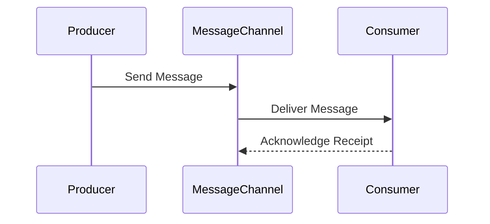

## 10.1 Introduction to Enterprise Integration Patterns

In today's fast-paced digital landscape, organizations are increasingly reliant on a multitude of software systems to manage their operations. These systems often need to communicate and share data seamlessly to ensure business processes run smoothly. This is where enterprise integration comes into play, providing the necessary framework to connect disparate systems within an organization.

### Understanding Enterprise Integration

**Enterprise Integration** refers to the process of ensuring that various software systems within an organization can communicate effectively and share data without friction. This is crucial for modern organizations as it enables them to leverage existing systems, streamline operations, and respond swiftly to market changes.

#### Why is Enterprise Integration Crucial?

1. **Seamless Communication**: In a typical enterprise, different departments may use different software solutions. Integration ensures these systems can communicate, allowing for a unified view of operations.
   
2. **Data Sharing**: Integration facilitates the sharing of data across systems, ensuring that decision-makers have access to accurate and up-to-date information.

3. **Operational Efficiency**: By automating data exchange and reducing manual interventions, integration improves operational efficiency and reduces the risk of errors.

4. **Scalability**: As businesses grow, their IT infrastructure must scale accordingly. Integration allows for the addition of new systems without disrupting existing operations.

5. **Innovation**: With systems integrated, organizations can innovate faster by building on existing capabilities rather than starting from scratch.

### Highlighting Integration Challenges

Despite its benefits, enterprise integration presents several challenges:

#### Common Challenges

- **Heterogeneous Systems**: Enterprises often use a mix of legacy systems, cloud services, and modern applications, each with its own technology stack.

- **Differing Data Formats**: Systems may store and exchange data in different formats, necessitating data transformation and mapping.

- **Varied Protocols**: Different systems may communicate using different protocols (e.g., HTTP, FTP, JMS), requiring protocol bridging.

- **Scalability**: As the volume of data and transactions increases, the integration solution must scale to handle the load.

- **Reliability**: Integration solutions must be reliable, ensuring that messages are delivered and processed even in the face of failures.

### Introducing Messaging and Integration Patterns

To address these challenges, organizations often turn to **Messaging and Integration Patterns**. These patterns provide reusable solutions to common integration problems, facilitating decoupled communication between systems.

#### Messaging Systems

Messaging systems are a cornerstone of enterprise integration, enabling asynchronous communication between systems. They decouple the sender and receiver, allowing each to operate independently and at their own pace.

- **Decoupled Communication**: Systems can send and receive messages without needing to know about each other's internal workings.

- **Asynchronous Processing**: Messages can be processed independently, improving system responsiveness and scalability.

- **Reliability**: Messaging systems often include features like message persistence and retry mechanisms to ensure reliable delivery.

#### Enterprise Integration Patterns (EIPs)

Enterprise Integration Patterns (EIPs) are a collection of design patterns that provide solutions to common integration challenges. These patterns help in designing robust, scalable, and maintainable integration solutions.

- **Message Channels**: Define pathways for message exchange between systems.

- **Message Routing**: Direct messages to the appropriate destination based on content or other criteria.

- **Message Transformation**: Convert messages from one format to another to ensure compatibility between systems.

- **Message Endpoints**: Define the interface through which systems send and receive messages.

### Setting the Context

In this section, we will explore various enterprise integration patterns and their implementation in F#. We will cover patterns such as Message Channels, Message Routing, Message Transformation, and more. These patterns are highly relevant in functional programming and F#, as they align with the language's strengths.

### Importance in Functional Programming

F# is well-suited for enterprise integration due to its functional programming features:

- **Immutability**: F#'s emphasis on immutability ensures that data remains consistent and predictable, reducing the risk of errors in integration scenarios.

- **Strong Typing**: F#'s robust type system helps catch integration errors at compile time, improving reliability.

- **Asynchronous Programming**: F# provides excellent support for asynchronous programming, making it easier to build responsive and scalable integration solutions.

- **Pattern Matching**: F#'s pattern matching capabilities simplify the implementation of complex message routing and transformation logic.

### Objective

The goal of this section is to equip you with the knowledge and practical skills to implement enterprise integration patterns in F#. By the end of this section, you will understand how to leverage F#'s features to build robust and scalable integration solutions that meet the needs of modern enterprises.

### Code Example: Simple Messaging System in F#

Let's explore a simple example of a messaging system in F# to illustrate some of these concepts.

```fsharp
open System
open System.Collections.Concurrent
open System.Threading.Tasks

// Define a message type
type Message = { Id: Guid; Content: string }

// Define a message channel
let messageChannel = new BlockingCollection<Message>()

// Producer function to send messages
let producer () =
    for i in 1 .. 10 do
        let message = { Id = Guid.NewGuid(); Content = sprintf "Message %d" i }
        printfn "Producing: %s" message.Content
        messageChannel.Add(message)
    messageChannel.CompleteAdding()

// Consumer function to receive messages
let consumer () =
    Task.Run(fun () ->
        for message in messageChannel.GetConsumingEnumerable() do
            printfn "Consuming: %s" message.Content
    )

// Start producer and consumer
let producerTask = Task.Run(producer)
let consumerTask = consumer()

Task.WaitAll(producerTask, consumerTask)
```

In this example, we define a simple messaging system using F#. The `producer` function generates messages and adds them to a `BlockingCollection`, which acts as our message channel. The `consumer` function processes messages from the channel asynchronously.

### Try It Yourself

Try modifying the code to add more producers or consumers. Observe how the system behaves with multiple producers and consumers. This exercise will help you understand the decoupled nature of messaging systems and how they can improve scalability and reliability.

### Visualizing Enterprise Integration

To better understand the flow of messages in an enterprise integration scenario, let's visualize the process using a sequence diagram.



This diagram illustrates how a producer sends a message to a message channel, which then delivers it to a consumer. The consumer acknowledges receipt, completing the message exchange process.

### References and Links

For further reading on enterprise integration patterns and messaging systems, consider the following resources:

- [Enterprise Integration Patterns](https://www.enterpriseintegrationpatterns.com/)
- [Messaging Systems](https://www.redhat.com/en/topics/integration/what-is-a-messaging-system)
- [F# Asynchronous Programming](https://docs.microsoft.com/en-us/dotnet/fsharp/tutorials/asynchronous-and-concurrent-programming/async)

### Knowledge Check

- What is enterprise integration, and why is it important?
- What are some common challenges in enterprise integration?
- How do messaging systems facilitate decoupled communication?
- What are Enterprise Integration Patterns (EIPs)?

### Embrace the Journey

Remember, mastering enterprise integration patterns is a journey. As you progress, you'll gain the skills to design and implement robust integration solutions that meet the needs of modern enterprises. Keep experimenting, stay curious, and enjoy the journey!

## Quiz Time!



### What is the primary goal of enterprise integration?

- [x] To ensure seamless communication and data sharing between disparate systems
- [ ] To replace all legacy systems with new ones
- [ ] To centralize all data in a single database
- [ ] To eliminate the need for software updates

> **Explanation:** Enterprise integration aims to connect different systems within an organization to enable seamless communication and data sharing.

### What is a common challenge in enterprise integration?

- [x] Heterogeneous systems with different technology stacks
- [ ] Having too many developers on a project
- [ ] Lack of internet connectivity
- [ ] Excessive use of open-source software

> **Explanation:** One of the main challenges in enterprise integration is dealing with heterogeneous systems that use different technology stacks.

### How do messaging systems facilitate communication?

- [x] By enabling asynchronous and decoupled communication between systems
- [ ] By requiring systems to communicate synchronously
- [ ] By storing all messages in a central database
- [ ] By eliminating the need for network protocols

> **Explanation:** Messaging systems allow systems to communicate asynchronously and decouple the sender and receiver, enabling independent operation.

### What is an Enterprise Integration Pattern (EIP)?

- [x] A reusable solution to a common integration problem
- [ ] A new programming language for integration
- [ ] A type of database used in integration
- [ ] A hardware device for network communication

> **Explanation:** EIPs are design patterns that provide reusable solutions to common integration challenges.

### Which F# feature is beneficial for enterprise integration?

- [x] Immutability
- [ ] Lack of type safety
- [ ] Manual memory management
- [ ] Weak typing

> **Explanation:** F#'s immutability ensures data consistency and predictability, which is beneficial for integration scenarios.

### What does a message channel do?

- [x] Defines pathways for message exchange between systems
- [ ] Stores all messages permanently
- [ ] Converts messages to a single format
- [ ] Eliminates the need for message transformation

> **Explanation:** A message channel defines the pathways through which messages are exchanged between systems.

### What is the role of message transformation?

- [x] To convert messages from one format to another for compatibility
- [ ] To store messages in a database
- [ ] To encrypt messages for security
- [ ] To delete old messages

> **Explanation:** Message transformation ensures that messages are compatible between systems by converting them from one format to another.

### How does F# support asynchronous programming?

- [x] Through its built-in support for asynchronous workflows
- [ ] By requiring external libraries for async operations
- [ ] By using global variables for state management
- [ ] By eliminating the need for async operations

> **Explanation:** F# has built-in support for asynchronous workflows, making it easier to build responsive and scalable integration solutions.

### What is a benefit of decoupled communication?

- [x] Systems can operate independently and at their own pace
- [ ] Systems must communicate in real-time
- [ ] All systems must use the same programming language
- [ ] Systems are tightly integrated and dependent on each other

> **Explanation:** Decoupled communication allows systems to operate independently, improving scalability and flexibility.

### True or False: Enterprise integration patterns are only applicable to large organizations.

- [ ] True
- [x] False

> **Explanation:** Enterprise integration patterns can be applied to organizations of any size to solve integration challenges.


