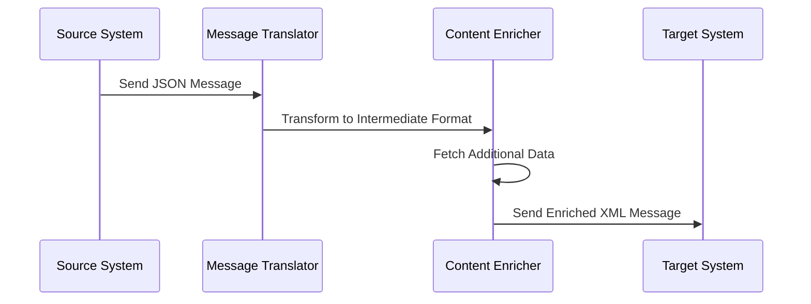

## 10.4 Message Transformation Patterns

In today's interconnected world, systems often need to communicate with each other, exchanging data in various formats. Message transformation patterns play a crucial role in ensuring that messages are correctly interpreted and processed by different systems, each with its own data requirements. In this section, we'll explore key message transformation patterns, including the Message Translator, Envelope Wrapper, and Content Enricher, and demonstrate how to implement these patterns in F#.

### Importance of Message Transformation

As systems evolve, they often need to integrate with other systems that may have different data formats or structures. Message transformation is essential for several reasons:

- **Interoperability**: Ensures that systems can communicate effectively despite differences in data formats.
- **Data Consistency**: Maintains consistent data representation across different systems.
- **Flexibility**: Allows systems to adapt to changes in data formats without requiring significant changes to the underlying architecture.

However, integrating systems with different data formats presents challenges, such as handling data mismatches, ensuring data integrity, and managing transformation errors. Let's delve into the patterns that address these challenges.

### Message Translator

The Message Translator pattern is designed to change the format of a message to match the requirements of the receiving system. This pattern is crucial when integrating systems that use different data formats, such as JSON, XML, or custom data structures.

#### Implementing Message Translator in F#

In F#, we can use serialization and deserialization techniques to implement the Message Translator pattern. Let's consider a scenario where we need to transform a JSON message into an XML format.

```fsharp
open System
open Newtonsoft.Json
open System.Xml.Linq

// Define a simple data model
type Person = {
    Name: string
    Age: int
}

// JSON representation of a Person
let jsonMessage = """{"Name": "Alice", "Age": 30}"""

// Deserialize JSON to a Person object
let person = JsonConvert.DeserializeObject<Person>(jsonMessage)

// Function to convert Person to XML
let personToXml (person: Person) =
    XElement("Person",
        XElement("Name", person.Name),
        XElement("Age", person.Age.ToString())
    )

// Transform the Person object to XML
let xmlMessage = personToXml person

printfn "XML Message: %s" (xmlMessage.ToString())
```

In this example, we use Newtonsoft.Json for JSON deserialization and System.Xml.Linq for XML creation. The `personToXml` function transforms the `Person` object into an XML format, demonstrating the Message Translator pattern.

### Envelope Wrapper

The Envelope Wrapper pattern involves adding metadata or headers to a message, which can be useful for routing, logging, or security purposes. This pattern helps in encapsulating the core message with additional information needed for processing.

#### Implementing Envelope Wrapper in F#

In F#, we can use record types or tuples to implement the Envelope Wrapper pattern. Let's see how we can wrap a message with metadata.

```fsharp
// Define a record type for the envelope
type Envelope<'T> = {
    Metadata: Map<string, string>
    Message: 'T
}

// Create a function to wrap a message with metadata
let wrapWithEnvelope metadata message =
    { Metadata = metadata; Message = message }

// Example usage
let metadata = Map.ofList [("Timestamp", DateTime.UtcNow.ToString()); ("CorrelationId", Guid.NewGuid().ToString())]
let message = "Hello, World!"

let envelope = wrapWithEnvelope metadata message

printfn "Envelope Metadata: %A" envelope.Metadata
printfn "Envelope Message: %s" envelope.Message
```

In this example, we define an `Envelope` record type that contains metadata and the core message. The `wrapWithEnvelope` function creates an envelope by combining metadata and the message, illustrating the Envelope Wrapper pattern.

### Content Enricher

The Content Enricher pattern involves augmenting a message with additional data. This pattern is useful when the original message lacks some information required for processing, and supplementary data needs to be fetched from an external source.

#### Implementing Content Enricher in F#

In F#, we can fetch supplementary data from a database or service and enrich the message. Let's demonstrate this with an example where we enrich a message with data from a database.

```fsharp
open System.Data.SqlClient

// Define a function to fetch additional data from a database
let fetchAdditionalData personId =
    use connection = new SqlConnection("your-connection-string")
    connection.Open()
    use command = new SqlCommand("SELECT Address FROM Persons WHERE Id = @Id", connection)
    command.Parameters.AddWithValue("@Id", personId) |> ignore
    command.ExecuteScalar() :?> string

// Define a type for the enriched message
type EnrichedPerson = {
    Name: string
    Age: int
    Address: string
}

// Function to enrich a Person message with additional data
let enrichPerson person =
    let address = fetchAdditionalData person.Id
    { Name = person.Name; Age = person.Age; Address = address }

// Example usage
let enrichedPerson = enrichPerson { Name = "Alice"; Age = 30; Id = 1 }

printfn "Enriched Person: %A" enrichedPerson
```

In this example, we define a function `fetchAdditionalData` to retrieve an address from a database. The `enrichPerson` function enriches the `Person` message with the fetched address, demonstrating the Content Enricher pattern.

### Tools and Libraries

F# provides several tools and libraries that facilitate message transformation:

- **FSharp.Data**: A library for data access, including JSON, XML, and CSV parsing.
- **Type Providers**: Simplify working with different data sources by providing strongly-typed access to external data.

#### Using FSharp.Data and Type Providers

Let's see how we can use FSharp.Data and type providers to simplify data manipulation.

```fsharp
open FSharp.Data

// Use a JSON type provider to access JSON data
type PersonJson = JsonProvider<"""{"Name": "Alice", "Age": 30}""">

let json = """{"Name": "Bob", "Age": 25}"""
let person = PersonJson.Parse(json)

printfn "Name: %s, Age: %d" person.Name person.Age
```

In this example, we use the JSON type provider from FSharp.Data to parse JSON data into a strongly-typed object, simplifying data manipulation.

### Best Practices

When implementing message transformation patterns, consider the following best practices:

- **Data Integrity**: Ensure that data transformations maintain the integrity and accuracy of the original data.
- **Error Handling**: Implement robust error handling to manage transformation errors gracefully.
- **Schema Validation**: Validate message schemas to ensure compatibility between systems.
- **Versioning Strategies**: Implement versioning strategies to manage changes in data formats over time.

### Practical Examples

Let's look at an end-to-end example of message transformation in an integration scenario. Suppose we have a system that receives JSON messages, enriches them with data from a database, and sends them as XML messages to another system.

```fsharp
open System
open Newtonsoft.Json
open System.Xml.Linq
open System.Data.SqlClient
open FSharp.Data

// Define data models
type Person = { Name: string; Age: int; Id: int }
type EnrichedPerson = { Name: string; Age: int; Address: string }

// Deserialize JSON to a Person object
let deserializeJson json =
    JsonConvert.DeserializeObject<Person>(json)

// Fetch additional data from a database
let fetchAdditionalData personId =
    use connection = new SqlConnection("your-connection-string")
    connection.Open()
    use command = new SqlCommand("SELECT Address FROM Persons WHERE Id = @Id", connection)
    command.Parameters.AddWithValue("@Id", personId) |> ignore
    command.ExecuteScalar() :?> string

// Enrich a Person message with additional data
let enrichPerson person =
    let address = fetchAdditionalData person.Id
    { Name = person.Name; Age = person.Age; Address = address }

// Convert EnrichedPerson to XML
let enrichedPersonToXml enrichedPerson =
    XElement("EnrichedPerson",
        XElement("Name", enrichedPerson.Name),
        XElement("Age", enrichedPerson.Age.ToString()),
        XElement("Address", enrichedPerson.Address)
    )

// Example usage
let jsonMessage = """{"Name": "Alice", "Age": 30, "Id": 1}"""
let person = deserializeJson jsonMessage
let enrichedPerson = enrichPerson person
let xmlMessage = enrichedPersonToXml enrichedPerson

printfn "XML Message: %s" (xmlMessage.ToString())
```

In this example, we demonstrate the entire process of deserializing a JSON message, enriching it with data from a database, and transforming it into an XML message, showcasing the integration of multiple message transformation patterns.

### Try It Yourself

To deepen your understanding, try modifying the code examples:

- Change the data model to include additional fields and update the transformation logic accordingly.
- Experiment with different data formats, such as CSV or YAML, and implement the Message Translator pattern for these formats.
- Implement error handling and logging to capture transformation errors and monitor the process.

### Visualizing Message Transformation Patterns

To better understand the flow of message transformation patterns, let's visualize the process using a sequence diagram.



This diagram illustrates the sequence of actions in a message transformation process, from receiving a JSON message to sending an enriched XML message to the target system.

### Conclusion

Message transformation patterns are essential for ensuring interoperability between systems with varying data requirements. By understanding and implementing patterns like Message Translator, Envelope Wrapper, and Content Enricher in F#, you can build robust integration solutions that handle diverse data formats effectively. Remember to follow best practices, such as maintaining data integrity and implementing error handling, to ensure reliable and efficient message transformations.

## Quiz Time!



### What is the primary purpose of message transformation patterns?

- [x] To ensure interoperability between systems with different data formats
- [ ] To increase the speed of data processing
- [ ] To reduce the size of data being transmitted
- [ ] To encrypt messages for security

> **Explanation:** Message transformation patterns are primarily used to ensure that systems can communicate effectively despite differences in data formats.

### Which pattern involves changing the format of a message to match the requirements of the receiving system?

- [x] Message Translator
- [ ] Envelope Wrapper
- [ ] Content Enricher
- [ ] Message Filter

> **Explanation:** The Message Translator pattern is designed to change the format of a message to match the requirements of the receiving system.

### How can the Envelope Wrapper pattern be implemented in F#?

- [x] Using record types or tuples to add metadata to messages
- [ ] Using JSON serialization
- [ ] Using XML deserialization
- [ ] Using type providers

> **Explanation:** In F#, the Envelope Wrapper pattern can be implemented using record types or tuples to encapsulate the core message with additional metadata.

### What is the purpose of the Content Enricher pattern?

- [x] To augment a message with additional data
- [ ] To compress a message for transmission
- [ ] To encrypt a message for security
- [ ] To filter out unnecessary data

> **Explanation:** The Content Enricher pattern involves augmenting a message with additional data, often fetched from an external source.

### Which F# library is commonly used for data access and manipulation?

- [x] FSharp.Data
- [ ] Newtonsoft.Json
- [ ] System.Xml.Linq
- [ ] SqlClient

> **Explanation:** FSharp.Data is a library commonly used in F# for data access and manipulation, including JSON, XML, and CSV parsing.

### What is a best practice when implementing message transformation patterns?

- [x] Implement robust error handling to manage transformation errors
- [ ] Always use XML for message formats
- [ ] Avoid using metadata in messages
- [ ] Never change the original message format

> **Explanation:** Implementing robust error handling is a best practice to manage transformation errors gracefully.

### What tool can simplify working with different data sources in F#?

- [x] Type Providers
- [ ] LINQ
- [ ] Entity Framework
- [ ] ASP.NET Core

> **Explanation:** Type Providers in F# simplify working with different data sources by providing strongly-typed access to external data.

### Which pattern is useful for adding metadata or headers to a message?

- [x] Envelope Wrapper
- [ ] Message Translator
- [ ] Content Enricher
- [ ] Message Filter

> **Explanation:** The Envelope Wrapper pattern is used to add metadata or headers to a message, encapsulating it with additional information.

### True or False: The Content Enricher pattern can involve fetching supplementary data from a database.

- [x] True
- [ ] False

> **Explanation:** True. The Content Enricher pattern often involves fetching supplementary data from a database or service to enrich the original message.

### Which of the following is NOT a message transformation pattern discussed in this section?

- [ ] Message Translator
- [ ] Envelope Wrapper
- [ ] Content Enricher
- [x] Message Filter

> **Explanation:** Message Filter is not a message transformation pattern discussed in this section. It is a pattern used for filtering messages based on certain criteria.


