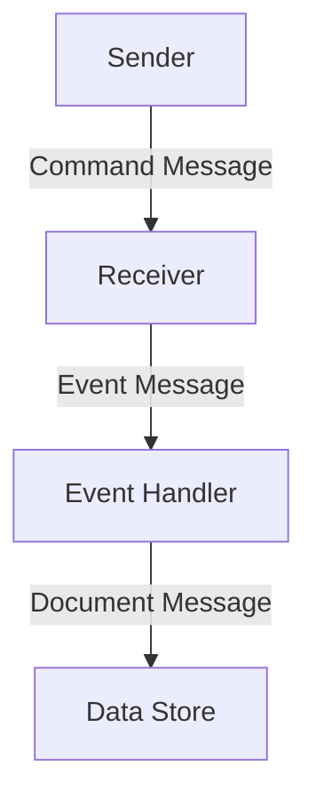

## 10.5 Message Design Patterns

In the realm of enterprise integration, the design of messages plays a pivotal role in ensuring that systems can communicate effectively and efficiently. This section delves into the intricacies of message design patterns, focusing on command, document, and event messages. We'll explore how to implement these patterns in F#, leveraging its powerful type system and functional programming paradigms to create robust, maintainable, and scalable systems.

### Importance of Message Design

Effective message design is crucial for system interoperability and maintainability. Messages act as the glue that binds disparate systems together, enabling them to exchange information and coordinate actions. Poorly designed messages can lead to misunderstandings, data corruption, and increased complexity, making systems difficult to maintain and evolve.

**Key Benefits of Proper Message Design:**

- **Interoperability**: Well-designed messages ensure that different systems can understand and process the data correctly.
- **Maintainability**: Clear and concise message structures make it easier to update and maintain systems over time.
- **Scalability**: Efficient message design supports the growth of systems without degrading performance.
- **Extensibility**: Properly structured messages can be extended with new fields or types without breaking existing functionality.

### Command Message

Command messages are used to instruct a system to perform a specific action. They encapsulate the intent of the sender, specifying what needs to be done rather than how to do it. In F#, command messages can be elegantly represented using discriminated unions, which provide a clear and type-safe way to define different command types.

#### Defining Command Messages

In F#, a command message can be defined using a discriminated union, which allows us to represent different commands as distinct cases.

```fsharp
type Command =
    | CreateOrder of orderId: int * product: string * quantity: int
    | CancelOrder of orderId: int
    | UpdateOrder of orderId: int * newProduct: string * newQuantity: int
```

In this example, we define a `Command` type with three possible commands: `CreateOrder`, `CancelOrder`, and `UpdateOrder`. Each command carries specific data relevant to the action it represents.

#### Handling Command Messages

To handle command messages, we can use pattern matching, a powerful feature in F# that allows us to deconstruct and process each command type safely.

```fsharp
let handleCommand command =
    match command with
    | CreateOrder(orderId, product, quantity) ->
        printfn "Creating order %d for %s (Quantity: %d)" orderId product quantity
    | CancelOrder(orderId) ->
        printfn "Cancelling order %d" orderId
    | UpdateOrder(orderId, newProduct, newQuantity) ->
        printfn "Updating order %d to %s (Quantity: %d)" orderId newProduct newQuantity
```

This function takes a `Command` and performs the appropriate action based on the command type.

### Document Message

Document messages carry data or documents between systems. They are typically self-describing and may include metadata to provide context. Designing document messages in F# involves ensuring that they are versioned and can evolve over time without breaking existing consumers.

#### Designing Document Messages

A document message can be represented as a record type in F#, which provides a convenient way to group related data.

```fsharp
type OrderDocument = {
    OrderId: int
    Product: string
    Quantity: int
    CustomerName: string
    Version: int
}
```

This `OrderDocument` type includes fields for the order details and a `Version` field to support versioning.

#### Ensuring Self-Describing and Versioned Messages

To make document messages self-describing, include metadata such as version numbers and timestamps. This helps consumers understand the structure and context of the message.

```fsharp
let createOrderDocument orderId product quantity customerName =
    { OrderId = orderId
      Product = product
      Quantity = quantity
      CustomerName = customerName
      Version = 1 }
```

This function creates an `OrderDocument` with the initial version set to 1. As the document evolves, you can increment the version number to indicate changes.

### Event Message

Event messages signal state changes or significant occurrences within a system. They are a cornerstone of event-driven architectures, enabling systems to react to changes asynchronously. In F#, event messages can be modeled using discriminated unions or records, depending on the complexity and variability of the events.

#### Publishing and Handling Event Messages

To publish and handle event messages, we can use F#'s functional constructs to create a flexible and responsive event-driven system.

```fsharp
type OrderEvent =
    | OrderCreated of orderId: int * product: string * quantity: int
    | OrderCancelled of orderId: int
    | OrderUpdated of orderId: int * newProduct: string * newQuantity: int

let publishEvent event =
    match event with
    | OrderCreated(orderId, product, quantity) ->
        printfn "Event: Order %d created for %s (Quantity: %d)" orderId product quantity
    | OrderCancelled(orderId) ->
        printfn "Event: Order %d cancelled" orderId
    | OrderUpdated(orderId, newProduct, newQuantity) ->
        printfn "Event: Order %d updated to %s (Quantity: %d)" orderId newProduct newQuantity
```

This example demonstrates how to define and publish event messages using pattern matching.

### Design Considerations

When designing messages, consider the following aspects to ensure they are robust and adaptable:

- **Schemas**: Define clear and consistent schemas for your messages to ensure all systems interpret them correctly.
- **Serialization Formats**: Choose appropriate serialization formats (e.g., JSON, XML, Protocol Buffers) based on your system's requirements.
- **Contracts**: Establish contracts between systems to define expectations and responsibilities.
- **Backward Compatibility**: Design messages to be backward compatible, allowing older systems to process newer messages without errors.
- **Extensibility**: Ensure messages can be extended with new fields or types without breaking existing functionality.

### Best Practices

To design effective messages, follow these best practices:

- **Choose the Appropriate Message Type**: Use command messages for actions, document messages for data transfer, and event messages for state changes.
- **Emphasize Clarity and Simplicity**: Keep message structures simple and clear to facilitate understanding and maintenance.
- **Include Necessary Metadata**: Provide metadata such as timestamps, version numbers, and identifiers to give context to the message.

### Examples and Use Cases

Let's explore scenarios where each message type is most effective:

- **Command Messages**: Use command messages in systems where actions need to be triggered, such as order processing or user management.
- **Document Messages**: Employ document messages for data exchange between systems, such as transferring customer information or product catalogs.
- **Event Messages**: Utilize event messages in event-driven architectures to notify systems of changes, such as inventory updates or user activity logs.

### Integration with F# Features

F#'s type system and immutability contribute significantly to robust message design. By leveraging discriminated unions and records, you can create clear and type-safe message structures. Immutability ensures that messages remain unchanged once created, reducing the risk of unintended side effects.

### Try It Yourself

Experiment with the code examples provided in this section. Try adding new command types, extending document messages with additional fields, or creating new event types. Observe how F#'s type system helps maintain clarity and safety as you evolve your message designs.

### Visualizing Message Flow

To better understand how messages flow through a system, consider the following diagram:



**Diagram Description**: This diagram illustrates the flow of messages in a system. The sender issues a command message to the receiver, which processes the command and publishes an event message. The event handler reacts to the event and updates the data store with a document message.

### Knowledge Check

- **What are the key benefits of proper message design?**
- **How can discriminated unions be used to define command messages in F#?**
- **What is the role of versioning in document messages?**
- **Why is backward compatibility important in message design?**

### Embrace the Journey

Remember, mastering message design patterns is a journey. As you progress, you'll gain deeper insights into how to create systems that are not only functional but also elegant and efficient. Keep experimenting, stay curious, and enjoy the process of crafting robust enterprise solutions with F#.

## Quiz Time!



### What is the primary purpose of a command message?

- [x] To instruct a system to perform a specific action
- [ ] To carry data or documents between systems
- [ ] To signal state changes or significant occurrences
- [ ] To provide metadata and context

> **Explanation:** Command messages are used to instruct a system to perform a specific action, encapsulating the intent of the sender.

### How can document messages be made self-describing?

- [x] By including metadata such as version numbers and timestamps
- [ ] By using discriminated unions
- [ ] By relying solely on serialization formats
- [ ] By minimizing the number of fields

> **Explanation:** Including metadata such as version numbers and timestamps helps make document messages self-describing, providing context and structure.

### What is a key advantage of using F#'s type system for message design?

- [x] It provides a clear and type-safe way to define message structures
- [ ] It allows for mutable message states
- [ ] It simplifies serialization and deserialization
- [ ] It eliminates the need for versioning

> **Explanation:** F#'s type system offers a clear and type-safe way to define message structures, enhancing robustness and maintainability.

### What is the role of event messages in an event-driven architecture?

- [x] To signal state changes or significant occurrences
- [ ] To instruct systems to perform actions
- [ ] To carry large amounts of data
- [ ] To replace command messages

> **Explanation:** Event messages signal state changes or significant occurrences, enabling systems to react asynchronously in an event-driven architecture.

### Which serialization format is best for ensuring backward compatibility?

- [ ] XML
- [ ] Protocol Buffers
- [x] JSON
- [ ] YAML

> **Explanation:** JSON is often preferred for its flexibility and ease of ensuring backward compatibility through optional fields and versioning.

### What is a key consideration when designing messages for extensibility?

- [x] Ensuring messages can be extended with new fields or types without breaking existing functionality
- [ ] Minimizing the number of fields
- [ ] Using complex nested structures
- [ ] Avoiding the use of metadata

> **Explanation:** Designing messages for extensibility involves ensuring they can be extended with new fields or types without breaking existing functionality.

### How can F#'s immutability feature contribute to message design?

- [x] By ensuring messages remain unchanged once created
- [ ] By allowing messages to be modified at any time
- [ ] By simplifying serialization
- [ ] By eliminating the need for versioning

> **Explanation:** F#'s immutability ensures that messages remain unchanged once created, reducing the risk of unintended side effects.

### What is the benefit of using discriminated unions for command messages?

- [x] They provide a clear and type-safe way to represent different command types
- [ ] They simplify serialization
- [ ] They allow for mutable message states
- [ ] They eliminate the need for versioning

> **Explanation:** Discriminated unions provide a clear and type-safe way to represent different command types, enhancing clarity and safety.

### Why is backward compatibility important in message design?

- [x] It allows older systems to process newer messages without errors
- [ ] It simplifies serialization
- [ ] It eliminates the need for versioning
- [ ] It reduces the number of message types

> **Explanation:** Backward compatibility ensures that older systems can process newer messages without errors, facilitating system evolution.

### True or False: Event messages are used to carry large amounts of data between systems.

- [ ] True
- [x] False

> **Explanation:** Event messages are not typically used to carry large amounts of data; they signal state changes or significant occurrences.


