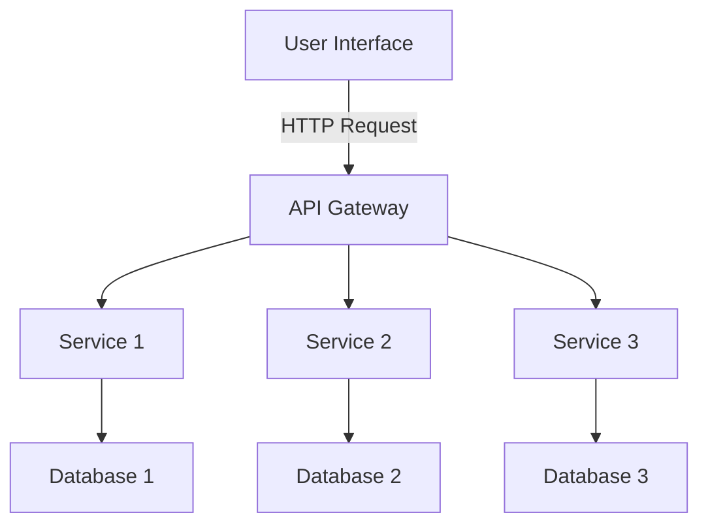

## 11.1 Introduction to Microservices Architecture

In today's fast-paced software development landscape, the demand for scalable, flexible, and maintainable applications has never been greater. Microservices architecture has emerged as a powerful paradigm to meet these demands, enabling organizations to build complex applications as a suite of small, independent services. In this section, we will explore the principles and benefits of microservices architecture, contrast it with traditional monolithic architecture, and discuss how F# can be leveraged to effectively develop microservices.

### What is Microservices Architecture?

Microservices architecture is an approach to software development where a large application is composed of small, independent services that communicate with each other over a network. Each service is responsible for a specific business capability and can be developed, deployed, and scaled independently. This architecture contrasts sharply with the traditional monolithic architecture, where all components are tightly coupled and deployed as a single unit.

#### Monolithic vs. Microservices Architecture

**Monolithic Architecture:**

- **Single Codebase:** All components of the application are part of a single codebase, making it difficult to isolate changes and deploy independently.
- **Tight Coupling:** Components are tightly interwoven, leading to challenges in scaling specific parts of the application.
- **Single Deployment Unit:** Any change requires redeploying the entire application, increasing the risk of downtime and deployment errors.

**Microservices Architecture:**

- **Modular Design:** Each service is a separate module, allowing for independent development and deployment.
- **Loose Coupling:** Services communicate through well-defined APIs, reducing dependencies and increasing flexibility.
- **Independent Scaling:** Services can be scaled independently based on demand, optimizing resource usage.

### Core Principles of Microservices

Microservices architecture is built on several core principles that guide its design and implementation:

1. **Modularity:**
   - Microservices promote a modular approach to software design, where each service encapsulates a specific business capability. This modularity enhances maintainability and allows teams to work on different services concurrently without stepping on each other's toes.

2. **Decentralization:**
   - In a microservices architecture, decision-making is decentralized. Each service can choose the best technologies and frameworks for its needs, promoting innovation and flexibility. This decentralization extends to data management, where each service can have its own database, known as the "database per service" pattern.

3. **Scalability:**
   - Microservices enable horizontal scaling, where individual services can be scaled independently based on demand. This scalability is crucial for handling varying loads and ensuring high availability.

4. **Loose Coupling:**
   - Services are designed to be loosely coupled, meaning changes in one service do not directly impact others. This is achieved through well-defined APIs and communication protocols, such as HTTP/REST, gRPC, or message queues.

5. **Resilience:**
   - Microservices architectures are designed to be resilient to failures. Techniques such as circuit breakers, retries, and fallbacks are employed to ensure that failures in one service do not cascade to others.

6. **Continuous Delivery:**
   - Microservices support continuous delivery and deployment practices, allowing teams to release new features and updates rapidly and with minimal risk.

### Benefits of Adopting Microservices

Adopting a microservices architecture offers several benefits that address the limitations of monolithic systems:

- **Improved Scalability:** Services can be scaled independently, allowing organizations to allocate resources where they are needed most.
- **Enhanced Flexibility:** Teams can choose the best technologies for each service, leading to more innovative solutions.
- **Faster Time to Market:** Independent deployment of services enables faster release cycles and quicker response to market changes.
- **Resilience and Fault Isolation:** Failures are contained within individual services, reducing the impact on the overall system.
- **Better Resource Utilization:** Services can be deployed on different hardware or cloud instances, optimizing resource usage.

### Real-World Examples of Microservices

Many organizations have successfully implemented microservices architecture to achieve scalability and flexibility. Here are a few notable examples:

- **Netflix:** Netflix is a pioneer in microservices architecture, using it to deliver streaming services to millions of users worldwide. By breaking down their application into hundreds of microservices, Netflix can deploy updates frequently and scale services independently.

- **Amazon:** Amazon's e-commerce platform leverages microservices to handle various functions such as payment processing, inventory management, and customer reviews. This architecture allows Amazon to innovate rapidly and handle massive traffic spikes during peak shopping seasons.

- **Uber:** Uber uses microservices to manage its complex ecosystem of drivers, riders, payments, and maps. This architecture enables Uber to scale its services globally and introduce new features quickly.

### Developing Microservices with F#

F#, a functional-first programming language, offers several advantages for developing microservices:

- **Immutability and Concurrency:** F#'s emphasis on immutability and functional programming paradigms makes it well-suited for building concurrent and scalable microservices.

- **Type Safety:** F#'s strong type system helps catch errors at compile time, reducing runtime issues and increasing reliability.

- **Expressive Syntax:** F#'s concise and expressive syntax allows developers to write clean and maintainable code, which is crucial for managing multiple microservices.

- **Interoperability with .NET:** F# seamlessly integrates with the .NET ecosystem, allowing developers to leverage existing libraries and tools for building microservices.

#### Example: Building a Simple Microservice in F#

Let's walk through an example of building a simple microservice in F# using Giraffe, a functional web framework for building web applications.

```fsharp
open System
open Microsoft.AspNetCore.Builder
open Microsoft.AspNetCore.Hosting
open Microsoft.Extensions.DependencyInjection
open Giraffe

// Define a simple handler function
let helloWorldHandler =
    fun (next: HttpFunc) (ctx: HttpContext) ->
        task {
            return! text "Hello, World!" next ctx
        }

// Configure the application
let configureApp (app: IApplicationBuilder) =
    app.UseGiraffe helloWorldHandler

// Configure services
let configureServices (services: IServiceCollection) =
    services.AddGiraffe() |> ignore

// Create and run the web host
[<EntryPoint>]
let main _ =
    WebHost
        .CreateDefaultBuilder()
        .Configure(configureApp)
        .ConfigureServices(configureServices)
        .Build()
        .Run()
    0
```

In this example, we define a simple HTTP handler that responds with "Hello, World!" and set up a Giraffe application to handle incoming requests. This microservice can be independently deployed and scaled as needed.

### Why Microservices are Relevant to F# Developers

Microservices architecture aligns well with the principles of functional programming, making it a natural fit for F# developers. The focus on immutability, pure functions, and type safety in F# complements the modular and decentralized nature of microservices. By adopting microservices, F# developers can build scalable, resilient, and maintainable applications that meet the demands of modern software development.

### Visualizing Microservices Architecture

To better understand the microservices architecture, let's visualize the interaction between services in a typical microservices-based application.



In this diagram, the API Gateway acts as a single entry point for client requests, routing them to the appropriate services. Each service interacts with its own database, following the "database per service" pattern.

### Try It Yourself

To deepen your understanding of microservices in F#, try modifying the code example above to add a new endpoint that returns a JSON response. Experiment with deploying the microservice to a cloud platform and observe how it scales under different loads.

### Conclusion

Microservices architecture offers a robust framework for building scalable and flexible applications. By embracing the principles of modularity, decentralization, and loose coupling, organizations can achieve greater agility and resilience. F# developers are well-positioned to leverage these benefits, thanks to the language's strengths in functional programming and type safety. As you continue your journey in software development, consider how microservices architecture can enhance your projects and empower your teams.

## Quiz Time!



### What is a key characteristic of microservices architecture?

- [x] Independent deployment of services
- [ ] Tight coupling of components
- [ ] Single codebase for all services
- [ ] Centralized decision-making

> **Explanation:** Microservices architecture allows for independent deployment of services, enabling flexibility and scalability.

### How do microservices communicate with each other?

- [x] Through well-defined APIs
- [ ] By sharing the same database
- [ ] Using direct function calls
- [ ] Through a single codebase

> **Explanation:** Microservices communicate through well-defined APIs, which allows them to be loosely coupled and independently deployable.

### Which of the following is a benefit of microservices?

- [x] Improved scalability
- [ ] Increased complexity
- [ ] Tight coupling
- [ ] Single deployment unit

> **Explanation:** Microservices improve scalability by allowing individual services to be scaled independently based on demand.

### What is a disadvantage of monolithic architecture compared to microservices?

- [x] Difficulty in scaling specific parts of the application
- [ ] Easier to deploy changes
- [ ] Better fault isolation
- [ ] More flexible technology choices

> **Explanation:** Monolithic architecture makes it difficult to scale specific parts of the application, as all components are tightly coupled.

### Which pattern is commonly used in microservices for data management?

- [x] Database per service
- [ ] Shared database for all services
- [ ] Centralized database management
- [ ] Single database instance

> **Explanation:** The "database per service" pattern is commonly used in microservices to allow each service to manage its own data independently.

### Why is F# suitable for developing microservices?

- [x] Emphasis on immutability and concurrency
- [ ] Lack of type safety
- [ ] Complex syntax
- [ ] Limited interoperability with .NET

> **Explanation:** F#'s emphasis on immutability and concurrency makes it well-suited for building scalable and reliable microservices.

### What role does the API Gateway play in a microservices architecture?

- [x] Acts as a single entry point for client requests
- [ ] Manages databases for all services
- [ ] Handles direct communication between services
- [ ] Deploys all services together

> **Explanation:** The API Gateway acts as a single entry point for client requests, routing them to the appropriate services.

### How does decentralization benefit microservices architecture?

- [x] Allows each service to choose the best technologies
- [ ] Centralizes decision-making
- [ ] Increases dependency between services
- [ ] Requires a single database for all services

> **Explanation:** Decentralization allows each service to choose the best technologies for its needs, promoting innovation and flexibility.

### What is a common technique used to ensure resilience in microservices?

- [x] Circuit breakers
- [ ] Direct function calls
- [ ] Shared state management
- [ ] Single deployment unit

> **Explanation:** Circuit breakers are used to ensure resilience in microservices by preventing failures in one service from cascading to others.

### True or False: Microservices architecture is only suitable for large organizations.

- [ ] True
- [x] False

> **Explanation:** Microservices architecture can be beneficial for organizations of all sizes, as it offers scalability, flexibility, and resilience.


