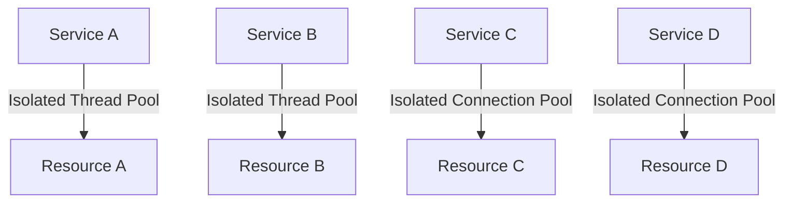

## 11.10 Bulkhead Pattern

In the world of microservices architecture, ensuring that one component's failure does not cascade into a system-wide outage is critical. The Bulkhead pattern is a design strategy that isolates different parts of a system to prevent failures from spreading. This section will delve into the Bulkhead pattern, its significance, and how to implement it effectively in F# applications.

### Understanding the Bulkhead Pattern

The Bulkhead pattern is inspired by the compartmentalization technique used in shipbuilding. Ships are divided into watertight compartments (bulkheads) so that if one compartment is breached, the ship remains afloat. Similarly, in software systems, the Bulkhead pattern involves partitioning resources to limit the impact of a failure to a specific part of the system.

#### Significance of the Bulkhead Pattern

- **Failure Isolation**: By isolating components, the Bulkhead pattern ensures that a failure in one part of the system doesn't bring down the entire application.
- **Resource Management**: It allows for better management of system resources like threads, memory, and connections by allocating them to specific components.
- **Increased Resilience**: Systems designed with bulkheads can handle failures more gracefully, maintaining overall system stability.

### Methods of Partitioning System Resources

To implement the Bulkhead pattern, we need to partition system resources effectively. Here are some common methods:

1. **Thread Pools**: Allocate separate thread pools for different components or services to prevent a single service from exhausting all available threads.
2. **Connection Pools**: Use distinct connection pools for different database connections or external services to avoid bottlenecks.
3. **Memory Allocation**: Limit the memory usage of individual components to prevent memory leaks from affecting the entire system.

### Implementing Bulkheads in F# Applications

F# provides several constructs that can be leveraged to implement the Bulkhead pattern. Let's explore some strategies and code examples.

#### Strategy 1: Using Asynchronous Workflows

F#'s asynchronous workflows (`async`) can be used to manage thread pools effectively. By isolating tasks into separate workflows, we can control resource allocation.

```fsharp
open System
open System.Threading

// Define a function to simulate a service call
let serviceCall (serviceName: string) =
    async {
        printfn "Starting service call for %s" serviceName
        do! Async.Sleep(1000) // Simulate delay
        printfn "Completed service call for %s" serviceName
    }

// Create separate workflows for different services
let serviceA = serviceCall "Service A"
let serviceB = serviceCall "Service B"

// Run the services in parallel with isolated resources
let runServices() =
    Async.Parallel [serviceA; serviceB]
    |> Async.RunSynchronously

runServices()
```

In this example, `serviceA` and `serviceB` are executed in parallel, each within its own asynchronous workflow, ensuring isolated execution.

#### Strategy 2: Using MailboxProcessor for Concurrency

The `MailboxProcessor` in F# can be used to implement the Actor model, providing a way to isolate state and behavior.

```fsharp
// Define a mailbox processor for a service
let serviceProcessor (serviceName: string) =
    MailboxProcessor.Start(fun inbox ->
        let rec loop() =
            async {
                let! msg = inbox.Receive()
                printfn "Processing message for %s: %s" serviceName msg
                do! Async.Sleep(500) // Simulate processing time
                return! loop()
            }
        loop()
    )

// Create processors for different services
let processorA = serviceProcessor "Service A"
let processorB = serviceProcessor "Service B"

// Send messages to the processors
processorA.Post("Message 1")
processorB.Post("Message 2")
```

Each `MailboxProcessor` acts as a bulkhead, processing messages independently and isolating failures.

### Determining Appropriate Boundaries for Bulkheads

Determining the right boundaries for bulkheads is crucial for effective isolation. Consider the following factors:

- **Component Criticality**: More critical components may require stricter isolation to ensure availability.
- **Resource Usage**: Components with high resource demands should be isolated to prevent resource exhaustion.
- **Failure Impact**: Components that are more likely to fail or have a high impact on the system should be isolated.

### Monitoring and Adjusting Bulkhead Configurations

Monitoring system performance and adjusting bulkhead configurations is essential for maintaining system resilience. Here are some strategies:

- **Load Testing**: Conduct regular load tests to identify bottlenecks and adjust resource allocations accordingly.
- **Metrics and Alerts**: Implement monitoring tools to track resource usage and set up alerts for unusual patterns.
- **Dynamic Scaling**: Use dynamic scaling techniques to adjust resource allocations based on real-time demand.

### Best Practices and Considerations

When applying the Bulkhead pattern, keep the following best practices in mind:

- **Start Small**: Begin with critical components and gradually extend bulkheads to other parts of the system.
- **Balance Isolation and Complexity**: Too much isolation can lead to increased complexity and maintenance overhead.
- **Regular Reviews**: Periodically review bulkhead configurations to ensure they align with current system requirements.
- **Collaborate with Teams**: Work closely with development and operations teams to understand component dependencies and resource needs.

### Try It Yourself

Experiment with the provided code examples by:

- Modifying the delay times in the asynchronous workflows to simulate different load conditions.
- Adding additional services or processors to see how they interact under isolated conditions.
- Implementing a monitoring system to track the execution time of each service call.

### Visualizing Bulkhead Isolation

To better understand how the Bulkhead pattern isolates components, let's visualize the architecture using a Mermaid.js diagram.



**Diagram Description**: This diagram illustrates how different services (A, B, C, D) are isolated using separate thread and connection pools, ensuring that a failure in one service does not affect others.

### References and Links

For further reading on the Bulkhead pattern and its implementation, consider the following resources:

- [Microsoft Docs: Resiliency Patterns](https://docs.microsoft.com/en-us/azure/architecture/patterns/)
- [Martin Fowler's Patterns of Enterprise Application Architecture](https://martinfowler.com/books/eaa.html)

### Knowledge Check

- **Question**: What is the primary goal of the Bulkhead pattern?
  - **Answer**: To isolate components and prevent failure propagation.

- **Question**: How can F#'s `MailboxProcessor` be used in implementing the Bulkhead pattern?
  - **Answer**: By isolating state and behavior in separate processors, acting as bulkheads.

### Embrace the Journey

Remember, implementing the Bulkhead pattern is just one step towards building resilient systems. As you continue to explore and apply design patterns, you'll enhance your ability to create robust, scalable applications. Keep experimenting, stay curious, and enjoy the journey!

## Quiz Time!



### What is the primary goal of the Bulkhead pattern?

- [x] To isolate components and prevent failure propagation
- [ ] To increase system complexity
- [ ] To reduce resource usage
- [ ] To enhance user interface design

> **Explanation:** The Bulkhead pattern aims to isolate components to prevent a failure in one part of the system from affecting the entire application.

### Which F# construct can be used to implement the Actor model for bulkhead isolation?

- [x] MailboxProcessor
- [ ] Async
- [ ] List
- [ ] Option

> **Explanation:** The `MailboxProcessor` in F# can be used to implement the Actor model, providing a way to isolate state and behavior.

### What is a common method of partitioning system resources in the Bulkhead pattern?

- [x] Thread pools
- [ ] Global variables
- [ ] Single-threaded execution
- [ ] Direct database connections

> **Explanation:** Thread pools are commonly used to partition system resources, ensuring that different components have isolated execution contexts.

### How can you monitor and adjust bulkhead configurations effectively?

- [x] Load testing and metrics
- [ ] Ignoring system performance
- [ ] Using only static configurations
- [ ] Disabling monitoring tools

> **Explanation:** Load testing and implementing metrics allow you to monitor system performance and adjust bulkhead configurations based on real-time data.

### What should be considered when determining boundaries for bulkheads?

- [x] Component criticality and resource usage
- [ ] The color of the user interface
- [ ] The number of developers on the team
- [ ] The age of the codebase

> **Explanation:** Component criticality, resource usage, and failure impact are important factors in determining appropriate boundaries for bulkheads.

### Which of the following is a best practice when applying the Bulkhead pattern?

- [x] Start small and gradually extend
- [ ] Apply it to every single component immediately
- [ ] Avoid reviewing configurations
- [ ] Ignore team collaboration

> **Explanation:** Starting small and gradually extending bulkheads, along with regular reviews and team collaboration, are best practices for applying the Bulkhead pattern.

### What is the significance of using separate connection pools in the Bulkhead pattern?

- [x] To avoid bottlenecks and ensure resource isolation
- [ ] To increase the number of database connections
- [ ] To reduce the number of services
- [ ] To enhance user authentication

> **Explanation:** Separate connection pools help avoid bottlenecks and ensure that different services have isolated access to resources.

### How does the Bulkhead pattern relate to shipbuilding?

- [x] It is inspired by the compartmentalization technique used in ships
- [ ] It involves building ships in software
- [ ] It requires knowledge of maritime navigation
- [ ] It is unrelated to shipbuilding

> **Explanation:** The Bulkhead pattern is inspired by the compartmentalization technique used in shipbuilding, where ships are divided into watertight compartments to prevent sinking.

### What is the role of dynamic scaling in bulkhead configuration?

- [x] Adjusting resource allocations based on real-time demand
- [ ] Keeping resource allocations static
- [ ] Reducing system performance
- [ ] Increasing system complexity

> **Explanation:** Dynamic scaling involves adjusting resource allocations based on real-time demand, ensuring efficient use of resources and maintaining system resilience.

### True or False: The Bulkhead pattern increases system complexity by isolating components.

- [x] True
- [ ] False

> **Explanation:** While the Bulkhead pattern can increase system complexity due to the need for isolation, it is a trade-off for increased resilience and failure isolation.


