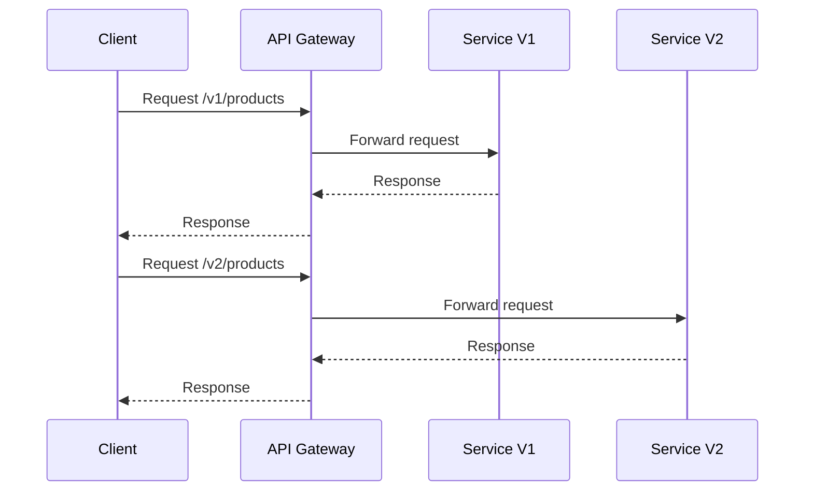

## 11.12 API Versioning Strategies

In the rapidly evolving landscape of software development, maintaining backward compatibility while introducing new features is a critical challenge. API versioning is a key strategy to address this challenge, allowing developers to evolve their APIs without disrupting existing consumers. In this section, we will explore various API versioning strategies, how to implement them in F#, and best practices for maintaining APIs over time.

### Why API Versioning is Necessary

API versioning is essential for several reasons:

- **Backward Compatibility**: Ensures that existing clients can continue to function without interruption when new features or changes are introduced.
- **Ongoing Development**: Allows for the introduction of new features, improvements, and bug fixes without breaking existing functionality.
- **Consumer Confidence**: Provides assurance to API consumers that their integrations will remain stable over time.

By implementing a robust versioning strategy, you can manage the lifecycle of your APIs effectively, ensuring a smooth transition for consumers as your services evolve.

### Common API Versioning Strategies

There are several strategies for versioning APIs, each with its own advantages and trade-offs. Let's explore some of the most common approaches:

#### URI Versioning

URI versioning involves embedding the version number directly in the URL path. This is one of the most straightforward and widely used methods.

**Example:**

```plaintext
GET /v1/products
GET /v2/products
```

**Advantages:**

- **Clarity**: The version is immediately visible in the URL, making it easy for consumers to understand which version they are using.
- **Simplicity**: Easy to implement and manage.

**Disadvantages:**

- **URL Changes**: Requires consumers to update their URLs when a new version is released.
- **Potential for URL Bloat**: Can lead to long and unwieldy URLs if not managed carefully.

#### Query Parameter Versioning

In this approach, the version number is specified as a query parameter.

**Example:**

```plaintext
GET /products?version=1
GET /products?version=2
```

**Advantages:**

- **Flexibility**: Allows for versioning without changing the URL structure.
- **Backward Compatibility**: Older clients can continue using the same endpoint with different parameters.

**Disadvantages:**

- **Less Discoverable**: The version is not immediately visible in the URL path.
- **Potential for Misuse**: Consumers may forget to specify the version, leading to unexpected behavior.

#### HTTP Header Versioning

Versioning via HTTP headers involves specifying the version number in the request headers.

**Example:**

```plaintext
GET /products
Headers: 
    API-Version: 1
```

**Advantages:**

- **Clean URLs**: Keeps the URL structure clean and consistent.
- **Separation of Concerns**: Separates versioning from the URL, focusing on the request metadata.

**Disadvantages:**

- **Hidden Versioning**: The version is not visible in the URL, which can make it harder to debug and document.
- **Complexity**: Requires consumers to manage headers explicitly.

### Implementing API Versioning in F#

F# provides a powerful and expressive language for implementing API versioning. Let's explore how to implement some of these strategies in F#.

#### URI Versioning in F#

To implement URI versioning in F#, you can define routes that include the version number. Here's a simple example using a web framework like Giraffe:

```fsharp
open Giraffe

let productHandlerV1 =
    fun (next: HttpFunc) (ctx: HttpContext) ->
        // Logic for version 1
        text "Product API v1" next ctx

let productHandlerV2 =
    fun (next: HttpFunc) (ctx: HttpContext) ->
        // Logic for version 2
        text "Product API v2" next ctx

let webApp =
    choose [
        route "/v1/products" >=> productHandlerV1
        route "/v2/products" >=> productHandlerV2
    ]

```

**Explanation:**

- We define separate handlers (`productHandlerV1` and `productHandlerV2`) for each version of the API.
- The `choose` function routes requests to the appropriate handler based on the URL path.

#### Query Parameter Versioning in F#

Query parameter versioning can be implemented by extracting the version from the query string and routing requests accordingly.

```fsharp
open Microsoft.AspNetCore.Http
open Giraffe

let getProductHandler (version: int) =
    match version with
    | 1 -> text "Product API v1"
    | 2 -> text "Product API v2"
    | _ -> text "Unknown API version"

let queryVersionHandler =
    fun (next: HttpFunc) (ctx: HttpContext) ->
        let version = ctx.Request.Query.["version"].ToString() |> int
        getProductHandler version next ctx

let webApp =
    route "/products" >=> queryVersionHandler
```

**Explanation:**

- We define a `getProductHandler` function that takes a version number and returns the appropriate response.
- The `queryVersionHandler` extracts the version from the query string and calls `getProductHandler`.

#### HTTP Header Versioning in F#

For header-based versioning, you can extract the version from the request headers and process the request accordingly.

```fsharp
open Microsoft.AspNetCore.Http
open Giraffe

let headerVersionHandler =
    fun (next: HttpFunc) (ctx: HttpContext) ->
        let versionHeader = ctx.Request.Headers.["API-Version"].ToString()
        let version = if versionHeader = "" then 1 else int versionHeader
        getProductHandler version next ctx

let webApp =
    route "/products" >=> headerVersionHandler
```

**Explanation:**

- We extract the version from the `API-Version` header.
- If the header is not present, we default to version 1.

### Managing Deprecation and Communication

As APIs evolve, it's important to manage the deprecation of old versions and communicate changes effectively to consumers.

#### Deprecation Strategies

- **Grace Periods**: Provide a grace period during which both the old and new versions are supported.
- **Deprecation Notices**: Include deprecation notices in API responses to inform consumers of upcoming changes.
- **Documentation Updates**: Keep documentation up-to-date with information about deprecated versions and migration paths.

#### Communicating Changes

- **Release Notes**: Publish detailed release notes for each new version, highlighting changes and improvements.
- **Developer Portals**: Use developer portals to provide comprehensive information about API versions, including usage examples and best practices.
- **Email Notifications**: Send email notifications to registered developers about upcoming changes and deprecations.

### Best Practices for API Evolution

To ensure a smooth evolution of your APIs, consider the following best practices:

#### Semantic Versioning

Semantic versioning is a widely adopted versioning scheme that uses a three-part version number: `MAJOR.MINOR.PATCH`.

- **MAJOR**: Incremented for incompatible changes.
- **MINOR**: Incremented for backward-compatible new features.
- **PATCH**: Incremented for backward-compatible bug fixes.

**Example:**

```plaintext
1.0.0 -> 1.1.0 (new feature)
1.0.0 -> 2.0.0 (breaking change)
1.0.0 -> 1.0.1 (bug fix)
```

#### Tooling and Documentation

- **Automated Documentation**: Use tools like Swagger/OpenAPI to generate and maintain API documentation.
- **Versioned Documentation**: Maintain separate documentation for each API version to avoid confusion.

#### Testing and Maintenance

- **Automated Testing**: Implement automated tests for each API version to ensure compatibility and prevent regressions.
- **Continuous Integration**: Use CI/CD pipelines to automate testing and deployment of API changes.

### Considerations for Testing and Maintaining Multiple API Versions

Testing and maintaining multiple API versions can be challenging. Here are some strategies to manage this complexity:

- **Test Suites**: Develop comprehensive test suites for each version to ensure consistent behavior.
- **Mocking and Simulation**: Use mocking frameworks to simulate different API versions and test consumer applications.
- **Version Management**: Implement version management tools to track and manage different versions of your APIs.

### Visualizing API Versioning Strategies

To better understand the flow of API versioning, let's visualize the process using a sequence diagram.



**Diagram Explanation:**

- The client sends requests to the API gateway, specifying the version in the URL.
- The API gateway forwards the request to the appropriate service version.
- The service processes the request and returns a response to the client.

### Try It Yourself

To deepen your understanding of API versioning in F#, try modifying the code examples provided:

- **Add a New Version**: Implement a new version of the product API with additional features.
- **Change the Versioning Strategy**: Experiment with different versioning strategies (e.g., switch from URI to header-based versioning).
- **Implement Deprecation Notices**: Add logic to include deprecation notices in API responses for older versions.

### Conclusion

API versioning is a crucial aspect of modern software development, enabling you to evolve your services while maintaining backward compatibility. By understanding and implementing effective versioning strategies, you can ensure a smooth transition for your consumers and support ongoing development. Remember to communicate changes clearly, maintain comprehensive documentation, and implement robust testing practices to manage the complexity of multiple API versions.

## Quiz Time!



### Why is API versioning necessary?

- [x] To ensure backward compatibility and support ongoing development
- [ ] To reduce the number of API endpoints
- [ ] To increase the complexity of API management
- [ ] To eliminate the need for testing

> **Explanation:** API versioning ensures that existing clients can continue to function without interruption when new features or changes are introduced, supporting backward compatibility and ongoing development.

### Which versioning strategy involves embedding the version number directly in the URL path?

- [x] URI Versioning
- [ ] Query Parameter Versioning
- [ ] HTTP Header Versioning
- [ ] Semantic Versioning

> **Explanation:** URI versioning involves embedding the version number directly in the URL path, making it easy for consumers to understand which version they are using.

### What is a disadvantage of query parameter versioning?

- [ ] It makes URLs too long
- [x] The version is less discoverable
- [ ] It requires changing the URL structure
- [ ] It is difficult to implement

> **Explanation:** Query parameter versioning is less discoverable because the version is not immediately visible in the URL path.

### How can you manage deprecation of old API versions?

- [x] Provide a grace period and include deprecation notices
- [ ] Immediately remove old versions
- [ ] Ignore consumer feedback
- [ ] Only update documentation

> **Explanation:** Managing deprecation involves providing a grace period during which both old and new versions are supported, and including deprecation notices in API responses to inform consumers of upcoming changes.

### What is semantic versioning?

- [x] A versioning scheme using MAJOR.MINOR.PATCH
- [ ] A method for embedding version numbers in URLs
- [ ] A strategy for using query parameters for versioning
- [ ] A way to hide version numbers in headers

> **Explanation:** Semantic versioning is a widely adopted versioning scheme that uses a three-part version number: MAJOR.MINOR.PATCH, indicating incompatible changes, backward-compatible new features, and bug fixes, respectively.

### Which tool can be used to generate and maintain API documentation?

- [x] Swagger/OpenAPI
- [ ] Giraffe
- [ ] NUnit
- [ ] FAKE

> **Explanation:** Swagger/OpenAPI is a tool that can be used to generate and maintain API documentation, providing a comprehensive view of the API structure and usage.

### What is a benefit of HTTP header versioning?

- [x] Keeps the URL structure clean and consistent
- [ ] Makes the version immediately visible in the URL
- [ ] Requires consumers to update their URLs
- [ ] Increases the complexity of request handling

> **Explanation:** HTTP header versioning keeps the URL structure clean and consistent by separating versioning from the URL and focusing on the request metadata.

### What should be included in release notes for API changes?

- [x] Detailed changes and improvements
- [ ] Only the new features
- [ ] Consumer feedback
- [ ] Internal development notes

> **Explanation:** Release notes should include detailed changes and improvements for each new version, highlighting what has been added, changed, or deprecated.

### Which strategy involves specifying the version number in the request headers?

- [x] HTTP Header Versioning
- [ ] URI Versioning
- [ ] Query Parameter Versioning
- [ ] Semantic Versioning

> **Explanation:** HTTP header versioning involves specifying the version number in the request headers, separating versioning from the URL.

### True or False: Semantic versioning uses a two-part version number.

- [ ] True
- [x] False

> **Explanation:** Semantic versioning uses a three-part version number: MAJOR.MINOR.PATCH, not a two-part version number.


