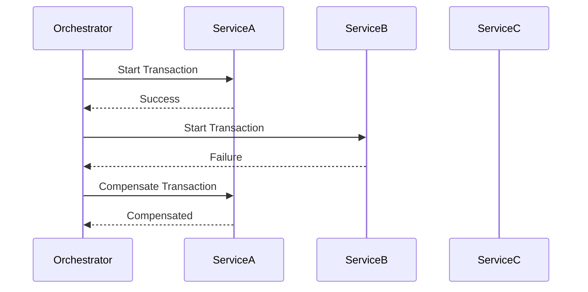

## 11.14 Saga Pattern

In the world of microservices, managing transactions that span multiple services is a complex challenge. Traditional ACID (Atomicity, Consistency, Isolation, Durability) transactions are not feasible in a distributed system due to the lack of a single transaction coordinator. This is where the Saga pattern comes into play, providing a way to maintain data consistency across microservices through a series of coordinated, compensating transactions.

### Understanding the Challenges of Distributed Transactions

When dealing with distributed systems, ensuring data consistency is a significant challenge. Each microservice typically manages its own database, and transactions often span multiple services. This can lead to issues such as:

- **Partial Failures**: One service might succeed while another fails, leading to inconsistent states.
- **Network Latency**: Communication delays can affect transaction timing and consistency.
- **Scalability**: Traditional two-phase commit protocols can become bottlenecks in a distributed environment.

The Saga pattern addresses these challenges by breaking down a transaction into a series of smaller, isolated steps, each with its own compensating action in case of failure.

### The Saga Pattern Explained

The Saga pattern divides a long-lived transaction into a sequence of smaller transactions that can be interleaved with other transactions. Each step in the saga is a local transaction that updates the database and publishes an event or message. If a step fails, the saga executes compensating transactions to undo the changes made by preceding steps.

There are two primary types of saga implementations:

1. **Orchestration-Based Sagas**: A central coordinator (orchestrator) manages the saga, directing each step and handling compensations if necessary.
2. **Choreography-Based Sagas**: Each service involved in the saga listens for events and decides when to act, eliminating the need for a central coordinator.

#### Orchestration-Based Sagas

In an orchestration-based saga, a central orchestrator is responsible for managing the flow of the saga. It sends commands to each service to perform a transaction and listens for responses to determine the next step.

**Advantages**:
- Centralized control simplifies management and monitoring.
- Easier to implement complex workflows.

**Disadvantages**:
- Single point of failure.
- Can become a bottleneck if not properly scaled.

#### Choreography-Based Sagas

In a choreography-based saga, there is no central orchestrator. Instead, each service involved in the saga publishes and listens to events to determine when to act.

**Advantages**:
- No single point of failure.
- Services are loosely coupled, enhancing scalability.

**Disadvantages**:
- More complex to manage and monitor.
- Harder to implement complex workflows.

### Implementing Sagas in F#

Let's explore how to implement sagas in F# by defining compensating actions and coordinating transactions.

#### Defining Compensating Actions

Compensating actions are crucial for maintaining consistency. They are the inverse operations that undo the effects of a previous transaction step if something goes wrong.

```fsharp
type OrderStatus = 
    | Created
    | Approved
    | Shipped
    | Cancelled

type Order = {
    Id: int
    Status: OrderStatus
}

let createOrder order = 
    // Logic to create an order
    printfn "Order %d created" order.Id
    { order with Status = Created }

let approveOrder order = 
    // Logic to approve an order
    printfn "Order %d approved" order.Id
    { order with Status = Approved }

let shipOrder order = 
    // Logic to ship an order
    printfn "Order %d shipped" order.Id
    { order with Status = Shipped }

let cancelOrder order = 
    // Logic to cancel an order
    printfn "Order %d cancelled" order.Id
    { order with Status = Cancelled }
```

In this example, `cancelOrder` is the compensating action for `createOrder`, `approveOrder`, and `shipOrder`.

#### Orchestrating a Saga

To orchestrate a saga, we need a coordinator that manages the flow of transactions and compensations.

```fsharp
let orchestrateSaga order = 
    try
        let order = createOrder order
        let order = approveOrder order
        let order = shipOrder order
        printfn "Order %d completed successfully" order.Id
    with
    | ex ->
        printfn "Error occurred: %s" ex.Message
        let _ = cancelOrder order
        printfn "Order %d rolled back" order.Id
```

In this orchestration, if any step fails, the saga compensates by canceling the order.

#### Choreographing a Saga

In a choreography-based saga, each service listens to events and acts accordingly.

```fsharp
let handleOrderCreatedEvent order = 
    // Logic to handle order created event
    printfn "Handling order created event for order %d" order.Id
    approveOrder order

let handleOrderApprovedEvent order = 
    // Logic to handle order approved event
    printfn "Handling order approved event for order %d" order.Id
    shipOrder order

let handleOrderCancelledEvent order = 
    // Logic to handle order cancelled event
    printfn "Handling order cancelled event for order %d" order.Id
```

Each function listens for specific events and performs the necessary actions.

### Error Handling and Ensuring Data Consistency

Error handling is critical in sagas to ensure data consistency. Here are some strategies:

- **Idempotency**: Ensure that operations can be repeated without adverse effects. This is crucial for retrying failed steps.
- **Timeouts and Retries**: Implement timeouts and retry logic to handle transient failures.
- **Compensation**: Always define compensating actions for each step to revert changes if necessary.

### Monitoring Sagas in Production

Monitoring sagas in a production environment is essential to detect and resolve issues promptly. Consider the following:

- **Logging**: Implement comprehensive logging for each step of the saga to trace its progress and identify failures.
- **Metrics**: Use metrics to monitor the performance and reliability of sagas.
- **Alerts**: Set up alerts for failures or anomalies in saga execution.

### Tools and Frameworks for Saga Implementation in F#

Several tools and frameworks can assist with implementing sagas in F#:

- **MassTransit**: A .NET library that supports saga orchestration and choreography.
- **NServiceBus**: Provides robust support for building distributed systems with sagas.
- **Akka.NET**: Offers actor-based concurrency and can be used to implement sagas.

### Potential Pitfalls and Considerations

When implementing sagas, be aware of the following potential pitfalls:

- **Complexity**: Sagas can become complex, especially in choreography-based implementations. Ensure that your design is as simple as possible.
- **Performance**: Orchestration can become a bottleneck if not properly managed. Consider scaling the orchestrator or using choreography for high-throughput scenarios.
- **Data Consistency**: Ensure that all compensating actions are correctly implemented to maintain data consistency.

### Visualizing the Saga Pattern

Below is a diagram illustrating the flow of an orchestration-based saga:



This diagram shows how the orchestrator manages the flow and compensates for failures.

### Try It Yourself

Experiment with the code examples provided by modifying the order of transactions or introducing failures to see how the saga handles them. Try implementing your own compensating actions and orchestrators to deepen your understanding.

### Key Takeaways

- The Saga pattern is essential for managing distributed transactions in microservices.
- Choose between orchestration and choreography based on your system's needs.
- Always define compensating actions to maintain data consistency.
- Monitor and log sagas in production to ensure reliability.

Remember, mastering the Saga pattern is a journey. As you progress, you'll build more resilient and scalable microservices. Keep experimenting, stay curious, and enjoy the journey!

## Quiz Time!



### What is the primary purpose of the Saga pattern in microservices?

- [x] To manage distributed transactions and ensure eventual consistency.
- [ ] To improve the performance of microservices.
- [ ] To enhance the security of microservices.
- [ ] To simplify the deployment process of microservices.

> **Explanation:** The Saga pattern is used to manage distributed transactions and ensure eventual consistency across microservices.

### Which of the following is a characteristic of orchestration-based sagas?

- [x] Centralized control with a single orchestrator.
- [ ] Decentralized control with no central orchestrator.
- [ ] No need for compensating actions.
- [ ] Direct communication between services without events.

> **Explanation:** Orchestration-based sagas have centralized control with a single orchestrator managing the flow.

### What is a compensating action in the context of the Saga pattern?

- [x] An action that undoes the effects of a previous transaction step.
- [ ] An action that enhances the performance of a transaction.
- [ ] An action that secures the transaction data.
- [ ] An action that logs the transaction details.

> **Explanation:** A compensating action undoes the effects of a previous transaction step to maintain consistency.

### In a choreography-based saga, how do services communicate?

- [x] Through events that each service listens to and acts upon.
- [ ] Directly with each other using synchronous calls.
- [ ] Through a central orchestrator.
- [ ] Using shared databases for communication.

> **Explanation:** In choreography-based sagas, services communicate through events.

### Which tool can be used for implementing sagas in F#?

- [x] MassTransit
- [x] NServiceBus
- [ ] Entity Framework
- [x] Akka.NET

> **Explanation:** MassTransit, NServiceBus, and Akka.NET are tools that can be used for implementing sagas in F#.

### What is a potential disadvantage of orchestration-based sagas?

- [x] Single point of failure.
- [ ] Lack of centralized control.
- [ ] Complexity in managing events.
- [ ] Difficulty in scaling services.

> **Explanation:** Orchestration-based sagas can have a single point of failure due to the centralized orchestrator.

### How can idempotency help in saga implementations?

- [x] By ensuring operations can be repeated without adverse effects.
- [ ] By improving the security of transactions.
- [ ] By reducing the latency of transactions.
- [ ] By simplifying the deployment process.

> **Explanation:** Idempotency ensures that operations can be repeated without adverse effects, which is crucial for retrying failed steps.

### What is a key benefit of using choreography-based sagas?

- [x] No single point of failure.
- [ ] Centralized control of transactions.
- [ ] Simplified error handling.
- [ ] Easier to implement complex workflows.

> **Explanation:** Choreography-based sagas have no single point of failure, as there is no central orchestrator.

### What should be monitored in a production environment for sagas?

- [x] Logging and metrics for each step of the saga.
- [ ] Only the final outcome of the saga.
- [ ] The number of services involved in the saga.
- [ ] The database size used by the saga.

> **Explanation:** Logging and metrics for each step of the saga should be monitored to detect and resolve issues promptly.

### True or False: In a choreography-based saga, a central orchestrator manages the flow of transactions.

- [ ] True
- [x] False

> **Explanation:** In a choreography-based saga, there is no central orchestrator. Services communicate through events.


