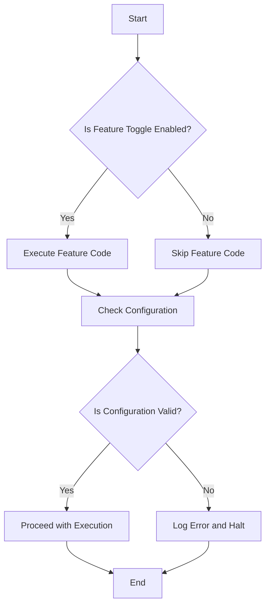

## 11.16 Feature Toggles and Configuration Management

In the fast-paced world of software development, the ability to quickly adapt and iterate on features is crucial. Feature toggles and configuration management play a pivotal role in enabling this agility, particularly in microservices architectures. In this section, we will delve into the concepts of feature toggles and configuration management, exploring their implementation in F#, and discussing best practices for their use in microservices.

### Understanding Feature Toggles

Feature toggles, also known as feature flags, are a powerful technique that allows developers to enable or disable features in a software application without deploying new code. This capability is invaluable for controlling feature rollout, conducting A/B testing, and managing operational changes.

#### Types of Feature Toggles

Feature toggles can be categorized into several types, each serving a distinct purpose:

1. **Release Toggles**: Used to control the release of new features. They allow teams to merge incomplete features into the main codebase and gradually expose them to users.

2. **Experiment Toggles**: Enable A/B testing and experimentation by allowing different user groups to experience different features.

3. **Operational Toggles**: Used to control operational aspects of the application, such as enabling or disabling logging or debugging features.

4. **Permission Toggles**: Manage access to features based on user roles or permissions.

5. **Infrastructure Toggles**: Allow switching between different infrastructure components, such as databases or external services.

### Implementing Feature Toggles in F#

Implementing feature toggles in F# can be achieved using libraries or custom solutions. Let's explore both approaches.

#### Using Libraries

Several libraries can help implement feature toggles in F#. One popular choice is `FsFeatureToggle`, which provides a simple and effective way to manage feature flags.

```fsharp
open FsFeatureToggle

// Define a feature toggle
let myFeatureToggle = FeatureToggle("MyFeature")

// Check if the feature is enabled
if myFeatureToggle.IsEnabled() then
    printfn "Feature is enabled"
else
    printfn "Feature is disabled"
```

#### Custom Solutions

For more control, you can implement custom feature toggles using F#'s functional capabilities. Here's a simple example:

```fsharp
type FeatureToggle = 
    | Enabled
    | Disabled

let isFeatureEnabled featureToggle =
    match featureToggle with
    | Enabled -> true
    | Disabled -> false

// Usage
let myFeature = Enabled
if isFeatureEnabled myFeature then
    printfn "Feature is enabled"
else
    printfn "Feature is disabled"
```

### Configuration Management Across Environments

Configuration management is essential for ensuring that applications behave consistently across different environments, such as development, staging, and production.

#### Strategies for Configuration Management

1. **Environment Variables**: Store configuration values in environment variables, which can be easily changed without redeploying the application.

2. **Configuration Files**: Use configuration files that are environment-specific. Tools like `dotnet user-secrets` can be used for managing sensitive information.

3. **Centralized Configuration Services**: Implement a centralized configuration service that applications can query to retrieve configuration values. This approach allows for dynamic updates without redeployment.

#### Dynamic Configuration Updates

To update configurations dynamically, consider using a service like Consul or etcd. These services provide a centralized store for configuration data and support real-time updates.

```fsharp
// Example of querying a configuration service
let getConfigValue key =
    // Simulate querying a configuration service
    match key with
    | "DatabaseConnectionString" -> "Server=myServer;Database=myDB;User Id=myUser;Password=myPass;"
    | _ -> "DefaultValue"

// Usage
let dbConnectionString = getConfigValue "DatabaseConnectionString"
printfn "Database Connection String: %s" dbConnectionString
```

### Best Practices for Feature Toggles and Configuration Management

1. **Toggle Hygiene**: Regularly review and clean up feature toggles to prevent clutter and confusion. Remove toggles that are no longer needed.

2. **Security Considerations**: Ensure that feature toggles and configuration values are secure. Avoid exposing sensitive information through toggles.

3. **Testing**: Test feature toggles and configurations thoroughly to ensure they work as expected in different environments.

4. **Documentation**: Document the purpose and usage of each feature toggle and configuration setting to aid understanding and maintenance.

5. **Monitoring**: Implement monitoring to track the usage and performance of feature toggles and configurations.

### Risks and Mitigation Strategies

While feature toggles and configuration management offer many benefits, they also introduce potential risks:

- **Complexity**: Excessive use of feature toggles can lead to code complexity. Mitigate this by limiting the number of active toggles and regularly cleaning up unused ones.

- **Performance**: Feature toggles can impact performance if not implemented efficiently. Use caching and efficient data structures to minimize performance overhead.

- **Security**: Improper management of configuration values can lead to security vulnerabilities. Use secure storage solutions and access controls to protect sensitive data.

### Visualizing Feature Toggles and Configuration Management

To better understand the flow of feature toggles and configuration management, let's visualize the process using a flowchart.



This diagram illustrates the decision-making process involved in using feature toggles and configuration management. It highlights the importance of checking both feature toggles and configuration validity before proceeding with execution.

### Try It Yourself

To gain hands-on experience with feature toggles and configuration management in F#, try modifying the code examples provided. Experiment with different types of feature toggles and implement a simple configuration management system using environment variables or a configuration file.

### Knowledge Check

- What are the different types of feature toggles, and how do they differ in their use cases?
- How can you implement feature toggles in F# using both libraries and custom solutions?
- What strategies can be used for managing configurations across multiple environments?
- What are the best practices for maintaining feature toggle hygiene and ensuring secure configuration management?
- How can you dynamically update configurations without redeploying services?

### Embrace the Journey

Remember, mastering feature toggles and configuration management is a journey. As you progress, you'll discover new ways to enhance your application's flexibility and resilience. Keep experimenting, stay curious, and enjoy the journey!

## Quiz Time!



### What is the primary purpose of feature toggles?

- [x] To enable or disable features without deploying new code
- [ ] To manage user authentication
- [ ] To optimize database queries
- [ ] To enhance UI design

> **Explanation:** Feature toggles allow developers to control feature rollout and experimentation without redeploying code.

### Which type of feature toggle is used for A/B testing?

- [ ] Release Toggles
- [x] Experiment Toggles
- [ ] Operational Toggles
- [ ] Infrastructure Toggles

> **Explanation:** Experiment toggles are used for A/B testing and experimentation by allowing different user groups to experience different features.

### How can you implement feature toggles in F#?

- [x] Using libraries like FsFeatureToggle
- [x] Creating custom solutions with F#'s functional capabilities
- [ ] Only through third-party APIs
- [ ] By modifying the .NET runtime

> **Explanation:** Feature toggles can be implemented using libraries or custom solutions in F#.

### What is a key benefit of using environment variables for configuration management?

- [x] They can be changed without redeploying the application
- [ ] They offer the best security for sensitive data
- [ ] They are the fastest way to access configuration values
- [ ] They are automatically encrypted

> **Explanation:** Environment variables allow configuration values to be changed without redeploying the application.

### What is a best practice for maintaining feature toggle hygiene?

- [x] Regularly review and clean up feature toggles
- [ ] Use as many toggles as possible for flexibility
- [ ] Never remove a toggle once it's added
- [ ] Store toggle states in the application code

> **Explanation:** Regularly reviewing and cleaning up feature toggles helps prevent clutter and confusion.

### What risk can excessive use of feature toggles introduce?

- [x] Increased code complexity
- [ ] Improved performance
- [ ] Enhanced security
- [ ] Simplified deployment

> **Explanation:** Excessive use of feature toggles can lead to increased code complexity.

### How can you mitigate the performance impact of feature toggles?

- [x] Use caching and efficient data structures
- [ ] Increase the number of toggles
- [ ] Store toggle states in a database
- [ ] Use feature toggles only in production

> **Explanation:** Caching and efficient data structures can help minimize the performance overhead of feature toggles.

### What is a potential security risk with configuration management?

- [x] Exposing sensitive information through configuration values
- [ ] Using environment variables
- [ ] Storing configurations in files
- [ ] Using centralized configuration services

> **Explanation:** Improper management of configuration values can lead to security vulnerabilities.

### Which tool can be used for centralized configuration management?

- [x] Consul
- [ ] FsFeatureToggle
- [ ] NUnit
- [ ] FSharp.Data

> **Explanation:** Consul is a tool that provides a centralized store for configuration data and supports real-time updates.

### True or False: Feature toggles should be used indefinitely to maintain flexibility.

- [ ] True
- [x] False

> **Explanation:** Feature toggles should not be used indefinitely; they should be regularly reviewed and cleaned up to prevent clutter.


