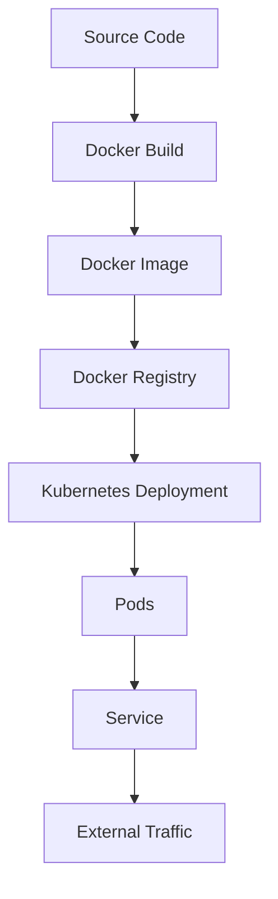

## 11.18 Containerization and Orchestration

In the evolving landscape of software development, containerization and orchestration have become pivotal in deploying and managing applications efficiently. This section delves into how F# applications can be containerized using Docker and orchestrated with Kubernetes, providing a robust framework for microservices architecture.

### Understanding Containerization

Containerization is a method of packaging an application and its dependencies into a single, lightweight, and portable unit called a container. Containers ensure that an application runs consistently across different environments, from development to production.

#### Benefits of Containerization for Microservices

1. **Isolation**: Containers provide an isolated environment for applications, reducing conflicts between different services.
2. **Portability**: Containers can run on any system that supports Docker, ensuring consistent behavior across environments.
3. **Scalability**: Containers can be easily scaled up or down, making them ideal for microservices that require dynamic scaling.
4. **Efficiency**: Containers share the host OS kernel, making them more resource-efficient than virtual machines.

### Containerizing an F# Application with Docker

Docker is the most popular containerization platform, and it provides tools to create, deploy, and manage containers. Let's explore how to containerize an F# application using Docker.

#### Writing a Dockerfile for F#

A Dockerfile is a script containing a series of instructions on how to build a Docker image. Here's a step-by-step guide to creating a Dockerfile for an F# application:

```dockerfile
FROM mcr.microsoft.com/dotnet/sdk:6.0 AS build-env
WORKDIR /app

COPY . ./

RUN dotnet restore

RUN dotnet publish -c Release -o out

FROM mcr.microsoft.com/dotnet/aspnet:6.0
WORKDIR /app

COPY --from=build-env /app/out .

ENTRYPOINT ["dotnet", "YourFSharpApp.dll"]
```

**Key Points:**
- **Multi-Stage Builds**: This Dockerfile uses multi-stage builds to minimize the final image size by separating the build environment from the runtime environment.
- **Base Images**: The `sdk` image is used for building the application, and the `aspnet` image is used for running it.
- **COPY Instruction**: Copies the necessary files into the container.
- **ENTRYPOINT**: Specifies the command to run when the container starts.

#### Optimizing Container Images

1. **Minimize Image Size**: Use multi-stage builds to keep the final image lean.
2. **Use Specific Tags**: Instead of `latest`, use specific tags for base images to ensure consistency.
3. **Remove Unnecessary Files**: Clean up temporary files and caches during the build process.

### Deploying F# Applications to Kubernetes

Kubernetes is an open-source platform designed to automate deploying, scaling, and operating application containers. It provides a robust framework for running distributed systems resiliently.

#### Creating Kubernetes Deployment and Service Manifests

A Kubernetes deployment manages a set of identical pods, while a service exposes an application running on a set of pods. Here's how to create these manifests:

**Deployment Manifest (`deployment.yaml`):**

```yaml
apiVersion: apps/v1
kind: Deployment
metadata:
  name: fsharp-app
spec:
  replicas: 3
  selector:
    matchLabels:
      app: fsharp-app
  template:
    metadata:
      labels:
        app: fsharp-app
    spec:
      containers:
      - name: fsharp-app
        image: yourdockerhubusername/yourfsharpapp:latest
        ports:
        - containerPort: 80
```

**Service Manifest (`service.yaml`):**

```yaml
apiVersion: v1
kind: Service
metadata:
  name: fsharp-app-service
spec:
  type: LoadBalancer
  selector:
    app: fsharp-app
  ports:
  - protocol: TCP
    port: 80
    targetPort: 80
```

**Key Points:**
- **Replicas**: The deployment specifies three replicas for high availability.
- **Labels and Selectors**: Used to match pods with services.
- **LoadBalancer**: The service type exposes the application to external traffic.

#### Configuring Kubernetes for Scaling and Rolling Updates

1. **Horizontal Pod Autoscaler**: Automatically scales the number of pods based on CPU utilization or other select metrics.
2. **Rolling Updates**: Gradually updates pods with new versions without downtime.

```yaml
apiVersion: autoscaling/v1
kind: HorizontalPodAutoscaler
metadata:
  name: fsharp-app-hpa
spec:
  scaleTargetRef:
    apiVersion: apps/v1
    kind: Deployment
    name: fsharp-app
  minReplicas: 1
  maxReplicas: 10
  targetCPUUtilizationPercentage: 50
```

### Challenges in Containerized Environments

#### State Management and Persistent Storage

- **Stateful Applications**: Use StatefulSets for applications that require stable network identifiers and persistent storage.
- **Persistent Volumes**: Use Kubernetes Persistent Volumes (PV) and Persistent Volume Claims (PVC) to manage storage.

```yaml
apiVersion: v1
kind: PersistentVolumeClaim
metadata:
  name: fsharp-app-pvc
spec:
  accessModes:
    - ReadWriteOnce
  resources:
    requests:
      storage: 1Gi
```

### Best Practices for Containerized F# Applications

#### Security

1. **Least Privilege**: Run containers with the least privilege necessary.
2. **Image Scanning**: Regularly scan images for vulnerabilities.
3. **Network Policies**: Use Kubernetes Network Policies to control traffic flow.

#### Monitoring and Logging

1. **Centralized Logging**: Use tools like Fluentd or Logstash to collect and analyze logs.
2. **Monitoring Tools**: Use Prometheus and Grafana for monitoring and alerting.

#### Continuous Integration/Continuous Deployment (CI/CD)

1. **Automated Builds**: Use CI/CD pipelines to automate the build and deployment process.
2. **Version Control**: Ensure all manifests and configurations are version-controlled.

### Visualizing Containerization and Orchestration

Below is a visual representation of how Docker and Kubernetes work together to manage containerized applications.



**Diagram Explanation:**
- **Source Code**: The starting point for building an application.
- **Docker Build**: The process of creating a Docker image from the source code.
- **Docker Image**: A portable artifact that can be deployed.
- **Docker Registry**: A storage for Docker images, such as Docker Hub.
- **Kubernetes Deployment**: Manages the deployment of pods.
- **Pods**: The smallest deployable units in Kubernetes.
- **Service**: Exposes the application to external traffic.

### Try It Yourself

Experiment with the provided Dockerfile and Kubernetes manifests. Try modifying the number of replicas, changing the base image, or adding environment variables to the deployment. Observe how these changes affect the deployment and behavior of your application.

### Knowledge Check

1. **What is the primary benefit of using multi-stage builds in Docker?**
2. **How does Kubernetes ensure high availability for applications?**
3. **What is the role of a Persistent Volume in Kubernetes?**

### Embrace the Journey

Remember, mastering containerization and orchestration is a journey. As you progress, you'll gain deeper insights into building resilient and scalable applications. Keep experimenting, stay curious, and enjoy the journey!

## Quiz Time!



### What is the primary benefit of containerization?

- [x] Portability across different environments
- [ ] Increased application size
- [ ] Reduced application isolation
- [ ] Decreased resource efficiency

> **Explanation:** Containerization allows applications to run consistently across different environments, ensuring portability.

### Which tool is most commonly used for containerization?

- [x] Docker
- [ ] Kubernetes
- [ ] Prometheus
- [ ] Grafana

> **Explanation:** Docker is the most popular tool for containerizing applications.

### What is the purpose of a Dockerfile?

- [x] To define instructions for building a Docker image
- [ ] To store application logs
- [ ] To manage Kubernetes deployments
- [ ] To monitor application performance

> **Explanation:** A Dockerfile contains instructions for building a Docker image.

### What is a key feature of Kubernetes?

- [x] Automated scaling of applications
- [ ] Manual deployment of applications
- [ ] Limited application isolation
- [ ] Reduced application portability

> **Explanation:** Kubernetes automates the scaling and management of containerized applications.

### How does Kubernetes manage persistent storage?

- [x] Using Persistent Volumes and Persistent Volume Claims
- [ ] By storing data in Docker images
- [ ] Through manual configuration files
- [ ] Using external databases only

> **Explanation:** Kubernetes uses Persistent Volumes and Persistent Volume Claims to manage persistent storage.

### What is a best practice for securing containerized applications?

- [x] Running containers with the least privilege necessary
- [ ] Allowing unrestricted network access
- [ ] Using the latest image tags without scanning
- [ ] Disabling logging and monitoring

> **Explanation:** Running containers with the least privilege necessary enhances security.

### Which tool is used for centralized logging in containerized environments?

- [x] Fluentd
- [ ] Docker
- [ ] Kubernetes
- [ ] Grafana

> **Explanation:** Fluentd is commonly used for centralized logging in containerized environments.

### What is a benefit of using CI/CD pipelines for containerized applications?

- [x] Automated builds and deployments
- [ ] Manual version control
- [ ] Increased application downtime
- [ ] Reduced application scalability

> **Explanation:** CI/CD pipelines automate the build and deployment process, enhancing efficiency.

### What is the role of a Kubernetes Service?

- [x] To expose applications to external traffic
- [ ] To build Docker images
- [ ] To monitor application performance
- [ ] To manage application logs

> **Explanation:** A Kubernetes Service exposes applications running on a set of pods to external traffic.

### True or False: Kubernetes can automatically scale applications based on CPU utilization.

- [x] True
- [ ] False

> **Explanation:** Kubernetes can automatically scale applications using the Horizontal Pod Autoscaler based on CPU utilization or other metrics.


