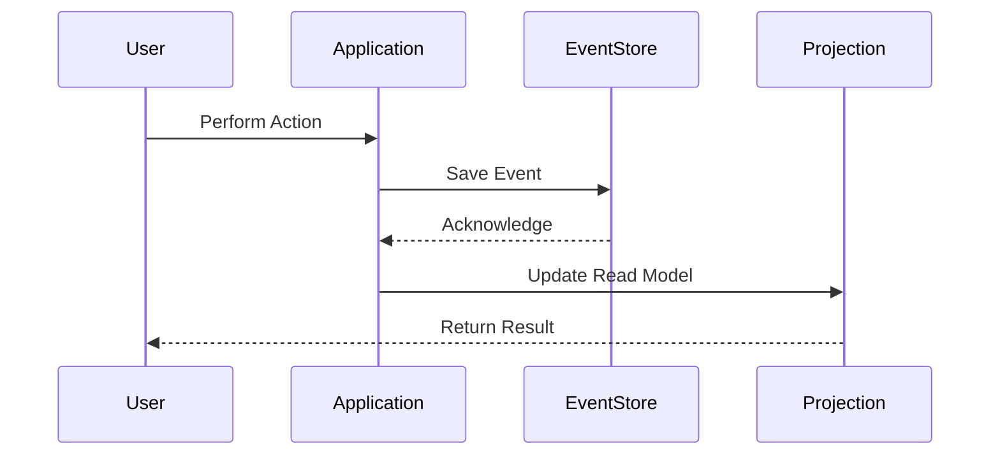

## 11.19 Event Sourcing in Microservices

In this section, we delve into the concept of Event Sourcing within the context of microservices, focusing on how to capture service state changes as events and implement this pattern using F#. Event Sourcing is a powerful pattern that records all changes to an application's state as a sequence of events. This approach not only provides a complete audit trail but also enables temporal queries and simplifies system debugging.

### Understanding Event Sourcing

**Event Sourcing** is a design pattern where state changes are captured as a series of events. Instead of storing the current state of an entity, each change is stored as an event. The current state can be reconstructed by replaying these events from the beginning.

#### Key Concepts

- **Event**: A record of a change in state. Each event is immutable and represents a fact that has occurred.
- **Event Store**: A database or storage system that persists events. It acts as the source of truth for the system.
- **Rehydration**: The process of rebuilding the current state of an entity by replaying its events.
- **Projection**: A read model that is built from events to provide a view of the data optimized for queries.

### Benefits of Event Sourcing

Event Sourcing offers several advantages:

- **Auditability**: Every change to the system is recorded, providing a complete history of all state changes.
- **Temporal Queries**: You can query the state of the system at any point in time by replaying events up to that point.
- **Debugging**: By replaying events, you can reproduce and debug issues as they occurred in the past.
- **Flexibility**: New read models can be created without altering the existing data structure.

### Implementing Event Sourcing in F#

Let's explore how to implement Event Sourcing in F#, focusing on event stores, event processing, and state reconstruction.

#### Setting Up an Event Store

An event store is crucial for persisting events. In F#, you can use various databases as event stores, such as SQL databases, NoSQL databases, or specialized event stores like EventStoreDB.

Here's a simple example of defining an event store interface in F#:

```fsharp
type Event = {
    Id: Guid
    Timestamp: DateTime
    EventType: string
    Data: string
}

type IEventStore =
    abstract member SaveEvent: Event -> Async<unit>
    abstract member GetEvents: unit -> Async<Event list>
```

This interface defines two methods: `SaveEvent` for persisting an event and `GetEvents` for retrieving all events.

#### Persisting Events

To persist events, you need to implement the `IEventStore` interface. Here's an example using a simple in-memory store:

```fsharp
open System.Collections.Concurrent

type InMemoryEventStore() =
    let events = ConcurrentBag<Event>()

    interface IEventStore with
        member _.SaveEvent(event) =
            async {
                events.Add(event)
                return ()
            }

        member _.GetEvents() =
            async {
                return events |> Seq.toList
            }
```

This implementation uses a `ConcurrentBag` to store events in memory. In a real-world application, you would use a persistent storage system.

#### Reconstructing State

Reconstructing the current state involves replaying events. Here's an example of how you might implement this:

```fsharp
type AccountState = {
    Balance: decimal
}

let applyEvent (state: AccountState) (event: Event) =
    match event.EventType with
    | "Deposit" -> { state with Balance = state.Balance + decimal.Parse(event.Data) }
    | "Withdraw" -> { state with Balance = state.Balance - decimal.Parse(event.Data) }
    | _ -> state

let reconstructState (events: Event list) =
    events |> List.fold applyEvent { Balance = 0m }
```

In this example, `applyEvent` applies an event to the current state, and `reconstructState` folds over the list of events to rebuild the state.

### Handling Event Versioning and Schema Evolution

As your system evolves, the structure of events may change. Handling event versioning and schema evolution is crucial to maintaining compatibility.

#### Event Versioning

One approach to handling versioning is to include a version number in each event. This allows you to handle different versions of events appropriately.

```fsharp
type VersionedEvent = {
    Id: Guid
    Timestamp: DateTime
    EventType: string
    Data: string
    Version: int
}
```

#### Schema Evolution

When the schema of an event changes, you may need to transform old events to the new schema. This can be done during event replay or by creating migration scripts.

### Addressing Challenges

Implementing Event Sourcing comes with its own set of challenges:

- **Handling Large Volumes of Events**: As the number of events grows, performance can degrade. Techniques like snapshotting can help by storing periodic snapshots of the state.
- **Ensuring System Performance**: Efficient querying and indexing strategies are essential to maintain performance as the event store grows.

### Tools and Libraries for Event Sourcing in F#

Several tools and libraries can assist with Event Sourcing in F#:

- **EventStoreDB**: A database optimized for storing events.
- **Akka.NET**: A toolkit for building concurrent, distributed, and fault-tolerant applications, which can be used to implement Event Sourcing.
- **FsKafka**: An F# library for working with Kafka, which can be used for event streaming.

### Try It Yourself

To get hands-on experience with Event Sourcing, try modifying the code examples provided. For instance, add new event types, implement a persistent event store, or create projections for querying specific data.

### Visualizing Event Sourcing

To better understand the flow of Event Sourcing, let's look at a diagram that illustrates the process of capturing, storing, and replaying events.



This diagram shows how a user action results in an event being saved to the event store, followed by updating a read model for querying.

### Knowledge Check

- **What are the key benefits of using Event Sourcing?**
- **How can you handle schema evolution in Event Sourcing?**
- **What are some challenges associated with Event Sourcing?**

### Embrace the Journey

Event Sourcing is a powerful pattern that can transform how you manage state in microservices. Remember, this is just the beginning. As you progress, you'll discover more advanced techniques and optimizations. Keep experimenting, stay curious, and enjoy the journey!

## Quiz Time!



### What is the primary purpose of Event Sourcing?

- [x] To record all changes to application state as events
- [ ] To store the current state of an entity
- [ ] To optimize database queries
- [ ] To replace traditional databases

> **Explanation:** Event Sourcing records all changes to application state as events, allowing for a complete history of state changes.

### What is an Event Store used for in Event Sourcing?

- [x] To persist events as the source of truth
- [ ] To store the current state of entities
- [ ] To optimize read queries
- [ ] To manage user sessions

> **Explanation:** An Event Store is used to persist events and acts as the source of truth in an Event Sourcing system.

### How can you handle schema evolution in Event Sourcing?

- [x] By including a version number in each event
- [ ] By ignoring old events
- [ ] By storing events in a separate database
- [ ] By rewriting all events to a new schema

> **Explanation:** Including a version number in each event allows handling different versions of events appropriately.

### What is rehydration in the context of Event Sourcing?

- [x] Rebuilding the current state by replaying events
- [ ] Storing events in a database
- [ ] Optimizing database queries
- [ ] Managing user sessions

> **Explanation:** Rehydration involves rebuilding the current state of an entity by replaying its events.

### Which of the following is a challenge of Event Sourcing?

- [x] Handling large volumes of events
- [ ] Storing the current state of entities
- [ ] Optimizing read queries
- [ ] Managing user sessions

> **Explanation:** Handling large volumes of events can be challenging as it may impact system performance.

### What is a projection in Event Sourcing?

- [x] A read model built from events for optimized queries
- [ ] A database table
- [ ] A user interface component
- [ ] A type of event

> **Explanation:** A projection is a read model built from events to provide a view of the data optimized for queries.

### What role does Akka.NET play in Event Sourcing?

- [x] It is a toolkit for building concurrent, distributed applications
- [ ] It is a database for storing events
- [ ] It is a UI framework
- [ ] It is a testing tool

> **Explanation:** Akka.NET is a toolkit for building concurrent, distributed, and fault-tolerant applications, useful for implementing Event Sourcing.

### What is the benefit of temporal queries in Event Sourcing?

- [x] They allow querying the state of the system at any point in time
- [ ] They optimize database storage
- [ ] They enhance user interface performance
- [ ] They manage user sessions

> **Explanation:** Temporal queries allow querying the state of the system at any point in time by replaying events up to that point.

### True or False: Event Sourcing can simplify system debugging.

- [x] True
- [ ] False

> **Explanation:** Event Sourcing can simplify system debugging by allowing you to replay events and reproduce issues as they occurred in the past.

### Which library can be used for event streaming in F#?

- [x] FsKafka
- [ ] NUnit
- [ ] Fable
- [ ] Xamarin.Forms

> **Explanation:** FsKafka is an F# library for working with Kafka, which can be used for event streaming.


