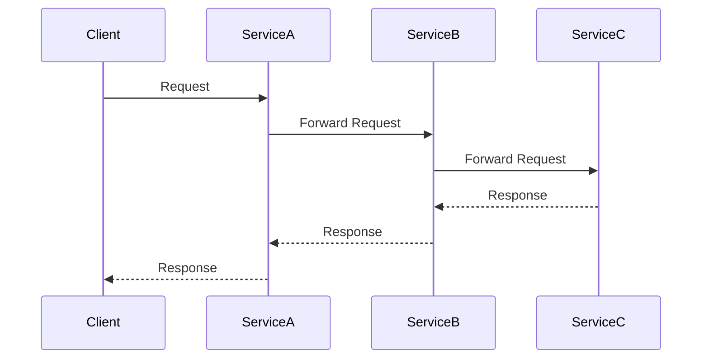
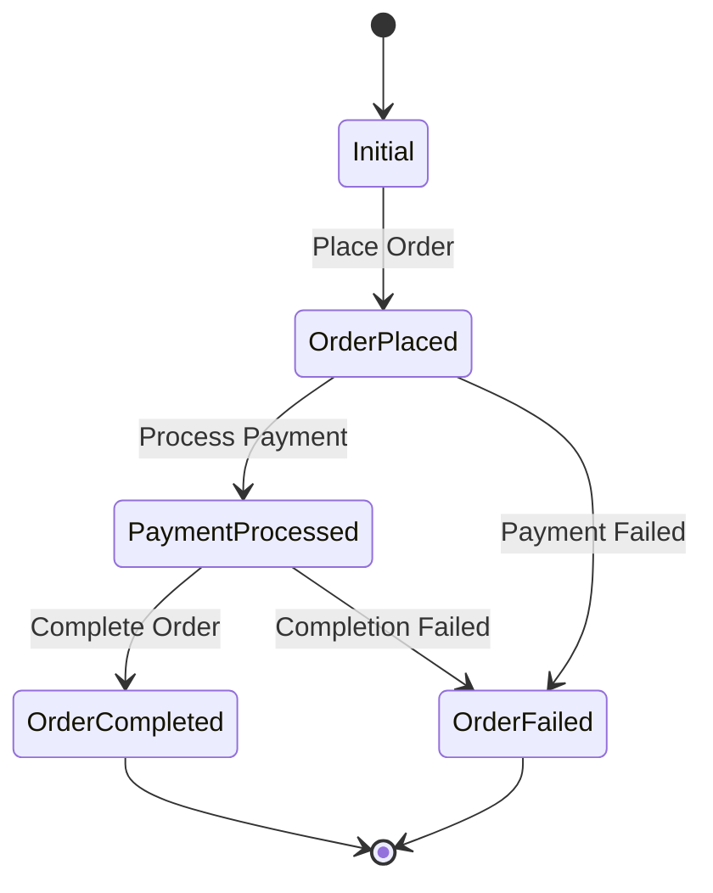

## 11.2 Challenges in Microservices Development

In the realm of modern software architecture, microservices have emerged as a powerful approach to building scalable and maintainable systems. However, this architectural style also introduces a unique set of challenges that developers and architects must navigate. In this section, we will delve into the complexities of microservices development, focusing on communication, data consistency, and service coordination challenges. We will also explore strategies and patterns to mitigate these challenges, setting the stage for solutions presented in later sections.

### Understanding Microservices Architecture

Before we dive into the challenges, let's briefly revisit what microservices architecture entails. Microservices architecture involves decomposing a large application into smaller, independent services that communicate with each other over a network. Each service is responsible for a specific business capability and can be developed, deployed, and scaled independently.

While this approach offers numerous benefits, such as improved scalability, flexibility, and faster time-to-market, it also introduces several complexities that must be addressed to ensure the success of a microservices-based system.

### Common Challenges in Microservices Development

#### 1. Inter-Service Communication

One of the most significant challenges in microservices development is managing inter-service communication. Unlike monolithic applications where components communicate through function calls, microservices rely on network communication, which introduces several complexities:

- **Latency and Network Reliability**: Network communication is inherently slower and less reliable than in-process communication. Latency can impact the performance of the system, and network failures can lead to service unavailability.

- **Serialization and Protocol Compatibility**: Microservices often use different technologies and programming languages, which can lead to challenges in data serialization and protocol compatibility. Ensuring that services can communicate effectively requires careful consideration of serialization formats and communication protocols.

- **Service Discovery and Load Balancing**: In a dynamic microservices environment, services may be added or removed frequently. Implementing service discovery mechanisms and load balancing strategies is crucial to ensure that requests are routed to the appropriate service instances.

Let's explore a code example to illustrate how inter-service communication can be managed in F# using HTTP-based communication.

```fsharp
open System.Net.Http
open System.Threading.Tasks

let httpClient = new HttpClient()

let getServiceDataAsync (url: string) : Task<string> =
    async {
        try
            let! response = httpClient.GetStringAsync(url) |> Async.AwaitTask
            return response
        with
        | ex -> 
            printfn "Error fetching data: %s" ex.Message
            return ""
    } |> Async.StartAsTask

// Example usage
let url = "http://example-service/api/data"
let dataTask = getServiceDataAsync url
dataTask.Wait()
printfn "Received data: %s" dataTask.Result
```

In this example, we use `HttpClient` to perform an HTTP GET request to another service. We handle potential exceptions to ensure that the application can gracefully handle network failures.

#### 2. Data Consistency

Data consistency is another critical challenge in microservices development. In a distributed system, ensuring that all services have a consistent view of the data can be difficult. There are two primary consistency models to consider:

- **Strong Consistency**: All nodes see the same data at the same time. This model is easier to reason about but can be challenging to achieve in a distributed system due to network latency and partitioning.

- **Eventual Consistency**: Nodes may see different data at different times, but eventually, all nodes will converge to the same state. This model is more suitable for distributed systems but requires careful handling of data conflicts and reconciliation.

Let's consider an example of eventual consistency using event sourcing in F#.

```fsharp
type Event =
    | ItemAdded of string
    | ItemRemoved of string

type State = { Items: string list }

let applyEvent (state: State) (event: Event) =
    match event with
    | ItemAdded item -> { state with Items = item :: state.Items }
    | ItemRemoved item -> { state with Items = List.filter ((<>) item) state.Items }

let replayEvents (events: Event list) =
    List.fold applyEvent { Items = [] } events

// Example usage
let events = [ItemAdded "Apple"; ItemAdded "Banana"; ItemRemoved "Apple"]
let finalState = replayEvents events
printfn "Final state: %A" finalState.Items
```

In this example, we use event sourcing to achieve eventual consistency. Events are stored and replayed to reconstruct the current state of the system.

#### 3. Service Coordination

Coordinating multiple services to achieve a common goal can be challenging in a microservices architecture. Some common coordination challenges include:

- **Distributed Transactions**: Managing transactions across multiple services is complex due to the lack of a global transaction manager. Techniques such as the Saga pattern can be used to manage distributed transactions.

- **Orchestration vs. Choreography**: Deciding between orchestration (centralized control) and choreography (decentralized control) for service interactions can impact the system's flexibility and complexity.

Let's explore an example of the Saga pattern in F# to manage distributed transactions.

```fsharp
type SagaState =
    | Initial
    | OrderPlaced
    | PaymentProcessed
    | OrderCompleted
    | OrderFailed

let processOrderSaga (state: SagaState) =
    match state with
    | Initial ->
        printfn "Placing order..."
        OrderPlaced
    | OrderPlaced ->
        printfn "Processing payment..."
        PaymentProcessed
    | PaymentProcessed ->
        printfn "Completing order..."
        OrderCompleted
    | _ ->
        printfn "Order failed."
        OrderFailed

// Example usage
let initialState = Initial
let finalState = processOrderSaga initialState
printfn "Final saga state: %A" finalState
```

In this example, we use a simple state machine to represent the different states of a Saga. Each state transition represents a step in the distributed transaction.

#### 4. Monitoring, Logging, and Debugging

Monitoring, logging, and debugging are essential for maintaining the health and performance of a microservices-based system. However, these tasks become more challenging in a distributed environment:

- **Centralized Logging**: Aggregating logs from multiple services can be difficult. Implementing a centralized logging solution is crucial for effective monitoring and debugging.

- **Distributed Tracing**: Tracing requests across multiple services is essential for identifying performance bottlenecks and diagnosing issues. Tools like OpenTelemetry can help implement distributed tracing.

- **Debugging Complexity**: Debugging issues in a distributed system can be challenging due to the lack of a single execution context. Techniques such as log correlation and trace visualization can aid in debugging.

Let's explore an example of implementing centralized logging in F# using Serilog.

```fsharp
open Serilog

let configureLogging () =
    Log.Logger <- LoggerConfiguration()
        .WriteTo.Console()
        .CreateLogger()

let logInformation message =
    Log.Information(message)

// Example usage
configureLogging()
logInformation "Service started"
logInformation "Processing request"
```

In this example, we use Serilog to configure centralized logging. Logs are written to the console, but they can also be directed to other sinks such as files or logging services.

### Strategies for Mitigating Microservices Challenges

To address the challenges discussed above, several strategies and patterns can be employed:

- **Service Mesh**: Implementing a service mesh can help manage inter-service communication, load balancing, and service discovery. It provides a layer of abstraction for communication and can enhance the resilience and security of the system.

- **Circuit Breaker Pattern**: The circuit breaker pattern can be used to prevent cascading failures by temporarily halting requests to a failing service. This pattern can improve the system's resilience and availability.

- **API Gateway**: An API gateway can act as a single entry point for client requests, providing features such as request routing, authentication, and rate limiting. It simplifies client interactions and enhances security.

- **Event-Driven Architecture**: Adopting an event-driven architecture can improve scalability and decoupling between services. Events can be used to trigger actions in other services, enabling asynchronous communication and eventual consistency.

- **Observability Tools**: Implementing observability tools such as Prometheus and Grafana can enhance monitoring and alerting capabilities. These tools provide insights into the system's performance and help identify issues proactively.

### Visualizing Microservices Challenges

To better understand the challenges in microservices development, let's visualize the architecture and interactions using Mermaid.js diagrams.

#### Inter-Service Communication



*Caption: This sequence diagram illustrates the flow of requests and responses between services in a microservices architecture.*

#### Distributed Transactions with Saga Pattern



*Caption: This state diagram represents the states and transitions in a Saga pattern for managing distributed transactions.*

### Knowledge Check

Before we conclude, let's reinforce our understanding with a few questions:

- What are the primary challenges in inter-service communication in microservices?
- How does eventual consistency differ from strong consistency, and when is it more suitable?
- What are some strategies for managing distributed transactions in microservices?

### Conclusion

Microservices architecture offers numerous benefits but also introduces significant challenges that must be addressed to build robust and scalable systems. By understanding the complexities of inter-service communication, data consistency, and service coordination, developers and architects can implement effective strategies to mitigate these challenges. In the following sections, we will explore specific design patterns and solutions to address these challenges in more detail.

Remember, this is just the beginning. As you progress, you'll build more resilient and scalable microservices architectures. Keep experimenting, stay curious, and enjoy the journey!

## Quiz Time!



### What is a common challenge in microservices development related to inter-service communication?

- [x] Latency and network reliability
- [ ] In-process communication
- [ ] Lack of serialization
- [ ] Single execution context

> **Explanation:** Network communication in microservices introduces latency and reliability issues, unlike in-process communication in monolithic applications.

### Which consistency model is more suitable for distributed systems?

- [ ] Strong consistency
- [x] Eventual consistency
- [ ] Immediate consistency
- [ ] Temporal consistency

> **Explanation:** Eventual consistency is often more suitable for distributed systems as it allows for temporary inconsistencies that eventually converge.

### What pattern can be used to manage distributed transactions in microservices?

- [ ] Singleton pattern
- [x] Saga pattern
- [ ] Observer pattern
- [ ] Factory pattern

> **Explanation:** The Saga pattern is used to manage distributed transactions by coordinating multiple services.

### What tool can be used for distributed tracing in microservices?

- [ ] NUnit
- [x] OpenTelemetry
- [ ] Serilog
- [ ] Fable

> **Explanation:** OpenTelemetry is a tool used for distributed tracing to track requests across multiple services.

### What is the purpose of an API Gateway in microservices?

- [x] To act as a single entry point for client requests
- [ ] To manage database transactions
- [ ] To replace service discovery
- [ ] To perform in-process communication

> **Explanation:** An API Gateway acts as a single entry point for client requests, providing features like routing and authentication.

### How does the circuit breaker pattern improve system resilience?

- [x] By temporarily halting requests to a failing service
- [ ] By increasing request throughput
- [ ] By reducing network latency
- [ ] By centralizing service control

> **Explanation:** The circuit breaker pattern improves resilience by preventing cascading failures when a service is failing.

### What is a key benefit of adopting an event-driven architecture in microservices?

- [ ] Strong coupling between services
- [x] Improved scalability and decoupling
- [ ] Synchronous communication
- [ ] Centralized control

> **Explanation:** Event-driven architecture improves scalability and decoupling by enabling asynchronous communication between services.

### What is a challenge of monitoring in a microservices environment?

- [ ] Centralized logging
- [x] Aggregating logs from multiple services
- [ ] Single execution context
- [ ] Lack of observability tools

> **Explanation:** Aggregating logs from multiple services is challenging in a distributed microservices environment.

### What strategy can be used to enhance monitoring and alerting capabilities in microservices?

- [ ] Using a single logging file
- [x] Implementing observability tools like Prometheus and Grafana
- [ ] Disabling logging
- [ ] Using only console logs

> **Explanation:** Observability tools like Prometheus and Grafana provide insights into system performance and help identify issues.

### True or False: Strong consistency ensures that all nodes see the same data at the same time.

- [x] True
- [ ] False

> **Explanation:** Strong consistency ensures that all nodes see the same data at the same time, unlike eventual consistency.


