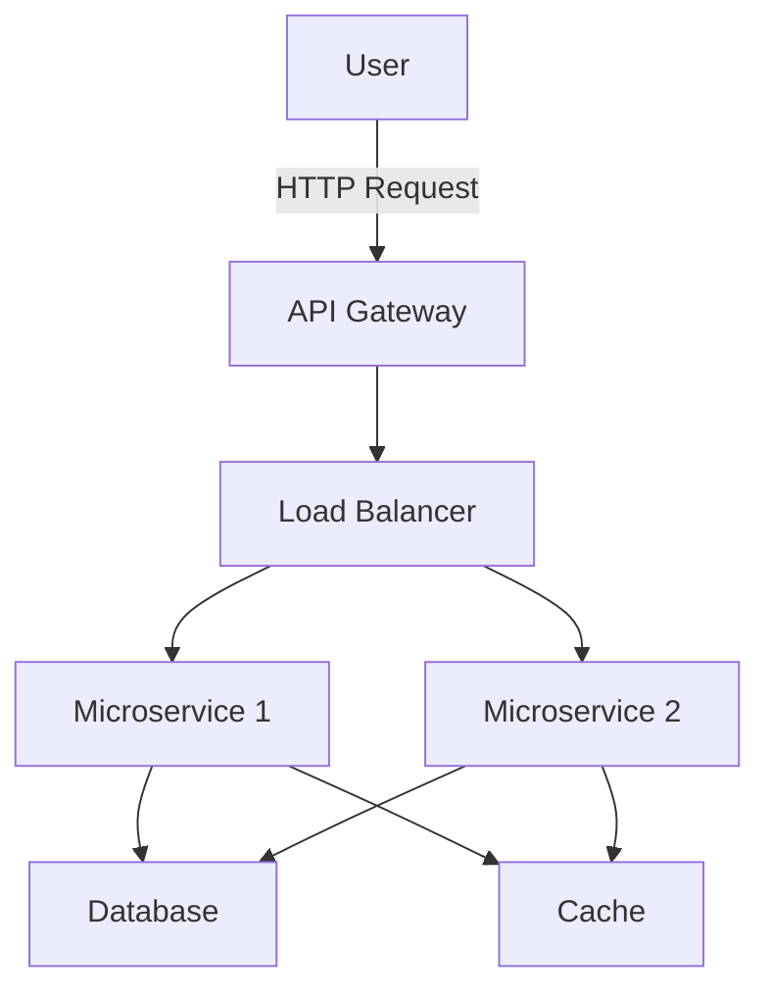

## 11.20 Cloud-Native and Serverless Patterns

In this section, we will delve into the world of cloud-native and serverless patterns, focusing on how F# can be leveraged to build efficient, scalable, and resilient applications. We'll explore the principles of cloud-native applications, the concept of serverless computing, and how to effectively use containerization and orchestration tools like Docker and Kubernetes. Additionally, we'll discuss best practices for designing cloud-native applications, with a focus on cost optimization and resource management.

### Understanding Cloud-Native Applications

Cloud-native applications are designed to take full advantage of the cloud computing model. They are built to be scalable, resilient, and easily manageable. The core principles of cloud-native applications include:

- **Microservices Architecture**: Breaking down applications into small, independent services that can be developed, deployed, and scaled independently.
- **Containerization**: Packaging applications and their dependencies into containers to ensure consistency across environments.
- **Dynamic Orchestration**: Using tools like Kubernetes to manage and scale containers automatically.
- **DevOps and Continuous Delivery**: Implementing practices that enable rapid and reliable delivery of applications.
- **Resilience and Observability**: Designing systems that can recover from failures and provide insights into their operation.

### Serverless Computing with F#

Serverless computing is a cloud-native development model that allows developers to build and run applications without managing the underlying infrastructure. F# can be used to create serverless functions on platforms like Azure Functions and AWS Lambda.

#### Azure Functions with F#

Azure Functions is a serverless compute service that enables you to run event-driven code without having to explicitly provision or manage infrastructure. Here's how you can create a simple Azure Function using F#:

```fsharp
open Microsoft.Azure.WebJobs
open Microsoft.Extensions.Logging

let Run([<HttpTrigger>] req: HttpRequest, log: ILogger) =
    log.LogInformation("F# HTTP trigger function processed a request.")
    let name = req.Query.["name"]
    if String.IsNullOrEmpty(name) then
        req.HttpContext.Response.WriteAsync("Please pass a name on the query string.")
    else
        req.HttpContext.Response.WriteAsync($"Hello, {name}!")
```

**Deployment and Invocation**: To deploy this function, you can use Azure CLI or Azure Portal. Once deployed, it can be invoked via HTTP requests.

#### AWS Lambda with F#

AWS Lambda is another popular serverless platform. You can write Lambda functions in F# using the AWS Toolkit for Visual Studio or by packaging your F# code as a .NET assembly.

```fsharp
open Amazon.Lambda.Core

[<assembly: LambdaSerializer(typeof<Amazon.Lambda.Serialization.Json.JsonSerializer>)>]
do ()

type Function() =
    member this.FunctionHandler(input: string, context: ILambdaContext) =
        $"Hello, {input}!"
```

**Deployment**: Package your F# function as a .NET Core application and deploy it using AWS CLI or AWS Management Console.

### Containerization Strategies for F# Applications

Containerization is a key component of cloud-native applications. Docker is the most widely used tool for containerization, allowing you to package your application and its dependencies into a single container image.

#### Dockerizing F# Applications

To containerize an F# application, you need to create a Dockerfile that specifies how to build your application image. Here is a simple example:

```dockerfile
FROM mcr.microsoft.com/dotnet/sdk:6.0 AS build
WORKDIR /app

COPY . .
RUN dotnet restore

RUN dotnet publish -c Release -o out

FROM mcr.microsoft.com/dotnet/aspnet:6.0 AS runtime
WORKDIR /app
COPY --from=build /app/out .

ENTRYPOINT ["dotnet", "YourApp.dll"]
```

**Building and Running the Container**: Use Docker CLI to build and run your container:

```bash
docker build -t yourapp .
docker run -d -p 8080:80 yourapp
```

### Orchestration with Kubernetes

Kubernetes is an open-source platform for automating the deployment, scaling, and management of containerized applications. It provides a robust framework for running distributed systems resiliently.

#### Deploying F# Applications on Kubernetes

To deploy an F# application on Kubernetes, you need to define a Kubernetes deployment and service. Here's a basic example:

```yaml
apiVersion: apps/v1
kind: Deployment
metadata:
  name: fsharp-app
spec:
  replicas: 3
  selector:
    matchLabels:
      app: fsharp-app
  template:
    metadata:
      labels:
        app: fsharp-app
    spec:
      containers:
      - name: fsharp-app
        image: yourapp:latest
        ports:
        - containerPort: 80
---
apiVersion: v1
kind: Service
metadata:
  name: fsharp-app
spec:
  type: LoadBalancer
  ports:
  - port: 80
  selector:
    app: fsharp-app
```

**Deploying to Kubernetes**: Use `kubectl` to apply these configurations:

```bash
kubectl apply -f deployment.yaml
```

### Best Practices for Cloud-Native F# Applications

When designing cloud-native applications, consider the following best practices:

- **Scalability**: Design your application to scale horizontally by adding more instances rather than vertically by adding more resources to a single instance.
- **Resilience**: Implement strategies for handling failures gracefully, such as retries and circuit breakers.
- **Observability**: Use logging, monitoring, and tracing to gain insights into your application's performance and behavior.
- **Security**: Follow security best practices, such as using secure communication channels and managing secrets properly.
- **Cost Optimization**: Monitor and optimize resource usage to minimize costs. Consider using serverless functions for workloads with variable demand.

### Cost Optimization and Resource Usage

Cloud-native applications can incur significant costs if not managed properly. Here are some strategies for cost optimization:

- **Right-Sizing Resources**: Continuously monitor resource usage and adjust instance sizes and counts accordingly.
- **Auto-Scaling**: Use auto-scaling features to automatically adjust the number of running instances based on demand.
- **Serverless Functions**: Take advantage of serverless computing for workloads that do not require constant uptime, as you only pay for the compute time you use.
- **Spot Instances**: Use spot instances or preemptible VMs for non-critical workloads to reduce costs.

### Try It Yourself

To get hands-on experience, try modifying the code examples provided. Experiment with different configurations in your Dockerfile or Kubernetes deployment to see how they affect your application's behavior. Deploy a simple F# function to Azure Functions or AWS Lambda and test its performance under different loads.

### Visualizing Cloud-Native Architecture

Let's visualize a typical cloud-native architecture using a Mermaid.js diagram:



**Diagram Description**: This diagram represents a cloud-native architecture where users interact with an API Gateway. The gateway routes requests to a load balancer, which distributes traffic to multiple microservices. These microservices interact with a shared database and cache to store and retrieve data efficiently.

### Conclusion

Building cloud-native and serverless applications with F# allows you to leverage the power of the cloud while maintaining the benefits of functional programming. By following best practices and utilizing tools like Docker and Kubernetes, you can create applications that are scalable, resilient, and cost-effective.

## Quiz Time!



### What is a key principle of cloud-native applications?

- [x] Microservices Architecture
- [ ] Monolithic Design
- [ ] Manual Scaling
- [ ] Static Resource Allocation

> **Explanation:** Cloud-native applications are built using a microservices architecture to enable independent scaling and deployment of services.

### Which platform can be used to run F# serverless functions?

- [x] Azure Functions
- [ ] Kubernetes
- [ ] Docker
- [ ] IIS

> **Explanation:** Azure Functions is a serverless compute service that supports running F# functions.

### What is the primary benefit of containerization?

- [x] Consistency across environments
- [ ] Increased hardware costs
- [ ] Manual deployment processes
- [ ] Static resource allocation

> **Explanation:** Containerization ensures consistency across different environments by packaging applications and their dependencies into containers.

### How does Kubernetes help in cloud-native architectures?

- [x] Automates deployment and scaling
- [ ] Increases manual intervention
- [ ] Reduces application resilience
- [ ] Limits application scalability

> **Explanation:** Kubernetes automates the deployment, scaling, and management of containerized applications, enhancing scalability and resilience.

### What is a best practice for designing cloud-native applications?

- [x] Implementing observability
- [ ] Ignoring security practices
- [ ] Using monolithic architecture
- [ ] Avoiding auto-scaling

> **Explanation:** Implementing observability is crucial for understanding application performance and behavior in cloud-native environments.

### What is the advantage of using serverless functions?

- [x] Pay only for compute time used
- [ ] Requires constant uptime
- [ ] Higher fixed costs
- [ ] Manual scaling required

> **Explanation:** Serverless functions allow you to pay only for the compute time used, making them cost-effective for variable workloads.

### Which tool is commonly used for containerization?

- [x] Docker
- [ ] AWS Lambda
- [ ] Azure Functions
- [ ] IIS

> **Explanation:** Docker is a widely used tool for containerizing applications and their dependencies.

### What is a strategy for cost optimization in cloud-native applications?

- [x] Using spot instances
- [ ] Over-provisioning resources
- [ ] Disabling auto-scaling
- [ ] Ignoring resource usage

> **Explanation:** Using spot instances or preemptible VMs for non-critical workloads can significantly reduce costs.

### What does the Load Balancer do in a cloud-native architecture?

- [x] Distributes traffic to multiple services
- [ ] Stores application data
- [ ] Provides user authentication
- [ ] Manages database connections

> **Explanation:** The Load Balancer distributes incoming traffic to multiple services to ensure even load distribution and high availability.

### True or False: Serverless computing eliminates the need to manage infrastructure.

- [x] True
- [ ] False

> **Explanation:** Serverless computing abstracts away infrastructure management, allowing developers to focus on code and logic.


