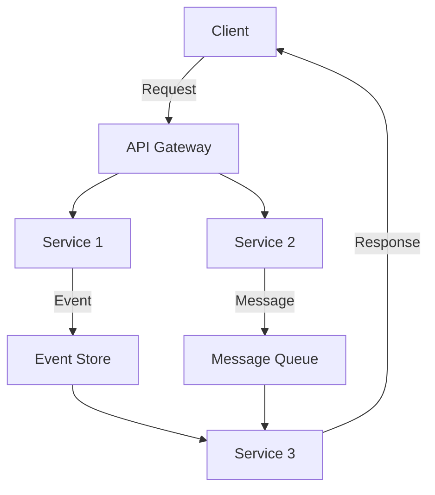

## 11.3 Functional Programming in Microservices

In the evolving landscape of software architecture, microservices have emerged as a popular approach for building scalable and maintainable systems. By decomposing applications into smaller, independent services, microservices enable teams to develop, deploy, and scale components independently. However, managing the complexity of these distributed systems requires careful consideration of design principles, and this is where functional programming can play a transformative role.

### Benefits of Functional Programming in Microservices

Functional programming (FP) offers a paradigm shift in how we approach software design, emphasizing immutability, statelessness, and pure functions. These principles align well with the goals of microservices architecture, providing several benefits:

1. **Immutability**: By promoting immutable data structures, FP reduces the risk of side effects, making services more predictable and easier to debug. In a microservices context, immutability enhances data consistency across distributed systems.

2. **Statelessness**: Stateless services are easier to scale and distribute because they do not rely on local state. FP encourages stateless design by focusing on pure functions that depend only on their input parameters.

3. **Concurrency and Parallelism**: FP's emphasis on immutability and pure functions simplifies concurrent and parallel execution, crucial for microservices that need to handle high volumes of requests.

4. **Modularity and Reusability**: FP promotes modular code through higher-order functions and function composition, allowing microservices to be more reusable and easier to maintain.

5. **Error Handling**: Functional programming languages often provide robust error handling mechanisms, such as monads, which can be leveraged to manage failures gracefully in microservices.

### Immutability and Statelessness in Microservices

Immutability and statelessness are cornerstone principles in functional programming that offer significant advantages when applied to microservices architecture.

#### Immutability

Immutability ensures that once a data structure is created, it cannot be modified. This characteristic is particularly beneficial in microservices for several reasons:

- **Consistency**: Immutable data structures help maintain consistency across distributed systems by preventing unintended modifications.
- **Concurrency**: With immutable data, multiple threads or services can safely read data without the need for locks or synchronization, enhancing performance.
- **Debugging**: Immutable data structures simplify debugging and testing by ensuring that data remains unchanged throughout the execution of a service.

#### Statelessness

Stateless services do not retain any state between requests, which aligns with the functional programming principle of pure functions. Statelessness offers several benefits:

- **Scalability**: Stateless services can be easily replicated and distributed across multiple nodes, improving scalability and fault tolerance.
- **Simplicity**: By eliminating local state, services become simpler and more predictable, reducing the complexity of managing distributed systems.
- **Resilience**: Stateless services are inherently more resilient to failures, as they do not depend on local state that could be lost in case of a crash.

### F# Features for Microservices

F# is a functional-first language on the .NET platform that offers powerful features for building microservices. Let's explore how F# facilitates the creation of stateless and immutable microservices.

#### Code Simplicity and Maintainability

F# emphasizes concise and expressive code, which is crucial for maintaining complex microservices architectures. Key features include:

- **Type Inference**: F#'s strong type inference reduces boilerplate code, making it easier to write and maintain services.
- **Pattern Matching**: Pattern matching allows for elegant handling of complex data structures and control flow, simplifying service logic.
- **Pipelining and Function Composition**: These features enable developers to build complex logic by composing simple functions, enhancing code readability and maintainability.

#### Functional Communication Patterns

In microservices, communication between services is critical. Functional programming offers several patterns that enhance communication:

- **Message Passing**: Instead of shared state, services communicate by passing messages, reducing coupling and enhancing scalability.
- **Event Sourcing**: This pattern involves capturing all changes to an application's state as a sequence of events, providing a reliable audit trail and enabling easy state reconstruction.

### Implementing Stateless Services in F#

Let's explore how to implement a stateless service in F# using functional programming principles.

```fsharp
// Define a simple record type for a request
type Request = {
    Id: int
    Data: string
}

// Define a function to process the request
let processRequest (request: Request) =
    // Simulate processing by returning a response
    { request with Data = request.Data.ToUpper() }

// Example usage
let request = { Id = 1; Data = "hello" }
let response = processRequest request

printfn "Processed Response: %A" response
```

In this example, we define a simple `Request` record type and a `processRequest` function that processes the request. The function is stateless, as it does not rely on any external state and produces a new response based solely on the input request.

### Functional Communication with Message Passing

Message passing is a key communication pattern in microservices, and F# provides powerful constructs to implement it.

```fsharp
// Define a message type
type Message =
    | Request of Request
    | Response of string

// Define a function to handle messages
let handleMessage message =
    match message with
    | Request req -> 
        let response = processRequest req
        Response response.Data
    | Response data ->
        printfn "Received Response: %s" data

// Example usage
let message = Request { Id = 2; Data = "world" }
let responseMessage = handleMessage message

handleMessage responseMessage
```

In this example, we define a `Message` type with two cases: `Request` and `Response`. The `handleMessage` function processes messages using pattern matching, demonstrating a simple message-passing mechanism.

### Event Sourcing in F#

Event sourcing is a powerful pattern for managing state changes in microservices. Let's see how it can be implemented in F#.

```fsharp
// Define an event type
type Event =
    | Created of Request
    | Updated of Request

// Define a function to apply events to a state
let applyEvent state event =
    match event with
    | Created req -> req
    | Updated req -> req

// Define a function to process a sequence of events
let processEvents events =
    events |> List.fold applyEvent { Id = 0; Data = "" }

// Example usage
let events = [
    Created { Id = 1; Data = "initial" }
    Updated { Id = 1; Data = "updated" }
]

let finalState = processEvents events

printfn "Final State: %A" finalState
```

In this example, we define an `Event` type with `Created` and `Updated` cases. The `applyEvent` function applies events to a state, and `processEvents` processes a sequence of events to produce the final state.

### Best Practices for Functional Microservices

When integrating functional programming into microservices design, consider the following best practices:

1. **Embrace Immutability**: Use immutable data structures to enhance consistency and simplify concurrency.

2. **Design Stateless Services**: Focus on stateless service design to improve scalability and resilience.

3. **Leverage F# Features**: Utilize F#'s type inference, pattern matching, and function composition to write concise and maintainable code.

4. **Adopt Functional Communication Patterns**: Implement message passing and event sourcing to enhance communication and state management.

5. **Focus on Error Handling**: Use F#'s robust error handling mechanisms, such as the `Result` type, to manage failures gracefully.

6. **Optimize for Performance**: Consider performance implications when designing services, especially in high-load environments.

### Visualizing Functional Microservices Architecture

To better understand how functional programming principles can be applied to microservices, let's visualize a typical architecture using Mermaid.js.



**Diagram Description**: This diagram illustrates a microservices architecture where a client sends a request to an API Gateway. The gateway routes the request to Service 1 and Service 2. Service 1 emits an event to an Event Store, while Service 2 sends a message to a Message Queue. Service 3 consumes events and messages, processes them, and sends a response back to the client.

### Try It Yourself

Experiment with the code examples provided in this section. Try modifying the `processRequest` function to include additional processing logic or change the message types in the `handleMessage` function. Explore how different event types can be added to the event sourcing example to handle more complex state transitions.

### Knowledge Check

- What are the benefits of using immutability in microservices?
- How does statelessness enhance scalability in distributed systems?
- Describe how F# features like pattern matching and function composition aid in microservices development.
- What are the advantages of using message passing and event sourcing in microservices communication?

### Embrace the Journey

Remember, integrating functional programming principles into microservices is a journey. As you progress, you'll discover new ways to enhance scalability, maintainability, and resilience in your systems. Keep experimenting, stay curious, and enjoy the journey!

## Quiz Time!



### What is a key benefit of immutability in microservices?

- [x] Enhances data consistency across distributed systems
- [ ] Increases the complexity of debugging
- [ ] Requires more memory usage
- [ ] Slows down data processing

> **Explanation:** Immutability ensures that data cannot be modified once created, which helps maintain consistency across distributed systems.

### How does statelessness improve microservices scalability?

- [x] Allows easy replication and distribution across nodes
- [ ] Increases dependency on local state
- [ ] Complicates the service logic
- [ ] Reduces fault tolerance

> **Explanation:** Stateless services can be easily replicated and distributed, improving scalability and fault tolerance.

### Which F# feature helps in writing concise and maintainable code?

- [x] Type Inference
- [ ] Global Variables
- [ ] Manual Memory Management
- [ ] Dynamic Typing

> **Explanation:** F#'s type inference reduces boilerplate code, making it easier to write and maintain services.

### What is a common functional communication pattern in microservices?

- [x] Message Passing
- [ ] Shared State
- [ ] Global Variables
- [ ] Direct Database Access

> **Explanation:** Message passing reduces coupling and enhances scalability by avoiding shared state.

### What is event sourcing?

- [x] Capturing all changes to an application's state as a sequence of events
- [ ] Storing the current state of an application
- [ ] Using global variables to manage state
- [ ] Directly modifying the database

> **Explanation:** Event sourcing involves capturing all changes as events, providing a reliable audit trail and enabling easy state reconstruction.

### Which F# feature simplifies control flow in microservices?

- [x] Pattern Matching
- [ ] Global Variables
- [ ] Manual Memory Management
- [ ] Dynamic Typing

> **Explanation:** Pattern matching allows for elegant handling of complex data structures and control flow.

### What is a benefit of using immutable data structures?

- [x] Simplifies debugging and testing
- [ ] Increases the risk of side effects
- [ ] Requires more synchronization
- [ ] Complicates concurrency

> **Explanation:** Immutable data structures simplify debugging and testing by ensuring data remains unchanged.

### How can message passing enhance microservices communication?

- [x] Reduces coupling and enhances scalability
- [ ] Increases dependency on shared state
- [ ] Complicates service interactions
- [ ] Requires more memory usage

> **Explanation:** Message passing reduces coupling and enhances scalability by avoiding shared state.

### What is a key advantage of using F# for microservices?

- [x] Concise and expressive code
- [ ] Requires more boilerplate code
- [ ] Lacks type safety
- [ ] Complicates error handling

> **Explanation:** F# emphasizes concise and expressive code, crucial for maintaining complex microservices architectures.

### True or False: Stateless services are inherently more resilient to failures.

- [x] True
- [ ] False

> **Explanation:** Stateless services do not depend on local state, making them more resilient to failures.


