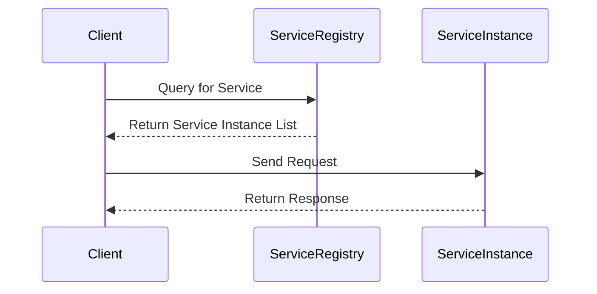

## 11.4 Service Discovery Pattern

In the dynamic world of microservices, where services are constantly being created, destroyed, and moved, the ability to discover services dynamically is crucial. This is where the Service Discovery Pattern comes into play. In this section, we will delve into the Service Discovery Pattern, its importance in a microservices architecture, and how to implement it in F#.

### Understanding the Service Discovery Pattern

Service Discovery is a key component in microservices architecture, enabling services to find and communicate with each other without hard-coding network locations. This pattern is essential for maintaining the flexibility and scalability of microservices.

#### Why is Service Discovery Important?

- **Dynamic Environments**: Microservices often run in dynamic environments where instances are constantly changing due to scaling, failures, or updates.
- **Decoupling Services**: By using service discovery, services can remain decoupled from each other, enhancing modularity and flexibility.
- **Load Balancing**: Service discovery helps in distributing requests evenly across service instances, improving performance and reliability.

### Client-Side vs. Server-Side Service Discovery

Service discovery can be implemented in two primary ways: client-side and server-side. Understanding the differences between these methods is crucial for selecting the right approach for your architecture.

#### Client-Side Service Discovery

In client-side service discovery, the client is responsible for determining the network locations of available service instances and balancing requests across them.

- **How It Works**: The client queries a service registry to get a list of available instances and selects one to send a request.
- **Advantages**: This approach is simple and can be efficient since the client has direct control over the load balancing.
- **Disadvantages**: It can lead to increased complexity on the client-side, requiring additional logic for service discovery and load balancing.

#### Server-Side Service Discovery

In server-side service discovery, the client makes a request to a load balancer, which then queries the service registry and forwards the request to an appropriate service instance.

- **How It Works**: The load balancer acts as an intermediary, handling the discovery and load balancing.
- **Advantages**: This approach offloads the complexity from the client to the server, simplifying client logic.
- **Disadvantages**: It introduces an additional network hop, which can add latency.

### Service Registries and Common Technologies

A service registry is a database of available service instances. It is a critical component of both client-side and server-side service discovery.

#### How Service Registries Work

- **Registration**: Services register themselves with the registry upon startup, providing their network location.
- **Discovery**: Clients or load balancers query the registry to discover available service instances.
- **Health Checks**: The registry periodically checks the health of registered services to ensure they are available.

#### Common Technologies

- **Consul**: A popular service discovery tool that provides service registry, health checking, and more.
- **etcd**: A distributed key-value store used for service discovery and configuration.
- **Zookeeper**: Often used for service discovery, configuration management, and distributed synchronization.

### Implementing Service Discovery in F#

Now that we understand the basics of service discovery, let's explore how to implement it in F#. We will use Consul as our service registry for this example.

#### Setting Up Consul

Before we dive into the F# code, let's set up Consul.

1. **Download and Install Consul**: Follow the instructions on the [Consul website](https://www.consul.io/downloads) to download and install Consul on your machine.
2. **Start Consul Agent**: Run the following command to start a Consul agent in development mode:

   ```bash
   consul agent -dev
   ```

   This command starts Consul in development mode, which is suitable for testing and experimentation.

#### Registering a Service with Consul

Let's start by registering a service with Consul using F#. We'll create a simple HTTP service and register it with Consul.

```fsharp
open System
open System.Net.Http
open System.Threading.Tasks
open Newtonsoft.Json

type ServiceRegistration = {
    ID: string
    Name: string
    Address: string
    Port: int
}

let registerService (service: ServiceRegistration) =
    async {
        use client = new HttpClient()
        let json = JsonConvert.SerializeObject(service)
        let content = new StringContent(json, System.Text.Encoding.UTF8, "application/json")
        let! response = client.PutAsync("http://localhost:8500/v1/agent/service/register", content) |> Async.AwaitTask
        if response.IsSuccessStatusCode then
            printfn "Service registered successfully"
        else
            printfn "Failed to register service: %s" response.ReasonPhrase
    }

let myService = {
    ID = "my-service"
    Name = "MyService"
    Address = "localhost"
    Port = 8080
}

registerService myService |> Async.RunSynchronously
```

**Explanation**:
- We define a `ServiceRegistration` type to represent the service registration data.
- The `registerService` function sends a PUT request to Consul to register the service.
- We create an instance of `ServiceRegistration` for our service and call `registerService`.

#### Discovering Services with Consul

Next, let's discover services registered with Consul.

```fsharp
let discoverService serviceName =
    async {
        use client = new HttpClient()
        let! response = client.GetStringAsync(sprintf "http://localhost:8500/v1/catalog/service/%s" serviceName) |> Async.AwaitTask
        let services = JsonConvert.DeserializeObject<ServiceRegistration[]>(response)
        services |> Array.iter (fun service -> printfn "Discovered service: %s at %s:%d" service.Name service.Address service.Port)
    }

discoverService "MyService" |> Async.RunSynchronously
```

**Explanation**:
- The `discoverService` function queries Consul for services by name.
- We deserialize the response into an array of `ServiceRegistration` and print the discovered services.

### Challenges in Service Discovery

Implementing service discovery comes with its own set of challenges. Let's discuss some common challenges and how to address them.

#### Dynamic Scaling

- **Challenge**: As services scale up and down, the service registry must be updated to reflect the current state.
- **Solution**: Implement automated registration and deregistration of services. Use health checks to ensure only healthy instances are listed.

#### Service Health Checks

- **Challenge**: Services may become unavailable or unhealthy, leading to failed requests.
- **Solution**: Use health checks to monitor service health. Consul supports health checks that can be configured to run periodically.

#### Network Latency

- **Challenge**: Additional network hops in server-side discovery can introduce latency.
- **Solution**: Optimize network paths and use efficient load balancing strategies to minimize latency.

### Best Practices for Service Discovery

To ensure a reliable and efficient service discovery mechanism, consider the following best practices:

- **Automate Registration**: Automate the registration and deregistration of services to ensure the registry is always up-to-date.
- **Use Health Checks**: Implement health checks to monitor the availability and health of services.
- **Optimize Load Balancing**: Choose the right load balancing strategy to distribute requests efficiently.
- **Secure the Registry**: Protect the service registry with authentication and encryption to prevent unauthorized access.
- **Monitor and Log**: Continuously monitor the service discovery process and log relevant events for troubleshooting and analysis.

### Try It Yourself

Now that we've covered the basics of service discovery in F#, try experimenting with the code examples. Here are a few suggestions:

- **Modify the Service Registration**: Change the service details and observe how the registration and discovery processes work.
- **Implement Health Checks**: Add health checks to your service and see how Consul handles unhealthy instances.
- **Explore Other Registries**: Try using etcd or Zookeeper as a service registry and compare their features with Consul.

### Visualizing Service Discovery

To better understand the service discovery process, let's visualize it using a sequence diagram.



**Diagram Description**:
- The client queries the service registry for available service instances.
- The service registry returns a list of instances.
- The client selects an instance and sends a request.
- The service instance processes the request and returns a response.

### Knowledge Check

Before we conclude, let's reinforce what we've learned with a few questions:

- What are the key differences between client-side and server-side service discovery?
- How does a service registry work, and what are some common technologies used?
- What challenges might you face when implementing service discovery, and how can you address them?

### Conclusion

Service discovery is a fundamental pattern in microservices architecture, enabling dynamic and flexible communication between services. By understanding and implementing service discovery in F#, you can build scalable and resilient microservices systems. Remember, this is just the beginning. As you continue to explore and experiment, you'll uncover more advanced techniques and optimizations.

## Quiz Time!



### What is the primary purpose of the Service Discovery pattern in microservices?

- [x] To dynamically discover and communicate with service instances
- [ ] To store and process large amounts of data
- [ ] To manage user authentication and authorization
- [ ] To handle payment transactions

> **Explanation:** The Service Discovery pattern is used to dynamically discover and communicate with service instances in a microservices architecture.

### Which of the following is a key advantage of client-side service discovery?

- [x] Direct control over load balancing
- [ ] Reduced complexity on the client-side
- [ ] Eliminates the need for a service registry
- [ ] Decreases network latency

> **Explanation:** Client-side service discovery allows the client to have direct control over load balancing, although it can increase complexity on the client-side.

### What is a common challenge when implementing service discovery?

- [x] Dynamic scaling of services
- [ ] Storing large volumes of data
- [ ] Implementing user interfaces
- [ ] Designing database schemas

> **Explanation:** Dynamic scaling of services is a common challenge in service discovery, as the registry must be updated to reflect the current state of service instances.

### Which technology is commonly used as a service registry?

- [x] Consul
- [ ] Redis
- [ ] MySQL
- [ ] MongoDB

> **Explanation:** Consul is a popular technology used as a service registry for service discovery.

### What is the role of health checks in service discovery?

- [x] To monitor the availability and health of services
- [ ] To encrypt service communications
- [ ] To manage user sessions
- [ ] To store service data

> **Explanation:** Health checks are used to monitor the availability and health of services, ensuring that only healthy instances are listed in the service registry.

### In server-side service discovery, who is responsible for querying the service registry?

- [x] Load balancer
- [ ] Client
- [ ] Database
- [ ] Service instance

> **Explanation:** In server-side service discovery, the load balancer is responsible for querying the service registry and forwarding requests to service instances.

### What is a disadvantage of server-side service discovery?

- [x] Additional network hop can add latency
- [ ] Increased complexity on the client-side
- [ ] Lack of load balancing control
- [ ] Requires manual service registration

> **Explanation:** Server-side service discovery introduces an additional network hop, which can add latency to the request processing.

### Which of the following is a best practice for service discovery?

- [x] Automate registration and deregistration of services
- [ ] Use manual service registration
- [ ] Disable health checks
- [ ] Store service data in flat files

> **Explanation:** Automating the registration and deregistration of services ensures that the service registry is always up-to-date and reliable.

### What is a benefit of using Consul for service discovery?

- [x] Provides service registry and health checking
- [ ] Eliminates the need for a database
- [ ] Reduces the need for network security
- [ ] Simplifies user authentication

> **Explanation:** Consul provides a service registry and health checking, making it a comprehensive solution for service discovery.

### True or False: Service discovery is only necessary in large-scale microservices architectures.

- [ ] True
- [x] False

> **Explanation:** Service discovery is beneficial in any microservices architecture, regardless of scale, as it enables dynamic and flexible communication between services.


