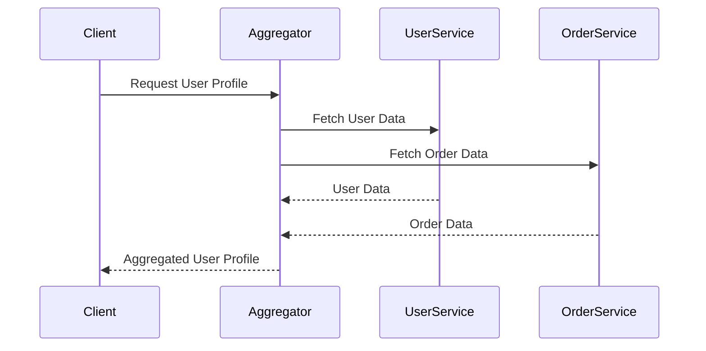

## 11.6 API Composition and Aggregators

In the world of microservices, applications are often composed of multiple services, each responsible for a specific domain or functionality. This architecture promotes scalability and maintainability but also introduces the challenge of efficiently aggregating data from these disparate services. API Composition and Aggregators play a crucial role in addressing this challenge by providing a unified interface to the underlying services. In this section, we will explore the need for API Composition, various strategies to achieve it, and how to implement these strategies in F#.

### The Need for API Composition

As microservices architecture becomes more prevalent, the need to aggregate data from multiple services into a cohesive response becomes critical. Consider a scenario where a client application needs to display a user's profile, which includes data from a user service, an order service, and a recommendation service. Without API Composition, the client would need to make multiple calls to these services, leading to increased complexity and latency.

**Key Benefits of API Composition:**
- **Simplified Client Logic:** By aggregating data at the server level, client applications can focus on rendering the data rather than managing multiple service calls.
- **Reduced Latency:** By minimizing the number of network calls, API Composition can significantly reduce response times.
- **Consistent Data Retrieval:** Ensures that data from various services is retrieved and processed consistently.

### Approaches to API Aggregation

API Aggregation can be achieved through various approaches, each with its own set of advantages and challenges. Let's explore some common strategies:

#### Synchronous Calls

In a synchronous approach, the API Aggregator makes direct calls to the underlying services, waits for their responses, and then composes the final response. This approach is straightforward and easy to implement but can lead to increased latency, especially if one of the services is slow to respond.

**Advantages:**
- Simplicity in implementation.
- Immediate data consistency.

**Challenges:**
- Increased latency due to sequential service calls.
- Potential for cascading failures if one service is unavailable.

#### Asynchronous Messaging

Asynchronous messaging involves using message queues or event streams to aggregate data from multiple services. This approach decouples the aggregator from the services, allowing for more resilient and scalable systems.

**Advantages:**
- Reduced latency through parallel processing.
- Improved resilience and fault tolerance.

**Challenges:**
- Increased complexity in managing message queues.
- Potential for eventual consistency issues.

#### Data Replication

Data replication involves maintaining a local copy of the data needed for aggregation. This approach can significantly reduce latency but requires careful management of data consistency and synchronization.

**Advantages:**
- Minimal latency as data is readily available.
- Reduced dependency on service availability.

**Challenges:**
- Complexity in ensuring data consistency.
- Increased storage requirements.

### Implementing an API Aggregator in F#

Let's explore how to implement an API Aggregator in F# using a combination of synchronous and asynchronous approaches. We'll build a simple aggregator that combines data from a user service and an order service.

#### Synchronous API Aggregator

```fsharp
open System.Net.Http
open System.Threading.Tasks

// Define a type for the aggregated response
type UserProfile = {
    UserId: string
    UserName: string
    Orders: string list
}

// Function to fetch user data
let fetchUserData userId =
    async {
        use client = new HttpClient()
        let! response = client.GetStringAsync(sprintf "http://userservice/api/users/%s" userId) |> Async.AwaitTask
        return response // Assume response is a JSON string
    }

// Function to fetch order data
let fetchOrderData userId =
    async {
        use client = new HttpClient()
        let! response = client.GetStringAsync(sprintf "http://orderservice/api/orders/%s" userId) |> Async.AwaitTask
        return response // Assume response is a JSON string
    }

// Function to aggregate data
let aggregateUserProfile userId =
    async {
        let! userData = fetchUserData userId
        let! orderData = fetchOrderData userId
        // Parse JSON and create UserProfile (parsing omitted for brevity)
        return { UserId = userId; UserName = userData; Orders = [orderData] }
    }

// Example usage
let userId = "12345"
let userProfileTask = aggregateUserProfile userId |> Async.StartAsTask
userProfileTask.Wait()
printfn "User Profile: %A" userProfileTask.Result
```

**Explanation:**
- We define a `UserProfile` type to represent the aggregated data.
- The `fetchUserData` and `fetchOrderData` functions asynchronously fetch data from the respective services.
- The `aggregateUserProfile` function combines the data into a `UserProfile` object.

#### Asynchronous API Aggregator with Parallel Processing

To improve performance, we can modify the aggregator to fetch data in parallel:

```fsharp
let aggregateUserProfileParallel userId =
    async {
        let userTask = fetchUserData userId
        let orderTask = fetchOrderData userId
        let! userData, orderData = Async.Parallel [userTask; orderTask]
        // Parse JSON and create UserProfile (parsing omitted for brevity)
        return { UserId = userId; UserName = userData; Orders = [orderData] }
    }

// Example usage
let userProfileParallelTask = aggregateUserProfileParallel userId |> Async.StartAsTask
userProfileParallelTask.Wait()
printfn "User Profile (Parallel): %A" userProfileParallelTask.Result
```

**Key Points:**
- We use `Async.Parallel` to execute the data fetching tasks concurrently.
- This approach can significantly reduce the overall latency of the aggregation process.

### Challenges in API Aggregation

While API Aggregation offers numerous benefits, it also presents several challenges that must be addressed:

#### Latency

Latency can be a significant concern, especially when aggregating data from multiple services. To mitigate this, consider the following strategies:
- **Parallel Processing:** As demonstrated in the code examples, fetching data in parallel can reduce response times.
- **Caching:** Implement caching mechanisms to store frequently accessed data and reduce the need for repeated service calls.

#### Error Handling and Partial Failures

When aggregating data from multiple services, it's crucial to handle errors gracefully and provide meaningful responses even when some services fail.

**Strategies for Error Handling:**
- **Fallback Mechanisms:** Implement fallback strategies to provide default values or cached data when a service is unavailable.
- **Partial Responses:** Design the aggregator to return partial responses with error information for failed services.

#### Data Consistency

Ensuring data consistency across services can be challenging, especially in asynchronous or replicated scenarios. Consider the following approaches:
- **Versioning:** Use versioning to manage changes in service contracts and data formats.
- **Eventual Consistency:** Embrace eventual consistency where appropriate, and design the system to handle temporary inconsistencies.

### Best Practices for Efficient API Composition

To ensure efficient and reliable API Composition, consider the following best practices:

- **Design for Scalability:** Use asynchronous processing and parallelism to handle increased load and improve performance.
- **Implement Caching:** Use caching to reduce the need for repeated service calls and improve response times.
- **Monitor Performance:** Continuously monitor the performance of the aggregator and underlying services to identify and address bottlenecks.
- **Use Circuit Breakers:** Implement circuit breakers to prevent cascading failures and improve system resilience.

### Tools and Libraries for API Composition in F#

F# offers several tools and libraries that can assist in building efficient API compositions:

- **FSharp.Data:** Provides easy access to JSON, XML, and CSV data, simplifying data parsing and manipulation.
- **Hopac:** A high-performance concurrency library that can be used to implement efficient parallel processing and asynchronous workflows.
- **FsHttp:** A lightweight HTTP client library for F# that simplifies making HTTP requests and handling responses.

### Visualizing API Composition

To better understand the flow of data in an API Composition scenario, let's visualize the process using a sequence diagram:



**Diagram Explanation:**
- The client sends a request to the aggregator for a user profile.
- The aggregator concurrently fetches data from the user service and order service.
- Once the data is retrieved, the aggregator composes the final response and sends it back to the client.

### Try It Yourself

To deepen your understanding of API Composition, try modifying the code examples provided:
- **Add a New Service:** Extend the aggregator to include data from an additional service, such as a recommendation service.
- **Implement Caching:** Introduce caching to store user profiles and reduce the need for repeated service calls.
- **Handle Partial Failures:** Modify the aggregator to return partial responses when one of the services fails.

### Conclusion

API Composition and Aggregators are essential components of modern microservices architecture, enabling efficient data retrieval and integration from multiple services. By understanding the various approaches to API aggregation and implementing best practices, you can build robust and scalable systems that deliver a seamless experience to clients. Remember, this is just the beginning. As you progress, you'll build more complex and interactive systems. Keep experimenting, stay curious, and enjoy the journey!

## Quiz Time!



### What is the primary benefit of API Composition in microservices architecture?

- [x] Simplifies client logic by aggregating data at the server level.
- [ ] Increases the number of network calls.
- [ ] Decreases data consistency.
- [ ] Complicates the client application.

> **Explanation:** API Composition simplifies client logic by aggregating data at the server level, reducing the need for the client to manage multiple service calls.

### Which approach to API aggregation involves using message queues or event streams?

- [ ] Synchronous Calls
- [x] Asynchronous Messaging
- [ ] Data Replication
- [ ] Direct Database Access

> **Explanation:** Asynchronous Messaging involves using message queues or event streams to aggregate data from multiple services, allowing for more resilient and scalable systems.

### What is a potential challenge of using synchronous calls for API aggregation?

- [ ] Reduced latency
- [x] Increased latency due to sequential service calls
- [ ] Immediate data consistency
- [ ] Simplified error handling

> **Explanation:** Synchronous calls can lead to increased latency because the aggregator waits for each service to respond sequentially.

### How can parallel processing improve the performance of an API Aggregator?

- [x] By executing data fetching tasks concurrently
- [ ] By increasing the number of sequential calls
- [ ] By reducing the number of services involved
- [ ] By simplifying the aggregator logic

> **Explanation:** Parallel processing improves performance by executing data fetching tasks concurrently, reducing the overall latency of the aggregation process.

### What is a common strategy for handling partial failures in API Aggregation?

- [ ] Ignoring the failure and returning an error
- [x] Implementing fallback mechanisms or returning partial responses
- [ ] Increasing the number of retries
- [ ] Disabling the affected service

> **Explanation:** Implementing fallback mechanisms or returning partial responses allows the aggregator to handle partial failures gracefully and provide meaningful responses.

### Which tool or library can assist in building efficient API compositions in F#?

- [x] FSharp.Data
- [ ] JavaScript
- [ ] SQL Server
- [ ] HTML

> **Explanation:** FSharp.Data provides easy access to JSON, XML, and CSV data, simplifying data parsing and manipulation in F#.

### What is a key advantage of using data replication for API Aggregation?

- [x] Minimal latency as data is readily available
- [ ] Increased dependency on service availability
- [ ] Simplified data consistency management
- [ ] Reduced storage requirements

> **Explanation:** Data replication provides minimal latency because the data is readily available, reducing the need for repeated service calls.

### How can caching improve the performance of an API Aggregator?

- [x] By storing frequently accessed data and reducing repeated service calls
- [ ] By increasing the number of service calls
- [ ] By complicating the aggregator logic
- [ ] By reducing data consistency

> **Explanation:** Caching improves performance by storing frequently accessed data, reducing the need for repeated service calls and improving response times.

### What is the role of circuit breakers in API Aggregation?

- [x] To prevent cascading failures and improve system resilience
- [ ] To increase the number of service calls
- [ ] To simplify the aggregator logic
- [ ] To reduce data consistency

> **Explanation:** Circuit breakers prevent cascading failures by temporarily halting requests to a failing service, improving system resilience.

### True or False: API Composition can reduce the complexity of client applications by aggregating data at the server level.

- [x] True
- [ ] False

> **Explanation:** True. API Composition reduces the complexity of client applications by aggregating data at the server level, allowing clients to focus on rendering the data.


