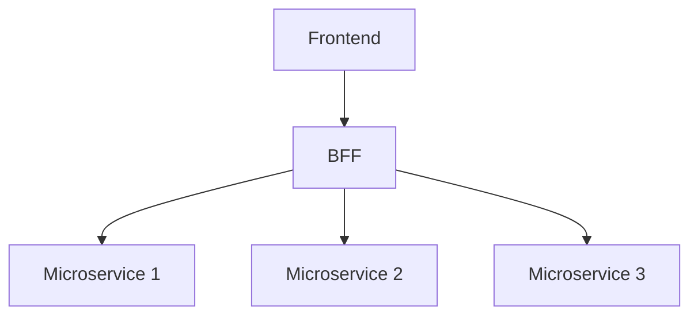

## 11.7 Backend for Frontend (BFF) Pattern

In the world of microservices and modern web applications, the Backend for Frontend (BFF) pattern has emerged as a powerful architectural approach to tailor backend services to the specific needs of different frontends. This section delves into the BFF pattern, its benefits, and how to effectively design and implement BFF services in F#. We will explore scenarios where BFFs are particularly beneficial, provide guidelines for designing BFFs in F#, and include examples or case studies of BFF implementations using F#. Additionally, we will discuss how BFFs interact with underlying microservices, considerations for maintaining multiple BFFs, and strategies for testing and securing BFF services.

### Understanding the Backend for Frontend (BFF) Pattern

The Backend for Frontend (BFF) pattern is an architectural pattern that involves creating separate backend services for different types of frontends, such as web, mobile, or desktop applications. Each BFF is specifically designed to meet the unique requirements of its corresponding frontend, providing a tailored API that simplifies frontend development and enhances performance.

#### Key Characteristics of the BFF Pattern

- **Frontend-Specific Logic**: Each BFF encapsulates logic specific to its frontend, such as data aggregation, transformation, and formatting.
- **Decoupled Architecture**: BFFs enable a decoupled architecture where frontends and backends can evolve independently.
- **Optimized Performance**: By providing tailored APIs, BFFs can reduce the amount of data transferred and minimize round trips, improving performance.
- **Simplified Frontend Development**: Frontend developers can work with APIs that are specifically designed for their needs, reducing complexity and improving productivity.

#### Scenarios Where BFFs Are Beneficial

BFFs are particularly beneficial in scenarios where different frontends have distinct requirements. For example:

- **Device-Specific Needs**: Mobile applications may require different data formats or reduced data payloads compared to web applications.
- **Performance Optimization**: BFFs can aggregate data from multiple microservices, reducing the number of API calls required by the frontend.
- **UI/UX Customization**: Different frontends may require different data structures or content to optimize the user experience.

### Designing BFFs in F#

When designing BFFs in F#, it's essential to consider how to handle client-specific logic and ensure seamless integration with underlying microservices. Here are some guidelines to help you design effective BFFs in F#.

#### Handling Client-Specific Logic

1. **Data Aggregation and Transformation**: Implement functions that aggregate and transform data from multiple microservices to meet the needs of the frontend. Use F#'s powerful data manipulation capabilities to simplify these operations.

2. **Custom Endpoints**: Define custom endpoints that expose the specific data and functionality required by the frontend. Use F#'s type system to ensure type safety and consistency.

3. **Caching and State Management**: Implement caching strategies to reduce latency and improve performance. Use F#'s immutable data structures to manage state efficiently.

#### Example: Implementing a BFF in F#

Let's consider a simple example of implementing a BFF in F# for a mobile application. This BFF aggregates data from multiple microservices and exposes a tailored API for the mobile frontend.

```fsharp
open System
open System.Net.Http
open Newtonsoft.Json

type UserProfile = {
    UserId: string
    Name: string
    Email: string
    Preferences: string list
}

type OrderHistory = {
    OrderId: string
    Date: DateTime
    Items: string list
}

type MobileUserData = {
    Profile: UserProfile
    Orders: OrderHistory list
}

let getUserProfile userId =
    async {
        // Simulate fetching user profile from a microservice
        return { UserId = userId; Name = "John Doe"; Email = "john.doe@example.com"; Preferences = ["DarkMode"; "Notifications"] }
    }

let getOrderHistory userId =
    async {
        // Simulate fetching order history from a microservice
        return [
            { OrderId = "123"; Date = DateTime.Now.AddDays(-10.0); Items = ["Item1"; "Item2"] }
            { OrderId = "124"; Date = DateTime.Now.AddDays(-5.0); Items = ["Item3"] }
        ]
    }

let getMobileUserData userId =
    async {
        let! profile = getUserProfile userId
        let! orders = getOrderHistory userId
        return { Profile = profile; Orders = orders }
    }

// Example usage
let userId = "user-123"
let mobileUserData = getMobileUserData userId |> Async.RunSynchronously
printfn "Mobile User Data: %A" mobileUserData
```

In this example, we define a BFF that fetches user profile and order history data from two separate microservices and aggregates them into a single `MobileUserData` object. This object is then exposed to the mobile frontend, providing a tailored API that meets its specific needs.

### Interacting with Underlying Microservices

BFFs act as intermediaries between frontends and underlying microservices. They are responsible for aggregating data, handling client-specific logic, and exposing tailored APIs. Here's how BFFs interact with microservices:

1. **Data Aggregation**: BFFs aggregate data from multiple microservices, reducing the number of API calls required by the frontend.

2. **Data Transformation**: BFFs transform data into the format required by the frontend, simplifying frontend development.

3. **API Gateway**: BFFs can act as an API gateway, providing a single entry point for frontend requests and routing them to the appropriate microservices.

#### Visualizing BFF Interaction with Microservices



In this diagram, the frontend communicates with the BFF, which in turn interacts with multiple microservices to aggregate and transform data before returning it to the frontend.

### Maintaining Multiple BFFs

When maintaining multiple BFFs, it's important to avoid code duplication and ensure consistency across different BFF implementations. Here are some strategies to consider:

1. **Shared Libraries**: Use shared libraries to encapsulate common logic and functionality that can be reused across different BFFs.

2. **Consistent API Design**: Ensure consistent API design across different BFFs to provide a uniform experience for frontend developers.

3. **Automated Testing**: Implement automated testing to ensure the correctness and reliability of BFF services. Use F#'s testing frameworks to write unit and integration tests.

### Testing and Securing BFF Services

Testing and securing BFF services are critical to ensuring their reliability and protecting sensitive data. Here are some strategies to consider:

1. **Unit and Integration Testing**: Write unit tests to verify the correctness of individual functions and integration tests to ensure the proper interaction between BFFs and microservices.

2. **Security Best Practices**: Implement security best practices, such as input validation, authentication, and authorization, to protect BFF services from common vulnerabilities.

3. **Monitoring and Logging**: Implement monitoring and logging to track the performance and usage of BFF services. Use logging frameworks to capture and analyze logs.

### Case Study: BFF Implementation for an E-Commerce Platform

Let's consider a case study of implementing a BFF for an e-commerce platform. The platform has separate frontends for web and mobile applications, each with distinct requirements.

#### Web BFF

The web BFF aggregates data from multiple microservices, such as product catalog, user profiles, and order history, and exposes a tailored API for the web frontend.

```fsharp
open System
open System.Net.Http
open Newtonsoft.Json

type WebProduct = {
    ProductId: string
    Name: string
    Price: decimal
    Description: string
}

type WebUserProfile = {
    UserId: string
    Name: string
    Email: string
}

type WebOrderHistory = {
    OrderId: string
    Date: DateTime
    TotalAmount: decimal
}

type WebUserData = {
    Profile: WebUserProfile
    Orders: WebOrderHistory list
    Products: WebProduct list
}

let getWebUserProfile userId =
    async {
        // Simulate fetching user profile from a microservice
        return { UserId = userId; Name = "Jane Doe"; Email = "jane.doe@example.com" }
    }

let getWebOrderHistory userId =
    async {
        // Simulate fetching order history from a microservice
        return [
            { OrderId = "125"; Date = DateTime.Now.AddDays(-15.0); TotalAmount = 150.0M }
            { OrderId = "126"; Date = DateTime.Now.AddDays(-7.0); TotalAmount = 75.0M }
        ]
    }

let getWebProducts =
    async {
        // Simulate fetching product catalog from a microservice
        return [
            { ProductId = "P001"; Name = "Laptop"; Price = 999.99M; Description = "High-performance laptop" }
            { ProductId = "P002"; Name = "Smartphone"; Price = 499.99M; Description = "Latest model smartphone" }
        ]
    }

let getWebUserData userId =
    async {
        let! profile = getWebUserProfile userId
        let! orders = getWebOrderHistory userId
        let! products = getWebProducts
        return { Profile = profile; Orders = orders; Products = products }
    }

// Example usage
let webUserId = "user-456"
let webUserData = getWebUserData webUserId |> Async.RunSynchronously
printfn "Web User Data: %A" webUserData
```

#### Mobile BFF

The mobile BFF focuses on providing a lightweight API with reduced data payloads, optimized for mobile devices.

```fsharp
open System
open System.Net.Http
open Newtonsoft.Json

type MobileProduct = {
    ProductId: string
    Name: string
    Price: decimal
}

type MobileUserProfile = {
    UserId: string
    Name: string
}

type MobileOrderHistory = {
    OrderId: string
    Date: DateTime
}

type MobileUserData = {
    Profile: MobileUserProfile
    Orders: MobileOrderHistory list
    Products: MobileProduct list
}

let getMobileUserProfile userId =
    async {
        // Simulate fetching user profile from a microservice
        return { UserId = userId; Name = "John Smith" }
    }

let getMobileOrderHistory userId =
    async {
        // Simulate fetching order history from a microservice
        return [
            { OrderId = "127"; Date = DateTime.Now.AddDays(-20.0) }
            { OrderId = "128"; Date = DateTime.Now.AddDays(-10.0) }
        ]
    }

let getMobileProducts =
    async {
        // Simulate fetching product catalog from a microservice
        return [
            { ProductId = "P003"; Name = "Tablet"; Price = 299.99M }
            { ProductId = "P004"; Name = "Headphones"; Price = 99.99M }
        ]
    }

let getMobileUserData userId =
    async {
        let! profile = getMobileUserProfile userId
        let! orders = getMobileOrderHistory userId
        let! products = getMobileProducts
        return { Profile = profile; Orders = orders; Products = products }
    }

// Example usage
let mobileUserId = "user-789"
let mobileUserData = getMobileUserData mobileUserId |> Async.RunSynchronously
printfn "Mobile User Data: %A" mobileUserData
```

### Conclusion

The Backend for Frontend (BFF) pattern is a powerful architectural approach that enables the creation of tailored backend services for different frontends. By encapsulating frontend-specific logic and providing optimized APIs, BFFs simplify frontend development, improve performance, and support diverse device requirements. In F#, the BFF pattern can be effectively implemented using the language's functional programming capabilities, enabling efficient data aggregation, transformation, and state management.

As you explore the BFF pattern, remember to consider the unique requirements of each frontend, leverage shared libraries to avoid code duplication, and implement robust testing and security practices to ensure the reliability and security of your BFF services. By embracing the BFF pattern, you can create scalable and maintainable applications that deliver exceptional user experiences across different devices and platforms.

### Try It Yourself

Experiment with the provided code examples by modifying the data structures or adding new endpoints to see how the BFF pattern can be adapted to different scenarios. Consider implementing caching strategies or integrating additional microservices to further enhance the functionality of your BFF services.

## Quiz Time!



### What is the primary purpose of the Backend for Frontend (BFF) pattern?

- [x] To tailor backend services to the specific needs of different frontends.
- [ ] To replace all microservices with a single backend service.
- [ ] To eliminate the need for frontend development.
- [ ] To standardize all APIs across different frontends.

> **Explanation:** The BFF pattern is designed to create backend services that are specifically tailored to the needs of different frontends, such as web or mobile applications.

### In which scenario is the BFF pattern particularly beneficial?

- [x] When different frontends have distinct requirements.
- [ ] When all frontends use the same data format.
- [ ] When there is only one type of frontend.
- [ ] When backend services are monolithic.

> **Explanation:** The BFF pattern is beneficial when different frontends, such as web and mobile applications, have distinct requirements and need tailored APIs.

### How do BFFs interact with underlying microservices?

- [x] By aggregating data from multiple microservices.
- [ ] By replacing microservices with a single service.
- [ ] By directly exposing microservices to the frontend.
- [ ] By eliminating the need for microservices.

> **Explanation:** BFFs aggregate data from multiple microservices, transforming it to meet the specific needs of the frontend.

### What is a key benefit of using BFFs?

- [x] Simplified frontend development.
- [ ] Increased complexity in backend services.
- [ ] Reduced performance for frontends.
- [ ] Standardized data formats for all frontends.

> **Explanation:** BFFs simplify frontend development by providing tailored APIs that meet the specific needs of each frontend.

### What strategy can be used to avoid code duplication in multiple BFFs?

- [x] Use shared libraries for common logic.
- [ ] Write unique code for each BFF.
- [ ] Avoid using libraries altogether.
- [ ] Use monolithic backend services.

> **Explanation:** Shared libraries can encapsulate common logic and functionality, reducing code duplication across different BFFs.

### What is an important consideration when testing BFF services?

- [x] Implementing unit and integration tests.
- [ ] Avoiding any form of testing.
- [ ] Only testing the frontend.
- [ ] Relying solely on manual testing.

> **Explanation:** Unit and integration tests are crucial for verifying the correctness and reliability of BFF services.

### How can BFFs improve performance for frontends?

- [x] By reducing the amount of data transferred and minimizing round trips.
- [ ] By increasing the number of API calls required.
- [ ] By providing generic APIs that fit all frontends.
- [ ] By eliminating the need for caching.

> **Explanation:** BFFs improve performance by providing tailored APIs that reduce data transfer and minimize round trips.

### What is a common security practice for BFF services?

- [x] Implementing input validation, authentication, and authorization.
- [ ] Allowing unrestricted access to all APIs.
- [ ] Disabling security features for simplicity.
- [ ] Relying on frontend security measures only.

> **Explanation:** Implementing input validation, authentication, and authorization are essential security practices for protecting BFF services.

### Which of the following is a characteristic of BFFs?

- [x] Frontend-specific logic encapsulation.
- [ ] Backend-specific logic encapsulation.
- [ ] Eliminating the need for microservices.
- [ ] Standardizing all APIs for different frontends.

> **Explanation:** BFFs encapsulate frontend-specific logic, providing tailored APIs for different frontends.

### True or False: BFFs can act as an API gateway for frontend requests.

- [x] True
- [ ] False

> **Explanation:** BFFs can act as an API gateway, providing a single entry point for frontend requests and routing them to the appropriate microservices.


