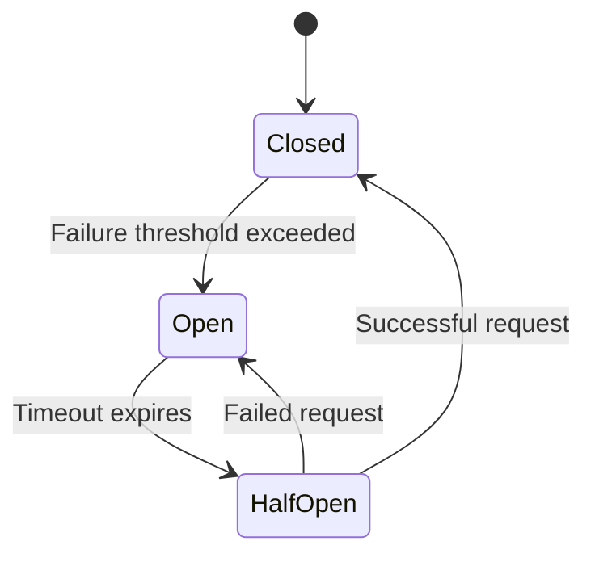

## 11.8 Circuit Breaker Pattern

In the world of microservices, where systems are composed of numerous interconnected services, handling failures gracefully is crucial to maintaining system resilience. The Circuit Breaker pattern is a powerful design pattern that helps prevent cascading failures and improves the overall robustness of microservices architectures. In this section, we will delve into the Circuit Breaker pattern, explore its states and transitions, and provide guidance on implementing it in F#.

### Understanding the Circuit Breaker Pattern

The Circuit Breaker pattern is inspired by electrical circuit breakers that protect electrical circuits from damage caused by overload or short circuits. Similarly, in software systems, a circuit breaker monitors service calls and temporarily halts requests to a service that is likely to fail, allowing the system to recover.

#### States of a Circuit Breaker

A Circuit Breaker typically has three states:

1. **Closed**: In the Closed state, requests are allowed to pass through to the service. If the service call fails, the failure count is incremented. Once the failure count exceeds a predefined threshold, the circuit breaker transitions to the Open state.

2. **Open**: In the Open state, requests are immediately blocked and fail fast without reaching the service. This state allows the system to avoid repeated failed calls, giving the service time to recover. After a specified timeout period, the circuit breaker transitions to the Half-Open state.

3. **Half-Open**: In the Half-Open state, a limited number of requests are allowed to pass through to the service. If these requests succeed, the circuit breaker transitions back to the Closed state. If they fail, the circuit breaker returns to the Open state.



### Benefits of the Circuit Breaker Pattern

The Circuit Breaker pattern offers several benefits:

- **Prevents Cascading Failures**: By halting requests to a failing service, the pattern prevents failures from propagating through the system.
- **Improves System Resilience**: It allows services to recover without overwhelming them with requests.
- **Reduces Latency**: Failed requests are blocked quickly, reducing the time spent waiting for responses from failing services.

### Implementing Circuit Breakers in F#

Implementing a Circuit Breaker in F# can be achieved using libraries like Polly, which provides resilience and transient-fault-handling capabilities. Polly is a .NET library that can be used in F# projects to implement retry policies, circuit breakers, and more.

#### Setting Up Polly in F#

To use Polly in an F# project, you need to add the Polly NuGet package. You can do this by running the following command in the Package Manager Console:

```shell
Install-Package Polly
```

#### Basic Circuit Breaker Implementation

Let's implement a simple Circuit Breaker using Polly in F#. We'll create a function that simulates a service call and apply a Circuit Breaker policy to it.

```fsharp
open System
open Polly
open Polly.CircuitBreaker

// Simulate a service call that may fail
let serviceCall() =
    let rnd = Random()
    if rnd.Next(1, 4) = 1 then
        failwith "Service call failed"
    else
        printfn "Service call succeeded"

// Define a Circuit Breaker policy
let circuitBreakerPolicy = Policy
    .Handle<Exception>()
    .CircuitBreaker(2, TimeSpan.FromSeconds(5.0))

// Execute the service call with Circuit Breaker
let executeWithCircuitBreaker() =
    try
        circuitBreakerPolicy.Execute(fun () -> serviceCall())
    with
    | :? BrokenCircuitException ->
        printfn "Circuit is open. Request blocked."
    | ex ->
        printfn "An error occurred: %s" ex.Message

// Test the Circuit Breaker
for _ in 1..10 do
    executeWithCircuitBreaker()
    System.Threading.Thread.Sleep(1000)
```

In this example, we define a Circuit Breaker policy that trips after two consecutive failures and remains open for five seconds. The `serviceCall` function simulates a service call that randomly fails. The `executeWithCircuitBreaker` function executes the service call with the Circuit Breaker policy applied.

### Configuration Options

When configuring a Circuit Breaker, several options can be adjusted to suit your application's needs:

- **Failure Threshold**: The number of consecutive failures required to trip the Circuit Breaker.
- **Reset Timeout**: The duration the Circuit Breaker remains open before transitioning to the Half-Open state.
- **Success Threshold**: The number of successful requests needed in the Half-Open state to transition back to the Closed state.

These parameters can be fine-tuned based on the specific requirements of your system and the behavior of the services you are interacting with.

### Monitoring and Reacting to Circuit Breaker Metrics

Monitoring Circuit Breaker metrics is essential for understanding the health of your services and the effectiveness of the Circuit Breaker pattern. By tracking metrics such as the number of open circuits, failure rates, and recovery times, you can gain insights into potential issues and adjust configurations as needed.

#### Integrating Monitoring Tools

Consider integrating monitoring tools like Prometheus or Grafana to visualize Circuit Breaker metrics. These tools can help you set up alerts for when circuits open or close, allowing you to react promptly to service failures.

### Best Practices for Integrating Circuit Breakers

When integrating Circuit Breakers into an existing codebase, consider the following best practices:

- **Start with Critical Services**: Apply Circuit Breakers to services that are critical to your application's functionality.
- **Gradual Rollout**: Introduce Circuit Breakers gradually, starting with non-critical paths, to minimize disruptions.
- **Combine with Other Patterns**: Use Circuit Breakers in conjunction with other resilience patterns, such as retries and timeouts, for comprehensive fault handling.
- **Test and Monitor**: Regularly test Circuit Breaker configurations and monitor their impact on system performance.

### Try It Yourself

Experiment with the provided code example by modifying the failure threshold, reset timeout, and success threshold. Observe how these changes affect the behavior of the Circuit Breaker and the overall resilience of the system.

### Conclusion

The Circuit Breaker pattern is a vital tool in building resilient microservices architectures. By preventing cascading failures and allowing services to recover gracefully, it enhances the robustness of your systems. Implementing Circuit Breakers in F# using libraries like Polly is straightforward and provides a powerful mechanism for handling transient faults.

Remember, this is just the beginning. As you progress, you'll build more complex and resilient systems. Keep experimenting, stay curious, and enjoy the journey!

## Quiz Time!



### What is the primary purpose of the Circuit Breaker pattern?

- [x] To prevent cascading failures in microservices
- [ ] To improve database performance
- [ ] To enhance user interface design
- [ ] To optimize network bandwidth

> **Explanation:** The Circuit Breaker pattern is designed to prevent cascading failures by temporarily halting requests to a failing service.

### Which state does a Circuit Breaker transition to after the failure threshold is exceeded?

- [ ] Half-Open
- [x] Open
- [ ] Closed
- [ ] Reset

> **Explanation:** Once the failure threshold is exceeded, the Circuit Breaker transitions to the Open state to block further requests.

### What library can be used in F# to implement Circuit Breakers?

- [ ] Newtonsoft.Json
- [x] Polly
- [ ] Serilog
- [ ] Dapper

> **Explanation:** Polly is a .NET library that provides resilience and transient-fault-handling capabilities, including Circuit Breakers.

### In which state does a Circuit Breaker allow a limited number of requests to pass through?

- [ ] Closed
- [ ] Open
- [x] Half-Open
- [ ] Reset

> **Explanation:** In the Half-Open state, a Circuit Breaker allows a limited number of requests to test if the service has recovered.

### What is the benefit of using a Circuit Breaker pattern?

- [x] Reduces latency by blocking failed requests quickly
- [ ] Increases memory usage
- [ ] Decreases code readability
- [ ] Complicates error handling

> **Explanation:** By blocking failed requests quickly, the Circuit Breaker pattern reduces latency and improves system performance.

### Which of the following is a configuration option for a Circuit Breaker?

- [x] Failure Threshold
- [x] Reset Timeout
- [ ] Database Connection String
- [ ] User Authentication Method

> **Explanation:** Failure Threshold and Reset Timeout are configuration options for a Circuit Breaker, allowing customization of its behavior.

### How can you monitor Circuit Breaker metrics effectively?

- [x] Integrate with tools like Prometheus or Grafana
- [ ] Use a text editor
- [ ] Rely solely on console logs
- [ ] Manually check service status

> **Explanation:** Integrating with monitoring tools like Prometheus or Grafana provides visual insights into Circuit Breaker metrics.

### What should you consider when integrating Circuit Breakers into an existing codebase?

- [x] Start with critical services
- [x] Gradual rollout
- [ ] Ignore monitoring
- [ ] Apply to all services at once

> **Explanation:** Starting with critical services and gradually rolling out Circuit Breakers helps minimize disruptions and ensures effective integration.

### True or False: Circuit Breakers can be used in conjunction with other resilience patterns.

- [x] True
- [ ] False

> **Explanation:** Circuit Breakers can be combined with other resilience patterns, such as retries and timeouts, for comprehensive fault handling.

### What is the role of the Half-Open state in a Circuit Breaker?

- [x] To test if the service has recovered by allowing limited requests
- [ ] To permanently block all requests
- [ ] To reset the failure count immediately
- [ ] To increase the failure threshold

> **Explanation:** The Half-Open state allows limited requests to test if the service has recovered before transitioning back to the Closed state.


