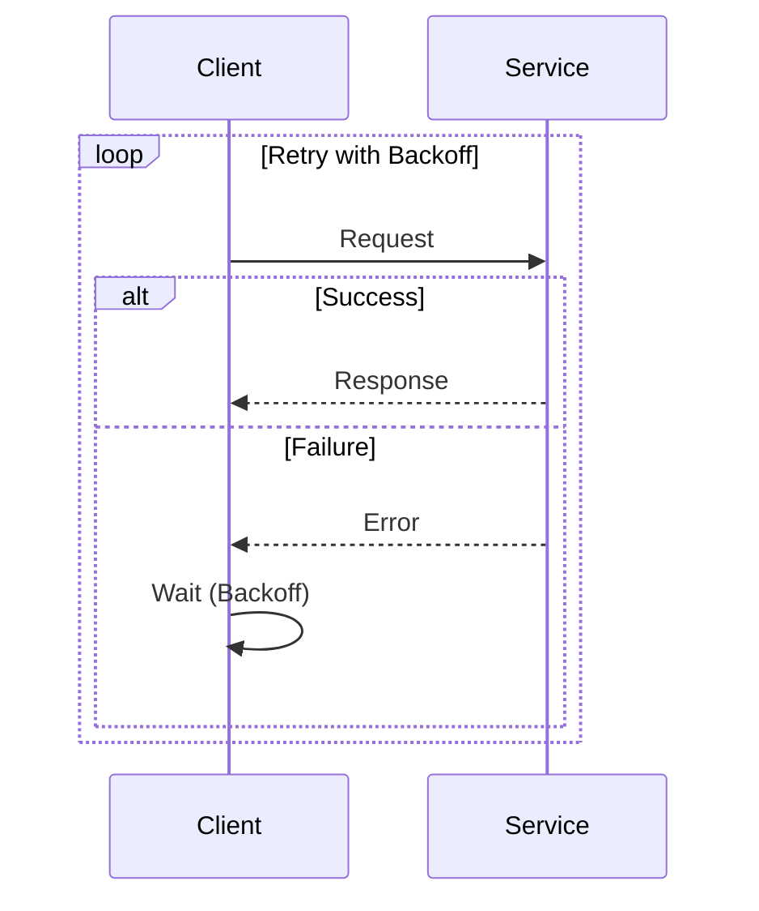

## 11.9 Retry and Backoff Patterns

In the world of microservices, where systems are distributed and network reliability can be unpredictable, handling transient faults gracefully is crucial. Retry and Backoff Patterns are essential strategies that help maintain the resilience and robustness of your applications. In this section, we will delve into these patterns, explore different backoff strategies, and demonstrate how to implement them effectively in F#.

### Understanding Retry and Backoff Patterns

**Retry Pattern** is a strategy used to handle transient failures by re-executing a failed operation. Transient faults are temporary and often resolve themselves, such as network timeouts or temporary unavailability of a service. By retrying the operation, you allow the system to recover without manual intervention.

**Backoff Pattern** complements the Retry Pattern by introducing a delay between retries. This delay helps prevent overwhelming the system or service, especially when dealing with high-load scenarios or when multiple clients are retrying simultaneously.

#### Key Concepts

- **Transient Faults**: Temporary issues that usually resolve themselves, such as network glitches or temporary service unavailability.
- **Retry Logic**: The mechanism to reattempt a failed operation.
- **Backoff Strategies**: Techniques to introduce delays between retries to avoid system overload.

### Backoff Strategies

There are several backoff strategies to consider when implementing retry logic:

1. **Fixed Backoff**: A constant delay between retries.
2. **Incremental Backoff**: Increasing delay with each retry attempt.
3. **Exponential Backoff**: Exponentially increasing delay, often with a random jitter to avoid synchronized retries (thundering herd problem).

#### Fixed Backoff

Fixed backoff is the simplest strategy, where a constant delay is applied between retries. This is useful for operations that have a predictable recovery time.

```fsharp
let retryWithFixedBackoff operation maxRetries delay =
    let rec retry attempt =
        if attempt > maxRetries then
            failwith "Operation failed after maximum retries"
        else
            try
                operation()
            with
            | ex ->
                printfn "Attempt %d failed: %s" attempt ex.Message
                System.Threading.Thread.Sleep(delay)
                retry (attempt + 1)
    retry 1
```

#### Incremental Backoff

Incremental backoff increases the delay linearly with each retry attempt. This can be useful when the recovery time is expected to increase gradually.

```fsharp
let retryWithIncrementalBackoff operation maxRetries initialDelay =
    let rec retry attempt delay =
        if attempt > maxRetries then
            failwith "Operation failed after maximum retries"
        else
            try
                operation()
            with
            | ex ->
                printfn "Attempt %d failed: %s" attempt ex.Message
                System.Threading.Thread.Sleep(delay)
                retry (attempt + 1) (delay + initialDelay)
    retry 1 initialDelay
```

#### Exponential Backoff with Jitter

Exponential backoff is a more sophisticated strategy where the delay increases exponentially. Adding jitter (randomness) helps prevent the thundering herd problem, where many clients retry at the same time.

```fsharp
let random = System.Random()

let retryWithExponentialBackoff operation maxRetries initialDelay maxDelay =
    let rec retry attempt =
        if attempt > maxRetries then
            failwith "Operation failed after maximum retries"
        else
            try
                operation()
            with
            | ex ->
                printfn "Attempt %d failed: %s" attempt ex.Message
                let delay = min (initialDelay * (pown 2 (attempt - 1))) maxDelay
                let jitter = random.Next(0, delay / 2)
                System.Threading.Thread.Sleep(delay + jitter)
                retry (attempt + 1)
    retry 1
```

### Implementing Retry Policies in F#

F# provides a functional approach to implementing retry policies. By leveraging higher-order functions and immutability, you can create robust and reusable retry mechanisms.

#### Wrapping Operations with Retry Logic

To wrap an operation with retry logic, define a function that takes the operation as a parameter and applies the retry policy.

```fsharp
let executeWithRetry retryPolicy operation =
    retryPolicy operation
```

You can then use this function to apply different retry policies to various operations.

### Balancing Retry Attempts with System Performance

While retries can help recover from transient faults, excessive retries can degrade system performance and resource utilization. Consider the following guidelines:

- **Limit Retry Attempts**: Set a maximum number of retries to prevent infinite loops.
- **Monitor System Load**: Adjust retry policies based on current system load and performance metrics.
- **Use Circuit Breakers**: Integrate with Circuit Breaker Pattern to prevent retries when a service is down for an extended period.

### Integrating Retries with Circuit Breakers

The Circuit Breaker Pattern is used to prevent an application from repeatedly trying to execute an operation that's likely to fail. By combining retries with circuit breakers, you can enhance system resilience.

```fsharp
type CircuitState = Closed | Open | HalfOpen

let circuitBreaker operation maxFailures resetTimeout =
    let mutable failureCount = 0
    let mutable state = Closed
    let mutable lastFailureTime = DateTime.MinValue

    let execute() =
        match state with
        | Open when DateTime.Now - lastFailureTime < resetTimeout ->
            failwith "Circuit is open"
        | _ ->
            try
                let result = operation()
                failureCount <- 0
                state <- Closed
                result
            with
            | ex ->
                failureCount <- failureCount + 1
                lastFailureTime <- DateTime.Now
                if failureCount >= maxFailures then
                    state <- Open
                raise ex

    execute
```

### Potential Pitfalls and Solutions

#### Thundering Herd Problem

The thundering herd problem occurs when many clients retry at the same time, overwhelming the system. To mitigate this:

- **Use Jitter**: Introduce randomness in backoff delays.
- **Stagger Retries**: Distribute retry attempts over time.

#### Resource Utilization

Excessive retries can consume system resources. Monitor and adjust retry policies based on system performance metrics.

### Try It Yourself

Experiment with the provided code examples by modifying parameters such as `maxRetries`, `initialDelay`, and `maxDelay`. Observe how these changes affect the retry behavior and system performance.

### Visualizing Retry and Backoff Patterns

Below is a sequence diagram illustrating the retry and backoff process:



This diagram shows the interaction between a client and a service, highlighting the retry attempts and backoff periods.

### References and Further Reading

- [Microsoft Docs: Transient Fault Handling](https://docs.microsoft.com/en-us/azure/architecture/patterns/retry)
- [Polly: .NET Resilience and Transient Fault Handling Library](https://github.com/App-vNext/Polly)
- [Exponential Backoff and Jitter](https://aws.amazon.com/blogs/architecture/exponential-backoff-and-jitter/)

### Knowledge Check

- What are transient faults, and why are they important in microservices?
- How does exponential backoff with jitter help prevent the thundering herd problem?
- What is the role of a Circuit Breaker in retry logic?

### Embrace the Journey

Remember, implementing Retry and Backoff Patterns is just one step in building resilient microservices. As you progress, you'll discover more patterns and techniques to enhance your systems. Keep experimenting, stay curious, and enjoy the journey!

## Quiz Time!



### What is the primary purpose of the Retry Pattern?

- [x] To handle transient faults by re-executing a failed operation.
- [ ] To permanently fix errors in the code.
- [ ] To enhance system performance by reducing load.
- [ ] To increase the speed of network requests.

> **Explanation:** The Retry Pattern is designed to handle transient faults, which are temporary and often resolve themselves, by re-executing the failed operation.

### Which backoff strategy involves a constant delay between retries?

- [x] Fixed Backoff
- [ ] Incremental Backoff
- [ ] Exponential Backoff
- [ ] Random Backoff

> **Explanation:** Fixed Backoff involves a constant delay between retries, making it simple and predictable.

### How does jitter help in backoff strategies?

- [x] It introduces randomness to avoid synchronized retries.
- [ ] It speeds up the retry process.
- [ ] It ensures retries happen simultaneously.
- [ ] It reduces the number of retries needed.

> **Explanation:** Jitter introduces randomness to the delay, helping to prevent the thundering herd problem by avoiding synchronized retries.

### What is the role of a Circuit Breaker in retry logic?

- [x] To prevent retries when a service is down for an extended period.
- [ ] To increase the number of retries.
- [ ] To decrease the delay between retries.
- [ ] To ensure retries are always successful.

> **Explanation:** A Circuit Breaker prevents retries when a service is down for an extended period, protecting the system from unnecessary load.

### What is the thundering herd problem?

- [x] When many clients retry at the same time, overwhelming the system.
- [ ] When a single client retries too frequently.
- [ ] When retries are too slow to respond.
- [ ] When the system cannot handle any retries.

> **Explanation:** The thundering herd problem occurs when many clients retry at the same time, potentially overwhelming the system.

### Which strategy involves increasing delay linearly with each retry attempt?

- [ ] Fixed Backoff
- [x] Incremental Backoff
- [ ] Exponential Backoff
- [ ] Random Backoff

> **Explanation:** Incremental Backoff involves increasing the delay linearly with each retry attempt.

### How can you mitigate the thundering herd problem?

- [x] Use Jitter
- [x] Stagger Retries
- [ ] Increase Retry Attempts
- [ ] Decrease Delay

> **Explanation:** Using jitter and staggering retries can help mitigate the thundering herd problem by distributing retry attempts over time.

### What is a potential downside of excessive retries?

- [x] Degraded system performance and resource utilization.
- [ ] Increased system reliability.
- [ ] Reduced error rates.
- [ ] Faster recovery from faults.

> **Explanation:** Excessive retries can degrade system performance and consume resources, potentially leading to further issues.

### What is the purpose of the `retryWithExponentialBackoff` function in F#?

- [x] To implement exponential backoff with jitter for retry logic.
- [ ] To permanently fix errors in the code.
- [ ] To enhance system performance by reducing load.
- [ ] To increase the speed of network requests.

> **Explanation:** The `retryWithExponentialBackoff` function implements exponential backoff with jitter, providing a robust retry mechanism.

### True or False: Fixed backoff is always the best strategy for retry logic.

- [ ] True
- [x] False

> **Explanation:** Fixed backoff is not always the best strategy; the choice of backoff strategy depends on the specific use case and system requirements.


