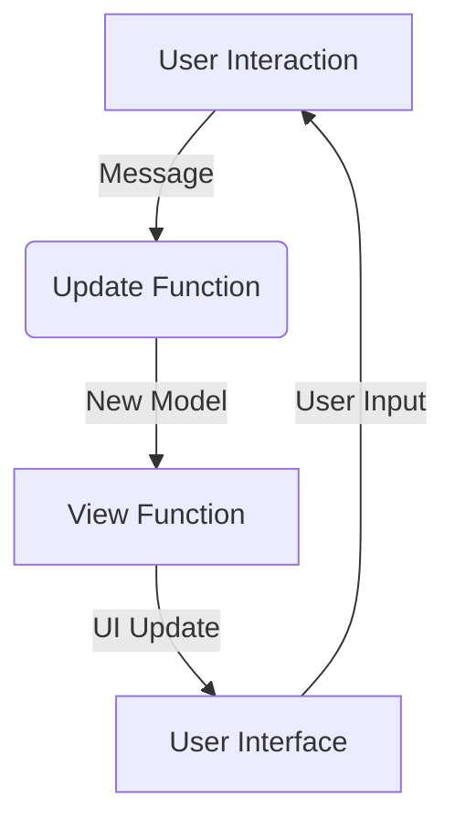

## 12.1 Model-View-Update (MVU) Pattern

In the realm of software architecture, the Model-View-Update (MVU) pattern stands out as a powerful approach for structuring applications with unidirectional data flow. Originating from the Elm language, MVU has gained traction in the F# community, particularly through the Elmish library, which adapts MVU for F# applications. In this section, we will delve into the core concepts of MVU, explore its benefits, and demonstrate how to implement it using Elmish in F#.

### Introduction to the Model-View-Update (MVU) Pattern

The MVU pattern is an architectural design pattern that emphasizes a clear separation of concerns and unidirectional data flow. It consists of three main components:

- **Model**: Represents the application's state.
- **View**: A function of the Model that produces the UI.
- **Update**: A function that alters the Model based on messages.

#### Origins in the Elm Language

The MVU pattern was first introduced in the Elm language, a functional programming language designed for building web applications. Elm's architecture inspired the adoption of MVU in other languages, including F#, due to its simplicity and effectiveness in managing state and UI updates.

### Core Concepts of MVU

Let's explore each component of the MVU pattern in detail:

#### Model

The Model is the central repository of the application's state. It is typically defined as a record type in F#, encapsulating all the data required by the application. The Model is immutable, meaning that any changes to the state result in a new instance of the Model.

```fsharp
type Model = {
    Count: int
    Message: string
}
```

#### View

The View is a function that takes the Model as input and produces the UI. In F#, this is often done using a declarative approach, where the UI is described as a series of nested functions or components.

```fsharp
let view model dispatch =
    div [] [
        h1 [] [ str model.Message ]
        button [ onClick (fun _ -> dispatch Increment) ] [ str "Increment" ]
        button [ onClick (fun _ -> dispatch Decrement) ] [ str "Decrement" ]
    ]
```

#### Update

The Update function is responsible for handling messages and updating the Model. It takes the current Model and a message as input and returns a new Model.

```fsharp
type Msg =
    | Increment
    | Decrement

let update msg model =
    match msg with
    | Increment -> { model with Count = model.Count + 1 }
    | Decrement -> { model with Count = model.Count - 1 }
```

### Benefits of Unidirectional Data Flow

The unidirectional data flow in MVU offers several advantages:

- **Easier Reasoning About State Changes**: With a single source of truth (the Model), it's easier to track how state changes occur in response to messages.
- **Improved Maintainability**: The clear separation of concerns between Model, View, and Update functions simplifies code maintenance and refactoring.
- **Simplified Debugging**: The predictable flow of data and state changes makes it easier to identify and fix bugs.

### Overview of Elmish: Bringing MVU to F#

Elmish is an F# library that brings the MVU pattern to F#, particularly for web applications. It provides a lightweight framework for building applications with a functional architecture, leveraging F#'s strong type system and functional programming features.

#### Setting Up an Elmish Project

To get started with Elmish, you'll need to set up a new F# project. Here's a step-by-step guide:

1. **Create a New F# Project**: Use the .NET CLI to create a new F# project.

   ```bash
   dotnet new console -lang F# -o ElmishApp
   cd ElmishApp
   ```

2. **Add Elmish NuGet Packages**: Add the Elmish and Fable.React packages to your project.

   ```bash
   dotnet add package Fable.Elmish
   dotnet add package Fable.React
   ```

3. **Set Up the Project Structure**: Organize your project into folders for Models, Views, and Updates.

### Implementing a Simple MVU Application

Let's walk through the implementation of a simple MVU application using Elmish in F#.

#### Defining the Model

First, define the Model that represents the application's state.

```fsharp
type Model = {
    Count: int
    Message: string
}
```

#### Creating the View

Next, create the View function that renders the UI based on the Model.

```fsharp
let view model dispatch =
    div [] [
        h1 [] [ str model.Message ]
        button [ onClick (fun _ -> dispatch Increment) ] [ str "Increment" ]
        button [ onClick (fun _ -> dispatch Decrement) ] [ str "Decrement" ]
    ]
```

#### Implementing the Update Function

The Update function handles messages and updates the Model.

```fsharp
type Msg =
    | Increment
    | Decrement

let update msg model =
    match msg with
    | Increment -> { model with Count = model.Count + 1 }
    | Decrement -> { model with Count = model.Count - 1 }
```

#### Wiring It All Together

Finally, wire everything together using the Elmish program loop.

```fsharp
open Elmish
open Elmish.React

Program.mkSimple init update view
|> Program.withConsoleTrace
|> Program.run
```

### Handling State Management and Side Effects

In MVU, state management is centralized in the Model, making it easier to manage and reason about. Side effects, such as HTTP requests or local storage access, are typically handled using commands or subscriptions in Elmish.

#### Example: Fetching Data from an API

Here's an example of handling side effects in an MVU application:

```fsharp
type Msg =
    | FetchData
    | DataFetched of string

let update msg model =
    match msg with
    | FetchData -> 
        // Trigger a side effect to fetch data
        model, Cmd.ofAsync fetchDataFromApi DataFetched
    | DataFetched data ->
        { model with Message = data }, Cmd.none
```

### Best Practices for Scaling MVU Applications

As your MVU application grows, consider these best practices for scaling:

- **Organize Code**: Use modules and namespaces to organize your code into logical units.
- **Manage Complex State**: Break down complex state into smaller, manageable pieces using nested models and updates.
- **Reuse Components**: Create reusable components for common UI elements to reduce duplication.

### Applying MVU Beyond the Web

While MVU is popular for web applications, it can also be applied to other platforms, such as desktop or mobile applications. Libraries like Fabulous bring MVU to mobile development with Xamarin.Forms, allowing you to write cross-platform applications in F#.

### Real-World Examples and Case Studies

MVU has been successfully implemented in various F# projects, ranging from web applications to mobile apps. One notable example is the SAFE Stack, a full-stack F# framework that leverages Elmish for client-side development.

### Visualizing the MVU Pattern

To better understand the flow of data in an MVU application, let's visualize the process using a Mermaid.js diagram.



**Diagram Description**: This diagram illustrates the unidirectional data flow in an MVU application. User interactions generate messages that trigger the Update function, which produces a new Model. The View function renders the UI based on the Model, and the cycle continues with user input.

### Try It Yourself

Now that we've covered the basics of MVU, try experimenting with the code examples provided. Modify the Model to include additional state, add new messages to the Update function, or create custom UI components in the View. This hands-on approach will deepen your understanding of the MVU pattern and its application in F#.

### Summary

In this section, we've explored the Model-View-Update (MVU) pattern, its origins in the Elm language, and its implementation in F# using Elmish. We've discussed the benefits of unidirectional data flow, demonstrated how to set up a simple MVU application, and highlighted best practices for scaling MVU applications. Remember, mastering MVU is just the beginning. As you continue your journey, you'll discover new ways to leverage this pattern for building robust, maintainable applications.

## Quiz Time!



### What is the primary benefit of unidirectional data flow in the MVU pattern?

- [x] Easier reasoning about state changes
- [ ] Faster UI rendering
- [ ] Reduced code complexity
- [ ] Increased performance

> **Explanation:** Unidirectional data flow makes it easier to track how state changes occur in response to messages, simplifying reasoning about state changes.

### Which component of the MVU pattern is responsible for rendering the UI?

- [ ] Model
- [x] View
- [ ] Update
- [ ] Controller

> **Explanation:** The View component is responsible for rendering the UI based on the current state of the Model.

### In the MVU pattern, what does the Update function return?

- [ ] A new View
- [x] A new Model
- [ ] A new Controller
- [ ] A new Message

> **Explanation:** The Update function returns a new Model after processing a message.

### What library brings the MVU pattern to F#?

- [ ] React
- [ ] Angular
- [x] Elmish
- [ ] Redux

> **Explanation:** Elmish is the library that brings the MVU pattern to F#, particularly for web applications.

### How are side effects typically handled in an MVU application?

- [ ] Directly in the View
- [ ] Directly in the Model
- [x] Using commands or subscriptions
- [ ] Using global variables

> **Explanation:** Side effects in MVU applications are typically handled using commands or subscriptions.

### What is a common practice for managing complex state in MVU applications?

- [ ] Using global variables
- [ ] Ignoring state complexity
- [x] Breaking down state into smaller pieces
- [ ] Using multiple Update functions

> **Explanation:** Breaking down complex state into smaller, manageable pieces is a common practice for managing state in MVU applications.

### Can the MVU pattern be applied to platforms other than the web?

- [x] Yes
- [ ] No

> **Explanation:** The MVU pattern can be applied to other platforms, such as desktop or mobile applications, using libraries like Fabulous.

### What is the role of the Model in the MVU pattern?

- [x] To represent the application's state
- [ ] To render the UI
- [ ] To handle user input
- [ ] To manage side effects

> **Explanation:** The Model represents the application's state in the MVU pattern.

### What does the Elmish library provide for F# developers?

- [ ] Object-oriented programming features
- [ ] Database connectivity
- [x] A framework for building applications with MVU
- [ ] A set of UI components

> **Explanation:** Elmish provides a framework for building applications with the MVU pattern in F#.

### True or False: The MVU pattern simplifies debugging by making the flow of data predictable.

- [x] True
- [ ] False

> **Explanation:** The MVU pattern simplifies debugging by providing a predictable flow of data and state changes.


