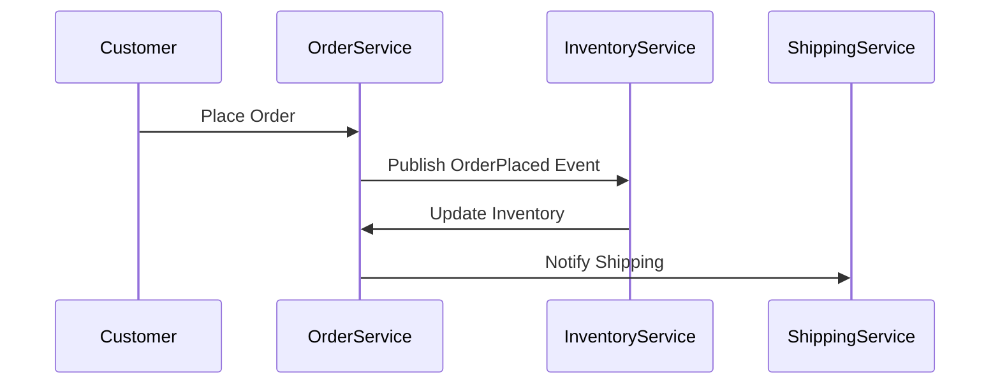

## 12.3 Domain Event Pattern

In the realm of software architecture, the **Domain Event Pattern** plays a pivotal role in capturing and communicating significant business occurrences within a system. This pattern is integral to creating scalable, decoupled systems, particularly within the context of Domain-Driven Design (DDD). In this section, we will delve into the intricacies of the Domain Event Pattern, its implementation in F#, and its integration with other architectural patterns like Event Sourcing and CQRS.

### Understanding Domain Events

**Domain Events** are notifications that something of interest has happened within the domain. They are immutable records of past occurrences that are relevant to the business. For example, in an e-commerce application, events such as `OrderPlaced`, `PaymentProcessed`, or `ItemShipped` can be considered domain events.

#### Role of Domain Events

1. **Capturing Business Occurrences**: Domain events encapsulate significant changes or actions within the business domain, providing a clear audit trail of what has happened.
2. **Facilitating Decoupling**: By using domain events, different parts of the system can communicate without being tightly coupled. This decoupling allows for greater flexibility and scalability.
3. **Enabling Scalability**: Systems can scale more effectively as domain events allow for asynchronous processing and integration with distributed systems.

### Modeling Domain Events in F#

In F#, domain events can be modeled using **discriminated unions** or **classes**, depending on the complexity and requirements of the system.

#### Using Discriminated Unions

Discriminated unions are a powerful feature in F# for modeling domain events due to their ability to represent a choice between different types.

```fsharp
type OrderEvent =
    | OrderPlaced of orderId: Guid * customerId: Guid * orderDate: DateTime
    | PaymentProcessed of orderId: Guid * paymentId: Guid * amount: decimal
    | ItemShipped of orderId: Guid * shipmentId: Guid * shipDate: DateTime
```

In this example, the `OrderEvent` type represents different events that can occur in the order processing domain.

#### Using Classes

For more complex scenarios, where events might have additional behavior or require inheritance, classes can be used.

```fsharp
type DomainEvent() =
    abstract member EventId: Guid
    abstract member OccurredOn: DateTime

type OrderPlaced(orderId: Guid, customerId: Guid, orderDate: DateTime) =
    inherit DomainEvent()
    override this.EventId = Guid.NewGuid()
    override this.OccurredOn = orderDate
```

### Publishing and Subscribing to Domain Events

Domain events can be published and subscribed to using various mechanisms, such as in-process event handlers or messaging systems.

#### In-Process Event Handlers

For simpler applications, in-process event handlers can be used to react to domain events.

```fsharp
let handleOrderPlaced (event: OrderPlaced) =
    printfn "Order placed with ID: %A" event.OrderId

let publishEvent (event: DomainEvent) =
    match event with
    | :? OrderPlaced as orderPlaced -> handleOrderPlaced orderPlaced
    | _ -> ()
```

#### Using Messaging Systems

For more complex systems, especially those that are distributed, a messaging system like RabbitMQ or Kafka can be used to publish and subscribe to domain events.

```fsharp
let publishToQueue (event: DomainEvent) =
    // Serialize the event and send it to a message queue
    // Implementation details depend on the chosen messaging system
```

### Handling Domain Events Across Bounded Contexts

In DDD, a **bounded context** is a boundary within which a particular model is defined and applicable. Domain events can be used to communicate across these boundaries.

#### Example: Order and Inventory Contexts

Consider an e-commerce system with separate bounded contexts for Order Management and Inventory Management. When an order is placed, an `OrderPlaced` event can be published, which the Inventory context can subscribe to in order to update stock levels.

```fsharp
let handleInventoryUpdate (event: OrderPlaced) =
    // Update inventory based on the order details
```

### Best Practices for Domain Events

1. **Naming**: Use descriptive names that clearly convey the business occurrence, such as `OrderPlaced` or `PaymentProcessed`.
2. **Versioning**: Plan for changes by versioning your events. This can be done by including a version number in the event data.
3. **Structure**: Keep events simple and focused on a single business occurrence. Avoid including too much data or logic within an event.

### Event Consistency and Transaction Management

Domain events should be consistent with the state of the system. This can be challenging, especially in distributed systems.

#### Strategies for Consistency

- **Transactional Outbox**: Use a transactional outbox pattern to ensure that events are only published if the transaction that generated them is committed.
- **Eventual Consistency**: Accept that some systems may be eventually consistent and design your system to handle this gracefully.

### Integration with Event Sourcing and CQRS

Domain events are a natural fit for **Event Sourcing**, where the state of a system is derived from a sequence of events. They also complement **CQRS** (Command Query Responsibility Segregation), where commands result in domain events that update the read model.

#### Example: Event Sourcing with Domain Events

```fsharp
let applyEvent (state: OrderState) (event: OrderEvent) =
    match event with
    | OrderPlaced(orderId, customerId, orderDate) ->
        { state with OrderId = orderId; CustomerId = customerId; OrderDate = orderDate }
    | PaymentProcessed(orderId, paymentId, amount) ->
        { state with PaymentId = Some paymentId; AmountPaid = amount }
    | ItemShipped(orderId, shipmentId, shipDate) ->
        { state with ShipmentId = Some shipmentId; ShipDate = Some shipDate }
```

### Real-World Examples of Domain Event Implementation in F#

In real-world projects, domain events can be used to integrate with external systems, trigger workflows, or update other parts of the application.

#### Example: E-Commerce System

In an e-commerce system, domain events can be used to notify the shipping department when an order is ready to be shipped, update customer loyalty points, or trigger marketing campaigns.

```fsharp
let notifyShipping (event: OrderPlaced) =
    // Send notification to the shipping department

let updateLoyaltyPoints (event: PaymentProcessed) =
    // Update customer loyalty points based on the payment amount
```

### Try It Yourself

Experiment with the code examples provided by modifying the event types or handlers. Try integrating a messaging system to see how domain events can be used in a distributed environment.

### Visualizing Domain Event Flow

To better understand the flow of domain events, let's visualize a simple sequence diagram showing the interaction between different components in an order processing system.



### Knowledge Check

- What are the benefits of using domain events in a system?
- How can domain events facilitate decoupling between different parts of a system?
- What are some best practices for naming and structuring domain events?
- How can domain events be integrated with Event Sourcing and CQRS?

### Conclusion

The Domain Event Pattern is a powerful tool for capturing significant business occurrences and facilitating communication between different parts of a system. By leveraging F#'s features, such as discriminated unions and classes, you can effectively model, publish, and handle domain events. Remember, this is just the beginning. As you progress, you'll build more complex and interactive systems. Keep experimenting, stay curious, and enjoy the journey!

## Quiz Time!



### What is a domain event?

- [x] A notification that something significant has happened within the business domain.
- [ ] A method for storing data in a database.
- [ ] A type of user interface element.
- [ ] A way to manage user sessions.

> **Explanation:** A domain event is a notification that something significant has happened within the business domain, capturing important occurrences.

### How do domain events facilitate decoupling in a system?

- [x] By allowing different parts of the system to communicate without being tightly coupled.
- [ ] By requiring all components to be in the same process.
- [ ] By enforcing synchronous communication.
- [ ] By eliminating the need for any communication between components.

> **Explanation:** Domain events allow different parts of the system to communicate without being tightly coupled, enabling greater flexibility and scalability.

### Which F# feature is commonly used to model domain events?

- [x] Discriminated Unions
- [ ] Arrays
- [ ] Lists
- [ ] Tuples

> **Explanation:** Discriminated unions are commonly used in F# to model domain events due to their ability to represent different types of events.

### What is a best practice for naming domain events?

- [x] Use descriptive names that convey the business occurrence.
- [ ] Use generic names to cover multiple occurrences.
- [ ] Use abbreviations to save space.
- [ ] Use random names for uniqueness.

> **Explanation:** It is best to use descriptive names for domain events that clearly convey the business occurrence, such as `OrderPlaced`.

### How can domain events be integrated with Event Sourcing?

- [x] By deriving the state of a system from a sequence of domain events.
- [ ] By storing events in a relational database.
- [ ] By using events to replace all database transactions.
- [ ] By ignoring events in the system design.

> **Explanation:** In Event Sourcing, the state of a system is derived from a sequence of domain events, making them integral to this pattern.

### What is a bounded context in Domain-Driven Design?

- [x] A boundary within which a particular model is defined and applicable.
- [ ] A type of database schema.
- [ ] A user interface design pattern.
- [ ] A method for optimizing code performance.

> **Explanation:** A bounded context is a boundary within which a particular model is defined and applicable, often used in DDD to manage complexity.

### What is the transactional outbox pattern used for?

- [x] Ensuring events are only published if the transaction that generated them is committed.
- [ ] Storing temporary data during a transaction.
- [ ] Caching frequently accessed data.
- [ ] Logging user interactions.

> **Explanation:** The transactional outbox pattern ensures that events are only published if the transaction that generated them is committed, maintaining consistency.

### Which of the following is a strategy for handling event consistency?

- [x] Eventual Consistency
- [ ] Immediate Consistency
- [ ] Synchronous Consistency
- [ ] Delayed Consistency

> **Explanation:** Eventual consistency is a strategy where systems are designed to handle the fact that not all parts may be consistent immediately.

### What is the role of a messaging system in domain events?

- [x] To publish and subscribe to domain events in a distributed system.
- [ ] To store domain events permanently.
- [ ] To replace all other forms of communication.
- [ ] To manage user authentication.

> **Explanation:** A messaging system is used to publish and subscribe to domain events in a distributed system, facilitating communication.

### True or False: Domain events are mutable records of past occurrences.

- [ ] True
- [x] False

> **Explanation:** Domain events are immutable records of past occurrences, ensuring they accurately capture the state of the system at a point in time.


