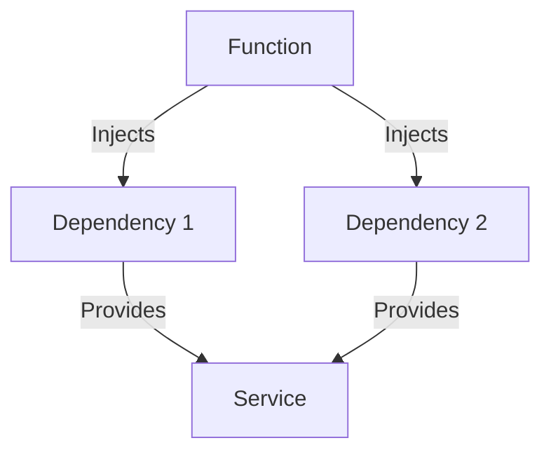

## 12.8 Dependency Injection in F#

### Introduction to Dependency Injection

Dependency Injection (DI) is a design pattern used to achieve Inversion of Control (IoC) between classes and their dependencies. By decoupling the creation of a class from its dependencies, DI promotes loose coupling and enhances testability. In traditional object-oriented programming (OOP), DI is often implemented using DI containers or frameworks, which manage the lifecycle and resolution of dependencies.

### Understanding the Dependency Inversion Principle

The Dependency Inversion Principle (DIP) is one of the SOLID principles of object-oriented design. It states that:

1. High-level modules should not depend on low-level modules. Both should depend on abstractions.
2. Abstractions should not depend on details. Details should depend on abstractions.

This principle guides the design of software systems by encouraging the use of interfaces or abstract classes to define the dependencies between modules. By doing so, changes in low-level modules do not affect high-level modules, leading to a more flexible and maintainable codebase.

### Dependency Injection in Object-Oriented Languages

In OOP, DI is typically implemented using three main techniques:

1. **Constructor Injection**: Dependencies are provided through a class constructor.
2. **Setter Injection**: Dependencies are provided through setter methods.
3. **Interface Injection**: Dependencies are provided through an interface method.

DI containers, such as Spring in Java or Autofac in C#, automate the process of resolving and injecting dependencies, managing their lifecycle, and ensuring that the correct dependencies are provided to each class.

### Dependency Injection in Functional Programming

In functional programming, the approach to DI differs significantly from OOP. Functional programming emphasizes immutability, pure functions, and higher-order functions, which naturally lend themselves to a different style of DI. Instead of relying on DI containers, dependencies are often passed explicitly as parameters to functions or modules.

#### Functional Dependency Injection Techniques in F#

1. **Higher-Order Functions**: Functions that take other functions as parameters or return them as results. This allows dependencies to be injected as functions.

2. **Partial Application**: A technique where a function is applied to some of its arguments, producing another function that takes the remaining arguments. This can be used to inject dependencies by partially applying them.

3. **Explicit Parameter Passing**: Dependencies are passed explicitly as parameters to functions or modules, making the dependencies clear and explicit.

### Implementing Dependency Injection in F#

Let's explore how these techniques can be applied in F# with practical examples.

#### Higher-Order Functions

Higher-order functions are a powerful feature of functional programming that allows functions to be passed as arguments or returned as results. This can be used to inject dependencies dynamically.

```fsharp
// Define a function that takes a logger function as a dependency
let processData logger data =
    logger "Processing data..."
    // Perform data processing
    logger "Data processed successfully."

// Define a simple logger function
let consoleLogger message = printfn "%s" message

// Inject the logger dependency
processData consoleLogger "Sample data"
```

In this example, the `processData` function takes a `logger` function as a parameter, allowing us to inject different logging implementations as needed.

#### Partial Application

Partial application allows us to fix some arguments of a function, creating a new function that takes the remaining arguments. This can be used to inject dependencies by partially applying them.

```fsharp
// Define a function that requires a configuration and data
let processDataWithConfig config data =
    printfn "Using config: %s" config
    printfn "Processing data: %s" data

// Partially apply the configuration dependency
let processDataWithDefaultConfig = processDataWithConfig "DefaultConfig"

// Use the partially applied function
processDataWithDefaultConfig "Sample data"
```

Here, we partially apply the `config` parameter, creating a new function `processDataWithDefaultConfig` that only requires the `data` parameter.

#### Explicit Parameter Passing

Explicit parameter passing involves passing dependencies directly as parameters to functions or modules, making the dependencies clear and explicit.

```fsharp
// Define a function that takes a database connection as a dependency
let fetchData dbConnection query =
    printfn "Fetching data with query: %s" query
    // Simulate data fetching
    "Fetched data"

// Pass the database connection explicitly
let dbConnection = "DatabaseConnection"
let result = fetchData dbConnection "SELECT * FROM table"
printfn "Result: %s" result
```

In this example, the `fetchData` function takes a `dbConnection` parameter, which is passed explicitly when calling the function.

### Benefits of Functional Dependency Injection

Functional DI offers several benefits:

- **Simplicity**: By avoiding complex DI frameworks, functional DI keeps the codebase simple and easy to understand.
- **Testability**: Dependencies are explicit, making it easy to substitute them with mock implementations for testing.
- **Flexibility**: Higher-order functions and partial application provide flexible ways to inject dependencies.

### Scenarios for Using Traditional DI Containers in F#

While functional DI techniques are powerful, there are scenarios where traditional DI containers might still be useful, especially when interoperating with object-oriented codebases.

- **Interoperability**: When working with existing OOP codebases or libraries that rely on DI containers, using a DI container in F# can simplify integration.
- **Complex Dependency Graphs**: In applications with complex dependency graphs, a DI container can manage the resolution and lifecycle of dependencies more efficiently.

### Best Practices for Managing Dependencies

1. **Keep Dependencies Explicit**: Make dependencies explicit by passing them as parameters to functions or modules.
2. **Use Higher-Order Functions**: Leverage higher-order functions to inject dependencies dynamically.
3. **Favor Immutability**: Prefer immutable data structures and pure functions to reduce side effects and improve testability.
4. **Minimize Global State**: Avoid global state to reduce coupling and improve maintainability.
5. **Document Dependencies**: Clearly document the dependencies of each function or module for better understanding and maintenance.

### Examples of Dependency Injection in F# Applications

Let's look at a practical example of applying DI in an F# application.

```fsharp
// Define a service interface
type IDataService =
    abstract member GetData: unit -> string

// Implement the service interface
type DataService() =
    interface IDataService with
        member _.GetData() = "Data from DataService"

// Define a function that uses the service
let processData (dataService: IDataService) =
    let data = dataService.GetData()
    printfn "Processing: %s" data

// Inject the service dependency
let dataService = DataService()
processData dataService
```

In this example, we define a `IDataService` interface and a `DataService` implementation. The `processData` function takes an `IDataService` as a parameter, allowing us to inject different implementations as needed.

### Try It Yourself

To deepen your understanding, try modifying the code examples:

- Implement a different logging mechanism, such as logging to a file, and inject it into the `processData` function.
- Create a mock implementation of `IDataService` for testing purposes and inject it into the `processData` function.

### Visualizing Dependency Injection in F#

Below is a diagram illustrating the flow of dependencies in a functional DI setup.



**Diagram Description:** This diagram shows how a function injects multiple dependencies, which then provide services to the function.

### Conclusion

Dependency Injection in F# leverages the power of functional programming to achieve loose coupling and enhance testability without relying on traditional DI frameworks. By using higher-order functions, partial application, and explicit parameter passing, we can manage dependencies effectively and maintain a clean, flexible codebase. As you continue your journey in F#, remember to embrace these functional DI techniques and apply them to create robust and maintainable applications.

## Quiz Time!



### What is Dependency Injection (DI)?

- [x] A design pattern used to achieve Inversion of Control (IoC) between classes and their dependencies.
- [ ] A method for creating classes in object-oriented programming.
- [ ] A technique for optimizing database queries.
- [ ] A way to handle errors in functional programming.

> **Explanation:** Dependency Injection is a design pattern that promotes loose coupling by decoupling the creation of a class from its dependencies.

### Which principle does Dependency Injection primarily support?

- [x] Dependency Inversion Principle
- [ ] Open/Closed Principle
- [ ] Single Responsibility Principle
- [ ] Liskov Substitution Principle

> **Explanation:** Dependency Injection supports the Dependency Inversion Principle, which encourages high-level modules to depend on abstractions rather than low-level modules.

### In functional programming, how are dependencies typically injected?

- [x] By passing them as parameters to functions or modules.
- [ ] By using DI containers.
- [ ] By creating global variables.
- [ ] By using setter methods.

> **Explanation:** In functional programming, dependencies are typically injected by passing them explicitly as parameters to functions or modules.

### What is a higher-order function?

- [x] A function that takes other functions as parameters or returns them as results.
- [ ] A function that operates on high-level data structures.
- [ ] A function that is defined at the top of a module.
- [ ] A function that is optimized for performance.

> **Explanation:** A higher-order function is a function that can take other functions as parameters or return them as results, allowing for dynamic injection of dependencies.

### What is partial application in F#?

- [x] A technique where a function is applied to some of its arguments, producing another function that takes the remaining arguments.
- [ ] A method for partially compiling F# code.
- [ ] A way to partially execute a function.
- [ ] A technique for partially mocking dependencies.

> **Explanation:** Partial application is a technique where a function is applied to some of its arguments, creating a new function that takes the remaining arguments.

### What is the main benefit of using functional DI techniques?

- [x] Simplicity and ease of testing.
- [ ] Increased complexity.
- [ ] Reduced performance.
- [ ] Enhanced global state management.

> **Explanation:** Functional DI techniques offer simplicity and ease of testing by making dependencies explicit and avoiding complex DI frameworks.

### When might traditional DI containers be useful in F#?

- [x] When interoperating with existing object-oriented codebases.
- [ ] When writing simple scripts.
- [ ] When optimizing performance.
- [ ] When using global variables.

> **Explanation:** Traditional DI containers might be useful in F# when interoperating with existing object-oriented codebases that rely on DI frameworks.

### What is a best practice for managing dependencies in F#?

- [x] Keep dependencies explicit by passing them as parameters.
- [ ] Use global variables for dependency management.
- [ ] Rely on DI containers for all dependencies.
- [ ] Avoid documenting dependencies.

> **Explanation:** A best practice for managing dependencies in F# is to keep them explicit by passing them as parameters to functions or modules.

### What is the Dependency Inversion Principle?

- [x] A principle that states high-level modules should not depend on low-level modules, but both should depend on abstractions.
- [ ] A principle that encourages the use of global variables.
- [ ] A principle that mandates the use of DI containers.
- [ ] A principle that focuses on optimizing performance.

> **Explanation:** The Dependency Inversion Principle states that high-level modules should not depend on low-level modules, but both should depend on abstractions, promoting loose coupling.

### True or False: In F#, dependencies are typically managed using DI containers.

- [ ] True
- [x] False

> **Explanation:** In F#, dependencies are typically managed using functional programming techniques such as higher-order functions and explicit parameter passing, rather than DI containers.


