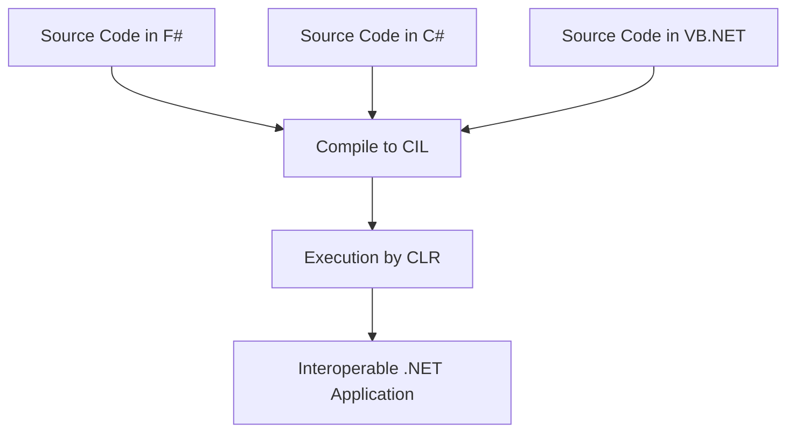

## 13.1 Interoperability with C# and VB.NET

In the diverse ecosystem of .NET, interoperability between languages like F#, C#, and VB.NET is a crucial feature that allows developers to leverage the strengths of each language. This section delves into how F# can seamlessly interoperate with C# and VB.NET, enabling developers to build robust applications by combining functional and object-oriented paradigms.

### Understanding the Common Language Runtime (CLR)

The Common Language Runtime (CLR) is the execution engine for .NET applications. It provides a managed execution environment for .NET programs, handling memory management, security, and exception handling. One of its most significant features is enabling interoperability between different .NET languages.

#### How CLR Enables Interoperability

The CLR allows different .NET languages to compile into a Common Intermediate Language (CIL), a CPU-independent set of instructions. This commonality means that once code is compiled into CIL, it can be executed by the CLR regardless of the source language. This feature is the cornerstone of interoperability in the .NET ecosystem.



*Figure 1: Visualizing the Compilation and Execution Process in .NET*

### Calling C# or VB.NET Code from F#

To leverage existing libraries or components written in C# or VB.NET, you can easily reference these assemblies in your F# projects. Let's walk through the process of integrating C# or VB.NET code into an F# application.

#### Step-by-Step Instructions

1. **Create or Obtain the Assembly**: Ensure you have the compiled DLL of the C# or VB.NET project you wish to reference.

2. **Add Reference in F# Project**: In your F# project, add a reference to the C# or VB.NET assembly.

   ```fsharp
   // In your F# project file (.fsproj), add:
   <ItemGroup>
       <Reference Include="YourCSharpLibrary">
           <HintPath>..\path\to\YourCSharpLibrary.dll</HintPath>
       </Reference>
   </ItemGroup>
   ```

3. **Use the C# or VB.NET Code**: Once referenced, you can use the classes, methods, and properties defined in the C# or VB.NET assembly.

   ```fsharp
   open YourCSharpLibrary

   let example = new CSharpClass()
   example.Method()
   ```

#### Example: Using a C# Class in F#

Suppose you have a C# class `Calculator` with a method `Add`.

```csharp
// C# Code
public class Calculator
{
    public int Add(int a, int b)
    {
        return a + b;
    }
}
```

In F#, you can use this class as follows:

```fsharp
open YourCSharpLibrary

let calculator = new Calculator()
let result = calculator.Add(5, 3)
printfn "The result is %d" result
```

### Using F# Code in C# or VB.NET

F# modules, types, and functions can be exposed for use in other .NET languages. This section explains how to make F# code accessible to C# or VB.NET.

#### Exposing F# Code

1. **Define Public Modules and Types**: Ensure that the F# modules and types you want to expose are marked as `public`.

   ```fsharp
   module public MathOperations =
       let add x y = x + y
   ```

2. **Compile the F# Code**: Build the F# project to generate a DLL.

3. **Reference the F# Assembly**: In your C# or VB.NET project, add a reference to the compiled F# DLL.

4. **Consume F# Code**: Use the F# functions and types in your C# or VB.NET code.

   ```csharp
   // C# Code
   using YourFSharpLibrary;

   class Program
   {
       static void Main()
       {
           var result = MathOperations.add(5, 3);
           Console.WriteLine($"The result is {result}");
       }
   }
   ```

#### Handling F# Specific Constructs

When consuming F# code, be mindful of certain constructs like option types and discriminated unions.

- **Option Types**: F# `Option` types can be handled in C# using nullable types or by checking for `None`.

  ```fsharp
  // F# Code
  let tryDivide x y =
      if y = 0 then None else Some(x / y)
  ```

  ```csharp
  // C# Code
  var result = MathOperations.tryDivide(10, 2);
  if (result.HasValue)
  {
      Console.WriteLine($"Result: {result.Value}");
  }
  else
  {
      Console.WriteLine("Division by zero");
  }
  ```

- **Discriminated Unions**: These are more complex and may require additional handling or conversion to C#-friendly types.

### Addressing Potential Issues

Interoperability between F#, C#, and VB.NET can introduce some challenges. Here are common issues and how to address them.

#### Name Mangling and Accessibility

- **Name Mangling**: F# uses different naming conventions (e.g., underscores) that might not align with C# or VB.NET. Use attributes like `[<CompiledName("...")>]` to control the output name.

  ```fsharp
  [<CompiledName("AddNumbers")>]
  let add x y = x + y
  ```

- **Accessibility Modifiers**: Ensure that F# types and members are marked as `public` if they need to be accessed from other languages.

#### Nullability

F# avoids nulls by design, but C# and VB.NET allow them. When interoperating:

- Use `Option` types in F# to represent nullable values.
- Handle `null` checks in C# or VB.NET when consuming F# code.

### Best Practices for Interoperability

To maintain smooth interoperability, consider the following best practices:

- **Use Common Interfaces or Base Classes**: Define shared interfaces or base classes to ensure consistent behavior across languages.

- **Consistent Coding Standards**: Adopt consistent naming conventions and coding styles to minimize confusion.

- **Documentation**: Clearly document any language-specific behavior or constructs.

### Tooling and Debugging

Leveraging the right tools can simplify interoperability:

- **Visual Studio**: Use Visual Studio's multi-language solution capabilities to manage projects across F#, C#, and VB.NET.

- **Debugging**: Set breakpoints and step through code across languages using Visual Studio's integrated debugger.

### Try It Yourself

Experiment with the provided examples by modifying the F# functions or C# classes. Try creating a new F# function that returns a discriminated union and consume it in C#. Observe how changes in one language affect the other.

### Conclusion

Interoperability between F#, C#, and VB.NET opens up a world of possibilities for .NET developers. By understanding the CLR, leveraging the strengths of each language, and following best practices, you can create powerful, flexible applications that take advantage of the full .NET ecosystem.

## Quiz Time!



### What is the role of the Common Language Runtime (CLR) in .NET?

- [x] It allows different .NET languages to compile to a common intermediate language.
- [ ] It is a language-specific compiler for F# only.
- [ ] It provides a graphical user interface for .NET applications.
- [ ] It is used only for memory management in .NET.

> **Explanation:** The CLR allows different .NET languages to compile to a Common Intermediate Language (CIL), enabling interoperability.

### How do you reference a C# assembly in an F# project?

- [x] By adding a reference to the C# DLL in the F# project file.
- [ ] By copying the C# code directly into the F# project.
- [ ] By converting the C# code to F# syntax.
- [ ] By using a special F# library for C# interoperability.

> **Explanation:** To use a C# assembly in an F# project, you need to add a reference to the C# DLL in the F# project file.

### What is a potential issue when consuming F# code in C#?

- [x] Handling F# option types and discriminated unions.
- [ ] F# code cannot be compiled into a DLL.
- [ ] F# code is not compatible with C# syntax.
- [ ] F# does not support public accessibility.

> **Explanation:** F# option types and discriminated unions may require special handling when consumed in C#.

### What attribute can be used to control name mangling in F#?

- [x] `[<CompiledName("...")>]`
- [ ] `[<Name("...")>]`
- [ ] `[<Alias("...")>]`
- [ ] `[<Rename("...")>]`

> **Explanation:** The `[<CompiledName("...")>]` attribute is used in F# to control the output name of a function or type.

### Which of the following is a best practice for interoperability?

- [x] Use common interfaces or base classes.
- [ ] Avoid using public accessibility.
- [ ] Use different coding standards for each language.
- [ ] Do not document language-specific behavior.

> **Explanation:** Using common interfaces or base classes ensures consistent behavior across languages.

### What tool can be used to debug across F#, C#, and VB.NET?

- [x] Visual Studio
- [ ] Notepad++
- [ ] Eclipse
- [ ] IntelliJ IDEA

> **Explanation:** Visual Studio provides integrated debugging capabilities across F#, C#, and VB.NET.

### How can you handle nullability when consuming F# code in C#?

- [x] Use `Option` types in F# and handle `null` checks in C#.
- [ ] Avoid using F# code that returns null.
- [ ] Convert all F# code to C#.
- [ ] Use a special library to manage nullability.

> **Explanation:** Use `Option` types in F# to represent nullable values and handle `null` checks in C#.

### What is the benefit of using the CLR for .NET languages?

- [x] It enables cross-language interoperability.
- [ ] It restricts the use of certain languages.
- [ ] It only supports object-oriented programming.
- [ ] It is specific to Windows operating systems.

> **Explanation:** The CLR enables cross-language interoperability by compiling code into a Common Intermediate Language (CIL).

### Can F# modules be used directly in C#?

- [x] Yes, if they are public and the F# assembly is referenced.
- [ ] No, F# modules cannot be used in C#.
- [ ] Yes, but only if converted to C# syntax.
- [ ] No, F# modules require special handling in C#.

> **Explanation:** F# modules can be used in C# if they are public and the F# assembly is referenced.

### True or False: F# avoids nulls by design, but C# and VB.NET allow them.

- [x] True
- [ ] False

> **Explanation:** F# avoids nulls by design, preferring `Option` types, while C# and VB.NET allow nulls.



Remember, this is just the beginning. As you progress, you'll build more complex and interactive applications by leveraging the interoperability between F#, C#, and VB.NET. Keep experimenting, stay curious, and enjoy the journey!
