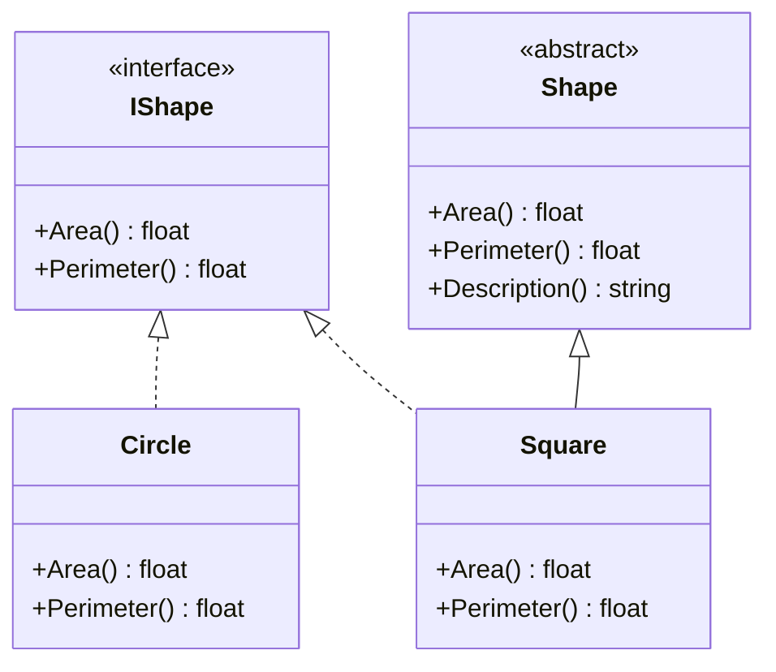

## 13.3 Implementing Interfaces and Abstract Classes

In the realm of software engineering, F# stands out as a functional-first language that also supports object-oriented programming (OOP) constructs. This dual capability allows F# developers to harness the power of both paradigms, making it a versatile tool for complex software development. In this section, we will delve into implementing interfaces and abstract classes in F#, exploring how these OOP features can be effectively utilized within the language.

### Understanding Object-Oriented Programming in F#

F# is primarily known for its functional programming capabilities, but it also supports object-oriented programming features. This dual nature allows developers to choose the best approach for a given problem. Let's briefly outline how F# supports OOP:

- **Classes and Objects**: F# allows the definition of classes and objects, enabling encapsulation and data abstraction.
- **Inheritance**: F# supports inheritance, allowing classes to inherit properties and methods from other classes.
- **Interfaces**: Interfaces in F# define contracts that classes or records can implement, ensuring a certain set of methods are present.
- **Abstract Classes**: These are classes that cannot be instantiated on their own and are intended to be subclassed, providing a base for other classes.

### Implementing Interfaces in F#

Interfaces in F# are used to define a contract that implementing types must adhere to. This is particularly useful for ensuring that certain methods are implemented across different types.

#### Syntax for Implementing Interfaces

To implement an interface in F#, use the `interface` keyword followed by the interface name. The `member` keyword is used to define the methods required by the interface.

```fsharp
type IShape =
    abstract member Area: unit -> float
    abstract member Perimeter: unit -> float

type Circle(radius: float) =
    interface IShape with
        member this.Area() = Math.PI * radius * radius
        member this.Perimeter() = 2.0 * Math.PI * radius
```

In this example, `IShape` is an interface with two abstract members: `Area` and `Perimeter`. The `Circle` class implements this interface, providing concrete implementations for these methods.

#### Implementing Multiple Interfaces

F# allows a class to implement multiple interfaces. This is done by specifying each interface and its members within the class definition.

```fsharp
type IPrintable =
    abstract member Print: unit -> unit

type Rectangle(width: float, height: float) =
    interface IShape with
        member this.Area() = width * height
        member this.Perimeter() = 2.0 * (width + height)

    interface IPrintable with
        member this.Print() = printfn "Rectangle: Width = %f, Height = %f" width height
```

Here, `Rectangle` implements both `IShape` and `IPrintable`, demonstrating how a class can adhere to multiple contracts.

### Inheriting Abstract Classes

Abstract classes in F# serve as templates for other classes. They can contain both abstract members (which must be implemented by derived classes) and concrete members (which provide default behavior).

#### Inheriting and Overriding Members

To inherit from an abstract class, use the `inherit` keyword. Abstract members must be overridden in the derived class.

```fsharp
[<AbstractClass>]
type Shape() =
    abstract member Area: unit -> float
    abstract member Perimeter: unit -> float
    member this.Description() = "This is a shape."

type Square(side: float) =
    inherit Shape()
    override this.Area() = side * side
    override this.Perimeter() = 4.0 * side
```

In this example, `Shape` is an abstract class with two abstract members and one concrete member. `Square` inherits from `Shape` and provides implementations for the abstract members.

### Object Expressions

Object expressions in F# provide a concise way to implement interfaces or classes on the fly without defining a new type. This is particularly useful for quick implementations or when working with anonymous types.

```fsharp
let circle = 
    { new IShape with
        member this.Area() = Math.PI * 1.0 * 1.0
        member this.Perimeter() = 2.0 * Math.PI * 1.0 }

printfn "Circle Area: %f" (circle.Area())
```

Here, an object expression is used to create an instance of `IShape` without defining a new class.

### Practical Examples

Let's explore some practical examples of implementing interfaces and abstract classes in F#.

#### Implementing IDisposable

The `IDisposable` interface is commonly used for releasing unmanaged resources.

```fsharp
type ResourceHolder() =
    interface IDisposable with
        member this.Dispose() =
            printfn "Releasing resources"
```

#### Event Handlers

F# can implement event handlers by defining interfaces that handle events.

```fsharp
type IEventHandler =
    abstract member HandleEvent: string -> unit

type Logger() =
    interface IEventHandler with
        member this.HandleEvent(event) = printfn "Event: %s" event
```

#### Custom Comparers

Custom comparers can be implemented by defining interfaces that specify comparison logic.

```fsharp
type IComparer<'T> =
    abstract member Compare: 'T -> 'T -> int

type StringLengthComparer() =
    interface IComparer<string> with
        member this.Compare(x, y) = compare (x.Length) (y.Length)
```

### Interoperability Considerations

When implementing interfaces and classes in F#, it's important to consider how they appear to other .NET languages. F# types implementing interfaces are fully compatible with C# and other .NET languages, allowing seamless integration.

- **Visibility**: Ensure that the implemented members are public if they need to be accessed from other languages.
- **Naming Conventions**: Follow .NET naming conventions to maintain consistency and readability across languages.

### Best Practices

While F# supports OOP features, it's essential to maintain functional programming principles where possible.

- **Favor Immutability**: Even when using classes, prefer immutable data structures to maintain functional integrity.
- **Use OOP Judiciously**: Reserve OOP features for scenarios where they provide clear benefits, such as interoperability with existing .NET libraries or when modeling inherently object-oriented domains.

### Edge Cases and Troubleshooting

When working with interfaces and abstract classes in F#, you may encounter some common issues:

- **Method Overloading**: F# does not support method overloading in the same way as C#. Use different names or parameter types to distinguish methods.
- **Name Hiding**: Ensure that member names do not conflict between interfaces and base classes to avoid hiding issues.

### Code Organization

Organizing code that mixes functional and object-oriented constructs can be challenging. Here are some tips:

- **Modular Design**: Use modules to encapsulate functional logic and classes for OOP constructs.
- **Clear Separation**: Maintain a clear separation between functional and object-oriented code to enhance readability and maintainability.

### Try It Yourself

To deepen your understanding, try modifying the examples provided:

- Implement a new interface and create a class that implements it.
- Use object expressions to create an instance of a class implementing multiple interfaces.
- Experiment with abstract classes by adding new abstract and virtual members.

### Visualizing Interfaces and Abstract Classes

To better understand the relationship between interfaces, abstract classes, and concrete implementations, consider the following class diagram:



This diagram illustrates how `Circle` and `Square` implement the `IShape` interface, while `Square` also inherits from the `Shape` abstract class.

### Summary

In this section, we've explored how F# supports object-oriented programming through interfaces and abstract classes. By understanding these constructs, you can effectively integrate OOP principles into your F# applications while maintaining functional programming integrity. Remember to use OOP features judiciously, leveraging them when they provide clear benefits, and always strive to maintain the functional nature of your code.

## Quiz Time!



### What keyword is used in F# to define an interface?

- [x] `interface`
- [ ] `class`
- [ ] `abstract`
- [ ] `module`

> **Explanation:** The `interface` keyword is used to define an interface in F#.

### How do you implement an interface in F#?

- [x] Using the `interface` and `member` keywords
- [ ] Using the `class` and `new` keywords
- [ ] Using the `abstract` and `override` keywords
- [ ] Using the `module` and `let` keywords

> **Explanation:** In F#, interfaces are implemented using the `interface` keyword, and the methods are defined using the `member` keyword.

### What is the purpose of an abstract class in F#?

- [x] To serve as a template for other classes
- [ ] To provide a concrete implementation of methods
- [ ] To define a single method
- [ ] To encapsulate data without methods

> **Explanation:** Abstract classes in F# serve as templates for other classes, providing a base that can be extended.

### Which keyword is used to inherit from an abstract class in F#?

- [x] `inherit`
- [ ] `interface`
- [ ] `override`
- [ ] `module`

> **Explanation:** The `inherit` keyword is used to inherit from an abstract class in F#.

### What is an object expression in F#?

- [x] A concise way to implement interfaces or classes on the fly
- [ ] A method for defining abstract classes
- [ ] A way to encapsulate data
- [ ] A technique for defining modules

> **Explanation:** Object expressions in F# provide a concise way to implement interfaces or classes on the fly without defining a new type.

### How can you implement multiple interfaces in F#?

- [x] By specifying each interface and its members within the class definition
- [ ] By using the `inherit` keyword
- [ ] By using the `module` keyword
- [ ] By using the `let` keyword

> **Explanation:** In F#, a class can implement multiple interfaces by specifying each interface and its members within the class definition.

### What is a common use case for implementing the `IDisposable` interface in F#?

- [x] Releasing unmanaged resources
- [ ] Defining abstract methods
- [ ] Implementing event handlers
- [ ] Creating object expressions

> **Explanation:** The `IDisposable` interface is commonly used for releasing unmanaged resources in F#.

### How do F# interfaces appear to other .NET languages?

- [x] Fully compatible and accessible
- [ ] Incompatible and inaccessible
- [ ] Partially compatible
- [ ] Only accessible through reflection

> **Explanation:** F# interfaces are fully compatible and accessible to other .NET languages, allowing seamless integration.

### What should you consider when mixing functional and object-oriented constructs in F#?

- [x] Maintain a clear separation between functional and object-oriented code
- [ ] Use only object-oriented constructs
- [ ] Avoid using functional constructs
- [ ] Mix them without any organization

> **Explanation:** When mixing functional and object-oriented constructs in F#, it's important to maintain a clear separation to enhance readability and maintainability.

### True or False: F# supports method overloading in the same way as C#.

- [ ] True
- [x] False

> **Explanation:** F# does not support method overloading in the same way as C#, so different names or parameter types must be used to distinguish methods.


