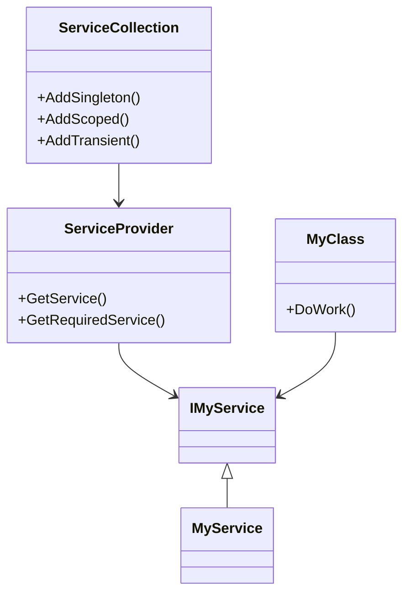

## 13.4 Dependency Injection in .NET Applications

In the world of software engineering, creating modular and testable code is paramount. Dependency Injection (DI) is a design pattern that facilitates this by promoting loose coupling between components. In this section, we'll explore how to leverage DI within .NET applications using F#, a functional-first language that integrates seamlessly with the .NET ecosystem.

### Understanding Dependency Injection

#### What is Dependency Injection?

Dependency Injection is a design pattern that allows a class to receive its dependencies from an external source rather than creating them internally. This approach offers several benefits:

- **Loose Coupling**: By decoupling the creation of dependencies from their usage, DI enables components to be more flexible and interchangeable.
- **Enhanced Testability**: Dependencies can be easily mocked or substituted during testing, allowing for isolated unit tests.
- **Improved Maintainability**: Changes to dependencies do not require modifications to the dependent components, making the system easier to maintain.

#### Benefits of DI in F#

In F#, DI can be particularly powerful due to the language's emphasis on immutability and pure functions. By using DI, we can maintain these functional programming principles while still benefiting from the modularity and testability that DI provides.

### Popular DI Frameworks for F#

Several DI frameworks are compatible with F#, each offering unique features and capabilities. Here are some popular choices:

- **Microsoft.Extensions.DependencyInjection**: The default DI framework for ASP.NET Core, providing a simple and lightweight container.
- **Autofac**: A more feature-rich DI framework that supports advanced scenarios like property injection and module-based configuration.
- **Ninject**: Known for its ease of use and flexibility, Ninject offers a fluent API for configuring dependencies.
- **Simple Injector**: Focuses on performance and simplicity, making it a great choice for high-performance applications.

### Setting Up Dependency Injection in F#

Let's walk through the process of setting up a DI container in an F# application using Microsoft.Extensions.DependencyInjection, the most commonly used DI framework in .NET applications.

#### Step-by-Step Configuration

1. **Add the Required NuGet Package**: First, ensure that your F# project includes the `Microsoft.Extensions.DependencyInjection` package. You can add it via the NuGet Package Manager or by editing your `.fsproj` file.

   ```xml
   <PackageReference Include="Microsoft.Extensions.DependencyInjection" Version="6.0.0" />
   ```

2. **Create a Service Collection**: The `ServiceCollection` class is used to register services and build the DI container.

   ```fsharp
   open Microsoft.Extensions.DependencyInjection

   let serviceCollection = ServiceCollection()
   ```

3. **Register Services**: Use the `AddSingleton`, `AddScoped`, or `AddTransient` methods to register your services with the DI container.

   ```fsharp
   serviceCollection.AddSingleton<IMyService, MyService>()
   ```

4. **Build the Service Provider**: Once all services are registered, build the `ServiceProvider` to resolve dependencies.

   ```fsharp
   let serviceProvider = serviceCollection.BuildServiceProvider()
   ```

5. **Resolve Services**: Use the `GetService` or `GetRequiredService` methods to resolve services from the container.

   ```fsharp
   let myService = serviceProvider.GetService<IMyService>()
   ```

### Registering Services

In F#, registering services with a DI container involves specifying the interface and implementation types. Here's how to register various types of services:

#### Interfaces and Implementations

Registering an interface and its implementation is straightforward:

```fsharp
serviceCollection.AddSingleton<IMyService, MyService>()
```

#### Factory Methods

You can also register services using factory methods, which provide more control over the instantiation process:

```fsharp
serviceCollection.AddSingleton<IMyService>(fun _ -> MyService())
```

#### F# Functions

In F#, you can register functions as services, allowing you to leverage the power of functional programming:

```fsharp
let myFunction = fun x -> x * x
serviceCollection.AddSingleton<Func<int, int>>(myFunction)
```

### Injecting Dependencies

Once services are registered, you can inject them into your F# classes or modules. Let's explore different injection techniques:

#### Constructor Injection

Constructor injection is the most common form of DI, where dependencies are provided through a class's constructor:

```fsharp
type MyClass(myService: IMyService) =
    member this.DoWork() =
        myService.PerformTask()
```

#### Method Injection

Method injection involves passing dependencies as parameters to a method:

```fsharp
type MyClass() =
    member this.DoWork(myService: IMyService) =
        myService.PerformTask()
```

### Functional Approaches to DI

F# offers unique functional approaches to DI, leveraging partial application and function parameters as alternatives to traditional DI.

#### Partial Application

Partial application allows you to create functions with some arguments fixed, effectively injecting dependencies:

```fsharp
let performTask (myService: IMyService) x =
    myService.PerformTask(x)

let performTaskWithService = performTask myService
```

#### Function Parameters

You can pass dependencies as function parameters, maintaining immutability and purity:

```fsharp
let doWork myService x =
    myService.PerformTask(x)
```

### Examples in Applications

Let's see how DI can be applied in real-world F# applications, such as ASP.NET Core web applications and console apps.

#### ASP.NET Core F# Application

In an ASP.NET Core application, DI is integrated into the framework, making it easy to inject services into controllers and middleware.

```fsharp
type MyController(myService: IMyService) =
    inherit ControllerBase()

    [<HttpGet>]
    member this.Get() =
        myService.PerformTask()
```

#### Console Application

In a console application, you can manually configure and resolve services using the DI container.

```fsharp
[<EntryPoint>]
let main argv =
    let serviceCollection = ServiceCollection()
    serviceCollection.AddSingleton<IMyService, MyService>()
    let serviceProvider = serviceCollection.BuildServiceProvider()
    let myService = serviceProvider.GetService<IMyService>()
    myService.PerformTask()
    0
```

### Testing with Dependency Injection

DI greatly facilitates testing by allowing you to mock or substitute dependencies. Here's how you can leverage DI for testing in F#:

#### Mocking Dependencies

Use a mocking framework like Moq to create mock implementations of your dependencies:

```fsharp
open Moq

let mockService = Mock<IMyService>()
mockService.Setup(fun s -> s.PerformTask()).Returns("Mocked Result")
```

#### Substituting Dependencies

During testing, you can substitute real implementations with test-specific ones:

```fsharp
let testService = TestService()
serviceCollection.AddSingleton<IMyService>(fun _ -> testService)
```

### Best Practices for DI in F#

When using DI in F#, consider the following best practices to balance object-oriented and functional styles:

- **Favor Immutability**: Prefer immutable data structures and pure functions to maintain functional programming principles.
- **Use DI Sparingly**: While DI is powerful, overusing it can lead to complex and hard-to-maintain code. Use it judiciously.
- **Leverage F# Features**: Utilize F# features like partial application and function parameters to achieve DI-like behavior without a DI container.

### Troubleshooting Common Issues

Integrating DI frameworks with F# can present challenges. Here are some common issues and solutions:

#### Lifetime Management

Ensure that services are registered with the appropriate lifetime (singleton, scoped, or transient) to avoid issues like memory leaks or unintended sharing of state.

#### Resolving Circular Dependencies

Circular dependencies can occur when two services depend on each other. To resolve this, refactor your code to eliminate the circular dependency or use a factory method to break the cycle.

#### Compatibility with F# Types

Some DI frameworks may not fully support F# types like discriminated unions or records. In such cases, consider using wrapper classes or interfaces to facilitate DI.

### Visualizing Dependency Injection

To better understand how DI works, let's visualize the process using a class diagram.



*Diagram: The relationship between ServiceCollection, ServiceProvider, and service interfaces.*

### Knowledge Check

Before we conclude, let's reinforce our understanding with some questions:

- What are the benefits of using DI in F# applications?
- How can you register a service using a factory method?
- What are the differences between constructor injection and method injection?

### Embrace the Journey

Remember, mastering DI in F# is just the beginning. As you continue to explore the vast world of functional programming and .NET development, you'll discover new patterns and techniques to enhance your software architecture. Keep experimenting, stay curious, and enjoy the journey!

## Quiz Time!



### What is a primary benefit of Dependency Injection?

- [x] Loose coupling between components
- [ ] Increased code complexity
- [ ] Reduced testability
- [ ] Dependency on specific frameworks

> **Explanation:** Dependency Injection promotes loose coupling by decoupling the creation of dependencies from their usage, making components more flexible and interchangeable.

### Which DI framework is the default for ASP.NET Core applications?

- [x] Microsoft.Extensions.DependencyInjection
- [ ] Autofac
- [ ] Ninject
- [ ] Simple Injector

> **Explanation:** Microsoft.Extensions.DependencyInjection is the default DI framework for ASP.NET Core applications, providing a simple and lightweight container.

### How do you register a service using a factory method in F#?

- [x] `serviceCollection.AddSingleton<IMyService>(fun _ -> MyService())`
- [ ] `serviceCollection.AddSingleton<IMyService, MyService>()`
- [ ] `serviceCollection.AddScoped<IMyService, MyService>()`
- [ ] `serviceCollection.AddTransient<IMyService, MyService>()`

> **Explanation:** Registering a service using a factory method involves providing a function that returns the service instance, allowing for more control over instantiation.

### What is constructor injection?

- [x] Providing dependencies through a class's constructor
- [ ] Passing dependencies as function parameters
- [ ] Using a factory method to create dependencies
- [ ] Injecting dependencies into private fields

> **Explanation:** Constructor injection involves providing dependencies through a class's constructor, making it the most common form of DI.

### How can you achieve DI-like behavior in F# without a DI container?

- [x] Using partial application
- [ ] Using global variables
- [x] Passing dependencies as function parameters
- [ ] Using reflection

> **Explanation:** In F#, you can achieve DI-like behavior by using partial application and passing dependencies as function parameters, maintaining immutability and purity.

### What is a common issue when integrating DI frameworks with F#?

- [x] Lifetime management
- [ ] Lack of DI frameworks
- [ ] Excessive use of mutable state
- [ ] Inability to use interfaces

> **Explanation:** Lifetime management is a common issue when integrating DI frameworks with F#, as it requires careful consideration to avoid memory leaks or unintended sharing of state.

### How can you resolve circular dependencies in DI?

- [x] Refactor code to eliminate the circular dependency
- [ ] Use global variables
- [x] Use a factory method to break the cycle
- [ ] Ignore the issue

> **Explanation:** Circular dependencies can be resolved by refactoring code to eliminate the circular dependency or using a factory method to break the cycle.

### What is the role of the ServiceProvider in DI?

- [x] Resolving services from the container
- [ ] Registering services
- [ ] Managing application state
- [ ] Handling HTTP requests

> **Explanation:** The ServiceProvider is responsible for resolving services from the DI container, allowing components to access their dependencies.

### Which of the following is a functional approach to DI in F#?

- [x] Partial application
- [ ] Using global variables
- [x] Passing dependencies as function parameters
- [ ] Using reflection

> **Explanation:** Functional approaches to DI in F# include partial application and passing dependencies as function parameters, which align with functional programming principles.

### True or False: DI can help improve the maintainability of an application.

- [x] True
- [ ] False

> **Explanation:** DI improves maintainability by decoupling dependencies from their usage, making it easier to change dependencies without modifying dependent components.


