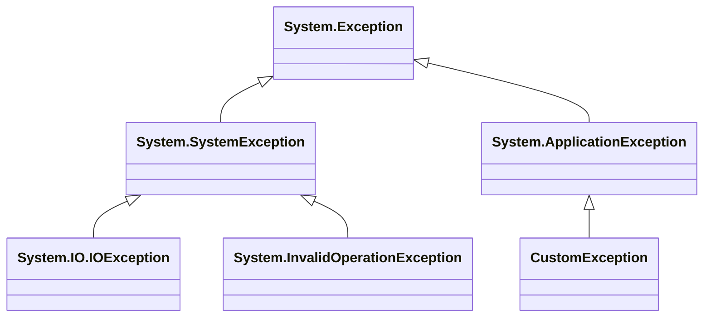

## 13.5 Exception Handling and .NET Exceptions

In the realm of software development, exceptions are an inevitable part of the process. They represent unexpected situations that require special handling to maintain the stability and reliability of applications. In this section, we will explore how to effectively handle exceptions in F#, particularly within the context of the .NET framework. We'll delve into the basics of exception handling in F#, discuss interoperability with other .NET languages, and provide best practices for robust error management.

### Exception Basics in F#

F# provides a powerful mechanism for handling exceptions through the `try...with` expression. This construct allows you to catch and handle exceptions in a structured manner, similar to the `try...catch` block in C#.

```fsharp
try
    // Code that may throw an exception
    let result = 10 / 0
    printfn "Result: %d" result
with
| :? System.DivideByZeroException as ex ->
    printfn "Caught exception: %s" ex.Message
| ex ->
    printfn "Unexpected exception: %s" ex.Message
```

In this example, we attempt to divide by zero, which raises a `System.DivideByZeroException`. The `try...with` expression catches this specific exception and prints a message. The `:?` operator is used to match the exception type, and the `as` keyword binds the exception to a variable for further inspection.

### Catching Specific Exceptions

Handling specific exceptions allows you to respond appropriately to different error conditions. In F#, you can catch specific .NET exceptions, such as `ArgumentNullException`, by using pattern matching within the `try...with` block.

```fsharp
let processInput input =
    try
        if input = null then raise (System.ArgumentNullException("input"))
        printfn "Processing input: %s" input
    with
    | :? System.ArgumentNullException as ex ->
        printfn "Input cannot be null: %s" ex.Message
    | ex ->
        printfn "An error occurred: %s" ex.Message

processInput null
```

In this example, we explicitly raise an `ArgumentNullException` if the input is null. The `try...with` block catches this exception and handles it accordingly.

### Throwing Exceptions

In F#, you can raise exceptions using the `raise` keyword or the `failwith` function. The `raise` keyword is used to throw a specific exception, while `failwith` is a convenient way to throw a generic `System.Exception` with a custom message.

```fsharp
let divide x y =
    if y = 0 then raise (System.DivideByZeroException("Cannot divide by zero"))
    else x / y

let result = try divide 10 0 with ex -> printfn "Error: %s" ex.Message

let failExample () =
    failwith "This is a failure example"

try
    failExample()
with
| ex -> printfn "Caught exception: %s" ex.Message
```

### Interoperability

One of the strengths of the .NET framework is its interoperability between different languages. Exceptions thrown in C# or VB.NET can be caught in F#, and vice versa. This seamless integration allows developers to handle exceptions consistently across language boundaries.

#### Catching C# Exceptions in F#

Suppose you have a C# library that throws a custom exception:

```csharp
// C# code
public class CustomException : Exception
{
    public CustomException(string message) : base(message) { }
}

public class Example
{
    public void ThrowException()
    {
        throw new CustomException("This is a custom exception from C#");
    }
}
```

You can catch this exception in F# as follows:

```fsharp
open System

let example = new Example()

try
    example.ThrowException()
with
| :? CustomException as ex ->
    printfn "Caught custom exception: %s" ex.Message
| ex ->
    printfn "Caught unexpected exception: %s" ex.Message
```

#### Throwing F# Exceptions to C#

Similarly, you can throw exceptions from F# that are caught in C#:

```fsharp
// F# code
let throwFSharpException () =
    raise (System.InvalidOperationException("This is an exception from F#"))

// C# code
try
{
    FSharpLibrary.throwFSharpException();
}
catch (InvalidOperationException ex)
{
    Console.WriteLine($"Caught exception from F#: {ex.Message}");
}
```

### Custom Exceptions

Defining custom exceptions in F# allows you to create meaningful error messages and encapsulate specific error conditions. Custom exceptions are typically derived from the `System.Exception` class.

```fsharp
type CustomException(message: string) =
    inherit System.Exception(message)

let throwCustomException () =
    raise (CustomException("This is a custom exception"))

try
    throwCustomException()
with
| :? CustomException as ex ->
    printfn "Caught custom exception: %s" ex.Message
| ex ->
    printfn "Caught unexpected exception: %s" ex.Message
```

### Exception Hierarchy

Understanding the .NET exception hierarchy is crucial for effective exception handling. The base class for all exceptions in .NET is `System.Exception`. Derived classes represent specific error conditions, such as `System.ArgumentException`, `System.InvalidOperationException`, and `System.IO.IOException`.



This diagram illustrates the hierarchy of exceptions in .NET. Custom exceptions can be derived from `System.ApplicationException` or directly from `System.Exception`.

### Best Practices

When it comes to exception handling, following best practices ensures that your code remains robust and maintainable.

- **Minimal Use of Exceptions for Control Flow**: Avoid using exceptions for regular control flow. Instead, use them for exceptional conditions that disrupt normal execution.

- **Use `Result` or `Option` Types**: In F#, prefer using `Result` or `Option` types for error handling when appropriate. These types provide a functional approach to managing errors without relying on exceptions.

```fsharp
let divideSafely x y =
    if y = 0 then None
    else Some (x / y)

match divideSafely 10 0 with
| Some result -> printfn "Result: %d" result
| None -> printfn "Cannot divide by zero"
```

### Async Exception Handling

Handling exceptions in asynchronous workflows requires special consideration. In F#, you can use `async` workflows to manage asynchronous operations and handle exceptions within them.

```fsharp
open System

let asyncOperation () = async {
    try
        // Simulate an asynchronous operation that may fail
        do! Async.Sleep 1000
        raise (InvalidOperationException("Async operation failed"))
    with
    | :? InvalidOperationException as ex ->
        printfn "Caught async exception: %s" ex.Message
}

Async.Start(asyncOperation())
```

### Logging and Diagnostics

Logging exceptions and providing diagnostic information are essential for troubleshooting and maintaining applications. Use logging frameworks, such as Serilog or NLog, to capture exception details and context.

```fsharp
open Serilog

let logger = LoggerConfiguration().WriteTo.Console().CreateLogger()

let logException ex =
    logger.Error("Exception occurred: {Message}", ex.Message)

try
    raise (System.Exception("Sample exception"))
with
| ex ->
    logException ex
```

### Examples

Let's explore some practical scenarios where exception handling is crucial.

#### Example 1: File Reading

```fsharp
open System.IO

let readFile path =
    try
        let content = File.ReadAllText(path)
        printfn "File content: %s" content
    with
    | :? FileNotFoundException as ex ->
        printfn "File not found: %s" ex.Message
    | :? UnauthorizedAccessException as ex ->
        printfn "Access denied: %s" ex.Message
    | ex ->
        printfn "An error occurred: %s" ex.Message

readFile "nonexistent.txt"
```

#### Example 2: Network Request

```fsharp
open System.Net.Http

let fetchUrl url = async {
    use client = new HttpClient()
    try
        let! response = client.GetStringAsync(url) |> Async.AwaitTask
        printfn "Response: %s" response
    with
    | :? HttpRequestException as ex ->
        printfn "Request failed: %s" ex.Message
    | ex ->
        printfn "Unexpected error: %s" ex.Message
}

Async.Start(fetchUrl "http://example.com")
```

### Try It Yourself

Experiment with the code examples provided in this section. Try modifying the exception types, messages, and handling logic to see how the behavior changes. Consider integrating logging frameworks to capture detailed exception information.

### Knowledge Check

- What is the purpose of the `try...with` expression in F#?
- How can you catch specific .NET exceptions in F#?
- What is the difference between `raise` and `failwith` in F#?
- How do you handle exceptions in asynchronous workflows?
- Why is it recommended to use `Result` or `Option` types for error handling?

### Embrace the Journey

Remember, mastering exception handling is a journey. As you progress, you'll encounter more complex scenarios that require thoughtful error management. Keep experimenting, stay curious, and enjoy the process of building robust applications.

## Quiz Time!



### What is the primary purpose of the `try...with` expression in F#?

- [x] To handle exceptions in a structured manner
- [ ] To declare variables
- [ ] To define functions
- [ ] To perform asynchronous operations

> **Explanation:** The `try...with` expression in F# is used to handle exceptions by catching and managing them in a structured way.

### How can you catch a specific .NET exception, such as `ArgumentNullException`, in F#?

- [x] Using pattern matching within the `try...with` block
- [ ] By using the `catch` keyword
- [ ] By declaring a new exception handler
- [ ] By using the `finally` block

> **Explanation:** In F#, specific .NET exceptions can be caught using pattern matching within the `try...with` block.

### What is the difference between `raise` and `failwith` in F#?

- [x] `raise` throws a specific exception, while `failwith` throws a generic exception with a message
- [ ] `raise` is used for logging, while `failwith` is for throwing exceptions
- [ ] `raise` is for asynchronous operations, while `failwith` is for synchronous operations
- [ ] `raise` is for input validation, while `failwith` is for output validation

> **Explanation:** `raise` is used to throw a specific exception, whereas `failwith` is a convenience function to throw a generic exception with a custom message.

### How do you handle exceptions in asynchronous workflows in F#?

- [x] By using `try...with` inside an `async` block
- [ ] By using `catch` inside an `async` block
- [ ] By using `await` inside a `try...catch` block
- [ ] By using `async` inside a `try...catch` block

> **Explanation:** In F#, exceptions in asynchronous workflows are handled using `try...with` inside an `async` block.

### Why is it recommended to use `Result` or `Option` types for error handling in F#?

- [x] They provide a functional approach to managing errors without relying on exceptions
- [ ] They are faster than exceptions
- [ ] They are easier to implement than exceptions
- [ ] They are the only way to handle errors in F#

> **Explanation:** `Result` and `Option` types offer a functional approach to error handling, allowing developers to manage errors without relying on exceptions.

### What is the base class for all exceptions in .NET?

- [x] System.Exception
- [ ] System.ApplicationException
- [ ] System.SystemException
- [ ] System.BaseException

> **Explanation:** `System.Exception` is the base class for all exceptions in the .NET framework.

### How can you define a custom exception in F#?

- [x] By creating a new type that inherits from `System.Exception`
- [ ] By using the `exception` keyword
- [ ] By using the `custom` keyword
- [ ] By using the `new` keyword

> **Explanation:** In F#, a custom exception is defined by creating a new type that inherits from `System.Exception`.

### Which logging framework can be used to capture exception details in F#?

- [x] Serilog
- [ ] Log4j
- [ ] Logback
- [ ] NLog

> **Explanation:** Serilog is a popular logging framework that can be used in F# to capture exception details and context.

### What is the recommended way to handle exceptions in file reading operations?

- [x] By using `try...with` to catch specific exceptions like `FileNotFoundException`
- [ ] By using `failwith` to throw exceptions
- [ ] By using `raise` to throw exceptions
- [ ] By ignoring exceptions

> **Explanation:** In file reading operations, it is recommended to use `try...with` to catch specific exceptions like `FileNotFoundException` for robust error handling.

### True or False: Exceptions thrown in C# can be caught in F#.

- [x] True
- [ ] False

> **Explanation:** Due to the interoperability of the .NET framework, exceptions thrown in C# can indeed be caught in F#.


