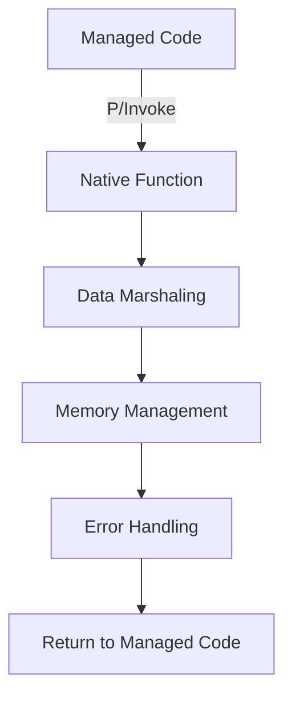

## 13.6 Interoperability with Native Code

In the realm of software development, the ability to interface with native code is a powerful tool in a developer's arsenal. F#, as a language built on the .NET framework, provides robust mechanisms to interact with native libraries through Platform Invocation Services (P/Invoke) and Foreign Function Interface (FFI). This section will delve into the intricacies of these interactions, providing you with the knowledge to harness native code effectively and safely within your F# applications.

### Introduction to P/Invoke

**Platform Invocation Services (P/Invoke)** is a feature of the .NET framework that allows managed code to call unmanaged functions implemented in dynamic link libraries (DLLs), such as those in the Windows API. P/Invoke is particularly useful when you need to access system-level functions or leverage existing native libraries that provide functionality not available in managed code.

#### When to Use P/Invoke

- **Accessing System APIs**: When you need to call operating system services that are not exposed through .NET.
- **Leveraging Existing Libraries**: When a required functionality is already implemented in a native library.
- **Performance**: In scenarios where native code offers performance benefits over managed code.

### Declaring External Functions

To call a native function using P/Invoke, you must declare it in your F# code using the `[<DllImport>]` attribute. This attribute specifies the DLL containing the function and its calling convention.

#### Syntax for Using `[<DllImport>]`

Here is the basic syntax for declaring an external function:

```fsharp
open System.Runtime.InteropServices

[<DllImport("kernel32.dll", SetLastError = true)>]
extern bool Beep(uint32 dwFreq, uint32 dwDuration)
```

- **`DllImport` Attribute**: Specifies the DLL name and additional options like `SetLastError`.
- **`extern` Keyword**: Indicates that the function is implemented externally.
- **Function Signature**: Must match the signature of the native function.

### Data Marshaling

Data marshaling is the process of converting data types between managed and unmanaged environments. This conversion is crucial for ensuring that data is correctly interpreted on both sides of the boundary.

#### Common Data Types

- **Integers**: Directly mapped between managed and unmanaged code.
- **Strings**: Use `StringBuilder` for mutable strings or specify marshaling behavior with attributes.
- **Structures**: Use `[<StructLayout>]` to control layout and alignment.

#### Marshaling Strings

Strings require special handling due to differences in memory management between managed and unmanaged environments.

```fsharp
[<DllImport("user32.dll", CharSet = CharSet.Auto)>]
extern int MessageBox(IntPtr hWnd, string lpText, string lpCaption, uint uType)
```

- **`CharSet` Attribute**: Specifies how strings are marshaled (e.g., `CharSet.Auto`, `CharSet.Unicode`).

### Memory Management

Interacting with native code often involves manual memory management. Understanding who allocates and frees memory is crucial to prevent leaks and corruption.

#### Allocating and Freeing Memory

- **Managed Code**: The .NET garbage collector handles memory.
- **Unmanaged Code**: You must explicitly manage memory using the `Marshal` class.

```fsharp
open System.Runtime.InteropServices

let ptr = Marshal.AllocHGlobal(100) // Allocate 100 bytes
Marshal.FreeHGlobal(ptr) // Free the allocated memory
```

#### Using the `Marshal` Class

The `Marshal` class provides methods for memory allocation, copying, and conversion between managed and unmanaged types.

### Safety Practices

Ensuring safety when interacting with native code is paramount. Here are some best practices:

- **Validate Inputs and Outputs**: Always check that data passed to and from native code is valid.
- **Use `SafeHandle`**: Encapsulate unmanaged resources to ensure they are released correctly.

```fsharp
open Microsoft.Win32.SafeHandles

type SafeFileHandle() =
    inherit SafeHandleZeroOrMinusOneIsInvalid(true)

    override this.ReleaseHandle() =
        CloseHandle(this.handle) // Assume CloseHandle is a P/Invoke call
```

### Examples of Calling Native Functions

Let's look at a practical example of calling a Win32 API function using P/Invoke.

#### Example: Calling the `Beep` Function

```fsharp
open System.Runtime.InteropServices

[<DllImport("kernel32.dll", SetLastError = true)>]
extern bool Beep(uint32 dwFreq, uint32 dwDuration)

let playBeep() =
    if Beep(750u, 300u) then
        printfn "Beep played successfully"
    else
        printfn "Failed to play beep"
```

### Error Handling

Handling errors from native code requires checking for error conditions and using system-provided mechanisms like `GetLastError`.

```fsharp
[<DllImport("kernel32.dll", SetLastError = true)>]
extern bool Beep(uint32 dwFreq, uint32 dwDuration)

let playBeepWithErrorHandling() =
    if not (Beep(750u, 300u)) then
        let error = Marshal.GetLastWin32Error()
        printfn "Error playing beep: %d" error
```

### Advanced Topics

#### Callbacks and Delegates

Native functions may require callbacks, which can be implemented using delegates in F#.

```fsharp
type CallbackDelegate = delegate of int -> unit

[<DllImport("SomeNativeLib.dll")>]
extern void RegisterCallback(CallbackDelegate callback)

let callbackFunction (value: int) =
    printfn "Callback received value: %d" value

let registerCallback() =
    let callback = CallbackDelegate(callbackFunction)
    RegisterCallback(callback)
```

#### Handling Unmanaged Events

Handling events from unmanaged code involves setting up mechanisms to receive and process these events in managed code.

### Debugging Native Interop Issues

Debugging issues in native interop can be challenging. Here are some tips:

- **Mixed-Mode Debugging**: Use Visual Studio's mixed-mode debugging to step through both managed and unmanaged code.
- **Check Marshaling**: Ensure data types are correctly marshaled.
- **Validate P/Invoke Signatures**: Double-check that your P/Invoke declarations match the native function signatures.

### Platform Considerations

When targeting different architectures, such as x86 vs. x64, be aware of differences in data types and calling conventions.

- **Pointer Sizes**: Ensure pointer sizes match the target architecture.
- **Calling Conventions**: Verify that the calling convention used in P/Invoke matches the native function.

### Visualizing F# and Native Code Interaction

To better understand how F# interacts with native code, let's visualize the process using a flowchart.



**Figure 1**: This flowchart illustrates the interaction between managed F# code and native functions, highlighting key steps such as P/Invoke, data marshaling, memory management, and error handling.

### Try It Yourself

Experiment with the provided examples by modifying parameters or extending functionality. For instance, try calling other Win32 API functions or create your own native library to interact with.

### Knowledge Check

- Why is data marshaling important in P/Invoke?
- How can you manage memory when interacting with native code?
- What are some safety practices to follow when using P/Invoke?

### Conclusion

Interoperability with native code in F# through P/Invoke is a powerful capability that allows you to leverage existing native libraries and system APIs. By understanding the principles of data marshaling, memory management, and safety practices, you can effectively and safely integrate native code into your F# applications. Remember, this is just the beginning. As you progress, you'll be able to build more complex and efficient applications that harness the full power of both managed and unmanaged code. Keep experimenting, stay curious, and enjoy the journey!

## Quiz Time!



### What is P/Invoke used for in F#?

- [x] To call unmanaged functions from dynamic link libraries
- [ ] To manage memory automatically
- [ ] To compile F# code to native code
- [ ] To create graphical user interfaces

> **Explanation:** P/Invoke is used to call unmanaged functions from DLLs, allowing managed code to interact with native libraries.

### Which attribute is used to declare an external function in F#?

- [x] `[<DllImport>]`
- [ ] `[<ExternFunction>]`
- [ ] `[<ImportDll>]`
- [ ] `[<NativeFunction>]`

> **Explanation:** The `[<DllImport>]` attribute is used to declare external functions in F#, specifying the DLL and calling conventions.

### What is the purpose of data marshaling in P/Invoke?

- [x] To convert data types between managed and unmanaged environments
- [ ] To allocate memory for managed objects
- [ ] To compile F# code to native binaries
- [ ] To optimize performance of managed code

> **Explanation:** Data marshaling is the process of converting data types between managed and unmanaged environments to ensure correct interpretation.

### Which class provides methods for manual memory management in F#?

- [x] `Marshal`
- [ ] `MemoryManager`
- [ ] `GC`
- [ ] `MemoryAllocator`

> **Explanation:** The `Marshal` class provides methods for manual memory management, such as allocating and freeing unmanaged memory.

### How can you ensure safety when interacting with native code?

- [x] Validate inputs and outputs
- [x] Use `SafeHandle` for resource management
- [ ] Ignore compiler warnings
- [ ] Use global variables for data sharing

> **Explanation:** Validating inputs and outputs and using `SafeHandle` are important safety practices when interacting with native code.

### What is a common use case for using delegates in P/Invoke?

- [x] Implementing callbacks for native functions
- [ ] Allocating unmanaged memory
- [ ] Compiling F# code to native binaries
- [ ] Managing garbage collection

> **Explanation:** Delegates are commonly used to implement callbacks for native functions, allowing managed code to respond to events.

### What is mixed-mode debugging used for?

- [x] Debugging both managed and unmanaged code
- [ ] Optimizing performance of managed code
- [ ] Compiling F# code to native binaries
- [ ] Managing memory automatically

> **Explanation:** Mixed-mode debugging allows developers to step through both managed and unmanaged code, facilitating debugging of interop issues.

### What should you check when targeting different architectures with P/Invoke?

- [x] Pointer sizes and calling conventions
- [ ] Memory allocation methods
- [ ] Garbage collection settings
- [ ] Compiler optimizations

> **Explanation:** When targeting different architectures, ensure pointer sizes and calling conventions match the native function specifications.

### What is the role of the `Marshal` class in F#?

- [x] To provide methods for memory allocation and data conversion
- [ ] To compile F# code to native binaries
- [ ] To manage garbage collection
- [ ] To create graphical user interfaces

> **Explanation:** The `Marshal` class provides methods for memory allocation and data conversion between managed and unmanaged environments.

### True or False: P/Invoke allows F# to call functions implemented in managed libraries.

- [ ] True
- [x] False

> **Explanation:** False. P/Invoke is used to call functions implemented in unmanaged libraries, such as DLLs, from managed code.


