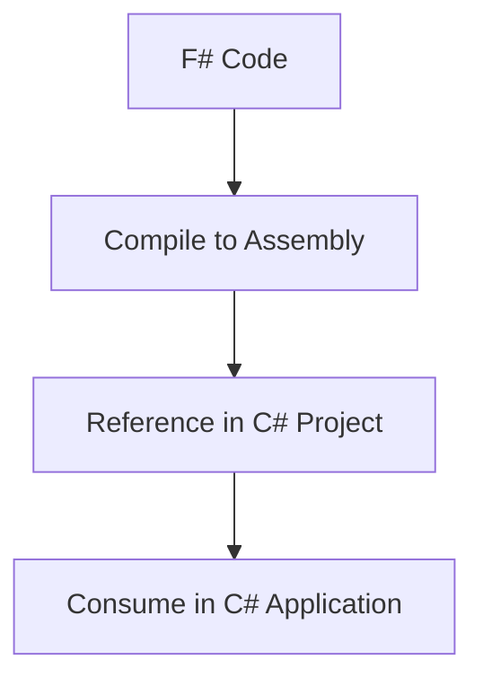

## 13.8 Exposing F# Libraries to Other Languages

In today's interconnected software landscape, the ability to expose F# libraries to other languages within the .NET ecosystem, such as C#, is a crucial skill for software engineers and architects. This guide will walk you through the best practices and techniques for designing F# libraries that are easily consumable by other .NET languages, ensuring seamless interoperability and maximizing the utility of your F# code.

### Designing Public APIs

When designing public APIs in F#, it's essential to consider the consumers of your library, especially if they are using languages like C# or VB.NET. Here are some key points to keep in mind:

- **Avoid F#-Specific Constructs**: While F# offers powerful constructs like discriminated unions and pattern matching, these may not be directly accessible or intuitive in other languages. Aim to use constructs that are common across .NET languages.

- **Use .NET Standard Types**: Prefer using .NET standard types such as `List<T>`, `Dictionary<TKey, TValue>`, and `Task` in your public interfaces. This ensures that your API is familiar and accessible to developers using other .NET languages.

#### Example: Designing a Public API

```fsharp
// F# Library Code
namespace MyFSharpLibrary

open System.Collections.Generic

type Calculator() =
    /// Adds two numbers and returns the result.
    member this.Add(x: int, y: int) : int =
        x + y

    /// Returns a list of even numbers from the input list.
    member this.GetEvenNumbers(numbers: List<int>) : List<int> =
        numbers |> List.filter (fun n -> n % 2 = 0)
```

In this example, we use `List<int>` instead of F#'s native list type to ensure compatibility with other .NET languages.

### Exposing Functions and Methods

To make F# functions callable from other languages, you need to expose them as methods. This involves considering method overloading, naming conventions, and accessibility.

- **Method Overloading**: Ensure that overloaded methods have distinct signatures that are clear to consumers.
- **Naming Conventions**: Follow .NET naming conventions to maintain consistency and readability.
- **Accessibility**: Use public access modifiers to expose methods and types.

#### Example: Exposing Methods

```fsharp
namespace MyFSharpLibrary

type MathOperations() =
    /// Adds two integers.
    member this.Add(x: int, y: int) : int = x + y

    /// Adds two floating-point numbers.
    member this.Add(x: float, y: float) : float = x + y
```

### Handling F# Specific Types

F# offers unique types such as options, tuples, and records, which may not have direct equivalents in other languages. Here's how to handle them:

- **Options**: Represent `Option<T>` as nullable types or use a `Result<T, TError>` pattern.
- **Tuples**: Convert tuples to custom classes or structs for better compatibility.
- **Records**: Use classes or structs to represent records, ensuring they are accessible in other languages.

#### Example: Handling F# Options

```fsharp
namespace MyFSharpLibrary

type OptionHandler() =
    /// Converts an F# option to a nullable type.
    member this.ToNullable(option: int option) : Nullable<int> =
        match option with
        | Some value -> Nullable(value)
        | None -> Nullable()
```

### Compiling Assemblies

To use F# libraries in other .NET projects, you need to compile them into assemblies. This process involves setting up your project correctly and ensuring that all dependencies are resolved.

- **Project Setup**: Use the .NET CLI or Visual Studio to create and build your F# library project.
- **Dependencies**: Ensure that all dependencies are included in the output assembly.

#### Example: Building an F# Project

```shell
dotnet new classlib -lang F# -o MyFSharpLibrary
dotnet build MyFSharpLibrary
```

### Example Usage in C#

Once your F# library is compiled into an assembly, you can consume it in a C# application. Here's how you can do it:

#### Example: Consuming F# Library in C#

```csharp
using System;
using MyFSharpLibrary;

class Program
{
    static void Main()
    {
        var calculator = new Calculator();
        int sum = calculator.Add(3, 5);
        Console.WriteLine($"Sum: {sum}");

        var numbers = new List<int> { 1, 2, 3, 4, 5 };
        var evenNumbers = calculator.GetEvenNumbers(numbers);
        Console.WriteLine("Even Numbers: " + string.Join(", ", evenNumbers));
    }
}
```

### Documentation and Metadata

Providing comprehensive documentation and metadata is crucial for the usability of your F# libraries. Use XML documentation comments to describe your API, and ensure that metadata is accurate and informative.

- **XML Documentation**: Annotate your code with XML comments to generate documentation.
- **Metadata**: Include versioning and author information in your assembly metadata.

#### Example: XML Documentation

```fsharp
namespace MyFSharpLibrary

/// <summary>
/// Provides mathematical operations.
/// </summary>
type Calculator() =
    /// <summary>
    /// Adds two integers.
    /// </summary>
    /// <param name="x">The first integer.</param>
    /// <param name="y">The second integer.</param>
    /// <returns>The sum of the two integers.</returns>
    member this.Add(x: int, y: int) : int = x + y
```

### Best Practices

To ensure your F# libraries are robust and easy to use, follow these best practices:

- **Avoid Inline Functions**: Inline functions can complicate interoperability. Use regular functions instead.
- **Thorough Testing**: Test your library from the perspective of the consumer language to ensure compatibility and usability.
- **Consistent Naming**: Use consistent naming conventions across your API to improve readability.

### Tooling Support

Several tools can assist in exposing F# libraries to other languages:

- **Type Providers**: Use type providers to generate proxies for complex types.
- **F# Compiler Options**: Explore compiler options that enhance interoperability.

### Potential Pitfalls

Be aware of potential pitfalls when exposing F# libraries to other languages:

- **Exception Handling**: Differences in exception handling can lead to unexpected behavior. Ensure exceptions are properly documented and handled.
- **Threading Models**: F# and C# may have different threading models. Test concurrency scenarios thoroughly.
- **Synchronization Contexts**: Be mindful of synchronization contexts when dealing with asynchronous code.

### Visualizing the Process

To better understand the process of exposing F# libraries to other languages, consider the following diagram, which illustrates the workflow from F# code to consumption in a C# application.



This diagram shows the sequential steps involved in making your F# code available to other .NET languages.

### Try It Yourself

To solidify your understanding, try modifying the code examples provided. Experiment with different types and methods, and observe how they are consumed in a C# application. This hands-on approach will deepen your understanding of cross-language interoperability.

### Knowledge Check

- **Question**: What are some common .NET types you should use in public interfaces to ensure compatibility?
- **Exercise**: Modify the `Calculator` class to include a method that multiplies two numbers, and consume it in a C# application.

### Embrace the Journey

Remember, this is just the beginning. As you progress, you'll build more complex and interoperable libraries. Keep experimenting, stay curious, and enjoy the journey!

## Quiz Time!



### What is a key consideration when designing public APIs in F# for use by other .NET languages?

- [x] Avoiding F#-specific constructs
- [ ] Using only F# lists
- [ ] Implementing inline functions
- [ ] Ignoring .NET naming conventions

> **Explanation:** Avoiding F#-specific constructs ensures that the API is accessible and understandable to developers using other .NET languages.

### Which .NET standard type is recommended for use in public interfaces instead of F# lists?

- [x] List<T>
- [ ] FSharpList<T>
- [ ] Array<T>
- [ ] IEnumerable<T>

> **Explanation:** List<T> is a common .NET type that is familiar and accessible to developers using other .NET languages.

### How can F# options be represented in a way that other languages can consume them?

- [x] As nullable types or using a Result<T, TError> pattern
- [ ] As F# lists
- [ ] As arrays
- [ ] As dictionaries

> **Explanation:** Representing F# options as nullable types or using a Result<T, TError> pattern makes them accessible to other languages.

### What is a potential pitfall when exposing F# libraries to other languages?

- [x] Differences in exception handling
- [ ] Using .NET standard types
- [ ] Providing XML documentation
- [ ] Using public access modifiers

> **Explanation:** Differences in exception handling can lead to unexpected behavior when consuming F# libraries in other languages.

### Which tool can assist in generating proxies for complex types in F#?

- [x] Type Providers
- [ ] XML Documentation
- [ ] .NET CLI
- [ ] Visual Studio

> **Explanation:** Type Providers can generate proxies for complex types, facilitating interoperability with other languages.

### What should be included in your assembly metadata for usability?

- [x] Versioning and author information
- [ ] Only the assembly name
- [ ] Inline functions
- [ ] F#-specific constructs

> **Explanation:** Including versioning and author information in your assembly metadata ensures that consumers have the necessary context for using your library.

### How can you ensure that your F# library is robust and easy to use?

- [x] Thorough testing from the consumer's perspective
- [ ] Using inline functions
- [ ] Avoiding XML documentation
- [ ] Ignoring .NET naming conventions

> **Explanation:** Thorough testing from the consumer's perspective ensures compatibility and usability of your F# library.

### Which of the following is a recommended practice when exposing F# libraries to other languages?

- [x] Using consistent naming conventions
- [ ] Using internal types in public APIs
- [ ] Avoiding method overloading
- [ ] Ignoring accessibility modifiers

> **Explanation:** Using consistent naming conventions improves readability and usability of your API.

### What is the first step in making your F# code available to other .NET languages?

- [x] Compile to Assembly
- [ ] Write XML documentation
- [ ] Test from the consumer's perspective
- [ ] Use inline functions

> **Explanation:** Compiling your F# code into an assembly is the first step in making it available to other .NET languages.

### True or False: F# records can be directly consumed by other .NET languages without any modifications.

- [ ] True
- [x] False

> **Explanation:** F# records may need to be represented as classes or structs to be directly consumed by other .NET languages.


