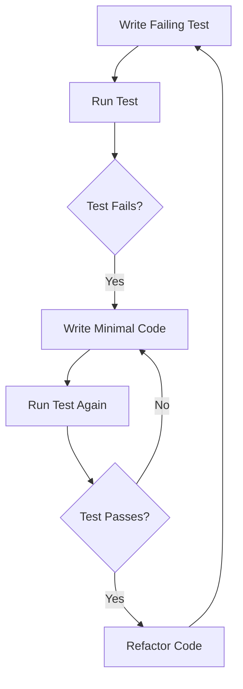

## 14.1 Test-Driven Development (TDD) in F#

Incorporating Test-Driven Development (TDD) into functional programming with F# can significantly enhance code quality and reliability. This section delves into the principles of TDD, its alignment with functional programming paradigms, and practical implementation in F#.

### Introduction to Test-Driven Development (TDD)

Test-Driven Development (TDD) is a software development approach where tests are written before the actual code. This methodology is characterized by the Red-Green-Refactor cycle:

1. **Red**: Write a test that fails because the functionality isn't implemented yet.
2. **Green**: Write the minimal amount of code necessary to pass the test.
3. **Refactor**: Improve the code while ensuring that all tests still pass.

#### Benefits of TDD

- **Improved Code Quality**: By writing tests first, developers are forced to consider the requirements and edge cases upfront.
- **Iterative Development**: Encourages small, incremental changes, making it easier to identify and fix bugs.
- **Documentation**: Tests serve as documentation for the code, explaining how it should behave.
- **Confidence in Changes**: With a comprehensive suite of tests, developers can refactor code with confidence, knowing that any regressions will be caught.

### TDD in Functional Programming

Functional programming (FP) emphasizes immutability, pure functions, and composability, all of which align well with TDD principles. Here's how TDD complements FP:

- **Purity and Immutability**: Pure functions, which have no side effects and return the same output for the same input, are easier to test.
- **Composability**: Functions can be composed together, allowing for modular and testable code.
- **Type Safety**: F#'s strong type system helps catch errors at compile time, reducing the need for certain runtime tests.

### Setting Up a TDD Environment in F#

To effectively practice TDD in F#, you need a well-configured development environment. Here’s how to set it up:

#### Choosing a Testing Framework

F# supports several testing frameworks. Here are some popular choices:

- **NUnit**: A widely-used testing framework in the .NET ecosystem.
- **xUnit**: Known for its extensibility and support for parallel test execution.
- **Expecto**: A functional testing library specifically designed for F#.

#### Configuring the Development Environment

1. **Install .NET SDK**: Ensure you have the .NET SDK installed on your machine.
2. **Create a New F# Project**: Use the .NET CLI to create a new F# project.
   ```bash
   dotnet new console -lang F# -o TDDExample
   cd TDDExample
   ```
3. **Add a Testing Framework**: Add your chosen testing framework to the project.
   ```bash
   dotnet add package Expecto
   ```
4. **Set Up the Test Project**: Create a test project and reference the main project.
   ```bash
   dotnet new classlib -lang F# -o TDDExample.Tests
   cd TDDExample.Tests
   dotnet add reference ../TDDExample/TDDExample.fsproj
   ```

### Writing Tests First

The essence of TDD is writing tests before the actual implementation. Let's walk through an example.

#### Example: Implementing a Simple Calculator

1. **Write a Failing Test**: Start by writing a test for a simple addition function.

   ```fsharp
   module CalculatorTests

   open Expecto

   [<Tests>]
   let tests =
       testList "Calculator Tests" [
           testCase "Addition of two numbers" <| fun _ ->
               let result = Calculator.add 2 3
               Expect.equal result 5 "Expected 2 + 3 to equal 5"
       ]
   ```

2. **Run the Test**: At this point, the test will fail because the `add` function is not implemented.

3. **Implement the Function**: Write the minimal code to pass the test.

   ```fsharp
   module Calculator

   let add x y = x + y
   ```

4. **Re-run the Test**: The test should now pass.

### Implementing Code to Pass Tests

When implementing code to pass tests, focus on writing the simplest solution that satisfies the test conditions. This approach helps avoid over-engineering and keeps the codebase clean.

#### Example: Extending the Calculator

Let's extend our calculator to handle subtraction:

1. **Write a Test for Subtraction**:

   ```fsharp
   testCase "Subtraction of two numbers" <| fun _ ->
       let result = Calculator.subtract 5 3
       Expect.equal result 2 "Expected 5 - 3 to equal 2"
   ```

2. **Implement the Subtraction Function**:

   ```fsharp
   let subtract x y = x - y
   ```

3. **Run the Tests**: Ensure both addition and subtraction tests pass.

### Refactoring

Refactoring is a critical step in TDD. It involves cleaning up the code without changing its behavior, ensuring that it remains maintainable and efficient.

#### Refactoring Techniques in F#

- **Eliminate Code Duplication**: Identify and remove redundant code.
- **Improve Function Purity**: Ensure functions are pure and side-effect-free.
- **Enhance Type Safety**: Use F#'s type system to prevent invalid states.

### Handling Side Effects

Functional programming encourages pure functions, but side effects are sometimes unavoidable, such as I/O operations. Here’s how to handle them in TDD:

#### Strategies for Testing Side Effects

- **Dependency Injection**: Inject dependencies that perform side effects, allowing them to be mocked during testing.
- **Mocking**: Use mocking frameworks to simulate side effects.
- **Isolate Side Effects**: Encapsulate side effects in separate modules or functions.

### Benefits of TDD in F#

TDD offers numerous benefits when used in F#:

- **Better-Designed Code**: Forces developers to think about design and requirements upfront.
- **Easier Maintenance**: Well-tested code is easier to maintain and extend.
- **Fewer Bugs**: Tests catch bugs early in the development process.
- **Deeper Understanding**: Writing tests first leads to a better understanding of the problem domain.

### Common Challenges and Solutions

Adopting TDD in F# can present challenges. Here are some common ones and their solutions:

- **Testing Pure Functions vs. Impure Functions**: Focus on testing the logic of pure functions and use mocks for impure functions.
- **Complex Test Cases**: Break down complex scenarios into smaller, manageable tests.
- **Resistance to Change**: Encourage incremental adoption and demonstrate the long-term benefits of TDD.

### Real-World Examples

#### Case Study: Improving a Financial Application

In a financial application, TDD was used to implement complex interest calculation algorithms. By writing tests first, the development team was able to identify edge cases and ensure accuracy, resulting in a more reliable application.

### Encouraging TDD Adoption

To encourage TDD adoption, highlight its long-term benefits:

- **Incremental Approach**: Start with critical components and gradually expand.
- **Team Workshops**: Conduct workshops to demonstrate TDD practices.
- **Success Stories**: Share success stories and case studies.

### Try It Yourself

Experiment with the calculator example by adding new operations, such as multiplication or division. Write tests first, then implement the functionality. This exercise will reinforce the TDD cycle and its benefits.

### Visualizing the TDD Workflow



This diagram illustrates the TDD cycle, emphasizing the iterative nature of development.

### Knowledge Check

- **What is the primary benefit of writing tests before code?**
- **How does TDD align with functional programming principles?**
- **What are some strategies for testing code with side effects?**

### Conclusion

Incorporating TDD into your F# projects can lead to more robust, maintainable, and reliable software. By following the TDD cycle and leveraging F#'s functional programming features, you can improve both the quality of your code and your understanding of the problem domain.

Remember, this is just the beginning. As you progress, you'll build more complex and interactive applications. Keep experimenting, stay curious, and enjoy the journey!

## Quiz Time!



### What is the first step in the TDD cycle?

- [x] Write a failing test
- [ ] Implement the code
- [ ] Refactor the code
- [ ] Run the test

> **Explanation:** The first step in TDD is to write a test that fails because the functionality isn't implemented yet.

### How does TDD complement functional programming?

- [x] By emphasizing purity and immutability
- [ ] By focusing on object-oriented design
- [ ] By allowing side effects
- [ ] By using mutable state

> **Explanation:** TDD complements functional programming by aligning with its principles of purity and immutability.

### Which testing framework is specifically designed for F#?

- [ ] NUnit
- [ ] xUnit
- [x] Expecto
- [ ] MSTest

> **Explanation:** Expecto is a functional testing library specifically designed for F#.

### What is the purpose of refactoring in TDD?

- [ ] To add new features
- [x] To improve code without changing its behavior
- [ ] To write more tests
- [ ] To delete unnecessary code

> **Explanation:** Refactoring is about cleaning up the code to improve its structure and maintainability without altering its behavior.

### How can side effects be managed in TDD?

- [x] Using dependency injection
- [ ] Ignoring them
- [ ] Using global variables
- [ ] Writing more tests

> **Explanation:** Dependency injection allows for side effects to be managed and tested effectively.

### What is a common challenge when adopting TDD in F#?

- [x] Testing pure functions vs. impure functions
- [ ] Writing too many tests
- [ ] Ignoring the refactor step
- [ ] Using too many frameworks

> **Explanation:** Testing pure functions vs. impure functions is a common challenge due to the nature of functional programming.

### Which of the following is a benefit of TDD?

- [x] Better-designed code
- [ ] Longer development time
- [ ] More complex code
- [ ] Less documentation

> **Explanation:** TDD leads to better-designed code by forcing developers to think about requirements and design upfront.

### What is the role of tests in TDD?

- [x] To serve as documentation
- [ ] To slow down development
- [ ] To replace code comments
- [ ] To increase complexity

> **Explanation:** Tests in TDD serve as documentation, explaining how the code should behave.

### How does TDD promote a deeper understanding of requirements?

- [x] By requiring tests to be written first
- [ ] By focusing on implementation details
- [ ] By ignoring edge cases
- [ ] By using complex algorithms

> **Explanation:** Writing tests first forces developers to consider requirements and edge cases upfront, leading to a deeper understanding.

### TDD is only applicable to functional programming.

- [ ] True
- [x] False

> **Explanation:** TDD is a methodology that can be applied to any programming paradigm, not just functional programming.


