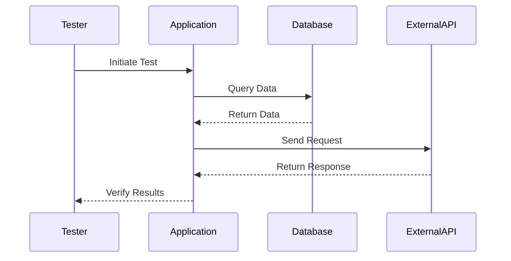

## 14.12 Integration Testing

In the realm of software development, ensuring that individual components work seamlessly together is as crucial as verifying their individual correctness. This is where integration testing comes into play. In this section, we will delve into the nuances of integration testing within the context of F#, explore its goals, and provide practical strategies and examples for effective implementation.

### Defining Integration Testing

Integration testing is a critical phase in the software testing lifecycle, positioned between unit testing and system testing. While unit testing focuses on verifying the functionality of individual components or functions in isolation, integration testing aims to validate the interactions and data flow between these components. It ensures that integrated units work together as expected, uncovering issues that may not surface during unit testing.

#### The Role of Integration Testing

Integration testing serves as a bridge between unit testing and system testing. It verifies that the interfaces between modules are correctly implemented and that the modules interact as intended. This type of testing is essential for detecting interface defects, ensuring data integrity, and validating the behavior of combined components.

### Goals of Integration Testing

The primary objectives of integration testing include:

- **Verifying Interactions**: Confirm that components communicate correctly and data flows seamlessly between them.
- **Detecting Interface Defects**: Identify issues related to the integration points, such as incorrect data formats or communication protocols.
- **Ensuring Data Integrity**: Validate that data is accurately passed and transformed across different modules.
- **Testing System Behavior**: Assess the overall behavior of the system when components are integrated, including performance and reliability.

### Setting Up Integration Tests in F#

Organizing integration tests effectively is crucial for maintaining a clean and efficient testing process. Consider the following strategies when setting up integration tests in F#:

#### Organizing Integration Tests

- **Separate Projects**: Create a dedicated project or folder for integration tests within your solution. This separation helps in managing dependencies and configurations specific to integration testing.
- **Test Categories**: Use attributes to categorize tests, allowing you to run specific groups of tests as needed. This can be particularly useful for distinguishing between unit and integration tests.

#### Selecting What to Test

Identifying critical integrations to focus on is essential for effective integration testing. Consider the following areas:

- **Database Interactions**: Test the integration with databases to ensure data is correctly stored, retrieved, and manipulated.
- **API Calls**: Validate the interactions with external APIs, ensuring that requests and responses are handled correctly.
- **Service Communications**: Test the communication between microservices or components, focusing on message formats and protocols.

### Testing Databases

Database interactions are a common focus of integration testing. Here’s how to effectively test database integrations in F#:

#### Writing Integration Tests for Databases

- **Setup and Teardown**: Use setup and teardown methods to prepare the database state before tests and clean up afterward. This ensures tests are repeatable and do not interfere with each other.
- **In-Memory Databases**: Consider using in-memory databases for testing purposes. They provide a lightweight and fast alternative to real databases, allowing you to test database logic without the overhead of a full database setup.

```fsharp
open System
open Microsoft.Data.Sqlite
open Dapper

let setupDatabase connectionString =
    use connection = new SqliteConnection(connectionString)
    connection.Open()
    connection.Execute("CREATE TABLE IF NOT EXISTS Users (Id INTEGER PRIMARY KEY, Name TEXT)")

let teardownDatabase connectionString =
    use connection = new SqliteConnection(connectionString)
    connection.Open()
    connection.Execute("DROP TABLE IF EXISTS Users")

let testDatabaseInteraction () =
    let connectionString = "Data Source=:memory:"
    setupDatabase connectionString

    // Perform database operations
    use connection = new SqliteConnection(connectionString)
    connection.Execute("INSERT INTO Users (Name) VALUES (@Name)", new { Name = "Alice" })
    let users = connection.Query("SELECT * FROM Users")

    // Assert results
    assert (users |> Seq.length = 1)
    assert (users |> Seq.head |> fun user -> user.Name = "Alice")

    teardownDatabase connectionString
```

#### Using Mocks and Stubs

When testing components that interact with databases, consider using mocks or stubs to simulate database behavior. This approach allows you to test the logic without relying on a real database.

### Testing External Services

Integrating with external services is another critical aspect of integration testing. Here’s how to approach it:

#### Testing Integrations with External APIs

- **Stubs and Simulated Environments**: Use stubs or simulated environments to mimic the behavior of external services. This allows you to test your application’s response to various scenarios without relying on the actual service.

```fsharp
open System.Net.Http
open System.Threading.Tasks

let simulateExternalApiResponse () =
    Task.FromResult(new HttpResponseMessage(System.Net.HttpStatusCode.OK) {
        Content = new StringContent("{\"status\":\"success\"}")
    })

let testExternalApiIntegration () =
    let httpClient = new HttpClient()
    
    // Simulate API call
    let responseTask = simulateExternalApiResponse()
    let response = responseTask.Result

    // Assert response
    assert (response.StatusCode = System.Net.HttpStatusCode.OK)
    assert (response.Content.ReadAsStringAsync().Result.Contains("success"))
```

### Tools and Frameworks

Several tools and frameworks can facilitate integration testing in F#:

- **Docker**: Use Docker to containerize dependencies, ensuring consistent test environments across different machines.
- **WireMock**: Utilize WireMock to mock HTTP services, allowing you to simulate various responses from external APIs.

### Managing Test Environment

A well-managed test environment is crucial for reliable integration testing. Consider the following practices:

#### Isolated and Repeatable Test Environments

- **Environment Variables**: Use environment variables to configure application settings for tests. This approach allows you to easily switch between different configurations without modifying the code.
- **Configuration Management**: Maintain separate configuration files for testing, ensuring that tests do not affect the production environment.

### Handling Asynchronous Operations

Testing asynchronous operations can be challenging. Here’s how to manage timing and coordination:

#### Managing Asynchronous Integrations

- **Synchronization**: Use synchronization techniques to ensure that asynchronous operations complete before assertions are made. This may involve waiting for tasks to complete or using callbacks to trigger assertions.

```fsharp
open System.Threading.Tasks

let asyncOperation () =
    Task.Delay(1000).ContinueWith(fun _ -> "Operation Complete")

let testAsyncIntegration () =
    let resultTask = asyncOperation()
    let result = resultTask.Result

    // Assert result
    assert (result = "Operation Complete")
```

### Assertions and Verification

Making meaningful assertions is key to effective integration testing. Consider the following guidance:

#### Meaningful Assertions

- **Data Validation**: Validate the data returned by integrated components, ensuring it meets the expected format and values.
- **State Verification**: Verify the state of the system after integration tests, ensuring that all components are in the expected state.

### Best Practices

Adopting best practices can enhance the effectiveness of your integration tests:

#### Testing Happy Paths and Failure Modes

- **Happy Paths**: Ensure that the system behaves correctly under normal conditions.
- **Failure Modes**: Test how the system handles errors and unexpected conditions, such as network failures or invalid data.

#### Balancing Coverage with Test Execution Time

- **Selective Testing**: Focus on critical integrations that have the most impact on the system’s functionality.
- **Parallel Execution**: Run tests in parallel to reduce execution time and improve efficiency.

### Automating Integration Tests

Integrating integration tests into your CI/CD pipelines can help catch issues early in the development process:

#### CI/CD Integration

- **Automated Pipelines**: Set up automated pipelines to run integration tests on every code change. This ensures that integration issues are detected and addressed promptly.

### Examples

Let’s explore practical examples of integration tests in F#, such as testing an end-to-end request through a web API:

#### Example: Testing a Web API

```fsharp
open System.Net.Http
open Xunit

let testWebApiIntegration () =
    let client = new HttpClient()
    let responseTask = client.GetAsync("https://api.example.com/data")
    let response = responseTask.Result

    // Assert response
    assert (response.StatusCode = System.Net.HttpStatusCode.OK)
    assert (response.Content.ReadAsStringAsync().Result.Contains("expected data"))
```

### Try It Yourself

Encourage experimentation by suggesting modifications to the code examples. For instance, try changing the API endpoint or the expected data to see how the tests respond.

### Visualizing Integration Testing

To better understand the flow of integration testing, let's visualize the process using a sequence diagram:



**Figure 1**: This diagram illustrates the sequence of interactions during an integration test, highlighting the communication between the tester, application, database, and external API.

### Knowledge Check

Before we conclude, let's pose a few questions to reinforce the concepts covered:

1. What is the primary goal of integration testing?
2. How can you manage asynchronous operations in integration tests?
3. Why is it important to have isolated test environments?

### Embrace the Journey

Remember, integration testing is a journey that enhances the reliability and robustness of your applications. As you progress, continue to refine your testing strategies, embrace new tools, and explore innovative approaches to ensure seamless component interactions.

### Conclusion

Integration testing is a vital aspect of software development, ensuring that components work together harmoniously. By adopting the strategies and best practices outlined in this guide, you can enhance the quality and reliability of your F# applications. Keep experimenting, stay curious, and enjoy the journey of mastering integration testing!

## Quiz Time!



### What is the primary goal of integration testing?

- [x] To verify interactions between components
- [ ] To test individual functions in isolation
- [ ] To check the user interface design
- [ ] To perform load testing

> **Explanation:** Integration testing focuses on verifying the interactions between components, ensuring they work together as expected.

### How can you manage asynchronous operations in integration tests?

- [x] Use synchronization techniques
- [ ] Ignore asynchronous operations
- [ ] Test them in isolation
- [ ] Use only synchronous code

> **Explanation:** Synchronization techniques help ensure that asynchronous operations complete before assertions are made, providing reliable test results.

### Why is it important to have isolated test environments?

- [x] To ensure tests are repeatable and do not interfere with each other
- [ ] To reduce the cost of testing
- [ ] To improve user experience
- [ ] To increase code coverage

> **Explanation:** Isolated test environments ensure that tests are repeatable and do not interfere with each other, providing consistent results.

### What is a common tool used for containerizing dependencies in integration testing?

- [x] Docker
- [ ] WireMock
- [ ] NUnit
- [ ] xUnit

> **Explanation:** Docker is commonly used for containerizing dependencies, ensuring consistent test environments.

### Which of the following is a benefit of using in-memory databases for testing?

- [x] They provide a lightweight and fast alternative to real databases
- [ ] They are more secure than real databases
- [ ] They require less code to implement
- [ ] They are easier to scale

> **Explanation:** In-memory databases provide a lightweight and fast alternative to real databases, making them ideal for testing purposes.

### What is the purpose of using stubs in integration testing?

- [x] To simulate the behavior of external services
- [ ] To increase test coverage
- [ ] To reduce code complexity
- [ ] To improve performance

> **Explanation:** Stubs simulate the behavior of external services, allowing you to test your application’s response to various scenarios.

### Which of the following is a best practice for integration testing?

- [x] Testing both happy paths and failure modes
- [ ] Only testing happy paths
- [ ] Focusing solely on performance testing
- [ ] Ignoring failure modes

> **Explanation:** Testing both happy paths and failure modes ensures that the system behaves correctly under normal conditions and handles errors appropriately.

### How can you automate integration tests in a CI/CD pipeline?

- [x] Set up automated pipelines to run tests on every code change
- [ ] Run tests manually after each deployment
- [ ] Only run tests in production
- [ ] Use manual testing for integration

> **Explanation:** Automated pipelines in a CI/CD setup ensure that integration tests are run on every code change, catching issues early in the development process.

### What is a key consideration when making assertions in integration tests?

- [x] Ensure data returned meets expected format and values
- [ ] Focus only on performance metrics
- [ ] Ignore data validation
- [ ] Only check for null values

> **Explanation:** Ensuring that data returned meets expected format and values is crucial for meaningful assertions in integration tests.

### Integration testing is positioned between unit testing and system testing.

- [x] True
- [ ] False

> **Explanation:** Integration testing sits between unit testing and system testing, focusing on verifying interactions between components.


