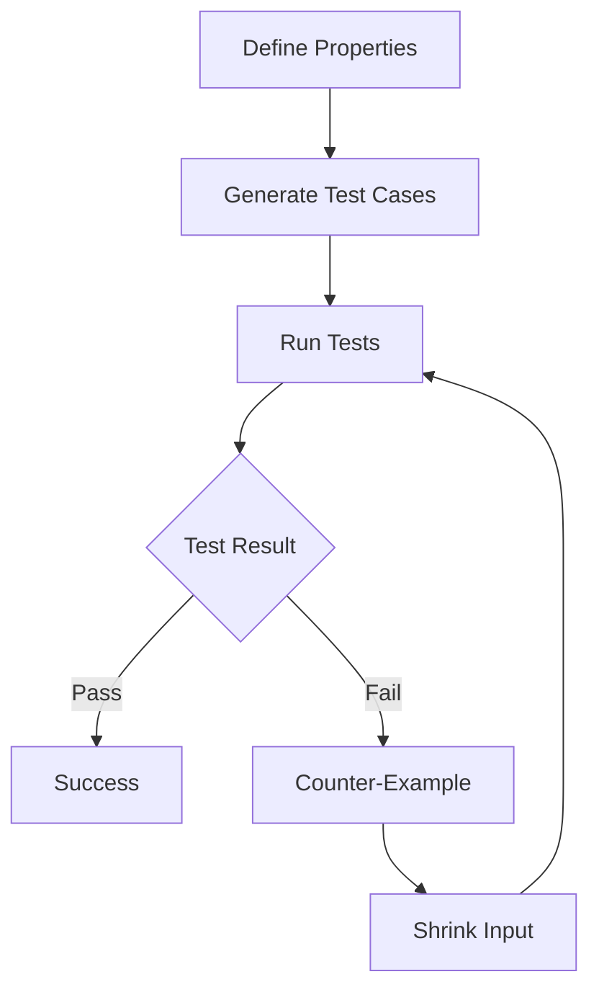

## 14.2 Property-Based Testing with FsCheck

In the realm of software testing, ensuring that your application behaves correctly across a wide range of inputs is paramount. Traditional example-based unit testing often falls short in this regard, as it tests specific cases rather than the general behavior of functions. This is where property-based testing shines, offering a robust alternative that can uncover edge cases and unexpected behavior. In this section, we will explore property-based testing using FsCheck, a powerful framework for F#.

### Introducing Property-Based Testing

Property-based testing is a testing approach where instead of writing individual test cases, you define properties that your functions should satisfy. These properties are general rules or invariants that hold true for a wide range of inputs. The testing framework then generates random test cases to verify these properties, providing a more comprehensive test coverage.

#### Key Differences from Example-Based Unit Testing

- **Generalization Over Specificity**: While unit tests focus on specific examples, property-based tests define general properties that should hold true universally.
- **Automated Test Case Generation**: Property-based testing frameworks like FsCheck automatically generate a wide range of inputs, including edge cases, to test the defined properties.
- **Discovery of Edge Cases**: By testing a broader set of inputs, property-based testing can uncover edge cases that might not be considered in traditional unit tests.

#### Advantages of Property-Based Testing

- **Increased Coverage**: By testing properties over a wide range of inputs, you achieve greater test coverage.
- **Robustness**: Helps ensure the robustness of your software by uncovering hidden bugs.
- **Reduced Bias**: Removes the bias of manually selecting test cases, allowing the framework to explore unexpected scenarios.

### Overview of FsCheck

FsCheck is a powerful property-based testing framework for F#. It is inspired by QuickCheck, a Haskell library, and provides seamless integration with existing unit testing frameworks like NUnit, xUnit, and Expecto. FsCheck allows you to define properties and automatically generates test cases to verify them.

#### Integration Capabilities

FsCheck can be easily integrated into your existing testing setup. It supports running tests alongside traditional unit tests, making it a versatile addition to your testing toolkit.

### Setting Up FsCheck

To start using FsCheck in your F# project, you need to install it via NuGet and configure it properly.

#### Step-by-Step Installation

1. **Open Your F# Project**: Launch your F# project in your preferred IDE, such as Visual Studio or JetBrains Rider.

2. **Install FsCheck via NuGet**: Use the NuGet Package Manager to install FsCheck. You can do this through the Package Manager Console with the following command:
   ```shell
   Install-Package FsCheck
   ```

3. **Configure FsCheck**: Once installed, you can start using FsCheck by importing it into your test files:
   ```fsharp
   open FsCheck
   ```

4. **Verify Installation**: Create a simple property test to ensure that FsCheck is correctly set up.

### Writing Properties

Defining properties is at the heart of property-based testing. A property is a statement about your code that should hold true for a wide range of inputs.

#### Simple Property Examples

Let's explore some basic properties like commutativity and associativity, and see how to express them in FsCheck.

**Commutativity Example**: A function is commutative if changing the order of its arguments does not change the result. For instance, addition is commutative.

```fsharp
let commutativeAddition (x: int) (y: int) =
    x + y = y + x

Check.Quick commutativeAddition
```

**Associativity Example**: A function is associative if the grouping of its arguments does not affect the result. For example, addition is associative.

```fsharp
let associativeAddition (x: int) (y: int) (z: int) =
    (x + y) + z = x + (y + z)

Check.Quick associativeAddition
```

### Generating Test Data

FsCheck excels at generating random test data for various types, ensuring that your properties are tested against a wide range of inputs.

#### Built-in Generators

FsCheck provides built-in generators for primitive types like integers, floats, and strings. These generators create random values to test your properties.

#### Custom Generators

For complex or domain-specific types, you can create custom generators. This allows you to tailor the test data to better reflect real-world scenarios.

**Example: Custom Generator for a Complex Type**

Suppose you have a type `Person` with fields `Name` and `Age`. You can create a custom generator for this type:

```fsharp
type Person = { Name: string; Age: int }

let personGenerator =
    gen {
        let! name = Arb.generate<string>
        let! age = Arb.generate<int>
        return { Name = name; Age = age }
    }

let personArb = Arb.fromGen personGenerator
```

### Interpreting Test Results

FsCheck provides detailed reports when a property fails, including the specific inputs that caused the failure. This helps you quickly identify and fix issues.

#### Understanding Counter-Examples

When a property fails, FsCheck presents a counter-example, which is a specific set of inputs that violate the property. Analyzing these counter-examples can reveal edge cases that were not considered during development.

**Example: Interpreting a Failure**

Suppose you have a property that checks if a list is sorted after sorting:

```fsharp
let sortedListProperty (list: int list) =
    let sortedList = List.sort list
    sortedList = List.sort sortedList

Check.Quick sortedListProperty
```

If this property fails, FsCheck will provide the list that caused the failure, helping you identify the issue.

### Combining FsCheck with Unit Testing Frameworks

FsCheck can be seamlessly integrated with popular unit testing frameworks like NUnit, xUnit, and Expecto, allowing you to run property-based tests alongside traditional unit tests.

#### Integration with NUnit

To integrate FsCheck with NUnit, you can use the `FsCheck.NUnit` package. Here's how you can set it up:

1. **Install FsCheck.NUnit**: Use NuGet to install the `FsCheck.NUnit` package.

2. **Define a Property Test**: Use the `Property` attribute to define a property test.

```fsharp
open FsCheck
open FsCheck.NUnit

[<Property>]
let ``Addition is commutative`` (x: int) (y: int) =
    x + y = y + x
```

3. **Run the Tests**: Execute your tests using NUnit's test runner.

#### Integration with xUnit

FsCheck can also be integrated with xUnit using the `FsCheck.Xunit` package. Here's an example:

1. **Install FsCheck.Xunit**: Use NuGet to install the `FsCheck.Xunit` package.

2. **Define a Property Test**: Use the `Property` attribute to define a property test.

```fsharp
open FsCheck
open FsCheck.Xunit

[<Property>]
let ``Multiplication is commutative`` (x: int) (y: int) =
    x * y = y * x
```

3. **Run the Tests**: Execute your tests using xUnit's test runner.

### Best Practices

To make the most of property-based testing, consider the following best practices:

#### Writing Effective Properties

- **Focus on Invariants**: Identify the core invariants of your functions and express them as properties.
- **Avoid False Positives**: Ensure that your properties are correctly defined to avoid false positives.
- **Use Custom Generators**: Leverage custom generators for complex types to ensure meaningful test data.

#### When to Use Property-Based Testing

- **Complex Logic**: Use property-based testing for functions with complex logic where edge cases are hard to predict.
- **Data Structures**: Test data structures to ensure they maintain their invariants across operations.
- **Mathematical Properties**: Verify mathematical properties like commutativity, associativity, and distributivity.

### Advanced Features

FsCheck offers advanced features like command-based testing for stateful scenarios and shrinking strategies to find minimal failing cases.

#### Command-Based Testing

Command-based testing is useful for testing stateful systems. It allows you to define a series of commands and verify that the system transitions between states correctly.

**Example: Command-Based Testing**

Suppose you have a simple counter with `Increment` and `Decrement` operations. You can define commands to test its behavior:

```fsharp
type CounterCommand =
    | Increment
    | Decrement

let counterSpec =
    { new ICommand<int, int> with
        member _.Run(state, command) =
            match command with
            | Increment -> state + 1
            | Decrement -> state - 1

        member _.NextState(state, command) =
            match command with
            | Increment -> state + 1
            | Decrement -> state - 1

        member _.PreCondition(state, command) = true
        member _.PostCondition(state, command, newState) = newState >= 0
    }

Check.Quick (Command.run counterSpec)
```

#### Shrinking Strategies

When a property fails, FsCheck attempts to shrink the failing input to the smallest possible counter-example. This helps in quickly identifying the root cause of the failure.

**Example: Shrinking**

If a property fails with a large input, FsCheck will automatically try to reduce the input size while still causing the failure, making it easier to debug.

### Real-World Applications

Property-based testing has been successfully applied in various domains to improve software reliability. Here are some examples:

- **Financial Systems**: Ensuring the correctness of complex financial calculations and transactions.
- **Compiler Development**: Verifying the correctness of language parsers and compilers.
- **Data Processing Pipelines**: Testing data transformations and ensuring data integrity.

### Encouraging Adoption

Incorporating property-based testing into your development process can yield long-term benefits. It enhances software quality, reduces bugs, and provides greater confidence in your code.

#### Long-Term Benefits

- **Reduced Maintenance Costs**: By catching bugs early, you reduce the cost of maintenance and bug fixes.
- **Improved Code Quality**: Property-based testing encourages writing cleaner, more robust code.
- **Enhanced Developer Confidence**: Developers gain confidence in their code's correctness, leading to faster development cycles.

### Try It Yourself

To get hands-on experience with property-based testing, try modifying the code examples provided. Experiment with different properties, custom generators, and integration with your favorite unit testing framework. This will help solidify your understanding and demonstrate the power of property-based testing in real-world scenarios.

### Visualizing Property-Based Testing

To better understand the flow of property-based testing, let's visualize the process using a flowchart.



**Figure 1**: This flowchart illustrates the property-based testing process, from defining properties to generating test cases, running tests, and handling failures.

### Knowledge Check

Before moving on, let's summarize the key takeaways:

- Property-based testing focuses on testing general properties rather than specific examples.
- FsCheck is a powerful framework for property-based testing in F#, offering integration with popular unit testing frameworks.
- Writing effective properties and using custom generators are crucial for meaningful tests.
- Advanced features like command-based testing and shrinking strategies enhance the testing process.

## Quiz Time!



### What is the primary focus of property-based testing?

- [x] Testing general properties over specific examples
- [ ] Testing specific examples over general properties
- [ ] Testing only edge cases
- [ ] Testing only happy paths

> **Explanation:** Property-based testing focuses on testing general properties that should hold true for a wide range of inputs, rather than specific examples.

### How does FsCheck generate test cases?

- [x] By automatically generating random test data
- [ ] By manually specifying test cases
- [ ] By using only predefined test data
- [ ] By generating test data based on user input

> **Explanation:** FsCheck automatically generates random test data to verify the properties defined in your tests.

### What is a counter-example in property-based testing?

- [x] A specific set of inputs that violate a property
- [ ] A set of inputs that pass all tests
- [ ] A set of inputs that are ignored
- [ ] A set of inputs that are manually specified

> **Explanation:** A counter-example is a specific set of inputs that cause a property to fail, helping identify edge cases.

### Which of the following is an example of a commutative property?

- [x] x + y = y + x
- [ ] (x + y) + z = x + (y + z)
- [ ] x * (y + z) = (x * y) + (x * z)
- [ ] x - y = y - x

> **Explanation:** The commutative property states that changing the order of operands does not change the result, as in x + y = y + x.

### What is the purpose of shrinking in FsCheck?

- [x] To find the minimal failing case
- [ ] To increase the size of the failing case
- [ ] To ignore the failing case
- [ ] To automatically fix the failing case

> **Explanation:** Shrinking is used to reduce the size of the failing input to the smallest possible counter-example, aiding in debugging.

### How can FsCheck be integrated with NUnit?

- [x] By using the FsCheck.NUnit package
- [ ] By using the FsCheck.Xunit package
- [ ] By using the FsCheck.Expecto package
- [ ] By using the FsCheck.MSTest package

> **Explanation:** FsCheck can be integrated with NUnit by using the FsCheck.NUnit package.

### What is a custom generator in FsCheck?

- [x] A generator tailored for complex or domain-specific types
- [ ] A generator for primitive types
- [ ] A generator for only integer types
- [ ] A generator for only string types

> **Explanation:** A custom generator is used to create test data for complex or domain-specific types, beyond the built-in primitive type generators.

### Which of the following is a benefit of property-based testing?

- [x] Increased test coverage
- [ ] Reduced test coverage
- [ ] Increased test complexity
- [ ] Reduced software reliability

> **Explanation:** Property-based testing increases test coverage by testing properties over a wide range of inputs.

### What is command-based testing used for?

- [x] Testing stateful systems
- [ ] Testing stateless systems
- [ ] Testing only mathematical properties
- [ ] Testing only immutable data

> **Explanation:** Command-based testing is used for testing stateful systems, verifying that they transition between states correctly.

### True or False: Property-based testing can only be used for mathematical functions.

- [ ] True
- [x] False

> **Explanation:** False. Property-based testing can be used for a wide range of applications, including data structures, algorithms, and stateful systems.



Remember, this is just the beginning. As you progress, you'll build more complex and interactive tests. Keep experimenting, stay curious, and enjoy the journey!
