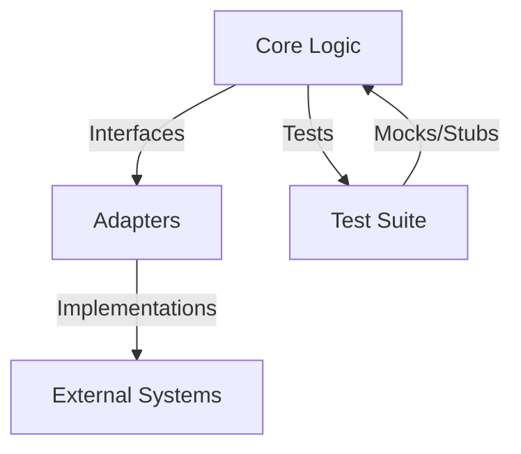

## 14.9 Designing for Testability

In the realm of software development, testability is a cornerstone of high-quality, maintainable code. Designing for testability means crafting software that is easy to test, ensuring that defects can be identified and fixed efficiently. This section delves into the principles and practices that make F# code inherently testable, leveraging the strengths of functional programming to produce robust and reliable software.

### Importance of Testability

Testability is crucial for maintaining high-quality software. It allows developers to verify that their code behaves as expected, facilitates regression testing, and supports continuous integration and delivery practices. By designing for testability, we can:

- **Reduce Bugs**: Early detection of defects leads to fewer bugs in production.
- **Enhance Maintainability**: Testable code is often modular and well-organized, making it easier to understand and modify.
- **Facilitate Refactoring**: With a solid suite of tests, developers can refactor code confidently, knowing that tests will catch regressions.
- **Support Agile Practices**: Testable code aligns with agile methodologies, enabling rapid iterations and feedback loops.

### Functional Programming Advantages

Functional programming paradigms in F# naturally encourage testable code. Key features such as pure functions and immutability simplify testing and enhance software quality.

#### Pure Functions

Pure functions are deterministic and side-effect-free, meaning they always produce the same output for the same input and do not alter any state outside their scope. This predictability makes them easy to test.

```fsharp
// Pure function example
let add x y = x + y

// Test case for the pure function
let testAdd () =
    assert (add 2 3 = 5)
```

#### Immutability

Immutability ensures that data structures cannot be modified after they are created. This property eliminates side effects related to state changes, simplifying reasoning about code behavior.

```fsharp
// Immutable data structure
type Person = { Name: string; Age: int }

// Function that returns a new modified instance
let celebrateBirthday person = { person with Age = person.Age + 1 }

// Test case for immutability
let testCelebrateBirthday () =
    let original = { Name = "Alice"; Age = 30 }
    let updated = celebrateBirthday original
    assert (updated.Age = 31 && original.Age = 30)
```

### Principles for Testable Design

Designing testable code involves adhering to several key principles:

#### Separation of Concerns

Separation of concerns involves dividing a program into distinct sections, each handling a specific aspect of functionality. This modular approach simplifies testing by isolating components.

#### Single Responsibility Principle

Each module or function should have a single responsibility, making it easier to test and reason about. This principle reduces the likelihood of unintended interactions between different parts of the code.

#### Modularity

Modular code is composed of small, reusable units. This structure not only facilitates testing but also enhances maintainability and scalability.

### Writing Pure Functions

Creating functions without side effects is a fundamental practice for testability. Pure functions are easier to test because they do not rely on or modify external state.

#### Comparing Pure and Impure Functions

Let's compare a pure function with an impure one:

```fsharp
// Impure function example
let mutable count = 0
let increment () =
    count <- count + 1
    count

// Pure function example
let incrementPure count = count + 1

// Test case for the pure function
let testIncrementPure () =
    assert (incrementPure 5 = 6)
```

The pure function `incrementPure` is easier to test because it does not depend on or modify any external state.

### Managing Side Effects

Side effects, such as I/O operations, can complicate testing. Strategies for isolating side effects include using monads or functional abstractions.

#### Using Monads for Side Effects

Monads provide a way to sequence computations and manage side effects in a controlled manner. The `Option` and `Result` types in F# are examples of monads that help manage optional and error-prone computations.

```fsharp
// Using the Result monad to handle errors
let divide x y =
    if y = 0 then Error "Division by zero"
    else Ok (x / y)

// Test case for the divide function
let testDivide () =
    match divide 10 2 with
    | Ok result -> assert (result = 5)
    | Error _ -> failwith "Unexpected error"
```

### Dependency Injection

Dependency injection involves passing dependencies as parameters, improving testability by decoupling components.

#### Injecting Services or Functions

By injecting dependencies, we can replace them with mocks or stubs during testing.

```fsharp
// Service interface
type ILogger =
    abstract member Log: string -> unit

// Function with injected dependency
let logMessage (logger: ILogger) message =
    logger.Log(message)

// Test case using a mock logger
let testLogMessage () =
    let mockLogger = { new ILogger with member _.Log msg = assert (msg = "Test message") }
    logMessage mockLogger "Test message"
```

### Use of Interfaces and Abstractions

Interfaces can abstract external dependencies, making code more flexible and testable.

#### Defining Interfaces in F#

Interfaces define a contract that concrete implementations must follow, allowing for easy substitution in tests.

```fsharp
// Interface definition
type IDataService =
    abstract member GetData: unit -> string

// Function using the interface
let fetchData (service: IDataService) =
    service.GetData()

// Test case with a mock implementation
let testFetchData () =
    let mockService = { new IDataService with member _.GetData () = "Mock data" }
    assert (fetchData mockService = "Mock data")
```

### Modular Code Organization

Structuring code into small, reusable modules benefits both testing and maintenance.

#### Benefits of Modular Code

- **Isolation**: Modules can be tested independently.
- **Reusability**: Modules can be reused across different parts of the application.
- **Maintainability**: Changes in one module have minimal impact on others.

### Avoiding Global State

Global mutable state can lead to unpredictable behavior and is difficult to test. Avoiding it enhances testability and reliability.

#### Drawbacks of Global State

- **Coupling**: Components become tightly coupled to shared state.
- **Complexity**: Managing state changes across the application becomes complex.
- **Testing Challenges**: Tests must account for the initial and final state, complicating setup and teardown.

### Designing for Observability

Observability involves making code behavior transparent through detailed logging and meaningful error messages.

#### Practices for Observability

- **Logging**: Implement structured logging to capture relevant information.
- **Error Messages**: Provide clear and actionable error messages to aid debugging.

### Examples and Patterns

Let's explore some code examples that illustrate testable design and common patterns such as the Ports and Adapters architecture.

#### Ports and Adapters Architecture

This architecture separates the core logic (application) from the infrastructure (adapters), enhancing testability by isolating dependencies.

```fsharp
// Core logic (port)
type IEmailService =
    abstract member SendEmail: string -> string -> unit

// Adapter implementation
type SmtpEmailService() =
    interface IEmailService with
        member _.SendEmail to subject =
            printfn "Sending email to %s with subject %s" to subject

// Function using the port
let notifyUser (emailService: IEmailService) user =
    emailService.SendEmail user "Welcome"

// Test case with a mock adapter
let testNotifyUser () =
    let mockEmailService = { new IEmailService with member _.SendEmail to subject = assert (to = "test@example.com" && subject = "Welcome") }
    notifyUser mockEmailService "test@example.com"
```

### Refactoring for Testability

Refactoring involves restructuring existing code to improve testability without changing its external behavior.

#### Strategies for Refactoring

- **Extract Functions**: Break down complex functions into smaller, testable units.
- **Introduce Interfaces**: Abstract dependencies to allow for mocking.
- **Isolate Side Effects**: Move side effects to the boundaries of the application.

### Balancing Testability and Performance

While testability is important, it should not come at the cost of performance. Balancing these aspects involves:

- **Profiling**: Identify performance bottlenecks and optimize them.
- **Caching**: Use caching strategies to improve performance without sacrificing testability.
- **Lazy Evaluation**: Defer computation until results are needed to enhance efficiency.

### Try It Yourself

Experiment with the code examples provided. Try modifying the functions to introduce side effects and see how it impacts testability. Refactor the code to isolate these effects and observe the improvements in testability.

### Visualizing Testability in F#

To better understand the concepts of testability, let's visualize the flow of dependencies and the separation of concerns in a typical F# application.



**Figure 1**: Visualizing the separation of core logic and adapters, highlighting the role of interfaces in enhancing testability.

### References and Links

For further reading on designing testable software, consider exploring the following resources:

- [Functional Programming in F#](https://fsharp.org/)
- [Test-Driven Development by Example](https://www.amazon.com/Test-Driven-Development-Kent-Beck/dp/0321146530)
- [Clean Code: A Handbook of Agile Software Craftsmanship](https://www.amazon.com/Clean-Code-Handbook-Software-Craftsmanship/dp/0132350882)

### Knowledge Check

- How do pure functions contribute to testability?
- What are the benefits of using interfaces for dependency abstraction?
- Why is avoiding global state important for testability?
- How does the Ports and Adapters architecture enhance testability?

### Embrace the Journey

Remember, designing for testability is an ongoing journey. As you continue to refine your skills, you'll discover new ways to enhance the quality and reliability of your software. Keep experimenting, stay curious, and enjoy the process!

## Quiz Time!



### Why is designing for testability crucial in software development?

- [x] It reduces bugs and enhances maintainability.
- [ ] It increases the complexity of the code.
- [ ] It makes code harder to refactor.
- [ ] It decreases the need for testing.

> **Explanation:** Designing for testability reduces bugs, enhances maintainability, and facilitates refactoring, making the codebase more robust and reliable.

### What is a key advantage of pure functions in F#?

- [x] They are deterministic and side-effect-free.
- [ ] They rely on global state.
- [ ] They require complex setup for testing.
- [ ] They are inherently slower than impure functions.

> **Explanation:** Pure functions are deterministic and side-effect-free, making them easier to test and reason about.

### How does immutability contribute to testability?

- [x] It eliminates side effects related to state changes.
- [ ] It complicates reasoning about code behavior.
- [ ] It requires more memory.
- [ ] It makes code more difficult to modify.

> **Explanation:** Immutability eliminates side effects related to state changes, simplifying reasoning about code behavior and enhancing testability.

### What is the role of dependency injection in testable design?

- [x] It decouples components by passing dependencies as parameters.
- [ ] It increases the coupling between components.
- [ ] It makes code harder to test.
- [ ] It reduces the flexibility of the code.

> **Explanation:** Dependency injection decouples components by passing dependencies as parameters, improving testability and flexibility.

### How can interfaces enhance testability in F#?

- [x] By abstracting external dependencies and allowing for easy substitution in tests.
- [ ] By making code more complex.
- [ ] By increasing the dependency on concrete implementations.
- [ ] By reducing the flexibility of the code.

> **Explanation:** Interfaces abstract external dependencies, allowing for easy substitution in tests and enhancing testability.

### What is a benefit of modular code organization?

- [x] It facilitates testing by isolating components.
- [ ] It increases the complexity of the codebase.
- [ ] It makes code harder to understand.
- [ ] It reduces reusability.

> **Explanation:** Modular code organization facilitates testing by isolating components, enhancing maintainability and reusability.

### Why should global state be avoided in testable design?

- [x] It leads to unpredictable behavior and is difficult to test.
- [ ] It simplifies state management across the application.
- [ ] It enhances the coupling between components.
- [ ] It makes code easier to maintain.

> **Explanation:** Global state leads to unpredictable behavior and is difficult to test, complicating state management and increasing coupling.

### How does the Ports and Adapters architecture support testability?

- [x] By separating core logic from infrastructure, isolating dependencies.
- [ ] By tightly coupling core logic with external systems.
- [ ] By reducing the flexibility of the code.
- [ ] By making code harder to test.

> **Explanation:** The Ports and Adapters architecture separates core logic from infrastructure, isolating dependencies and enhancing testability.

### What is a strategy for refactoring code to improve testability?

- [x] Extract functions to create smaller, testable units.
- [ ] Increase the use of global state.
- [ ] Reduce the use of interfaces and abstractions.
- [ ] Combine multiple responsibilities into single modules.

> **Explanation:** Extracting functions to create smaller, testable units improves testability by simplifying code and isolating functionality.

### True or False: Balancing testability and performance is unnecessary in software design.

- [ ] True
- [x] False

> **Explanation:** Balancing testability and performance is crucial in software design to ensure that code remains efficient while being easy to test and maintain.


