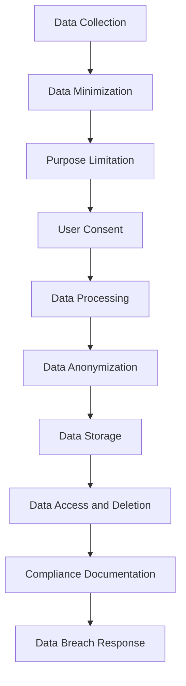

## 15.11 Data Privacy and Compliance

In today's digital age, data privacy and compliance have become paramount concerns for software engineers and architects. As we delve into the realm of F# applications, understanding and implementing data protection laws such as the General Data Protection Regulation (GDPR) and the California Consumer Privacy Act (CCPA) is crucial. This section will guide you through the principles of privacy by design, data anonymization, pseudonymization, and more, ensuring that your F# applications adhere to the highest standards of data privacy and compliance.

### Overview of Data Protection Laws

Data protection laws are designed to safeguard individuals' personal data and ensure that organizations handle this data responsibly. Let's explore some of the key regulations:

#### General Data Protection Regulation (GDPR)

The GDPR is a comprehensive data protection law that applies to all organizations operating within the European Union (EU) and those handling the personal data of EU citizens. Key aspects include:

- **Data Subject Rights**: Individuals have the right to access, rectify, and erase their personal data.
- **Consent**: Organizations must obtain clear and explicit consent from individuals before processing their data.
- **Data Breach Notification**: Organizations must notify authorities and affected individuals of data breaches within 72 hours.
- **Data Protection Officer (DPO)**: Certain organizations are required to appoint a DPO to oversee data protection strategies.

#### California Consumer Privacy Act (CCPA)

The CCPA is a state statute intended to enhance privacy rights and consumer protection for residents of California, USA. Key elements include:

- **Right to Know**: Consumers have the right to know what personal data is being collected and how it is used.
- **Right to Delete**: Consumers can request the deletion of their personal data.
- **Right to Opt-Out**: Consumers can opt-out of the sale of their personal data.
- **Non-Discrimination**: Businesses cannot discriminate against consumers who exercise their privacy rights.

These regulations significantly impact software development, requiring developers to embed privacy considerations throughout the software lifecycle.

### Privacy by Design

Privacy by design is a proactive approach to embedding privacy into the design and operation of IT systems, networked infrastructure, and business practices. It involves:

- **Data Minimization**: Collect only the data necessary for the intended purpose.
- **Purpose Limitation**: Use data only for the purposes for which it was collected.
- **Security**: Implement robust security measures to protect personal data.
- **Transparency**: Be transparent about data collection and processing activities.

#### Implementing Privacy by Design in F# Applications

To implement privacy by design in F# applications, consider the following strategies:

1. **Data Minimization**: Use F#'s strong typing and pattern matching to ensure that only necessary data is collected and processed.

   ```fsharp
   type UserData = {
       Name: string
       Email: string
       Age: int option // Optional field for data minimization
   }

   let processUserData (user: UserData) =
       match user.Age with
       | Some age when age >= 18 -> printfn "Processing adult user data."
       | _ -> printfn "Processing general user data."
   ```

2. **Purpose Limitation**: Clearly define the purpose of data collection and ensure that data processing aligns with this purpose.

   ```fsharp
   let collectUserData (purpose: string) (user: UserData) =
       if purpose = "marketing" then
           // Process data for marketing purposes
           printfn "Collecting data for marketing."
       else
           // Process data for other purposes
           printfn "Collecting data for other purposes."
   ```

3. **Security**: Implement encryption and secure storage mechanisms to protect personal data.

   ```fsharp
   open System.Security.Cryptography
   open System.Text

   let encryptData (data: string) (key: byte[]) =
       use aes = Aes.Create()
       aes.Key <- key
       aes.GenerateIV()
       let encryptor = aes.CreateEncryptor(aes.Key, aes.IV)
       use ms = new System.IO.MemoryStream()
       use cs = new CryptoStream(ms, encryptor, CryptoStreamMode.Write)
       use sw = new System.IO.StreamWriter(cs)
       sw.Write(data)
       ms.ToArray()
   ```

4. **Transparency**: Provide clear and accessible information about data processing activities.

   ```fsharp
   let displayPrivacyPolicy () =
       printfn "Our privacy policy explains how we collect, use, and protect your data."
   ```

### Data Anonymization Techniques

Data anonymization involves transforming personal data in such a way that individuals cannot be identified. This reduces the risk if data is compromised. Here are some techniques:

- **Data Masking**: Replace sensitive data with random characters or symbols.
- **Generalization**: Remove specific details to make data less identifiable.
- **Aggregation**: Combine data into groups or categories.

#### Implementing Data Anonymization in F#

Let's explore how to implement data anonymization techniques in F#:

1. **Data Masking**: Replace sensitive information with asterisks or other characters.

   ```fsharp
   let maskEmail (email: string) =
       let parts = email.Split('@')
       if parts.Length = 2 then
           let maskedLocal = String.replicate (parts.[0].Length) "*"
           maskedLocal + "@" + parts.[1]
       else
           email

   let maskedEmail = maskEmail "user@example.com"
   printfn "Masked Email: %s" maskedEmail
   ```

2. **Generalization**: Remove specific details to make data less identifiable.

   ```fsharp
   type Location = {
       City: string
       State: string
       Country: string
   }

   let generalizeLocation (location: Location) =
       { location with City = "Unknown" }

   let generalizedLocation = generalizeLocation { City = "New York"; State = "NY"; Country = "USA" }
   printfn "Generalized Location: %A" generalizedLocation
   ```

3. **Aggregation**: Combine data into groups or categories.

   ```fsharp
   let aggregateAge (age: int) =
       match age with
       | age when age < 18 -> "Under 18"
       | age when age < 30 -> "18-29"
       | age when age < 50 -> "30-49"
       | _ -> "50+"

   let ageGroup = aggregateAge 25
   printfn "Age Group: %s" ageGroup
   ```

### Pseudonymization

Pseudonymization involves replacing identifying fields with pseudonyms, allowing data processing while protecting identities. This technique is particularly useful when data needs to be processed but not directly linked to individuals.

#### Implementing Pseudonymization in F#

To implement pseudonymization in F#, consider the following approach:

1. **Generate Pseudonyms**: Replace identifiable information with pseudonyms.

   ```fsharp
   open System

   let generatePseudonym (identifier: string) =
       let hash = Convert.ToBase64String(System.Text.Encoding.UTF8.GetBytes(identifier))
       hash.Substring(0, 8) // Shorten for simplicity

   let pseudonym = generatePseudonym "user@example.com"
   printfn "Pseudonym: %s" pseudonym
   ```

2. **Mapping Pseudonyms**: Maintain a secure mapping between original data and pseudonyms for re-identification if necessary.

   ```fsharp
   let pseudonymMap = System.Collections.Generic.Dictionary<string, string>()

   let addPseudonym (original: string) =
       let pseudonym = generatePseudonym original
       pseudonymMap.[original] <- pseudonym
       pseudonym

   let original = "user@example.com"
   let pseudonym = addPseudonym original
   printfn "Original: %s, Pseudonym: %s" original pseudonym
   ```

### User Consent and Rights

Managing user consent and facilitating rights like data access and deletion are critical components of data privacy compliance. Here's how you can implement these in F# applications:

1. **User Consent**: Obtain and manage user consent for data processing activities.

   ```fsharp
   type Consent = {
       UserId: string
       HasConsented: bool
   }

   let updateConsent (userId: string) (consent: bool) =
       { UserId = userId; HasConsented = consent }

   let userConsent = updateConsent "user123" true
   printfn "User Consent: %A" userConsent
   ```

2. **Data Access and Deletion**: Provide mechanisms for users to access and delete their data.

   ```fsharp
   let userDataStore = System.Collections.Generic.Dictionary<string, UserData>()

   let getUserData (userId: string) =
       if userDataStore.ContainsKey(userId) then
           Some(userDataStore.[userId])
       else
           None

   let deleteUserData (userId: string) =
       if userDataStore.ContainsKey(userId) then
           userDataStore.Remove(userId) |> ignore
           printfn "User data deleted."
       else
           printfn "User data not found."

   // Example usage
   userDataStore.["user123"] <- { Name = "John Doe"; Email = "john@example.com"; Age = Some 30 }
   let userData = getUserData "user123"
   printfn "User Data: %A" userData
   deleteUserData "user123"
   ```

### Data Breach Response

In the event of a data breach, organizations must take swift action to comply with legal obligations and mitigate damage. Here's a step-by-step response plan:

1. **Identify and Contain**: Quickly identify the breach and contain it to prevent further data loss.
2. **Assess Impact**: Evaluate the extent of the breach and the data affected.
3. **Notify Authorities**: Inform relevant authorities, such as data protection agencies, within the required timeframe.
4. **Notify Affected Individuals**: Communicate with affected individuals, providing information on the breach and steps they can take to protect themselves.
5. **Review and Improve**: Analyze the breach to identify vulnerabilities and implement measures to prevent future incidents.

### Compliance Documentation

Maintaining records of data processing activities is essential for accountability and demonstrating compliance. Consider the following documentation practices:

- **Data Processing Records**: Keep detailed records of data processing activities, including the purpose, data categories, and retention periods.
- **Consent Records**: Document user consent, including when and how it was obtained.
- **Data Breach Logs**: Maintain logs of data breaches, including details of the breach and response actions taken.

### Tools and Libraries

Several tools and libraries can assist with compliance efforts in F# applications:

- **Consent Management Platforms**: Tools like OneTrust and TrustArc help manage user consent and preferences.
- **Data Protection APIs**: Libraries such as Microsoft.AspNetCore.DataProtection provide encryption and secure data storage capabilities.
- **Privacy Management Software**: Solutions like Nymity and BigID offer comprehensive privacy management features.

### Challenges and Solutions

Achieving compliance with data privacy regulations can be challenging. Here are some common challenges and practical solutions:

- **Challenge**: Balancing data utility with privacy requirements.
  - **Solution**: Implement data anonymization and pseudonymization techniques to protect privacy while retaining data utility.

- **Challenge**: Managing user consent and preferences.
  - **Solution**: Use consent management platforms to streamline consent collection and management.

- **Challenge**: Ensuring data security and breach response readiness.
  - **Solution**: Regularly review and update security measures, and conduct breach response drills to ensure preparedness.

### Visualizing Data Privacy and Compliance Workflow

To better understand the workflow of data privacy and compliance, let's visualize the process using a flowchart:



**Diagram Description**: This flowchart illustrates the data privacy and compliance workflow, starting from data collection and ending with data breach response. Each step represents a critical component of ensuring data privacy and compliance in F# applications.

### Try It Yourself

Now that we've explored the concepts of data privacy and compliance, it's time to put your knowledge into practice. Here are some suggestions for experimenting with the code examples:

- **Modify the Data Masking Function**: Try changing the masking character or the length of the masked portion in the `maskEmail` function.
- **Enhance Pseudonymization**: Experiment with different hashing algorithms or encoding techniques in the `generatePseudonym` function.
- **Implement Additional User Rights**: Extend the `updateConsent` function to include other user rights, such as data portability or objection to processing.

### Knowledge Check

Before we conclude, let's summarize the key takeaways from this section:

- **Data Protection Laws**: Understanding GDPR and CCPA is crucial for ensuring compliance in software development.
- **Privacy by Design**: Embedding privacy considerations throughout the system's lifecycle is essential for protecting user data.
- **Data Anonymization and Pseudonymization**: These techniques help protect identities while allowing data processing.
- **User Consent and Rights**: Managing user consent and facilitating rights like data access and deletion are critical components of compliance.
- **Compliance Documentation**: Maintaining records of data processing activities is essential for accountability.

Remember, this is just the beginning. As you progress, you'll build more complex and compliant F# applications. Keep experimenting, stay curious, and enjoy the journey!

## Quiz Time!



### What is the primary purpose of GDPR?

- [x] To protect the personal data of EU citizens
- [ ] To regulate financial transactions in the EU
- [ ] To standardize software development practices
- [ ] To promote open-source software

> **Explanation:** The GDPR aims to protect the personal data of EU citizens by regulating how organizations collect, process, and store this data.

### Which principle is NOT part of Privacy by Design?

- [ ] Data Minimization
- [ ] Purpose Limitation
- [x] Data Monetization
- [ ] Security

> **Explanation:** Privacy by Design focuses on data minimization, purpose limitation, and security, but not on data monetization.

### What is the key difference between anonymization and pseudonymization?

- [x] Anonymization removes all identifiers, while pseudonymization replaces them with pseudonyms.
- [ ] Anonymization is reversible, while pseudonymization is not.
- [ ] Anonymization is used for encryption, while pseudonymization is not.
- [ ] Anonymization is a legal requirement, while pseudonymization is not.

> **Explanation:** Anonymization removes all identifiers, making data non-identifiable, while pseudonymization replaces identifiers with pseudonyms, allowing for potential re-identification.

### How can user consent be managed in F# applications?

- [x] By using consent management platforms
- [ ] By hardcoding consent in the application
- [ ] By ignoring user preferences
- [ ] By storing consent in a text file

> **Explanation:** Consent management platforms help manage user consent and preferences efficiently, ensuring compliance with data protection laws.

### What should be done first in the event of a data breach?

- [x] Identify and contain the breach
- [ ] Notify affected individuals
- [ ] Assess the impact
- [ ] Review and improve security measures

> **Explanation:** The first step in responding to a data breach is to identify and contain it to prevent further data loss.

### Which tool is NOT typically used for data protection?

- [ ] Microsoft.AspNetCore.DataProtection
- [ ] OneTrust
- [x] GitHub
- [ ] TrustArc

> **Explanation:** GitHub is a platform for version control and collaboration, not specifically for data protection.

### What is a common challenge in achieving data privacy compliance?

- [x] Balancing data utility with privacy requirements
- [ ] Implementing data encryption
- [ ] Writing code in F#
- [ ] Using pseudonyms

> **Explanation:** Balancing data utility with privacy requirements is a common challenge, as organizations need to protect privacy while retaining data utility.

### How can data anonymization be achieved in F#?

- [x] By using techniques like data masking and generalization
- [ ] By encrypting all data
- [ ] By deleting all data
- [ ] By storing data in a database

> **Explanation:** Data anonymization can be achieved using techniques like data masking and generalization, which make data less identifiable.

### What is the role of a Data Protection Officer (DPO)?

- [x] To oversee data protection strategies
- [ ] To develop software applications
- [ ] To manage financial transactions
- [ ] To promote open-source software

> **Explanation:** A Data Protection Officer (DPO) is responsible for overseeing data protection strategies and ensuring compliance with data protection laws.

### True or False: Pseudonymization allows for data processing while protecting identities.

- [x] True
- [ ] False

> **Explanation:** Pseudonymization involves replacing identifying fields with pseudonyms, allowing data processing while protecting identities.


