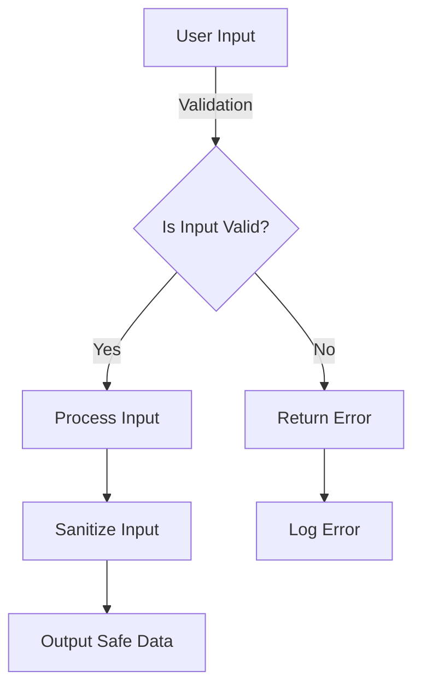

## 15.5 Input Validation and Sanitization

In the world of software development, input validation and sanitization are critical components of security. As expert software engineers and architects, understanding these concepts in the context of F# is essential to building robust and secure applications. This section will delve into the threats posed by improper input handling, strategies for validation and sanitization, and best practices to fortify your applications against vulnerabilities.

### Understanding the Threats

Before we dive into the strategies for input validation and sanitization, let's first understand the threats that arise from improper input handling:

#### SQL Injection

SQL Injection is a code injection technique that exploits vulnerabilities in an application's software by injecting malicious SQL code into input fields. This can lead to unauthorized access to database information, data corruption, or even deletion.

#### Cross-Site Scripting (XSS)

XSS attacks occur when an attacker injects malicious scripts into content from otherwise trusted websites. This can lead to data theft, session hijacking, or defacement of websites.

#### Command Injection

Command injection attacks occur when an attacker is able to execute arbitrary commands on the host operating system via a vulnerable application. This can lead to unauthorized access and control over the system.

### Input Validation Strategies

Input validation is the process of ensuring that the data provided by users meets the expected format and constraints. Here are some strategies to implement effective input validation in F#:

#### Whitelisting Acceptable Input Formats

Whitelisting involves specifying a list of acceptable input formats and rejecting anything that doesn't conform. This is a more secure approach compared to blacklisting, which only specifies what is not allowed.

```fsharp
let isValidEmail (email: string) =
    let emailRegex = @"^[a-zA-Z0-9._%+-]+@[a-zA-Z0-9.-]+\.[a-zA-Z]{2,}$"
    System.Text.RegularExpressions.Regex.IsMatch(email, emailRegex)

let validateEmail email =
    if isValidEmail email then
        printfn "Valid email"
    else
        printfn "Invalid email"
```

#### Using Regular Expressions Carefully

Regular expressions are powerful tools for input validation, but they must be used carefully to avoid introducing vulnerabilities such as ReDoS (Regular Expression Denial of Service).

#### Leveraging F#'s Pattern Matching for Validation

F#'s pattern matching can be a powerful tool for input validation, allowing for clear and concise validation logic.

```fsharp
type Input =
    | Email of string
    | PhoneNumber of string

let validateInput input =
    match input with
    | Email e when isValidEmail e -> printfn "Valid email"
    | PhoneNumber p when isValidPhoneNumber p -> printfn "Valid phone number"
    | _ -> printfn "Invalid input"
```

### Data Sanitization

Data sanitization involves cleaning or filtering input to neutralize any harmful data. This is especially important for preventing XSS attacks.

#### Encoding Output to Prevent XSS

Encoding involves converting data into a safe format before rendering it in a web page. This prevents malicious scripts from being executed.

```fsharp
let htmlEncode (input: string) =
    System.Web.HttpUtility.HtmlEncode(input)

let safeOutput = htmlEncode "<script>alert('XSS');</script>"
printfn "Encoded output: %s" safeOutput
```

### Using Parameterized Queries

When interacting with databases, always use parameterized queries to prevent SQL injection. This ensures that user inputs are treated as data rather than executable code.

```fsharp
open System.Data.SqlClient

let getUserData (userId: int) =
    use connection = new SqlConnection("your_connection_string")
    let command = new SqlCommand("SELECT * FROM Users WHERE UserId = @UserId", connection)
    command.Parameters.AddWithValue("@UserId", userId) |> ignore
    connection.Open()
    use reader = command.ExecuteReader()
    while reader.Read() do
        printfn "User: %s" (reader.GetString(1))
```

### Validating at All Tiers

It's crucial to validate inputs at both the client and server sides. Client-side validation provides a quick feedback loop for users, while server-side validation ensures security.

### Third-Party Libraries and Frameworks

F# offers several libraries that can aid in input validation and sanitization. For instance, `FSharp.Data` provides robust parsing and validation capabilities.

```fsharp
open FSharp.Data

let validateJson (jsonString: string) =
    try
        let json = JsonValue.Parse(jsonString)
        printfn "Valid JSON: %A" json
    with
    | :? System.Exception as ex -> printfn "Invalid JSON: %s" ex.Message
```

### Error Reporting

When reporting validation errors, ensure that you do not expose sensitive information. Provide generic error messages to the user while logging detailed information for developers.

```fsharp
let handleValidationError error =
    printfn "An error occurred. Please try again."
    // Log detailed error for developers
    System.Diagnostics.Trace.WriteLine(error)
```

### Regular Auditing

Regularly review and audit your validation logic to adapt to new threats. This involves keeping up with security best practices and updating your code accordingly.

### Best Practices

- **Never Trust Client Input**: Always assume that client input can be malicious and validate it on the server side.
- **Minimal Disclosure of Error Information**: Avoid providing detailed error messages to users that could aid attackers.
- **Thorough Testing**: Regularly test your validation logic with various inputs to ensure robustness.

### Resources

For further reading and guidelines on input validation and sanitization, consider exploring the following resources:

- [OWASP Input Validation Cheat Sheet](https://cheatsheetseries.owasp.org/cheatsheets/Input_Validation_Cheat_Sheet.html)
- [OWASP XSS Prevention Cheat Sheet](https://cheatsheetseries.owasp.org/cheatsheets/XSS_Prevention_Cheat_Sheet.html)

### Try It Yourself

Experiment with the code examples provided by modifying the input values and observing the outcomes. Try creating your own validation functions using pattern matching and regular expressions.

### Visualizing Input Validation and Sanitization

To better understand the flow of input validation and sanitization, let's visualize the process:



In this diagram, we see the flow from user input through validation, sanitization, and finally safe output. This process helps ensure that inputs are both valid and secure before being processed.

### Knowledge Check

- **What is the difference between input validation and sanitization?**
- **Why is it important to validate inputs at both the client and server sides?**
- **What are some common threats associated with improper input handling?**

### Embrace the Journey

Remember, input validation and sanitization are ongoing processes. As you continue to develop and secure your applications, keep experimenting, stay curious, and enjoy the journey of mastering F# security practices!

## Quiz Time!



### What is the primary goal of input validation?

- [x] To ensure that the data provided by users meets the expected format and constraints.
- [ ] To convert data into a safe format before rendering it in a web page.
- [ ] To execute arbitrary commands on the host operating system.
- [ ] To provide detailed error messages to users.

> **Explanation:** Input validation ensures that user data conforms to expected formats and constraints, preventing malicious inputs.

### Which of the following is a common threat associated with improper input handling?

- [x] SQL Injection
- [ ] Buffer Overflow
- [ ] Denial of Service
- [ ] Man-in-the-Middle Attack

> **Explanation:** SQL Injection is a common threat that exploits vulnerabilities in input handling to execute malicious SQL code.

### What is the recommended approach for preventing SQL injection?

- [x] Using parameterized queries
- [ ] Using string concatenation for SQL statements
- [ ] Disabling SQL logging
- [ ] Encrypting SQL queries

> **Explanation:** Parameterized queries ensure that user inputs are treated as data, not executable code, preventing SQL injection.

### Why is it important to encode output to prevent XSS?

- [x] To convert data into a safe format before rendering it in a web page
- [ ] To ensure that user data meets expected formats
- [ ] To execute arbitrary commands on the host operating system
- [ ] To provide detailed error messages to users

> **Explanation:** Encoding output prevents malicious scripts from being executed by converting data into a safe format.

### Which library can aid in input validation and sanitization in F#?

- [x] FSharp.Data
- [ ] Newtonsoft.Json
- [ ] System.Text.Json
- [ ] EntityFramework

> **Explanation:** FSharp.Data provides robust parsing and validation capabilities, aiding in input validation and sanitization.

### What is the purpose of regular auditing in input validation?

- [x] To review and update validation logic to adapt to new threats
- [ ] To provide detailed error messages to users
- [ ] To disable SQL logging
- [ ] To encrypt SQL queries

> **Explanation:** Regular auditing ensures that validation logic is up-to-date with security best practices and new threats.

### What is a key best practice for input validation?

- [x] Never trust client input
- [ ] Always trust client input
- [ ] Provide detailed error messages to users
- [ ] Disable server-side validation

> **Explanation:** Never trusting client input ensures that all inputs are validated on the server side, preventing malicious data entry.

### What is the role of pattern matching in input validation?

- [x] To provide clear and concise validation logic
- [ ] To execute arbitrary commands on the host operating system
- [ ] To provide detailed error messages to users
- [ ] To convert data into a safe format before rendering it in a web page

> **Explanation:** Pattern matching allows for clear and concise validation logic, making it easier to implement input validation.

### What is the difference between whitelisting and blacklisting in input validation?

- [x] Whitelisting specifies acceptable input formats, while blacklisting specifies what is not allowed.
- [ ] Blacklisting specifies acceptable input formats, while whitelisting specifies what is not allowed.
- [ ] Both whitelisting and blacklisting specify acceptable input formats.
- [ ] Both whitelisting and blacklisting specify what is not allowed.

> **Explanation:** Whitelisting specifies acceptable input formats, making it a more secure approach than blacklisting.

### True or False: Input validation should only be performed on the client side.

- [ ] True
- [x] False

> **Explanation:** Input validation should be performed on both the client and server sides to ensure security and provide quick feedback to users.


