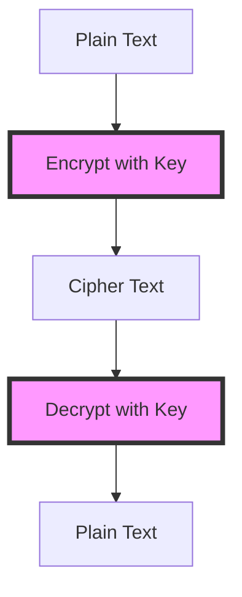

## 15.8 Handling Sensitive Data

In today's digital landscape, safeguarding sensitive data is paramount. As expert software engineers and architects, it is crucial to understand and implement robust strategies for encrypting and protecting sensitive information within F# applications. This section will guide you through the essentials of handling sensitive data, from identifying what constitutes sensitive data to implementing encryption techniques, ensuring secure storage, and maintaining compliance with regulations like GDPR and HIPAA.

### Identifying Sensitive Data

Before we delve into encryption and protection strategies, let's first define what constitutes sensitive data. Sensitive data typically includes:

- **Personally Identifiable Information (PII)**: This includes names, addresses, social security numbers, and other data that can identify an individual.
- **Financial Information**: Credit card numbers, bank account details, and transaction records fall under this category.
- **Credentials**: Usernames, passwords, and authentication tokens are critical pieces of sensitive data.
- **Health Information**: Medical records and health-related data are considered sensitive, especially under regulations like HIPAA.

Understanding the type of data you are dealing with is the first step in determining the appropriate protection measures.

### Encryption Techniques

Encryption is a fundamental technique for protecting sensitive data. It involves converting data into a format that is unreadable without a decryption key. There are two primary types of encryption:

#### Symmetric Encryption

Symmetric encryption uses the same key for both encryption and decryption. It is efficient and suitable for encrypting large amounts of data. However, the challenge lies in securely sharing the encryption key.

**Example Use Case**: Symmetric encryption is ideal for encrypting data at rest, such as files stored on a server.

```fsharp
open System.Security.Cryptography
open System.Text

let encryptData (key: byte[]) (plainText: string) =
    use aes = Aes.Create()
    aes.Key <- key
    aes.GenerateIV()
    let iv = aes.IV
    use encryptor = aes.CreateEncryptor(aes.Key, iv)
    use ms = new System.IO.MemoryStream()
    ms.Write(iv, 0, iv.Length)
    use cs = new CryptoStream(ms, encryptor, CryptoStreamMode.Write)
    use sw = new System.IO.StreamWriter(cs)
    sw.Write(plainText)
    ms.ToArray()

let decryptData (key: byte[]) (cipherText: byte[]) =
    use aes = Aes.Create()
    aes.Key <- key
    let iv = cipherText.[..15]
    let actualCipherText = cipherText.[16..]
    use decryptor = aes.CreateDecryptor(aes.Key, iv)
    use ms = new System.IO.MemoryStream(actualCipherText)
    use cs = new CryptoStream(ms, decryptor, CryptoStreamMode.Read)
    use sr = new System.IO.StreamReader(cs)
    sr.ReadToEnd()
```

#### Asymmetric Encryption

Asymmetric encryption uses a pair of keys: a public key for encryption and a private key for decryption. It is more secure for transmitting data over networks but is computationally intensive.

**Example Use Case**: Asymmetric encryption is commonly used for secure key exchange and digital signatures.

```fsharp
open System.Security.Cryptography
open System.Text

let encryptDataWithPublicKey (publicKey: RSAParameters) (plainText: string) =
    use rsa = RSA.Create()
    rsa.ImportParameters(publicKey)
    let dataToEncrypt = Encoding.UTF8.GetBytes(plainText)
    rsa.Encrypt(dataToEncrypt, RSAEncryptionPadding.OaepSHA256)

let decryptDataWithPrivateKey (privateKey: RSAParameters) (cipherText: byte[]) =
    use rsa = RSA.Create()
    rsa.ImportParameters(privateKey)
    let decryptedData = rsa.Decrypt(cipherText, RSAEncryptionPadding.OaepSHA256)
    Encoding.UTF8.GetString(decryptedData)
```

### Using .NET Cryptographic Libraries

The .NET framework provides a robust set of cryptographic libraries under the `System.Security.Cryptography` namespace, which can be leveraged in F# to implement encryption and decryption.

#### Encrypting and Decrypting Data

Let's demonstrate how to use these libraries to encrypt and decrypt data in F#:

```fsharp
open System.Security.Cryptography
open System.Text

let encrypt (plainText: string) (key: byte[]) =
    use aes = Aes.Create()
    aes.Key <- key
    aes.GenerateIV()
    let iv = aes.IV
    use encryptor = aes.CreateEncryptor(aes.Key, iv)
    use ms = new System.IO.MemoryStream()
    ms.Write(iv, 0, iv.Length)
    use cs = new CryptoStream(ms, encryptor, CryptoStreamMode.Write)
    use sw = new System.IO.StreamWriter(cs)
    sw.Write(plainText)
    ms.ToArray()

let decrypt (cipherText: byte[]) (key: byte[]) =
    use aes = Aes.Create()
    aes.Key <- key
    let iv = cipherText.[..15]
    let actualCipherText = cipherText.[16..]
    use decryptor = aes.CreateDecryptor(aes.Key, iv)
    use ms = new System.IO.MemoryStream(actualCipherText)
    use cs = new CryptoStream(ms, decryptor, CryptoStreamMode.Read)
    use sr = new System.IO.StreamReader(cs)
    sr.ReadToEnd()
```

### Secure Storage

Storing encrypted data securely is as important as encrypting it. Here are some best practices:

- **Key Management**: Use secure key management solutions to store and manage encryption keys. Avoid hardcoding keys in your source code.
- **Environment Variables**: Store sensitive information like keys and secrets in environment variables or secure vaults.
- **Access Controls**: Implement strict access controls to ensure only authorized personnel can access sensitive data.

### Data in Transit

Securing data in transit is crucial to prevent interception by unauthorized parties. Use protocols like TLS (Transport Layer Security) to encrypt data being transmitted over networks.

```fsharp
// Example of setting up a secure HTTP client with TLS
open System.Net.Http

let createSecureHttpClient () =
    let handler = new HttpClientHandler()
    handler.SslProtocols <- System.Security.Authentication.SslProtocols.Tls12
    new HttpClient(handler)
```

### Hashing Sensitive Data

Hashing is a technique used to convert data into a fixed-size string of characters, which is typically a hash code. It is commonly used for storing passwords securely.

#### Hashing with Salt

Adding a salt to the hash prevents attackers from using precomputed tables (rainbow tables) to reverse-engineer passwords.

```fsharp
open System.Security.Cryptography
open System.Text

let hashPasswordWithSalt (password: string) (salt: byte[]) =
    use sha256 = SHA256.Create()
    let saltedPassword = Encoding.UTF8.GetBytes(password) |> Array.append salt
    sha256.ComputeHash(saltedPassword)

let generateSalt () =
    let salt = Array.zeroCreate<byte> 16
    use rng = RandomNumberGenerator.Create()
    rng.GetBytes(salt)
    salt
```

### Compliance Considerations

When handling sensitive data, it's essential to comply with regulations such as:

- **GDPR (General Data Protection Regulation)**: Requires data protection by design and default.
- **HIPAA (Health Insurance Portability and Accountability Act)**: Mandates the protection of health information.

Ensure your data protection strategies align with these regulations to avoid legal repercussions.

### Avoiding Common Mistakes

- **Outdated Algorithms**: Avoid using outdated or weak encryption algorithms like MD5 or SHA1. Use stronger algorithms like SHA256 or AES.
- **Thorough Testing**: Test your encryption implementations thoroughly to ensure they are secure and function as expected.

### Third-Party Libraries

Consider using reliable third-party libraries to simplify cryptographic operations. Some popular options include:

- **Bouncy Castle**: A comprehensive cryptographic library that supports a wide range of algorithms.
- **Libsodium**: A modern, easy-to-use crypto library.

### Disposal of Sensitive Data

Securely disposing of sensitive data in memory is crucial to prevent data leakage. Use techniques like zeroing out memory or using secure memory management libraries.

```fsharp
let zeroMemory (buffer: byte[]) =
    for i in 0 .. buffer.Length - 1 do
        buffer.[i] <- 0uy
```

### Try It Yourself

Experiment with the provided code examples by modifying the encryption keys, testing different algorithms, or implementing additional security measures. This hands-on approach will deepen your understanding of handling sensitive data in F#.

### Visualizing Encryption and Decryption Process

To better understand the encryption and decryption process, let's visualize it using a flowchart:



**Figure 1**: This flowchart illustrates the basic process of encrypting and decrypting data using a key.

### Knowledge Check

- **Question**: What is the primary difference between symmetric and asymmetric encryption?
- **Exercise**: Implement a simple F# application that uses both symmetric and asymmetric encryption to secure a message.

### Summary

In this section, we've explored various strategies for handling sensitive data in F# applications. From identifying sensitive data to implementing encryption techniques and ensuring compliance with regulations, these practices are essential for protecting data privacy and security. Remember, this is just the beginning. As you progress, continue to refine your skills and stay informed about the latest security trends and best practices.

## Quiz Time!



### What constitutes sensitive data?

- [x] Personally Identifiable Information (PII)
- [x] Financial Information
- [x] Credentials
- [ ] Publicly available data

> **Explanation:** Sensitive data includes PII, financial information, and credentials, which require protection. Publicly available data is not considered sensitive.

### Which encryption technique uses the same key for encryption and decryption?

- [x] Symmetric Encryption
- [ ] Asymmetric Encryption
- [ ] Hashing
- [ ] Salting

> **Explanation:** Symmetric encryption uses the same key for both encryption and decryption, making it efficient for encrypting large amounts of data.

### What is a common use case for asymmetric encryption?

- [x] Secure key exchange
- [ ] Encrypting large files
- [ ] Hashing passwords
- [ ] Storing data at rest

> **Explanation:** Asymmetric encryption is commonly used for secure key exchange due to its use of a public and private key pair.

### Which .NET namespace provides cryptographic libraries for F#?

- [x] System.Security.Cryptography
- [ ] System.IO
- [ ] System.Text
- [ ] System.Net

> **Explanation:** The `System.Security.Cryptography` namespace provides cryptographic libraries for implementing encryption and decryption in F#.

### What is the purpose of adding salt to a hash?

- [x] Prevent reverse engineering with rainbow tables
- [ ] Increase the hash length
- [ ] Make the hash human-readable
- [ ] Speed up the hashing process

> **Explanation:** Adding salt to a hash prevents attackers from using precomputed tables (rainbow tables) to reverse-engineer passwords.

### Which protocol is commonly used to secure data in transit?

- [x] TLS (Transport Layer Security)
- [ ] HTTP
- [ ] FTP
- [ ] SMTP

> **Explanation:** TLS is commonly used to encrypt data being transmitted over networks, ensuring secure communication.

### What should you avoid when storing encryption keys?

- [x] Hardcoding keys in source code
- [ ] Using environment variables
- [ ] Storing keys in secure vaults
- [ ] Implementing access controls

> **Explanation:** Hardcoding keys in source code is insecure. Instead, use environment variables or secure vaults and implement access controls.

### Which third-party library is popular for cryptographic operations?

- [x] Bouncy Castle
- [ ] Newtonsoft.Json
- [ ] Entity Framework
- [ ] SignalR

> **Explanation:** Bouncy Castle is a popular cryptographic library that supports a wide range of algorithms and simplifies cryptographic operations.

### What is a compliance requirement for handling sensitive data?

- [x] GDPR
- [x] HIPAA
- [ ] HTTP
- [ ] FTP

> **Explanation:** GDPR and HIPAA are compliance requirements for handling sensitive data, ensuring data protection and privacy.

### True or False: Securely disposing of sensitive data in memory is unnecessary.

- [ ] True
- [x] False

> **Explanation:** Securely disposing of sensitive data in memory is crucial to prevent data leakage and protect sensitive information.


