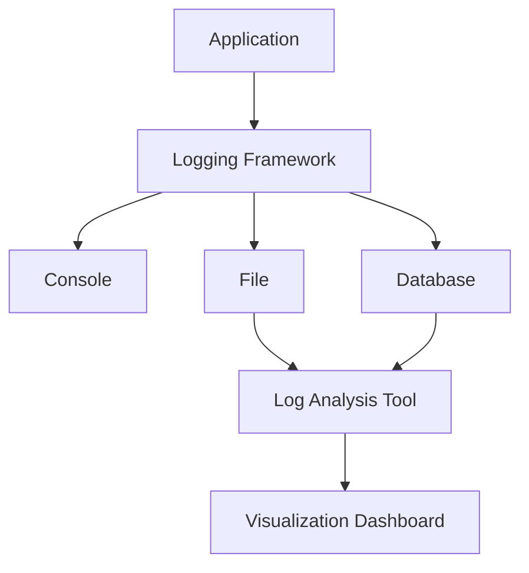

## 15.9 Auditing and Logging

In the realm of software development, auditing and logging are indispensable practices for ensuring security compliance and facilitating forensic analysis. This section delves into the intricacies of auditing and logging within F# applications, providing expert guidance on designing robust logging strategies, implementing structured logging, securing logs, and utilizing log analysis tools.

### Importance of Auditing and Logging

Auditing and logging serve as the backbone for detecting security incidents and meeting compliance requirements. By recording activities within an application, developers can trace the origin of issues, monitor system health, and ensure adherence to legal standards.

#### Detecting Security Incidents

Logging is crucial for identifying and responding to security threats. By capturing detailed records of system activities, developers can detect anomalies, unauthorized access attempts, and other suspicious behaviors. This proactive approach enables swift incident response and mitigation.

#### Meeting Compliance Requirements

Many industries are governed by strict compliance regulations that mandate comprehensive logging practices. For instance, the General Data Protection Regulation (GDPR) and the Health Insurance Portability and Accountability Act (HIPAA) require organizations to maintain detailed logs for auditing purposes. Effective logging ensures compliance and protects organizations from legal repercussions.

### Designing a Logging Strategy

A well-designed logging strategy is essential for capturing relevant events and maintaining system integrity. Consider the following key aspects when developing a logging strategy for your F# application:

#### What Events to Log

Identify critical events that warrant logging, such as:

- **Authentication Attempts**: Record successful and failed login attempts to monitor access patterns and detect potential breaches.
- **Data Access**: Log data retrieval and modification actions to track user interactions with sensitive information.
- **Errors and Exceptions**: Capture error messages and stack traces to facilitate debugging and improve application reliability.
- **Configuration Changes**: Document alterations to system settings to ensure transparency and accountability.

#### Log Levels

Implement log levels to categorize the severity of events. Common log levels include:

- **Debug**: Detailed information for debugging purposes.
- **Info**: General operational messages indicating normal application behavior.
- **Warning**: Indications of potential issues that do not disrupt functionality.
- **Error**: Errors that affect application functionality but do not cause a crash.
- **Critical**: Severe errors that may lead to application failure.

### Structured Logging

Structured logging enhances the ability to query and analyze log data by organizing it into a consistent format. This approach facilitates efficient data retrieval and interpretation, enabling developers to extract meaningful insights from logs.

#### Benefits of Structured Logging

- **Improved Querying**: Structured logs can be easily queried using tools like Elasticsearch, allowing for rapid identification of specific events.
- **Enhanced Analysis**: Consistent log formats enable advanced analysis techniques, such as machine learning, to identify patterns and anomalies.
- **Better Integration**: Structured logs integrate seamlessly with monitoring and alerting systems, providing real-time insights into application performance.

#### Using Serilog for Structured Logging

Serilog is a popular logging framework that supports structured data. Below is an example of integrating Serilog into an F# application:

```fsharp
open Serilog

// Configure Serilog
let logger = 
    LoggerConfiguration()
        .WriteTo.Console()
        .WriteTo.File("logs/myapp.txt", rollingInterval = RollingInterval.Day)
        .CreateLogger()

// Log an information message
logger.Information("User {UserId} logged in at {LoginTime}", 123, DateTime.UtcNow)

// Log an error with exception details
try
    // Simulate an operation that throws an exception
    raise (System.Exception("An error occurred"))
with
| ex -> logger.Error(ex, "An exception was caught")
```

### Implementing Logging in F#

Integrating logging frameworks within F# code is straightforward and enhances the application's observability. Here's a step-by-step guide to implementing logging in F#:

1. **Choose a Logging Framework**: Select a framework that aligns with your application's requirements. Popular choices include Serilog, NLog, and Log4Net.

2. **Configure the Logger**: Set up the logger to define output destinations (e.g., console, file, database) and log levels.

3. **Incorporate Logging Statements**: Add logging statements at strategic points in your code to capture relevant events.

4. **Test the Logging Implementation**: Verify that logs are generated correctly and contain the necessary information for analysis.

### Securing Logs

Protecting log files from unauthorized access is crucial for maintaining data integrity and confidentiality. Consider the following best practices for securing logs:

#### Access Control

Implement strict access controls to ensure that only authorized personnel can view or modify log files. Use role-based access control (RBAC) to manage permissions effectively.

#### Encrypting Sensitive Data

Encrypt sensitive data within logs to prevent unauthorized disclosure. Use strong encryption algorithms and secure key management practices to safeguard log contents.

#### Log Integrity

Ensure the integrity of log files by implementing checksums or digital signatures. This practice helps detect tampering and ensures the authenticity of log data.

### Compliance and Retention Policies

Adhering to legal requirements for log retention and data protection is essential for compliance. Consider the following guidelines:

#### Retention Periods

Determine appropriate retention periods based on regulatory requirements and business needs. Retain logs for a sufficient duration to support audits and investigations.

#### Data Protection

Implement data protection measures, such as encryption and access controls, to safeguard log data. Regularly review and update security policies to address emerging threats.

### Monitoring and Alerting

Real-time monitoring of logs is vital for detecting and responding to suspicious activities promptly. Set up alerts to notify administrators of potential security incidents.

#### Configuring Alerts

Use monitoring tools to configure alerts for specific log events, such as failed login attempts or unauthorized data access. Customize alert thresholds to minimize false positives and ensure timely responses.

#### Integrating with SIEM Systems

Integrate logs with Security Information and Event Management (SIEM) systems for centralized monitoring and analysis. SIEM solutions provide comprehensive insights into security events and streamline incident response.

### Performance Considerations

While logging is essential for security and compliance, it can impact application performance. Consider the following strategies to mitigate performance issues:

#### Asynchronous Logging

Implement asynchronous logging to minimize the impact on application performance. This approach allows the application to continue processing requests while logs are written in the background.

#### Log Sampling

Use log sampling to reduce the volume of logs generated. This technique involves selectively logging events based on predefined criteria, such as frequency or severity.

### Avoiding Sensitive Data Exposure

Logging sensitive information, such as passwords or personal data, poses significant security risks. Follow these best practices to prevent data exposure:

#### Masking Sensitive Data

Mask sensitive data in logs to prevent unauthorized access. Use techniques like hashing or tokenization to obfuscate sensitive information.

#### Excluding Sensitive Fields

Exclude sensitive fields from logs to minimize the risk of data exposure. Review logging configurations regularly to ensure compliance with data protection policies.

### Analyzing Logs

Effective log analysis is crucial for interpreting data and identifying patterns. Use log analysis tools to gain insights into application behavior and security events.

#### Log Analysis Tools

Leverage tools like Elasticsearch, Kibana, and Splunk for advanced log analysis. These platforms provide powerful querying capabilities and visualization features to facilitate data interpretation.

#### Identifying Patterns

Analyze logs to identify patterns and trends that may indicate security threats or performance issues. Use machine learning algorithms to automate pattern recognition and anomaly detection.

### Try It Yourself

Experiment with the provided code examples by modifying log levels, output destinations, and log formats. Explore different logging frameworks to find the best fit for your application. Consider implementing structured logging and analyzing the generated logs using a tool like Kibana.

### Visualizing Logging Architecture

Below is a diagram illustrating a typical logging architecture, showcasing the flow of log data from the application to various storage and analysis platforms.



### Knowledge Check

- What are the key events to log in an application?
- How does structured logging improve log analysis?
- What are the best practices for securing log files?
- How can monitoring and alerting enhance security incident response?

### Summary

In this section, we've explored the critical role of auditing and logging in F# applications, focusing on security compliance, forensic analysis, and effective implementation strategies. By designing a robust logging strategy, implementing structured logging, securing logs, and utilizing log analysis tools, developers can enhance their application's security posture and ensure compliance with regulatory requirements.

## Quiz Time!



### What is the primary purpose of auditing and logging in software applications?

- [x] Detecting security incidents and ensuring compliance
- [ ] Improving application performance
- [ ] Enhancing user interface design
- [ ] Reducing code complexity

> **Explanation:** Auditing and logging are primarily used to detect security incidents and ensure compliance with legal and regulatory requirements.

### Which of the following events should be logged for security purposes?

- [x] Authentication attempts
- [x] Data access
- [x] Errors and exceptions
- [ ] UI color changes

> **Explanation:** Authentication attempts, data access, and errors are critical events for security logging, while UI color changes are not.

### What is structured logging?

- [x] Organizing log data into a consistent format for easy querying and analysis
- [ ] Logging data in plain text format
- [ ] Storing logs in a single file
- [ ] Using different log levels for different events

> **Explanation:** Structured logging involves organizing log data into a consistent format, making it easier to query and analyze.

### How can sensitive data in logs be protected?

- [x] Encrypting sensitive data
- [ ] Logging all data in plain text
- [ ] Storing logs on public servers
- [ ] Sharing logs with all team members

> **Explanation:** Encrypting sensitive data in logs helps protect it from unauthorized access.

### What is the benefit of using asynchronous logging?

- [x] Minimizing the impact of logging on application performance
- [ ] Increasing the volume of logs generated
- [ ] Simplifying log analysis
- [ ] Reducing the need for log retention policies

> **Explanation:** Asynchronous logging minimizes the impact on application performance by allowing the application to continue processing requests while logs are written in the background.

### Which tool is commonly used for log analysis?

- [x] Elasticsearch
- [ ] Microsoft Word
- [ ] Photoshop
- [ ] Excel

> **Explanation:** Elasticsearch is a popular tool for log analysis, providing powerful querying capabilities and visualization features.

### What is the purpose of log retention policies?

- [x] Ensuring logs are retained for a sufficient duration to support audits and investigations
- [ ] Reducing the size of log files
- [ ] Increasing application speed
- [ ] Simplifying log analysis

> **Explanation:** Log retention policies ensure that logs are kept for a sufficient duration to support audits and investigations.

### Why is it important to avoid logging sensitive information?

- [x] To prevent unauthorized access to sensitive data
- [ ] To increase the volume of logs
- [ ] To simplify log analysis
- [ ] To reduce application performance

> **Explanation:** Avoiding logging sensitive information prevents unauthorized access to sensitive data and protects user privacy.

### How can monitoring and alerting enhance security incident response?

- [x] By providing real-time notifications of suspicious activities
- [ ] By reducing the volume of logs
- [ ] By simplifying log analysis
- [ ] By increasing application speed

> **Explanation:** Monitoring and alerting provide real-time notifications of suspicious activities, enabling swift incident response.

### True or False: Structured logging makes it easier to query and analyze log data.

- [x] True
- [ ] False

> **Explanation:** Structured logging organizes log data into a consistent format, making it easier to query and analyze.


