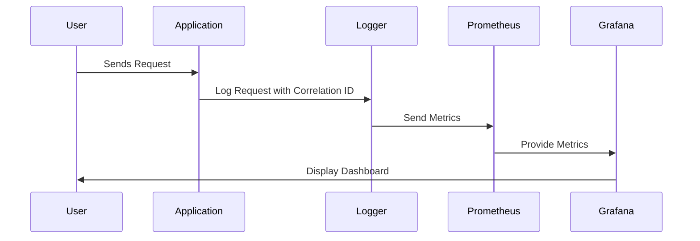

## 16.1 Logging and Monitoring in Functional Applications

In the world of software development, logging and monitoring are indispensable tools for maintaining application health, diagnosing issues, and ensuring optimal performance. As we delve into the realm of F# and functional programming, these practices take on unique characteristics and challenges. This section will guide you through the intricacies of logging and monitoring in functional applications, equipping you with the knowledge to implement robust observability in your F# projects.

### The Role of Logging and Monitoring

Logging and monitoring serve as the eyes and ears of an application. They provide insights into the application's behavior, performance, and potential issues. In functional programming, where immutability and pure functions are prevalent, the approach to logging and monitoring can differ significantly from imperative paradigms.

**Key Considerations:**

- **Immutability and Side Effects:** Functional applications often minimize side effects, which can complicate traditional logging methods that rely on mutable state.
- **Concurrency and Asynchrony:** Functional applications frequently leverage asynchronous and concurrent patterns, introducing challenges in maintaining consistent and meaningful logs.
- **Declarative Nature:** The declarative style of functional programming can make it harder to pinpoint where and when certain operations occur, necessitating more strategic logging.

### Implementing Structured Logging

Structured logging is a powerful technique that enhances the queryability and correlation of log data. Unlike traditional logging, which often involves unstructured text messages, structured logging captures logs as data with specific fields.

#### What is Structured Logging?

Structured logging involves recording log data in a structured format, such as JSON, allowing for easier parsing and analysis. This approach enables developers to filter and search logs based on specific attributes, improving the ability to diagnose issues and understand application behavior.

#### Benefits of Structured Logging

- **Improved Queryability:** Logs can be easily searched and filtered based on structured fields.
- **Enhanced Correlation:** Structured logs facilitate the correlation of events across distributed systems.
- **Consistent Format:** Ensures a uniform structure for log entries, aiding in automated processing.

#### Implementing Structured Logging in F#

To implement structured logging in F#, we can use libraries like Serilog, which provides robust support for structured log data.

```fsharp
open Serilog

// Configure Serilog for structured logging
let logger = 
    LoggerConfiguration()
        .WriteTo.Console(outputTemplate = "{Timestamp:yyyy-MM-dd HH:mm:ss} [{Level}] {Message}{NewLine}{Exception}")
        .CreateLogger()

// Example of structured logging
let logExample () =
    logger.Information("User {UserId} logged in at {LoginTime}", 123, DateTime.UtcNow)

// Call the function to log an event
logExample()
```

**Explanation:**

- **Logger Configuration:** We configure Serilog to output logs to the console with a specific template.
- **Structured Log Entry:** The `Information` method logs a message with structured data, allowing us to capture specific fields like `UserId` and `LoginTime`.

### Monitoring Tools and Techniques

Monitoring involves collecting and analyzing metrics to ensure application health and performance. Several open-source tools are compatible with F#, providing powerful capabilities for monitoring.

#### Prometheus and Grafana

Prometheus is a popular open-source monitoring tool that collects and stores metrics, while Grafana provides visualization capabilities.

**Setting Up Prometheus and Grafana:**

1. **Install Prometheus:** Download and install Prometheus from the [official website](https://prometheus.io/).
2. **Configure Prometheus:** Define the metrics to collect in the `prometheus.yml` configuration file.
3. **Install Grafana:** Download and install Grafana from the [official website](https://grafana.com/).
4. **Connect Grafana to Prometheus:** Add Prometheus as a data source in Grafana to visualize metrics.

#### Collecting and Visualizing Metrics

Metrics can be collected using libraries like `Prometheus-net`, which provides a .NET client for Prometheus.

```fsharp
open Prometheus

// Define a counter metric
let requestCounter = Metrics.CreateCounter("http_requests_total", "Total number of HTTP requests")

// Increment the counter
let logRequest () =
    requestCounter.Inc()
    printfn "Request logged"

// Call the function to log a request
logRequest()
```

**Explanation:**

- **Counter Metric:** We define a counter to track the total number of HTTP requests.
- **Incrementing the Counter:** Each time a request is logged, we increment the counter, allowing Prometheus to collect this metric.

### Logging in Asynchronous and Concurrent Contexts

Asynchronous and concurrent programming introduce unique challenges for logging, such as race conditions and thread safety. Ensuring logs remain consistent and meaningful in these contexts requires careful consideration.

#### Challenges in Asynchronous Logging

- **Race Conditions:** Concurrent operations may lead to race conditions, where log entries are interleaved or lost.
- **Thread Safety:** Logging operations must be thread-safe to prevent data corruption.

#### Strategies for Consistent Logging

1. **Use Thread-Safe Loggers:** Ensure that the logging library you use is thread-safe.
2. **Preserve Context:** Use correlation IDs to trace execution flow across asynchronous operations.
3. **Avoid Blocking Calls:** Ensure logging operations do not block the main execution flow, especially in asynchronous contexts.

#### Context Preservation and Correlation IDs

Correlation IDs are unique identifiers that help trace the flow of a request across different components and services.

```fsharp
open System
open Serilog

// Function to generate a correlation ID
let generateCorrelationId () = Guid.NewGuid().ToString()

// Example of logging with a correlation ID
let logWithCorrelationId correlationId =
    logger.Information("Operation completed with Correlation ID: {CorrelationId}", correlationId)

// Generate and log a correlation ID
let correlationId = generateCorrelationId()
logWithCorrelationId correlationId
```

**Explanation:**

- **Correlation ID Generation:** We generate a unique correlation ID for each operation.
- **Logging with Correlation ID:** The correlation ID is included in the log entry, allowing us to trace the operation across different components.

### Best Practices for Logging and Monitoring

To ensure effective logging and monitoring, adhere to the following best practices:

1. **Log Levels:** Use appropriate log levels (e.g., Debug, Info, Warn, Error) to categorize log entries based on their severity.
2. **Message Clarity:** Ensure log messages are clear and descriptive, providing enough context for diagnosis.
3. **Avoid Sensitive Information:** Do not log sensitive information, such as passwords or personal data.
4. **Manage Log Volume:** Excessive logging can impact performance. Use log levels and filters to manage log volume.
5. **Regularly Review Logs:** Regularly review logs to identify patterns, anomalies, and potential issues.

### Real-World Examples

#### Case Study: E-commerce Platform

An e-commerce platform implemented structured logging and monitoring to enhance its observability. By using Serilog for structured logging and Prometheus for monitoring, the platform achieved the following:

- **Improved Issue Diagnosis:** Structured logs allowed the team to quickly identify and resolve issues, reducing downtime.
- **Enhanced Performance Monitoring:** Prometheus metrics provided insights into application performance, enabling proactive optimizations.
- **Seamless Asynchronous Logging:** Correlation IDs helped trace requests across asynchronous operations, ensuring consistent logging.

#### Code Snippet: Logging Best Practices

```fsharp
open Serilog

// Configure Serilog with different log levels
let logger =
    LoggerConfiguration()
        .MinimumLevel.Debug()
        .WriteTo.Console()
        .CreateLogger()

// Example of logging with different levels
let logExample () =
    logger.Debug("This is a debug message")
    logger.Information("This is an info message")
    logger.Warning("This is a warning message")
    logger.Error("This is an error message")

// Call the function to log messages
logExample()
```

**Explanation:**

- **Log Levels:** We configure Serilog to use different log levels, allowing us to categorize log entries based on their importance.
- **Logging Examples:** Different log levels are demonstrated, showcasing how to log messages with varying severity.

### Try It Yourself

To deepen your understanding of logging and monitoring in F#, try modifying the code examples provided:

1. **Experiment with Structured Logging:** Add additional fields to the structured log entries and observe how they appear in the console.
2. **Set Up Prometheus and Grafana:** Follow the setup instructions to collect and visualize metrics from your F# application.
3. **Implement Correlation IDs:** Generate and log correlation IDs for different operations, and trace their flow across asynchronous tasks.

### Visualizing Logging and Monitoring

To better understand the flow of logging and monitoring in a functional application, let's visualize it using a sequence diagram.



**Diagram Description:**

- **User Interaction:** The user sends a request to the application.
- **Logging and Monitoring Flow:** The application logs the request with a correlation ID, sends metrics to Prometheus, and Grafana visualizes the metrics on a dashboard.

### Knowledge Check

Before we conclude, let's reinforce our understanding with a few questions:

- **What is the primary benefit of structured logging?**
- **How can correlation IDs help in asynchronous logging?**
- **Why is it important to use appropriate log levels?**

### Embrace the Journey

Remember, mastering logging and monitoring in functional applications is a journey. As you progress, you'll gain deeper insights into your application's behavior and performance. Keep experimenting, stay curious, and enjoy the process!

## Quiz Time!



### What is structured logging?

- [x] Logging that captures data in a structured format like JSON
- [ ] Logging that uses plain text messages
- [ ] Logging that only captures error messages
- [ ] Logging that is only used in asynchronous applications

> **Explanation:** Structured logging captures log data in a structured format, such as JSON, allowing for easier parsing and analysis.

### Why are correlation IDs important in asynchronous logging?

- [x] They help trace execution flow across different components
- [ ] They reduce the size of log files
- [ ] They prevent race conditions
- [ ] They encrypt log messages

> **Explanation:** Correlation IDs are unique identifiers that help trace the flow of a request across different components and services, especially in asynchronous contexts.

### What is a primary advantage of using Prometheus for monitoring?

- [x] It collects and stores metrics for analysis
- [ ] It encrypts log messages
- [ ] It replaces the need for logging
- [ ] It only works with F# applications

> **Explanation:** Prometheus is a monitoring tool that collects and stores metrics, allowing for detailed analysis and visualization.

### Which log level is typically used for debugging purposes?

- [x] Debug
- [ ] Info
- [ ] Warn
- [ ] Error

> **Explanation:** The Debug log level is used for detailed information, typically of interest only when diagnosing problems.

### What should be avoided in log messages?

- [x] Sensitive information like passwords
- [ ] Timestamps
- [ ] Correlation IDs
- [ ] Error messages

> **Explanation:** Sensitive information, such as passwords or personal data, should not be logged to protect user privacy and security.

### How can excessive logging impact an application?

- [x] It can degrade performance
- [ ] It improves security
- [ ] It reduces the need for monitoring
- [ ] It simplifies code

> **Explanation:** Excessive logging can degrade application performance by consuming resources and storage.

### What is the role of Grafana in monitoring?

- [x] It visualizes metrics collected by Prometheus
- [ ] It collects log data
- [ ] It encrypts metrics
- [ ] It replaces Prometheus

> **Explanation:** Grafana is a visualization tool that displays metrics collected by Prometheus, providing insights into application performance.

### Which library is commonly used for structured logging in F#?

- [x] Serilog
- [ ] Prometheus
- [ ] Grafana
- [ ] Newtonsoft.Json

> **Explanation:** Serilog is a popular library used for structured logging in F#, allowing developers to capture log data in a structured format.

### What is a challenge in logging for concurrent applications?

- [x] Race conditions can lead to interleaved or lost log entries
- [ ] Logs are automatically encrypted
- [ ] Logs are always structured
- [ ] Logs are never stored

> **Explanation:** In concurrent applications, race conditions can occur, leading to interleaved or lost log entries if not handled properly.

### True or False: Logging should always include as much information as possible.

- [ ] True
- [x] False

> **Explanation:** While logging should be informative, it should not include excessive or sensitive information, as this can impact performance and security.



By mastering logging and monitoring in functional applications, you enhance your ability to maintain robust, performant, and reliable F# systems. As you continue your journey, remember that effective observability is key to understanding and optimizing your applications.
