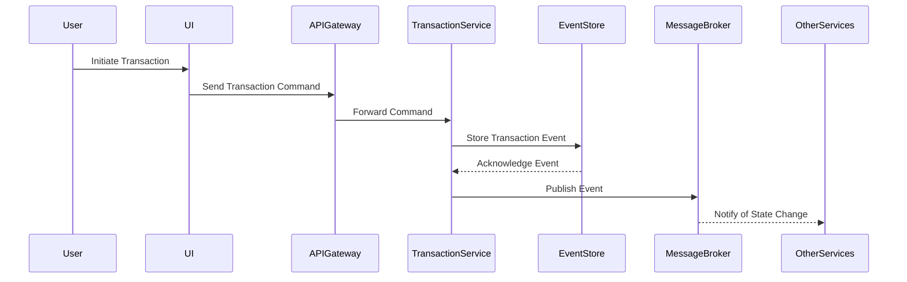

## 18.3 Case Study: Complex Application Architecture

In this case study, we will explore the architecture of a complex application built using F# and multiple design patterns. The focus is on understanding how these patterns work together to address architectural challenges, improve scalability, and enhance maintainability. This study will provide insights into the practical application of design patterns in a real-world scenario.

### Setting the Context

#### Application Domain

Our case study revolves around a distributed enterprise system designed for a financial services company. The application serves as a comprehensive platform for managing financial transactions, customer accounts, and regulatory compliance. It is a web-based application with a microservices architecture, supporting high concurrency and requiring robust data consistency.

#### Requirements and Challenges

The primary requirements for the application include:

- **High Concurrency**: The system must handle thousands of concurrent users performing transactions and accessing account information.
- **Modularity**: The architecture should support independent deployment and scaling of services.
- **Data Consistency**: Ensuring data consistency across distributed services is crucial, especially for financial transactions.
- **Scalability**: The system must scale seamlessly to accommodate growing user demand and data volume.
- **Maintainability**: The architecture should facilitate easy updates and integration of new features without disrupting existing services.

### Architectural Overview

#### High-Level View

The application architecture is based on a microservices model, where each service is responsible for a specific business capability. The key components include:

- **User Interface (UI)**: A web-based front end built using Fable, an F# to JavaScript compiler.
- **API Gateway**: A single entry point for all client requests, routing them to appropriate services.
- **Microservices**: Independent services handling specific business functions such as transaction processing, account management, and compliance.
- **Event Store**: A centralized repository for storing events related to financial transactions.
- **Message Broker**: Facilitates communication between services using asynchronous messaging.

#### Interaction of Components

The components interact through well-defined APIs and messaging protocols. The API Gateway routes requests to the appropriate microservices, which communicate with each other using events published to the message broker. The event store maintains a log of all transactions, ensuring data consistency and enabling event sourcing.

### Patterns Employed

#### List of Design Patterns

The architecture employs several design patterns, each playing a critical role:

- **Event Sourcing**: Captures all changes to application state as a sequence of events.
- **Command Query Responsibility Segregation (CQRS)**: Separates read and write operations to optimize performance and scalability.
- **Actor Model**: Manages concurrency and state in a distributed environment using actors.
- **Dependency Injection**: Facilitates loose coupling and enhances testability by injecting dependencies.
- **Repository Pattern**: Provides a consistent interface for data access, abstracting the underlying data store.

#### Role of Each Pattern

- **Event Sourcing**: Ensures data consistency by recording all state changes as events, which can be replayed to reconstruct the current state.
- **CQRS**: Optimizes read and write operations by separating them into distinct models, improving performance and scalability.
- **Actor Model**: Handles concurrency by encapsulating state and behavior within actors, which communicate through message passing.
- **Dependency Injection**: Promotes modularity and testability by allowing dependencies to be injected at runtime.
- **Repository Pattern**: Simplifies data access by providing a unified interface for interacting with the event store and other data sources.

### Integration of Patterns

#### Solving Specific Problems

The integration of these patterns addresses several architectural challenges:

- **Concurrency**: The Actor Model manages concurrent operations by isolating state within actors, reducing contention and ensuring thread safety.
- **Data Consistency**: Event Sourcing and CQRS work together to maintain consistent data across services, with events serving as the single source of truth.
- **Scalability**: The microservices architecture, combined with CQRS, allows independent scaling of read and write operations, accommodating increased load.

#### Data Flow Example

Consider a scenario where a user initiates a financial transaction. The data flow through the system involves multiple patterns:

1. **Command Handling**: The user action is captured as a command, which is processed by the appropriate microservice.
2. **Event Generation**: The command results in one or more events, which are stored in the event store.
3. **Event Propagation**: Events are published to the message broker, notifying other services of the state change.
4. **Query Handling**: Services responsible for read operations update their views based on the new events, ensuring that the UI reflects the latest state.

### Detailed Walkthrough

#### Selected Parts of the Application

Let's dive into the transaction processing service to illustrate the application of patterns.

##### Sequence Diagram: Transaction Processing



##### Code Example: Command Handling

```fsharp
type TransactionCommand = 
    | CreateTransaction of amount: decimal * accountId: string

type TransactionEvent = 
    | TransactionCreated of transactionId: Guid * amount: decimal * accountId: string

let handleCommand (command: TransactionCommand) =
    match command with
    | CreateTransaction(amount, accountId) ->
        let transactionId = Guid.NewGuid()
        let event = TransactionCreated(transactionId, amount, accountId)
        // Store event in event store
        storeEvent event
        // Publish event to message broker
        publishEvent event
```

In this example, the `handleCommand` function processes a `CreateTransaction` command, generating a `TransactionCreated` event. The event is stored in the event store and published to the message broker, ensuring that all services are notified of the transaction.

### Addressing Challenges

#### Architectural Challenges

The architecture faced several challenges, including:

- **Data Consistency Across Microservices**: Ensuring that all services have a consistent view of the data, especially in a distributed environment.
- **Handling Concurrency**: Managing concurrent operations without introducing race conditions or data corruption.

#### Solutions Through Pattern Combination

- **Event Sourcing and CQRS**: By capturing all state changes as events, these patterns ensure that all services can reconstruct the current state from the event log, maintaining consistency.
- **Actor Model**: By encapsulating state within actors, the Actor Model provides a robust solution for managing concurrency, allowing services to process messages independently.

### Performance and Scalability

#### Accommodating Growth

The architecture is designed to scale horizontally, with each microservice capable of being deployed independently. CQRS allows for separate scaling of read and write operations, optimizing resource usage.

#### Optimizations

- **Event Sourcing**: By storing events rather than current state, the system can efficiently handle large volumes of data, replaying events as needed to reconstruct state.
- **Actor Model**: The use of actors reduces contention and improves performance by isolating state and behavior.

### Testing and Reliability

#### Contribution of Patterns

Design patterns contribute to testing and reliability in several ways:

- **Dependency Injection**: Facilitates unit testing by allowing mock dependencies to be injected.
- **Event Sourcing**: Enables replaying of events to verify system behavior and detect anomalies.

#### Testing Strategies

The application employs a combination of testing strategies:

- **Unit Testing**: Tests individual components in isolation, using mock dependencies.
- **Integration Testing**: Verifies interactions between components, ensuring that services work together as expected.
- **Property-Based Testing**: Uses tools like FsCheck to generate test cases based on properties, ensuring comprehensive coverage.

### Maintainability and Extensibility

#### Future Changes and Additions

The architecture's modular design allows for easy integration of new features and updates. Design patterns like Dependency Injection and the Repository Pattern facilitate maintainability by promoting loose coupling and separation of concerns.

#### Long-Term Benefits

- **Design Patterns**: Provide a blueprint for consistent and maintainable code, reducing technical debt over time.
- **Modularity**: Supports independent development and deployment, allowing teams to work on different services concurrently.

### Lessons Learned

#### Insights Gained

- **Pattern Combination**: Combining patterns can address complex challenges more effectively than using them in isolation.
- **Trade-Offs**: While patterns provide structure, they can introduce complexity. It's important to balance the benefits with the overhead they introduce.

#### Recommendations for Practitioners

- **Consider Pattern Combinations**: When designing complex systems, consider how different patterns can work together to address challenges.
- **Focus on Modularity**: Design systems with modularity in mind, allowing for independent development and scaling.

### Conclusion

#### Success Factors

The successful application of multiple design patterns contributed significantly to the project's objectives, providing a scalable, maintainable, and reliable architecture.

#### Reflection

The case study demonstrates the power of design patterns in addressing architectural challenges and highlights the importance of thoughtful pattern selection and integration in complex applications.

## Quiz Time!



### What is the primary benefit of using Event Sourcing in a distributed system?

- [x] Ensures data consistency by capturing all state changes as events
- [ ] Reduces the number of services needed
- [ ] Simplifies the user interface design
- [ ] Increases the speed of data processing

> **Explanation:** Event Sourcing captures all changes to application state as a sequence of events, ensuring data consistency across distributed services.

### How does the Actor Model help manage concurrency?

- [x] By encapsulating state and behavior within actors
- [ ] By increasing the number of threads
- [ ] By reducing the number of services
- [ ] By simplifying the user interface

> **Explanation:** The Actor Model encapsulates state and behavior within actors, allowing them to process messages independently and manage concurrency effectively.

### Which pattern separates read and write operations to optimize performance?

- [x] Command Query Responsibility Segregation (CQRS)
- [ ] Event Sourcing
- [ ] Dependency Injection
- [ ] Repository Pattern

> **Explanation:** CQRS separates read and write operations into distinct models, optimizing performance and scalability.

### What role does the Repository Pattern play in the architecture?

- [x] Provides a consistent interface for data access
- [ ] Manages user authentication
- [ ] Simplifies the user interface design
- [ ] Increases the speed of data processing

> **Explanation:** The Repository Pattern provides a unified interface for interacting with data sources, abstracting the underlying data store.

### Which pattern facilitates loose coupling and enhances testability?

- [x] Dependency Injection
- [ ] Event Sourcing
- [ ] CQRS
- [ ] Actor Model

> **Explanation:** Dependency Injection promotes loose coupling by allowing dependencies to be injected at runtime, enhancing testability.

### What is a key challenge addressed by combining Event Sourcing and CQRS?

- [x] Ensuring data consistency across services
- [ ] Simplifying the user interface
- [ ] Reducing the number of services
- [ ] Increasing the speed of data processing

> **Explanation:** Event Sourcing and CQRS work together to maintain consistent data across services, with events serving as the single source of truth.

### How does the architecture accommodate growth in users or data?

- [x] By allowing independent scaling of microservices
- [ ] By reducing the number of services
- [ ] By simplifying the user interface
- [ ] By increasing the number of threads

> **Explanation:** The architecture is designed to scale horizontally, with each microservice capable of being deployed independently, accommodating growth.

### What testing strategy uses tools like FsCheck to generate test cases based on properties?

- [x] Property-Based Testing
- [ ] Unit Testing
- [ ] Integration Testing
- [ ] Behavior-Driven Development

> **Explanation:** Property-Based Testing uses tools like FsCheck to generate test cases based on properties, ensuring comprehensive coverage.

### Why is modularity important in the architecture?

- [x] Supports independent development and deployment
- [ ] Reduces the number of services
- [ ] Simplifies the user interface
- [ ] Increases the speed of data processing

> **Explanation:** Modularity supports independent development and deployment, allowing teams to work on different services concurrently.

### True or False: Combining multiple design patterns can address complex challenges more effectively than using them in isolation.

- [x] True
- [ ] False

> **Explanation:** Combining multiple design patterns can address complex challenges more effectively by leveraging the strengths of each pattern.


