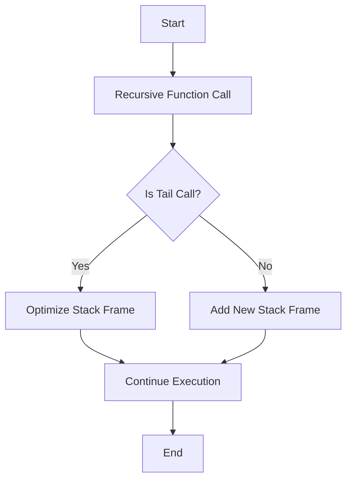

## 19.2 Tail Call Optimization

In the realm of functional programming, recursion is a fundamental concept that allows us to solve problems by defining functions that call themselves. However, recursion can come with its own set of challenges, particularly when it comes to performance and memory usage. This is where Tail Call Optimization (TCO) comes into play. In this section, we will delve deep into TCO, its significance in F#, and how you can leverage it to write efficient recursive functions.

### Introduction to Tail Call Optimization

#### What are Tail Calls?

A **tail call** occurs when a function calls another function as its final action. In other words, the calling function does nothing after the called function returns. This is a crucial concept because it allows the compiler to optimize the call stack usage.

Consider the following example:

```fsharp
let rec factorial n =
    if n <= 1 then 1
    else n * factorial (n - 1)
```

In the above code, the recursive call `factorial (n - 1)` is not a tail call because the multiplication operation `n *` needs to be performed after the recursive call returns. Therefore, each call to `factorial` adds a new frame to the call stack.

#### How TCO Works in F# and .NET

**Tail Call Optimization (TCO)** is a technique used by compilers to optimize recursive function calls that are in the tail position. When a function call is in the tail position, the compiler can replace the current function's stack frame with the called function's stack frame, effectively reusing the stack space and preventing stack overflow.

In F#, TCO is supported by the .NET runtime, but it's important to note that not all recursive calls are automatically optimized. The F# compiler can optimize tail-recursive calls, but certain conditions must be met for TCO to occur.

### Importance of TCO in Recursive Functions

#### Handling Large Data Sets and Deep Recursion

Recursive functions are elegant and expressive, but they can lead to stack overflow errors when dealing with large data sets or deep recursion. TCO mitigates this risk by ensuring that tail-recursive functions use constant stack space, allowing them to handle larger inputs without crashing.

#### Efficiency and Performance

By eliminating the need to maintain multiple stack frames, TCO improves the efficiency and performance of recursive functions. This is particularly important in functional programming, where recursion is often preferred over iterative constructs.

### Writing Tail-Recursive Functions

To benefit from TCO, you need to write your recursive functions in a tail-recursive manner. This involves structuring your functions so that the recursive call is the last operation performed.

#### Structuring Tail-Recursive Functions

Let's revisit the factorial function and refactor it to be tail-recursive:

```fsharp
let factorial n =
    let rec loop acc n =
        if n <= 1 then acc
        else loop (acc * n) (n - 1)
    loop 1 n
```

In this version, we introduce an accumulator `acc` to carry forward the computation result. The recursive call `loop (acc * n) (n - 1)` is now in the tail position, allowing the F# compiler to optimize it.

#### Example: Non-Tail-Recursive vs. Tail-Recursive

Consider a function to compute the sum of a list:

**Non-Tail-Recursive Version:**

```fsharp
let rec sumList lst =
    match lst with
    | [] -> 0
    | head :: tail -> head + sumList tail
```

**Tail-Recursive Version:**

```fsharp
let sumList lst =
    let rec loop acc lst =
        match lst with
        | [] -> acc
        | head :: tail -> loop (acc + head) tail
    loop 0 lst
```

In the tail-recursive version, the accumulator `acc` is used to store the ongoing sum, and the recursive call `loop (acc + head) tail` is in the tail position.

### Using Accumulators

Accumulators are a common technique used in tail-recursive functions to carry forward intermediate results. By using accumulators, you can transform many recursive functions into tail-recursive ones.

#### Code Example: Using Accumulators

Let's look at another example where we use an accumulator to compute the Fibonacci sequence:

```fsharp
let fibonacci n =
    let rec loop a b n =
        if n = 0 then a
        else loop b (a + b) (n - 1)
    loop 0 1 n
```

In this example, `a` and `b` are accumulators that store the two most recent Fibonacci numbers. The recursive call `loop b (a + b) (n - 1)` is in the tail position.

### Compiler Considerations

#### Limitations of TCO in .NET CLR

While F# supports TCO, the .NET Common Language Runtime (CLR) has limitations. Not all tail-recursive calls are optimized, particularly when dealing with certain constructs or when debugging information is enabled.

#### F# Compiler Optimization

The F# compiler attempts to optimize tail-recursive calls, but it's essential to be aware of the conditions under which TCO is applied. You can use the `--tailcalls` compiler option to enable or disable tail call optimization explicitly.

### Performance Implications

#### Impact on Memory Usage

TCO significantly reduces memory usage by reusing stack frames for tail-recursive calls. This allows recursive functions to handle larger inputs without exhausting the call stack.

#### Avoiding Stack Overflows

Without TCO, deep recursion can lead to stack overflow errors. By ensuring that your recursive functions are tail-recursive, you can prevent these errors and improve the robustness of your code.

### Alternative Solutions

#### Converting Recursion to Iteration

When TCO is not available or sufficient, you can convert recursive functions to iterative ones. This involves using loops and mutable variables to achieve the same result.

#### Trampoline Functions and CPS

For advanced scenarios, you can use trampoline functions or continuation-passing style (CPS) to manage deep recursion. These techniques allow you to simulate recursion without consuming stack space.

### Best Practices

#### When to Prefer Tail Recursion

Tail recursion is preferred when you need to handle large data sets or deep recursion efficiently. It's also beneficial when you want to write clear and expressive code without worrying about stack overflows.

#### Testing with Large Inputs

Always test your recursive functions with large inputs to ensure they perform as expected. This will help you identify potential stack overflow issues and optimize your code accordingly.

### Real-World Examples

#### Case Study: Optimizing a Recursive Algorithm

Consider a scenario where you need to compute the depth of a binary tree. A naive recursive approach might lead to stack overflow for deep trees. By refactoring the function to be tail-recursive, you can handle larger trees efficiently.

**Before Optimization:**

```fsharp
type Tree =
    | Leaf
    | Node of int * Tree * Tree

let rec depth tree =
    match tree with
    | Leaf -> 0
    | Node (_, left, right) -> 1 + max (depth left) (depth right)
```

**After Optimization:**

```fsharp
let depth tree =
    let rec loop acc trees =
        match trees with
        | [] -> acc
        | Leaf :: rest -> loop acc rest
        | Node (_, left, right) :: rest -> loop (acc + 1) (left :: right :: rest)
    loop 0 [tree]
```

In the optimized version, we use an accumulator `acc` to track the depth and a list `trees` to manage the nodes to be processed.

### Try It Yourself

Experiment with the code examples provided by modifying the input data or changing the recursive logic. Try converting non-tail-recursive functions to tail-recursive ones and observe the impact on performance and memory usage.

### Visualizing Tail Call Optimization

To better understand how TCO works, let's visualize the process using a flowchart:



**Figure 1:** This flowchart illustrates the decision-making process for tail call optimization. If a recursive call is in the tail position, the stack frame is optimized, preventing additional stack usage.

### References and Further Reading

- [F# Language Reference: Tail Calls](https://docs.microsoft.com/en-us/dotnet/fsharp/language-reference/functions/tail-recursion)
- [Understanding Tail Call Optimization in .NET](https://devblogs.microsoft.com/dotnet/understanding-tail-call-optimization-in-net/)
- [Functional Programming in F#: Tail Recursion](https://fsharpforfunandprofit.com/posts/tail-recursion/)

### Knowledge Check

- What is a tail call, and why is it important for recursion?
- How does F# implement tail call optimization?
- What are the limitations of TCO in the .NET CLR?
- How can accumulators be used to make a function tail-recursive?
- What are some alternative solutions when TCO is not available?

### Embrace the Journey

Remember, mastering tail call optimization is just one step in your journey to becoming an expert in F# and functional programming. Keep experimenting, stay curious, and enjoy the process of learning and optimizing your code!

## Quiz Time!



### What is a tail call?

- [x] A function call that is the last action in a function
- [ ] A function call that occurs at the beginning of a function
- [ ] A function call that is nested within another function
- [ ] A function call that does not return a value

> **Explanation:** A tail call is a function call that is the last action performed in a function, allowing for tail call optimization.

### Why is tail call optimization important?

- [x] It prevents stack overflow by reusing stack frames
- [ ] It makes code easier to read
- [ ] It allows functions to return multiple values
- [ ] It improves the accuracy of calculations

> **Explanation:** Tail call optimization prevents stack overflow by reusing stack frames, making recursive functions more efficient.

### How can you make a function tail-recursive?

- [x] Ensure the recursive call is the last operation in the function
- [ ] Use global variables to store intermediate results
- [ ] Avoid using recursion altogether
- [ ] Use loops instead of recursion

> **Explanation:** To make a function tail-recursive, ensure that the recursive call is the last operation performed in the function.

### What is an accumulator in the context of tail recursion?

- [x] A variable that carries forward computation results
- [ ] A function that accumulates errors
- [ ] A data structure for storing intermediate values
- [ ] A method for optimizing memory usage

> **Explanation:** An accumulator is a variable used in tail-recursive functions to carry forward computation results.

### What is a limitation of TCO in the .NET CLR?

- [x] Not all tail-recursive calls are optimized
- [ ] It increases memory usage
- [ ] It makes debugging more difficult
- [ ] It requires additional libraries

> **Explanation:** The .NET CLR does not optimize all tail-recursive calls, which can limit the effectiveness of TCO.

### What is an alternative to TCO when dealing with deep recursion?

- [x] Convert recursion to iteration
- [ ] Use global variables
- [ ] Increase the stack size
- [ ] Use more complex data structures

> **Explanation:** When TCO is not available, converting recursion to iteration is a common alternative to handle deep recursion.

### How does TCO impact memory usage?

- [x] It reduces memory usage by reusing stack frames
- [ ] It increases memory usage by creating more stack frames
- [ ] It has no impact on memory usage
- [ ] It only affects memory usage in certain programming languages

> **Explanation:** TCO reduces memory usage by reusing stack frames for tail-recursive calls.

### What is a trampoline function?

- [x] A function that simulates recursion without consuming stack space
- [ ] A function that jumps between different modules
- [ ] A function that handles errors in recursion
- [ ] A function that optimizes memory allocation

> **Explanation:** A trampoline function simulates recursion without consuming stack space, allowing for deep recursion without stack overflow.

### What is continuation-passing style (CPS)?

- [x] A style of programming where control is passed explicitly through continuations
- [ ] A style of programming that avoids recursion
- [ ] A style of programming that uses global variables
- [ ] A style of programming that relies on loops

> **Explanation:** Continuation-passing style (CPS) is a programming style where control is passed explicitly through continuations, often used to manage deep recursion.

### True or False: Tail call optimization is automatically applied to all recursive functions in F#.

- [ ] True
- [x] False

> **Explanation:** False. Tail call optimization is not automatically applied to all recursive functions in F#. It depends on the function's structure and the .NET CLR's capabilities.


