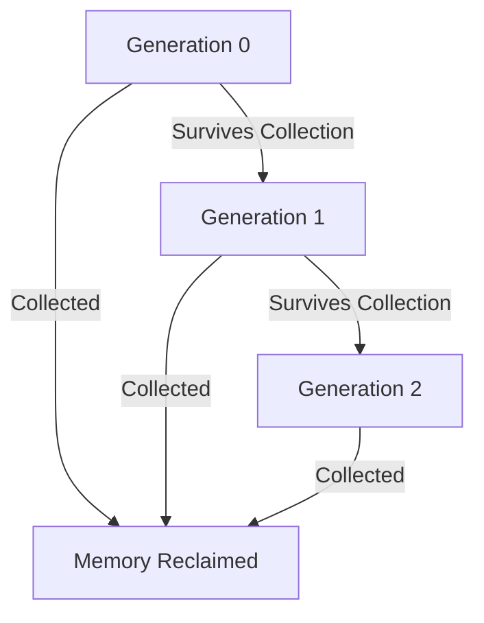

## 19.3 Memory Management

In the realm of software development, efficient memory management is paramount, especially when working with a language like F# that runs on the .NET framework. In this section, we will delve into the intricacies of memory management within F# applications, focusing on understanding the .NET garbage collection mechanism, writing memory-efficient code, and avoiding common pitfalls that can lead to excessive memory consumption or leaks.

### Overview of .NET Garbage Collection

The .NET garbage collector (GC) is a sophisticated memory management system that automatically handles the allocation and release of memory in managed applications. Understanding how it works is crucial for writing efficient F# code.

#### How Garbage Collection Works

Garbage collection in .NET is designed to reclaim memory occupied by objects that are no longer in use by the application. The GC operates on the principle of generations, which helps optimize the collection process:

- **Generations**: The GC categorizes objects into three generations:
  - **Generation 0**: Short-lived objects, such as temporary variables.
  - **Generation 1**: Objects that have survived one collection cycle.
  - **Generation 2**: Long-lived objects, like static data or objects that survive multiple collections.

- **Collection Triggers**: The GC is triggered under several circumstances, including:
  - When the system runs low on physical memory.
  - When the generation 0 heap is full.
  - Explicitly, when the `GC.Collect()` method is called (though this is generally discouraged).

- **Finalization**: Objects that require cleanup before memory is reclaimed implement a finalizer. The finalizer is called before the object is collected, allowing for resource cleanup.

#### Visualizing Garbage Collection

To better understand the garbage collection process, let's visualize the generational model:



**Figure 1**: Visual representation of the generational garbage collection process in .NET.

### Memory Management in F#

F# is a functional-first language, and its constructs interact uniquely with memory allocation. Let's explore how F#'s features affect memory usage.

#### Immutable Data Structures

F# emphasizes immutability, meaning once a data structure is created, it cannot be changed. This has both benefits and drawbacks for memory management:

- **Benefits**: Immutability leads to safer and more predictable code, reducing the chances of unintended side effects.
- **Drawbacks**: It can lead to increased memory usage if not managed properly, as new copies of data structures are created rather than modifying existing ones.

#### Functional Constructs and Memory

Functional programming constructs, such as higher-order functions and closures, can impact memory usage:

- **Closures**: Capturing variables in closures can inadvertently hold onto memory longer than necessary, leading to potential memory leaks.
- **Higher-Order Functions**: While powerful, they can create additional allocations if not used judiciously.

### Identifying Memory Issues

Detecting memory leaks and excessive allocations is crucial for maintaining application performance. Here are some techniques and tools to help identify memory issues:

#### Profiling Tools

- **Visual Studio Memory Profiler**: A built-in tool that provides detailed insights into memory usage, helping identify leaks and excessive allocations.
- **dotMemory by JetBrains**: A powerful memory profiling tool that offers advanced features for analyzing memory usage in .NET applications.

#### Interpreting Memory Profiling Results

When using profiling tools, focus on:

- **Memory Allocation Graphs**: Visualize memory usage over time to identify spikes or trends.
- **Object Retention Paths**: Determine why certain objects are not being collected by examining their retention paths.
- **Heap Snapshots**: Compare snapshots to identify objects that persist longer than expected.

### Optimizing Memory Usage

To reduce memory footprint and improve performance, consider the following strategies:

#### Reusing Data Structures

Where possible, reuse existing data structures instead of creating new ones. This can be achieved through:

- **Persistent Data Structures**: Use data structures optimized for immutability, such as F#'s list and map types, which share structure between versions.

#### Avoiding Unnecessary Object Creation

Minimize object creation by:

- **Using Structs vs. Classes**: In F#, structs are value types and can be more memory-efficient than classes, which are reference types. However, use structs judiciously, as they are copied by value.

#### Example: Using Structs

```fsharp
type PointStruct = struct
    val X : int
    val Y : int
    new(x, y) = { X = x; Y = y }
end

let point1 = PointStruct(1, 2)
let point2 = point1 // Copy by value
```

### Avoiding Common Pitfalls

Be aware of common mistakes that can lead to memory issues:

#### Retaining References

Avoid retaining references longer than necessary. This can occur when:

- **Event Handlers**: Ensure event handlers are detached when no longer needed.
- **Static References**: Be cautious with static references, as they persist for the application's lifetime.

#### Closures and Captured Variables

Closures can capture variables, leading to memory retention:

```fsharp
let createCounter() =
    let mutable count = 0
    fun () -> count <- count + 1; count

let counter = createCounter()
counter() // 1
counter() // 2
```

In this example, the `count` variable is captured by the closure, which can lead to memory retention if not managed properly.

### Disposing of Resources

Releasing unmanaged resources is crucial for preventing memory leaks. In F#, use the `IDisposable` interface and the `use`/`using` keywords:

#### Example: Using IDisposable

```fsharp
open System.IO

let readFile path =
    use reader = new StreamReader(path)
    reader.ReadToEnd()

let content = readFile "example.txt"
```

In this example, the `StreamReader` is disposed of automatically when the function exits, ensuring resources are released.

### Large Object Heap (LOH)

The Large Object Heap (LOH) is a special area of memory for large allocations (over 85,000 bytes). Large allocations can be problematic because:

- **Fragmentation**: The LOH is not compacted, leading to fragmentation.
- **Collection Frequency**: Objects on the LOH are collected less frequently.

#### Minimizing LOH Allocations

To minimize LOH allocations:

- **Use Arrays Wisely**: Avoid large arrays if possible, or consider breaking them into smaller chunks.
- **String Handling**: Be cautious with large strings, as they can quickly fill the LOH.

### Best Practices

To ensure efficient memory management in F# applications, follow these guidelines:

- **Regular Monitoring**: Incorporate memory profiling into your development process to catch issues early.
- **Immutable Data Structures**: Use persistent data structures to manage immutability efficiently.
- **Resource Management**: Dispose of unmanaged resources promptly using `IDisposable`.
- **Avoid Large Allocations**: Minimize allocations on the LOH to prevent fragmentation.

### Case Studies

Let's explore some real-world examples where optimizing memory usage led to performance improvements.

#### Case Study 1: Reducing Memory Footprint in a Web Application

A web application was experiencing high memory usage due to large object allocations. By profiling the application, it was discovered that large arrays were being used unnecessarily. Refactoring the code to use smaller arrays and more efficient data structures reduced memory usage by 30%.

#### Case Study 2: Eliminating Memory Leaks in a Desktop Application

A desktop application was suffering from memory leaks due to event handlers not being detached. By implementing a pattern to ensure handlers were removed when no longer needed, the memory leaks were eliminated, resulting in a more stable application.

### Try It Yourself

Experiment with the code examples provided in this section. Try modifying the `PointStruct` example to include additional fields, and observe how it affects memory usage. Use a memory profiler to analyze the impact of different data structures on memory allocation.

### Embrace the Journey

Remember, mastering memory management is an ongoing journey. As you progress, you'll develop a deeper understanding of how to write efficient, memory-conscious code. Keep experimenting, stay curious, and enjoy the journey!

## Quiz Time!



### What is the primary purpose of the .NET garbage collector?

- [x] To reclaim memory occupied by objects no longer in use
- [ ] To manage CPU usage
- [ ] To optimize network bandwidth
- [ ] To handle user input

> **Explanation:** The .NET garbage collector is designed to automatically reclaim memory occupied by objects that are no longer in use by the application.

### Which generation in the .NET garbage collection process is intended for short-lived objects?

- [x] Generation 0
- [ ] Generation 1
- [ ] Generation 2
- [ ] Generation 3

> **Explanation:** Generation 0 is intended for short-lived objects, such as temporary variables.

### What is a common drawback of using immutable data structures in F#?

- [x] Increased memory usage
- [ ] Reduced code safety
- [ ] Increased risk of side effects
- [ ] Decreased code readability

> **Explanation:** Immutability can lead to increased memory usage because new copies of data structures are created rather than modifying existing ones.

### Which tool is NOT mentioned as a memory profiling tool in this section?

- [ ] Visual Studio Memory Profiler
- [ ] dotMemory by JetBrains
- [x] Resharper
- [ ] Heap Snapshot

> **Explanation:** Resharper is not mentioned as a memory profiling tool in this section.

### What keyword in F# is used to ensure resources are disposed of automatically?

- [x] use
- [ ] let
- [ ] val
- [ ] match

> **Explanation:** The `use` keyword in F# ensures that resources are disposed of automatically when the function exits.

### What is a potential issue with the Large Object Heap (LOH)?

- [x] Fragmentation
- [ ] Frequent garbage collection
- [ ] High CPU usage
- [ ] Increased network latency

> **Explanation:** The Large Object Heap (LOH) can suffer from fragmentation because it is not compacted.

### Which of the following is a strategy for optimizing memory usage?

- [x] Reusing data structures
- [ ] Increasing object creation
- [ ] Using large arrays
- [ ] Retaining references

> **Explanation:** Reusing data structures is a strategy for optimizing memory usage, as it reduces the need for new allocations.

### What is a common mistake that can lead to memory retention in closures?

- [x] Capturing variables
- [ ] Using structs
- [ ] Using classes
- [ ] Using interfaces

> **Explanation:** Capturing variables in closures can lead to memory retention if not managed properly.

### What is the benefit of using structs over classes in F#?

- [x] More memory-efficient
- [ ] Easier to modify
- [ ] Automatically disposed
- [ ] Supports inheritance

> **Explanation:** Structs are value types and can be more memory-efficient than classes, which are reference types.

### True or False: The .NET garbage collector requires manual intervention to function.

- [ ] True
- [x] False

> **Explanation:** The .NET garbage collector is automatic and does not require manual intervention to function.


